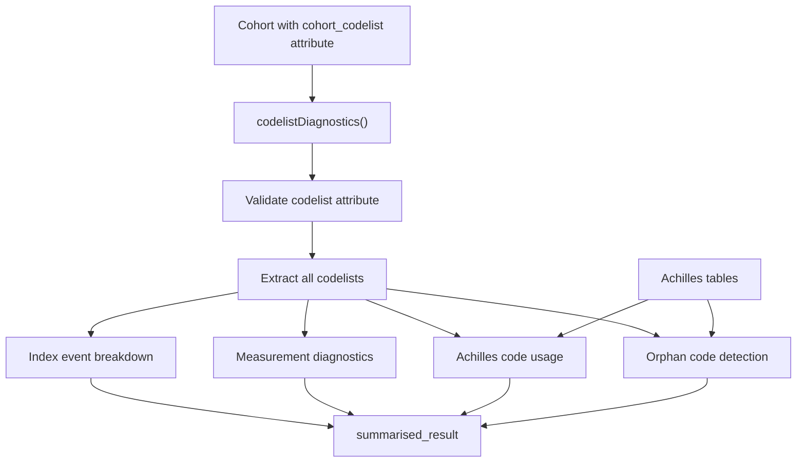
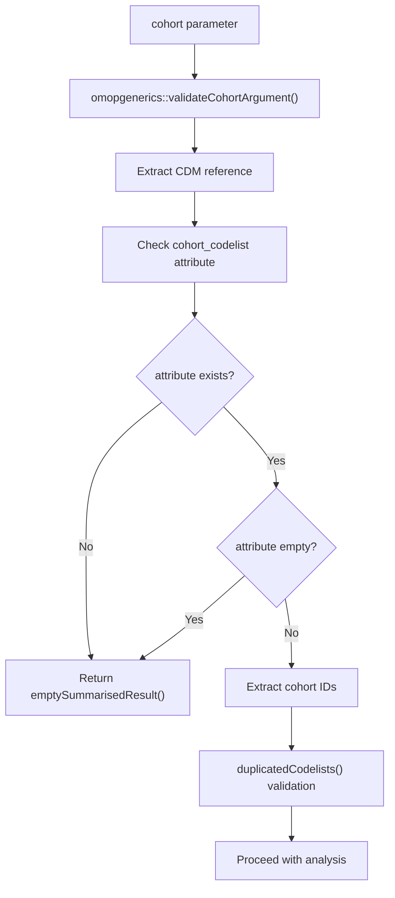
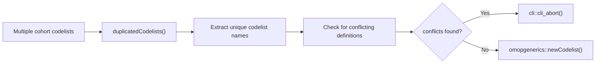
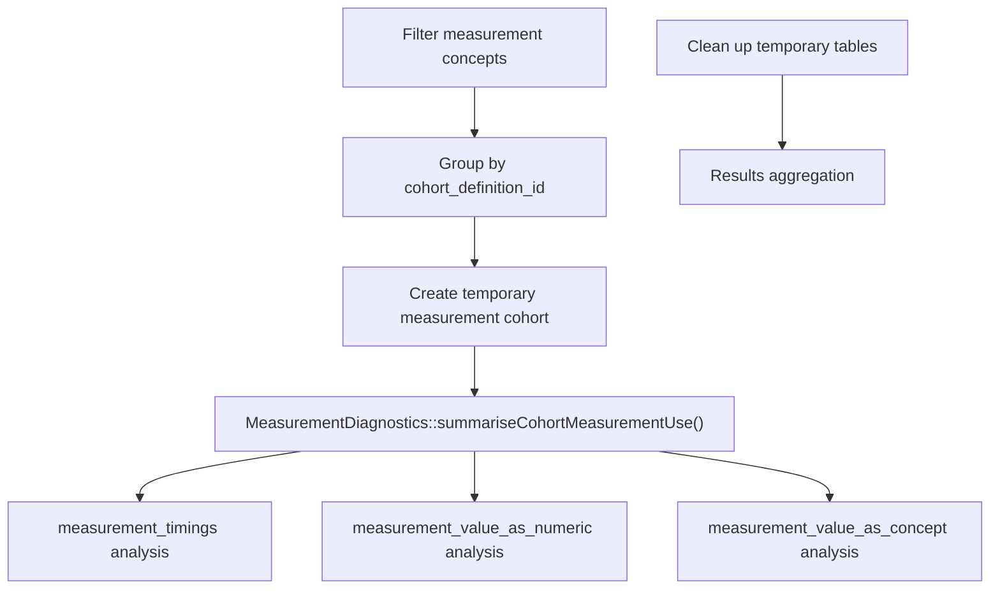
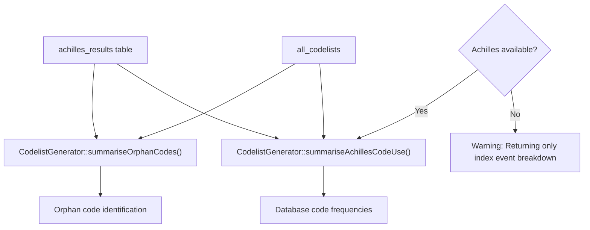
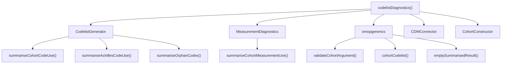
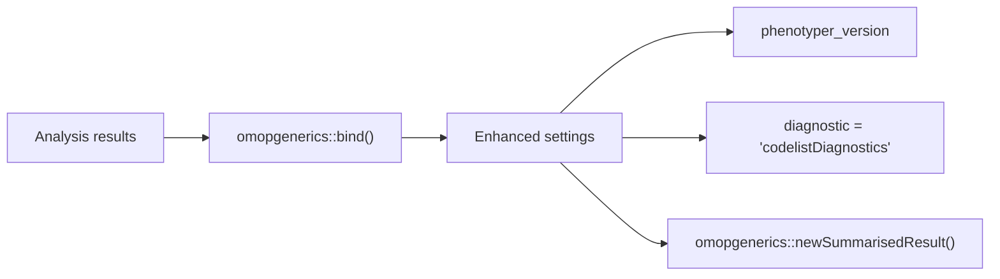

# Page: Codelist Diagnostics

# Codelist Diagnostics

Relevant source files

The following files were used as context for generating this wiki page:

- [R/codelistDiagnostics.R](R/codelistDiagnostics.R)
- [tests/testthat/test-codelistDiagnostics.R](tests/testthat/test-codelistDiagnostics.R)
- [tests/testthat/test-databaseDiagnostics.R](tests/testthat/test-databaseDiagnostics.R)
- [tests/testthat/test-dbms.R](tests/testthat/test-dbms.R)

The codelist diagnostics system analyzes the usage patterns, completeness, and quality of concept code lists used in cohort definitions. This module examines how codes from cohort codelists appear in the database, identifies orphan codes, analyzes measurement-specific patterns, and provides comprehensive code usage statistics to support cohort validation and refinement.

For information about the main diagnostic orchestration, see [Main Orchestrator Function](#2.1). For database-level analysis, see [Database and Population Diagnostics](#2.4).

## Overview

The `codelistDiagnostics()` function performs comprehensive analysis of cohort codelists by examining code usage patterns across multiple dimensions. The system requires cohorts with populated `cohort_codelist` attributes and leverages Achilles tables for database-wide code frequency analysis.

**Codelist Diagnostics Workflow**

Sources: [R/codelistDiagnostics.R:34-187]()

## Core Function Architecture

The `codelistDiagnostics()` function follows a structured validation and analysis pipeline:

### Input Validation and Preparation

The function begins with comprehensive validation of the cohort input and its required attributes:

**Input Validation Flow**

The system validates cohort arguments using `omopgenerics::validateCohortArgument()` and checks for the presence of the `cohort_codelist` attribute. If validation fails, the function returns an empty summarised result with appropriate warnings.

Sources: [R/codelistDiagnostics.R:36-81]()

### Codelist Deduplication

The `duplicatedCodelists()` helper function ensures codelist consistency across cohort definitions:

**Codelist Validation Process**

Sources: [R/codelistDiagnostics.R:189-216]()

## Analysis Components

### Index Event Breakdown

For each cohort definition, the system analyzes code usage patterns during cohort entry using `CodelistGenerator::summariseCohortCodeUse()`:

| Parameter | Value | Description |
|-----------|-------|-------------|
| `timing` | "entry" | Analyzes codes at cohort entry |
| `countBy` | ["record", "person"] | Counts by both records and persons |
| `byConcept` | TRUE | Provides concept-level breakdown |

The analysis skips empty cohorts and provides warnings for cohorts with zero subjects.

Sources: [R/codelistDiagnostics.R:91-110]()

### Measurement Diagnostics

When measurement domain concepts are detected in codelists, the system performs specialized measurement analysis:

**Measurement Diagnostics Pipeline**

The measurement analysis examines timing patterns, numeric values, and concept values for measurement-domain codes with parameters:

- `timing`: "during" - analyzes measurements during cohort periods
- `byConcept`: TRUE - provides concept-level details
- `checks`: ["measurement_timings", "measurement_value_as_numeric", "measurement_value_as_concept"]

Sources: [R/codelistDiagnostics.R:112-145]()

### Achilles-Based Analysis

When Achilles tables are available, the system performs database-wide code analysis:

**Achilles-Dependent Analysis**

The Achilles analysis provides:
- **Code Usage Statistics**: Frequency of codes across the entire database
- **Orphan Code Detection**: Codes in codelists that have zero occurrences in the database

Sources: [R/codelistDiagnostics.R:147-168]()

## Dependencies and Integration

### Required Package Dependencies

**Package Dependencies**

Sources: [R/codelistDiagnostics.R:99-107, 131-142, 150, 159-162]()

### Database Requirements

The function requires specific database components:

| Component | Required For | Fallback Behavior |
|-----------|-------------|-------------------|
| `cohort_codelist` attribute | All analysis | Returns empty result with warning |
| Achilles tables | Code usage & orphan analysis | Returns only index event breakdown |
| Measurement data | Measurement diagnostics | Skips measurement analysis |

Sources: [R/codelistDiagnostics.R:44-64, 147-168]()

## Result Structure and Metadata

The function returns a `summarised_result` object with enhanced metadata:

**Result Processing Pipeline**

The results include version tracking and diagnostic type identification for downstream processing and visualization systems.

Sources: [R/codelistDiagnostics.R:170-186]()