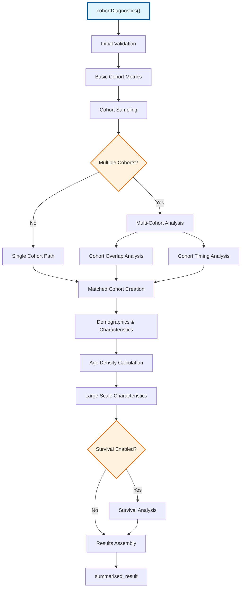
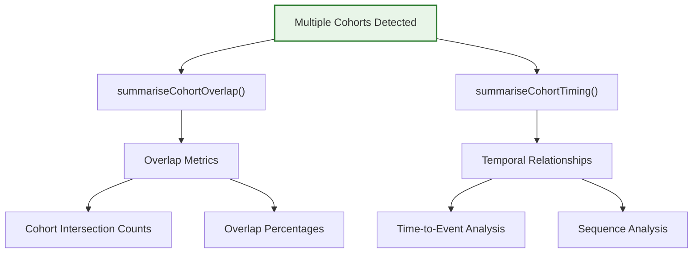
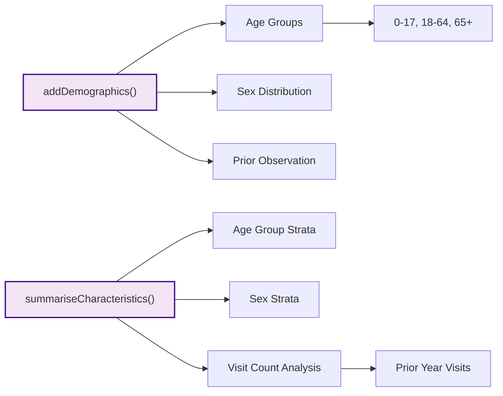
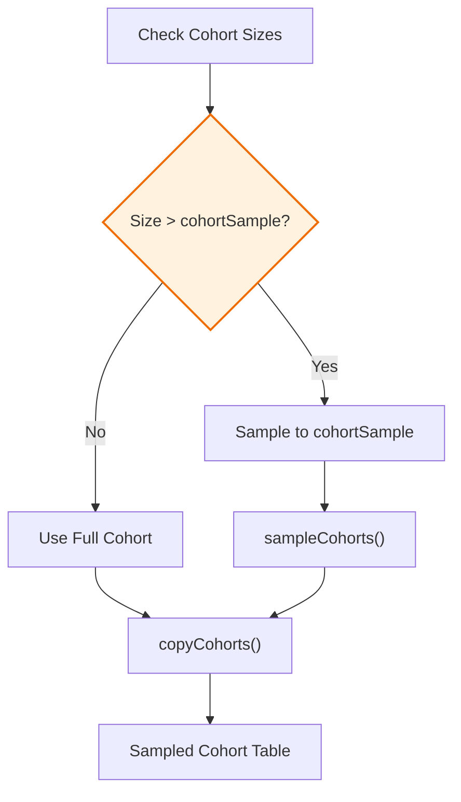
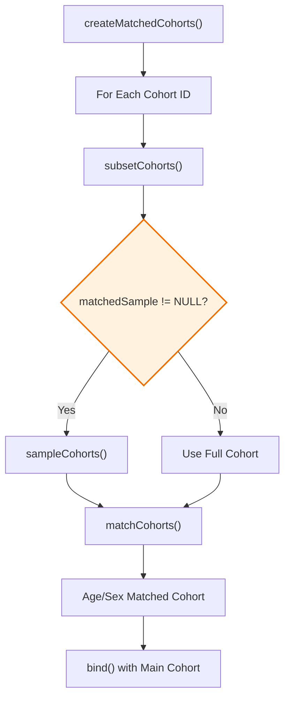
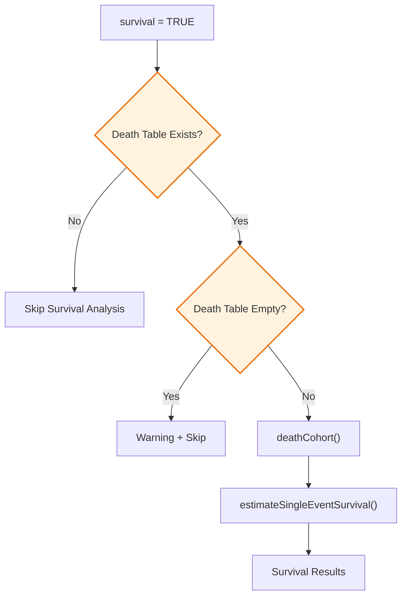
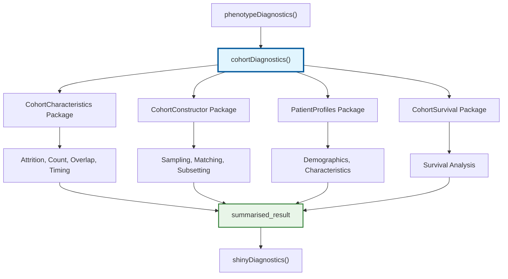
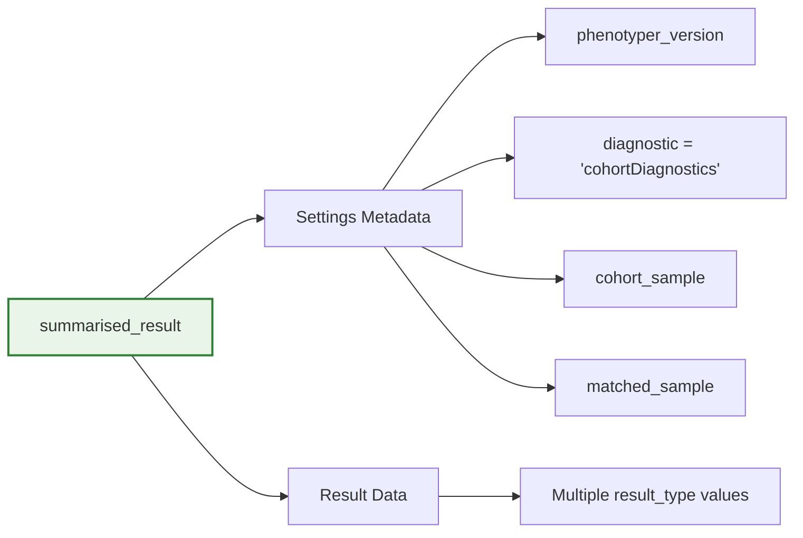

# Page: Cohort Diagnostics

# Cohort Diagnostics

Relevant source files

The following files were used as context for generating this wiki page:

- [R/cohortDiagnostics.R](R/cohortDiagnostics.R)
- [man/cohortDiagnostics.Rd](man/cohortDiagnostics.Rd)
- [tests/testthat/test-cohortDiagnostics.R](tests/testthat/test-cohortDiagnostics.R)
- [tests/testthat/test-phenotypeDiagnostics.R](tests/testthat/test-phenotypeDiagnostics.R)

This page documents the cohort-level diagnostic functionality within PhenotypeR's core diagnostic engine. The cohort diagnostics module performs comprehensive analysis of cohort composition, characteristics, and quality, providing essential insights for phenotype validation and research-readiness assessment.

For database-level analysis and population incidence/prevalence calculations, see [Database and Population Diagnostics](#2.4). For codelist-specific diagnostics, see [Codelist Diagnostics](#2.3).

## Purpose and Scope

The `cohortDiagnostics()` function serves as the primary entry point for cohort-level analysis within the PhenotypeR diagnostic framework. It performs multi-dimensional analysis of cohort composition including demographics, clinical characteristics, temporal patterns, and survival outcomes. The module automatically adapts its analysis strategy based on cohort count and implements sampling strategies for computational efficiency.

**Sources:** [R/cohortDiagnostics.R:1-48]()

## Core Diagnostic Workflow

The cohort diagnostics system follows a structured analysis pipeline that progresses from basic cohort metrics to complex multi-cohort comparisons:

**Sources:** [R/cohortDiagnostics.R:31-204]()

## Analysis Components

The cohort diagnostics module performs several distinct types of analysis, each targeting different aspects of cohort composition and quality:

### Basic Cohort Metrics

| Analysis Type | Function Call | Description |
|---------------|---------------|-------------|
| Cohort Attrition | `CohortCharacteristics::summariseCohortAttrition()` | Tracks cohort construction steps and exclusions |
| Cohort Count | `CohortCharacteristics::summariseCohortCount()` | Provides basic cohort size metrics |

**Sources:** [R/cohortDiagnostics.R:48-54]()

### Multi-Cohort Analysis

For scenarios with multiple cohorts, additional comparative analyses are performed:

**Sources:** [R/cohortDiagnostics.R:75-84]()

### Demographics and Characteristics

The system performs comprehensive demographic analysis with stratification:

**Sources:** [R/cohortDiagnostics.R:96-116]()

### Large Scale Characteristics

The module performs comprehensive clinical event analysis across multiple time windows:

| Time Window | Description | OMOP Tables |
|-------------|-------------|-------------|
| `c(-Inf, -366)` | More than 1 year prior | condition_occurrence, visit_occurrence, measurement, procedure_occurrence, observation, drug_exposure |
| `c(-365, -31)` | 1 year to 1 month prior | Same as above |
| `c(-30, -1)` | 30 days prior | Same as above |
| `c(0, 0)` | Index date | Same as above |
| `c(1, 30)` | 30 days after | Same as above |
| `c(31, 365)` | 1 month to 1 year after | Same as above |
| `c(366, Inf)` | More than 1 year after | Same as above |

**Sources:** [R/cohortDiagnostics.R:131-163]()

## Sampling Strategies

The cohort diagnostics system implements intelligent sampling to manage computational complexity while preserving analytical validity:

### Cohort Sampling

The `cohortSample` parameter controls the maximum number of individuals included in detailed analysis:

**Sources:** [R/cohortDiagnostics.R:56-73]()

### Matched Cohort Generation

For comparative analysis, the system creates age and sex-matched control cohorts:

**Sources:** [R/cohortDiagnostics.R:206-238]()

## Survival Analysis Integration

When the `survival` parameter is enabled, the system performs comprehensive survival analysis:

**Sources:** [R/cohortDiagnostics.R:165-186]()

## Integration with Diagnostic Framework

The cohort diagnostics module integrates seamlessly with the broader PhenotypeR diagnostic ecosystem:

**Sources:** [R/cohortDiagnostics.R:31-204](), [tests/testthat/test-phenotypeDiagnostics.R:42-58]()

## Input Validation and Error Handling

The system performs comprehensive input validation through the `checksCohortDiagnostics()` function:

| Parameter | Validation | Error Condition |
|-----------|------------|-----------------|
| `survival` | `assertLogical()` | Non-boolean value |
| `cohortSample` | `assertNumeric()` | Non-integer, negative, or multiple values |
| `matchedSample` | `assertNumeric()` | Non-integer, negative, or multiple values |
| CohortSurvival dependency | `check_installed()` | Missing package when survival=TRUE |

**Sources:** [R/cohortDiagnostics.R:240-247]()

## Result Structure

The function returns a `summarised_result` object with standardized metadata:

**Sources:** [R/cohortDiagnostics.R:193-202]()