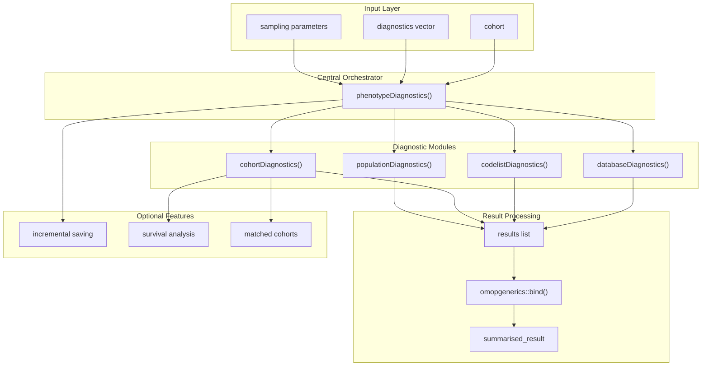
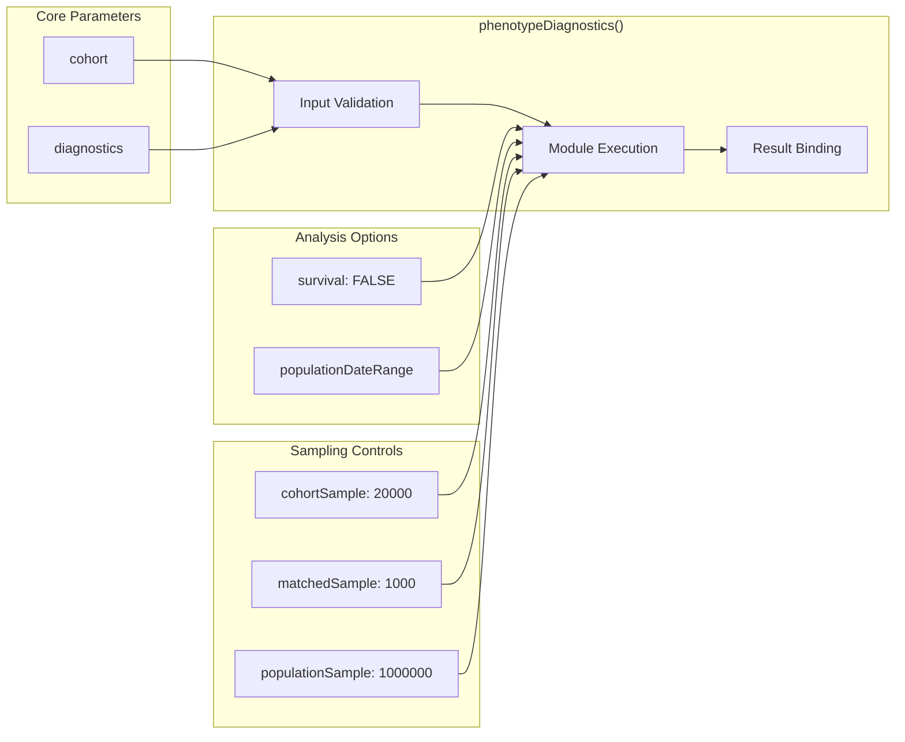
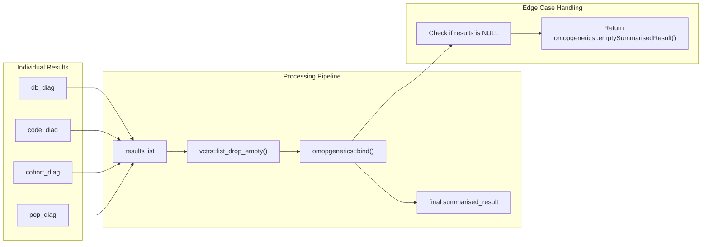
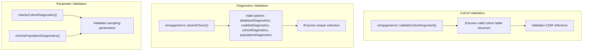

# Page: Core Diagnostic System

# Core Diagnostic System

Relevant source files

The following files were used as context for generating this wiki page:

- [R/phenotypeDiagnostics.R](R/phenotypeDiagnostics.R)
- [man/phenotypeDiagnostics.Rd](man/phenotypeDiagnostics.Rd)
- [tests/testthat/test-cohortDiagnostics.R](tests/testthat/test-cohortDiagnostics.R)
- [tests/testthat/test-phenotypeDiagnostics.R](tests/testthat/test-phenotypeDiagnostics.R)

## Purpose and Scope

The Core Diagnostic System forms the analytical engine of PhenotypeR, providing comprehensive assessment of cohorts across multiple analytical dimensions. This system orchestrates four complementary diagnostic modules to evaluate database quality, codelist usage, cohort characteristics, and population-level epidemiology.

This document covers the central diagnostic orchestration and module coordination. For detailed information about specific diagnostic modules, see [Cohort Diagnostics](#2.2), [Codelist Diagnostics](#2.3), and [Database and Population Diagnostics](#2.4). For AI-powered expectation generation, see [AI-Powered Expectations](#2.5). For interactive visualization of diagnostic results, see [Interactive Visualization System](#3).

## System Architecture

The Core Diagnostic System is built around a central orchestrator function that coordinates four specialized diagnostic modules, each targeting different aspects of phenotype validation.

**Sources:** [R/phenotypeDiagnostics.R:34-118]()

## Main Orchestrator Function

The `phenotypeDiagnostics()` function serves as the central coordinator for all diagnostic analyses. It validates inputs, manages execution flow, and consolidates results from multiple diagnostic modules.

### Function Signature and Parameters

### Execution Flow

The orchestrator follows a systematic execution pattern:

1. **Input Validation** - Validates cohort argument and diagnostic choices using `omopgenerics::validateCohortArgument()` and `omopgenerics::assertChoice()`
2. **Module Selection** - Conditionally executes diagnostic modules based on the `diagnostics` parameter
3. **Progressive Execution** - Runs modules sequentially with CLI progress indicators via `cli::cli()`
4. **Result Consolidation** - Combines results using `vctrs::list_drop_empty()` and `omopgenerics::bind()`

**Sources:** [R/phenotypeDiagnostics.R:43-117](), [tests/testthat/test-phenotypeDiagnostics.R:24-71]()

## Diagnostic Module Integration

Each diagnostic module operates independently but follows a common integration pattern within the orchestrator framework.

```mermaid
flowchart TD
    subgraph "Module Execution Pattern"
        A["Check if module in diagnostics vector"]
        B["Display CLI progress message"]
        C["Execute module function"]
        D["Store result in results list"]
        E["Optional: Export to incremental path"]
    end
    
    subgraph "Database Diagnostics"
        F["databaseDiagnostics(cdm)"]
        G["results[['db_diag']]"]
    end
    
    subgraph "Codelist Diagnostics"  
        H["codelistDiagnostics(cohort)"]
        I["results[['code_diag']]"]
    end
    
    subgraph "Cohort Diagnostics"
        J["cohortDiagnostics(cohort, survival, cohortSample, matchedSample)"]
        K["results[['cohort_diag']]"]
    end
    
    subgraph "Population Diagnostics"
        L["populationDiagnostics(cohort, populationSample, populationDateRange)"]
        M["results[['pop_diag']]"]
    end
    
    A --> B
    B --> C
    C --> D
    D --> E
    
    F --> G
    H --> I
    J --> K
    L --> M
```

### Module-Specific Parameters

| Module | Required Parameters | Optional Parameters |
|--------|-------------------|-------------------|
| `databaseDiagnostics` | `cdm` | None |
| `codelistDiagnostics` | `cohort` | None |
| `cohortDiagnostics` | `cohort` | `survival`, `cohortSample`, `matchedSample` |
| `populationDiagnostics` | `cohort` | `populationSample`, `populationDateRange` |

**Sources:** [R/phenotypeDiagnostics.R:56-106](), [tests/testthat/test-phenotypeDiagnostics.R:29-65]()

## Sampling Strategy Framework

The system implements sophisticated sampling strategies to handle large-scale healthcare databases efficiently while maintaining statistical validity.

### Sampling Parameters

```mermaid
graph TB
    subgraph "Cohort-Level Sampling"
        A["cohortSample: 20000"]
        B["Limits cohort size for characteristics analysis"]
        C["Maintains statistical power"]
    end
    
    subgraph "Matched Cohort Sampling"
        D["matchedSample: 1000"]
        E["Controls matched cohort generation"]
        F["Set to 0 to disable matching"]
    end
    
    subgraph "Population-Level Sampling"
        G["populationSample: 1000000"]
        H["Limits background population size"]
        I["Used for incidence/prevalence calculations"]
    end
    
    subgraph "Temporal Constraints"
        J["populationDateRange"]
        K["Constrains analysis timeframe"]
        L["Defaults to observation_period bounds"]
    end
    
    A --> B
    B --> C
    D --> E
    E --> F
    G --> H
    H --> I
    J --> K
    K --> L
```

### Sampling Implementation

The sampling is implemented at the module level, with the orchestrator passing sampling parameters to individual diagnostic functions. For cohort diagnostics, setting `matchedSample = 0` disables matched cohort creation entirely, while `NULL` values disable sampling.

**Sources:** [R/phenotypeDiagnostics.R:38-41](), [tests/testthat/test-phenotypeDiagnostics.R:44-45](), [man/phenotypeDiagnostics.Rd:27-42]()

## Result Management System

The system provides comprehensive result management including consolidation, validation, and optional incremental saving.

### Result Consolidation Pipeline

### Incremental Saving Feature

The system supports incremental saving of results through the `PhenotypeR.incremenatl_save_path` option. When configured, each diagnostic module's results are automatically exported to CSV files:

- `incremental_database_diagnostics.csv`
- `incremental_codelist_diagnostics.csv`  
- `incremental_cohort_diagnostics.csv`
- `incremental_population_diagnostics.csv`

This feature enables progressive result storage during long-running analyses and provides checkpoint recovery capabilities.

**Sources:** [R/phenotypeDiagnostics.R:51-117](), [tests/testthat/test-phenotypeDiagnostics.R:73-107]()

## Configuration and Validation

The system implements comprehensive input validation and configuration management to ensure robust operation across diverse healthcare data environments.

### Input Validation Framework

### Error Handling Patterns

The system provides informative error messages for common configuration issues:

- Invalid diagnostic module names
- Negative sampling parameters
- Invalid date ranges
- Malformed cohort tables

**Sources:** [R/phenotypeDiagnostics.R:43-49](), [tests/testthat/test-phenotypeDiagnostics.R:67-70]()

## Integration with OMOP Ecosystem

The Core Diagnostic System integrates seamlessly with the broader OMOP/OHDSI ecosystem through standardized interfaces and result formats.

### OMOP Integration Points

| Component | Integration Method | Purpose |
|-----------|-------------------|---------|
| `omopgenerics` | Result format standardization | Ensures consistent `summarised_result` output |
| `CDMConnector` | Database connectivity | Provides CDM reference for analysis |
| `CohortConstructor` | Cohort management | Handles cohort table operations |
| Clinical packages | Specialized analysis | Delegates to domain-specific packages |

The system returns results in the standardized `summarised_result` format, enabling seamless integration with other OHDSI tools and visualization frameworks.

**Sources:** [R/phenotypeDiagnostics.R:43,54,111,114]()