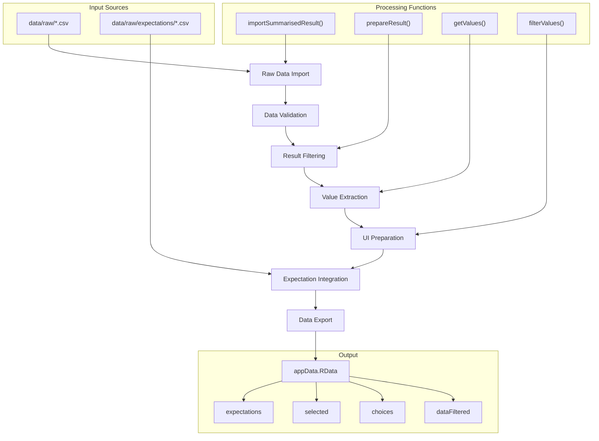
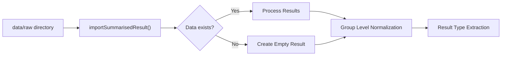
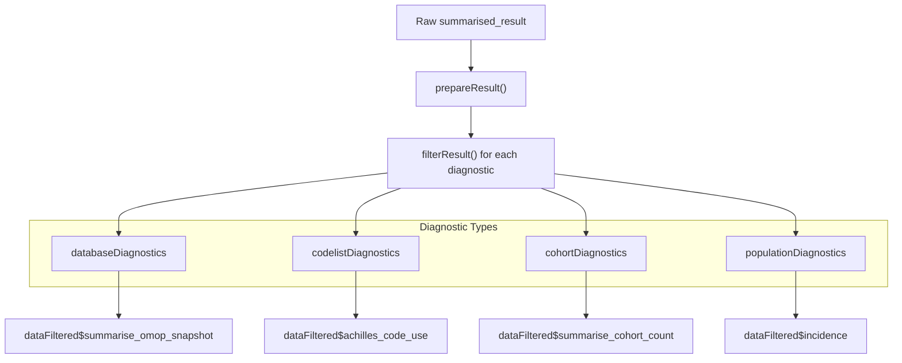
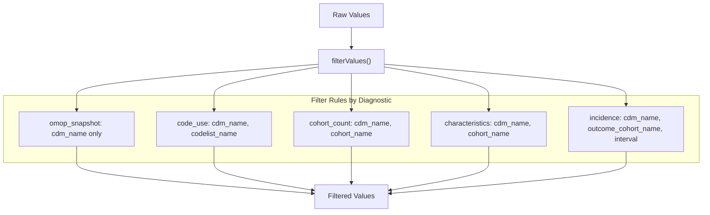
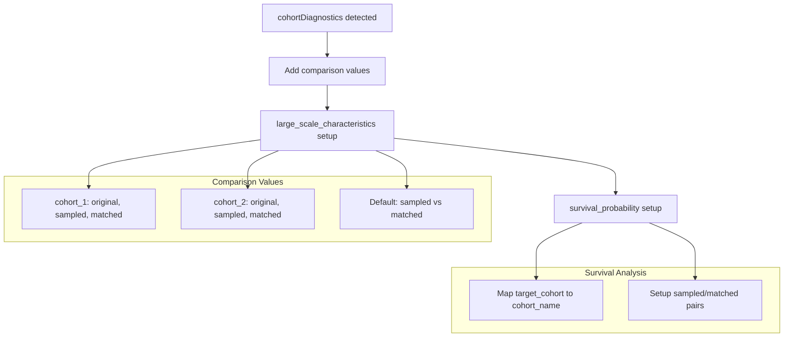
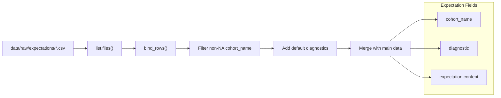
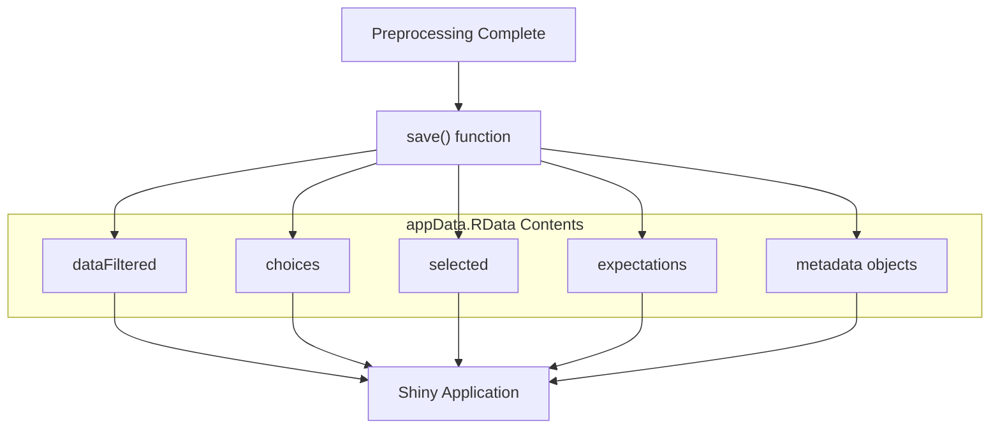
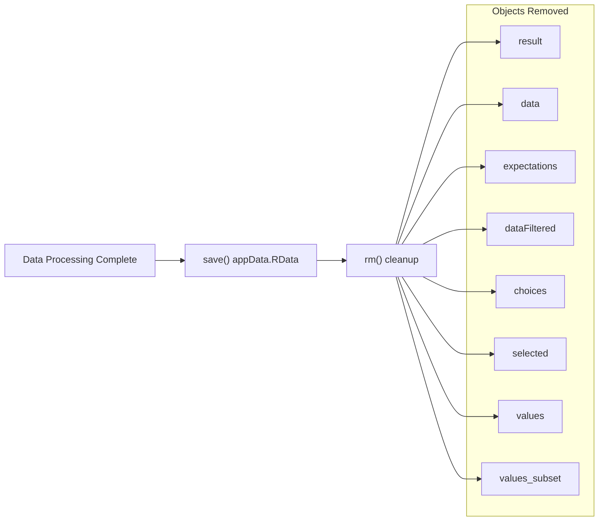

# Page: Data Preprocessing Pipeline

# Data Preprocessing Pipeline

Relevant source files

The following files were used as context for generating this wiki page:

- [.gitignore](.gitignore)
- [inst/shiny/data/raw/expectations/readme.md](inst/shiny/data/raw/expectations/readme.md)
- [inst/shiny/data/raw/readme.md](inst/shiny/data/raw/readme.md)
- [inst/shiny/data/readme.md](inst/shiny/data/readme.md)
- [inst/shiny/scripts/functions.R](inst/shiny/scripts/functions.R)
- [inst/shiny/scripts/preprocess.R](inst/shiny/scripts/preprocess.R)

## Purpose and Scope

The Data Preprocessing Pipeline transforms raw diagnostic results into a format optimized for interactive exploration in the Shiny application. This system takes `summarised_result` objects generated by the core diagnostic functions and processes them into structured data suitable for web-based visualization and filtering.

This page covers the data transformation workflow that occurs between raw diagnostic output and the Shiny interface. For information about the Shiny application setup and configuration, see [Shiny Application Setup](#3.1). For details about the server-side data processing within the Shiny app, see [Server Logic and Data Processing](#3.3).

## Preprocessing Workflow Overview

The preprocessing pipeline operates as a batch process that transforms diagnostic results into an optimized format for the Shiny application.

### Overall Pipeline Architecture

Sources: [inst/shiny/scripts/preprocess.R:1-236](), [inst/shiny/scripts/functions.R:1-109]()

## Data Import and Validation

The pipeline begins by importing raw diagnostic results and performing initial validation checks.

### Import Process

The system imports `summarised_result` objects from CSV files using the `omopgenerics::importSummarisedResult()` function. The import process includes error handling for empty datasets and data structure validation.

The pipeline handles special group level naming conventions, particularly converting matched/sampled cohort naming patterns for consistency across the application.

Sources: [inst/shiny/scripts/preprocess.R:22-42]()

## Data Transformation and Filtering

### Result Preparation

The `prepareResult()` function transforms raw results into diagnostic-specific datasets using filtering logic defined in `functions.R`.

| Function | Purpose | Input | Output |
|----------|---------|-------|--------|
| `prepareResult()` | Apply filters to create diagnostic datasets | `result`, `resultList` | Filtered data by diagnostic type |
| `filterResult()` | Apply specific filter criteria | `result`, filter criteria | Filtered `summarised_result` |
| `getValues()` | Extract unique values for UI components | `result`, `resultList` | Named list of UI choices |

Sources: [inst/shiny/scripts/functions.R:1-13](), [inst/shiny/scripts/preprocess.R:44-49]()

### Value Extraction and Filtering

The system extracts unique values from each diagnostic dataset to populate UI filter components. The `filterValues()` function removes unnecessary filter options to optimize the user interface.

#### Value Filtering Rules

The pipeline applies specific filtering rules for different diagnostic types:

Sources: [inst/shiny/scripts/functions.R:40-48](), [inst/shiny/scripts/preprocess.R:82-101]()

## UI Component Preparation

### Choices and Selected Values

The pipeline creates two parallel data structures for Shiny UI components:

- **choices**: All available options for each filter component
- **selected**: Default selections optimized for typical use cases

#### Cohort Diagnostics UI Preparation

For cohort diagnostics, the system performs additional processing to support comparison features:

Sources: [inst/shiny/scripts/preprocess.R:107-128](), [inst/shiny/scripts/preprocess.R:135-147]()

### Sampling and Matching Messages

The pipeline generates informational messages about data sampling and matching operations:

| Message Type | Condition | Purpose |
|--------------|-----------|---------|
| `msgCohortSample` | `cohort_sample` setting present | Inform about cohort size limitations |
| `msgMatchedSample` | `matched_sample` setting present | Explain matched cohort creation |
| `msgPopulationDiag` | Population date ranges | Describe incidence calculation periods |

Sources: [inst/shiny/scripts/preprocess.R:148-202]()

## Expectation Data Integration

### Expectation File Processing

The pipeline integrates AI-generated expectations from separate CSV files in the expectations directory:

The system assigns default diagnostic coverage to expectations that don't specify particular diagnostic types, ensuring expectations are available across all relevant diagnostic modules.

Sources: [inst/shiny/scripts/preprocess.R:204-218]()

## Data Export and Persistence

### Final Data Structure

The preprocessing pipeline culminates in saving a structured data file (`appData.RData`) containing all necessary components for the Shiny application:

| Data Object | Type | Purpose |
|-------------|------|---------|
| `dataFiltered` | List of `summarised_result` objects | Diagnostic data by type |
| `choices` | Named list | Available filter options |
| `selected` | Named list | Default filter selections |
| `expectations` | Data frame | AI-generated expectations |
| `min_incidence_start` | Date | Population analysis date range |
| `max_incidence_end` | Date | Population analysis date range |
| `msgCohortSample` | Character | Sampling information |
| `msgMatchedSample` | Character | Matching information |
| `msgPopulationDiag` | Character | Population diagnostic info |
| `phenotyper_version` | Character | Package version tracking |

Sources: [inst/shiny/scripts/preprocess.R:220-236]()

## Memory Management

The pipeline includes explicit memory cleanup to optimize resource usage in deployment environments:

This cleanup ensures that large intermediate objects don't persist in memory after the preprocessing is complete.

Sources: [inst/shiny/scripts/preprocess.R:234-236]()