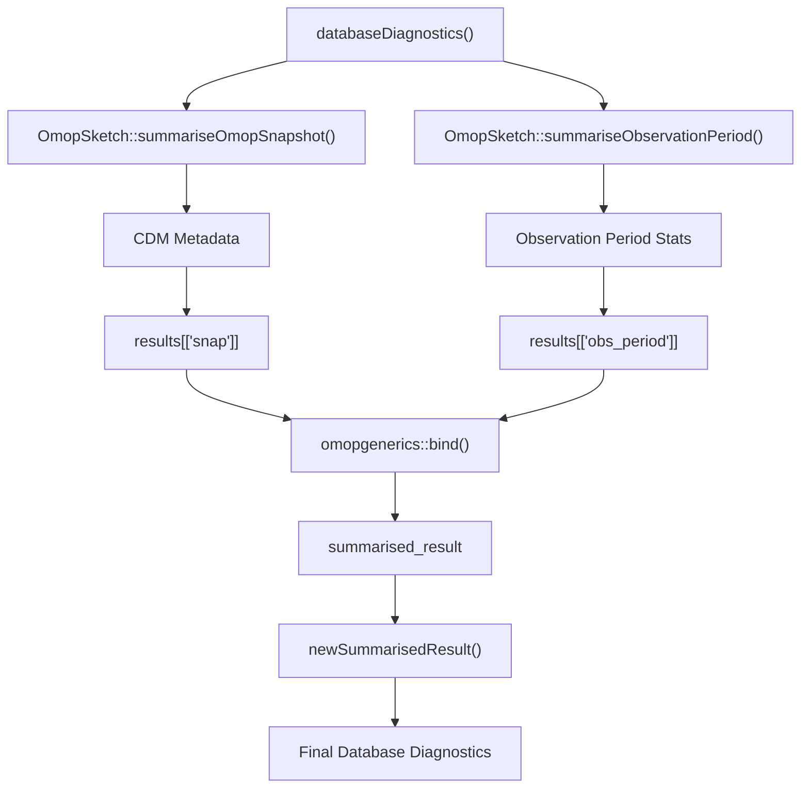
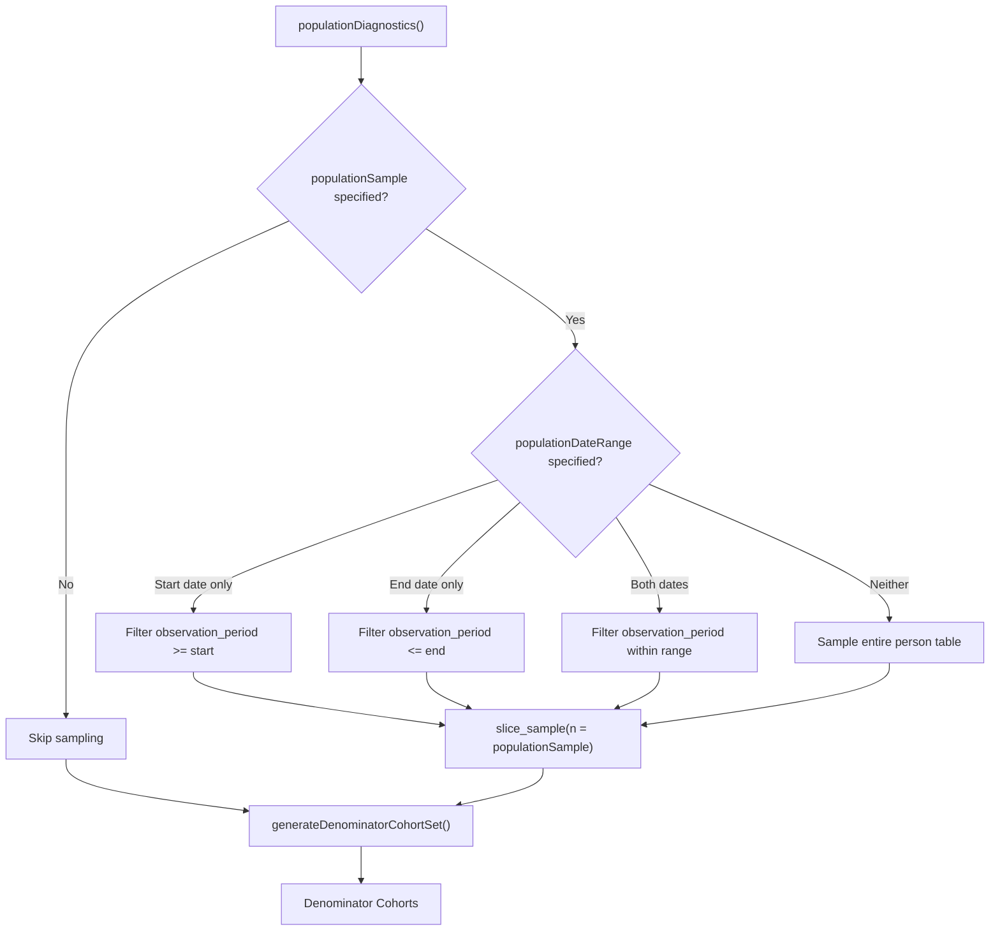
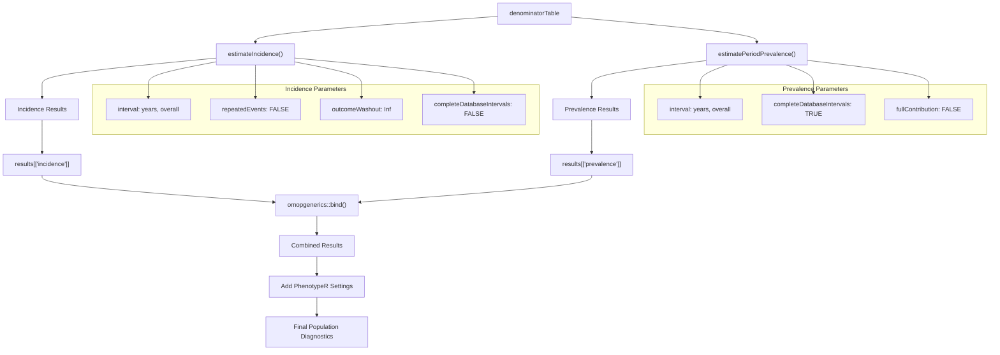
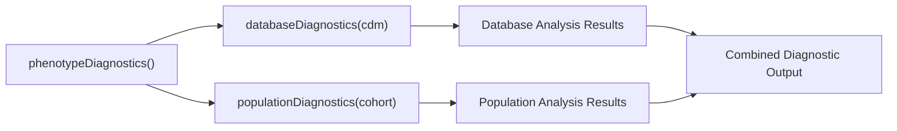

# Page: Database and Population Diagnostics

# Database and Population Diagnostics

Relevant source files

The following files were used as context for generating this wiki page:

- [R/databaseDiagnostics.R](R/databaseDiagnostics.R)
- [R/populationDiagnostics.R](R/populationDiagnostics.R)
- [man/codelistDiagnostics.Rd](man/codelistDiagnostics.Rd)
- [man/databaseDiagnostics.Rd](man/databaseDiagnostics.Rd)
- [tests/testthat/test-codelistDiagnostics.R](tests/testthat/test-codelistDiagnostics.R)
- [tests/testthat/test-databaseDiagnostics.R](tests/testthat/test-databaseDiagnostics.R)
- [tests/testthat/test-populationDiagnostics.R](tests/testthat/test-populationDiagnostics.R)

This document covers the database-level and population-level diagnostic capabilities within PhenotypeR. Database diagnostics provide a comprehensive snapshot of the OMOP CDM structure and observation periods, while population diagnostics calculate epidemiological measures including incidence and prevalence rates with customizable denominator populations.

For cohort-specific analysis including demographics and attrition, see [Cohort Diagnostics](#2.2). For code usage analysis, see [Codelist Diagnostics](#2.3).

## Overview

The database and population diagnostic modules operate at different analytical levels than other PhenotypeR components. Database diagnostics assess the underlying CDM structure and data availability, while population diagnostics calculate epidemiological measures by comparing cohorts against denominator populations with stratification by age, sex, and observation time requirements.

## Database Diagnostics Module

### Core Functionality

The `databaseDiagnostics()` function provides comprehensive database-level analysis through two primary components:

**Database Snapshot Analysis**
- Generates CDM metadata summary using `OmopSketch::summariseOmopSnapshot()`
- Captures table counts, schema information, and CDM version details
- Provides database-level quality indicators

**Observation Period Analysis** 
- Analyzes observation period coverage using `OmopSketch::summariseObservationPeriod()`
- Calculates temporal coverage statistics
- Identifies data availability windows

### Implementation Architecture

Sources: [R/databaseDiagnostics.R:25-43]()

### Data Structures

The function returns a `summarised_result` object containing:

| Result Type | Description | Source Function |
|-------------|-------------|-----------------|
| `omop_snapshot` | CDM structure and metadata | `summariseOmopSnapshot()` |
| `observation_period_summary` | Temporal coverage statistics | `summariseObservationPeriod()` |

Sources: [R/databaseDiagnostics.R:28-29]()

## Population Diagnostics Module

### Core Functionality

The `populationDiagnostics()` function calculates epidemiological measures through denominator population generation and outcome analysis:

**Denominator Population Construction**
- Creates stratified denominator cohorts using `IncidencePrevalence::generateDenominatorCohortSet()`
- Supports age stratification: 0-150, 0-17, 18-64, 65-150 years
- Implements sex stratification: Both, Male, Female
- Applies observation time requirements: 0 and 365 days prior observation

**Population Sampling**
- Optional population sampling via `populationSample` parameter
- Date range filtering through `populationDateRange` parameter
- Maintains representativeness through stratified sampling

**Epidemiological Calculations**
- Incidence estimation via `IncidencePrevalence::estimateIncidence()`
- Prevalence estimation via `IncidencePrevalence::estimatePeriodPrevalence()`
- Supports both yearly and overall time intervals

### Population Sampling Implementation

Sources: [R/populationDiagnostics.R:48-89](), [R/populationDiagnostics.R:91-102]()

### Epidemiological Analysis Workflow

Sources: [R/populationDiagnostics.R:106-124]()

### Configuration Parameters

The `populationDiagnostics()` function accepts the following parameters:

| Parameter | Type | Description | Default |
|-----------|------|-------------|---------|
| `cohort` | cohort_table | Input cohort for analysis | Required |
| `populationSample` | integer | Sample size for person table | 1,000,000 |
| `populationDateRange` | Date[2] | Start and end dates for sampling | `c(NA, NA)` |

Sources: [R/populationDiagnostics.R:35-37]()

### Denominator Stratification

The denominator population generation creates multiple strata:

**Age Groups**
- All ages: 0-150 years
- Pediatric: 0-17 years  
- Adult: 18-64 years
- Elderly: 65-150 years

**Sex Categories**
- Both sexes combined
- Male only
- Female only

**Prior Observation Requirements**
- No prior observation required (0 days)
- One year prior observation required (365 days)

Sources: [R/populationDiagnostics.R:94-100]()

## Function Integration with Main Orchestrator

Both diagnostic functions integrate seamlessly with the main `phenotypeDiagnostics()` orchestrator:

Sources: [R/databaseDiagnostics.R:25](), [R/populationDiagnostics.R:35]()

## Error Handling and Validation

### Population Diagnostics Validation

The `checksPopulationDiagnostics()` function validates:
- `populationSample`: Must be positive integer or NULL
- `populationDateRange`: Must be valid Date vector of length 2, allowing NA values

Sources: [R/populationDiagnostics.R:143-146]()

### Database Diagnostics Dependencies

Database diagnostics requires:
- Valid CDM reference object
- Access to `observation_period` table
- OmopSketch package functionality

Sources: [R/databaseDiagnostics.R:25]()