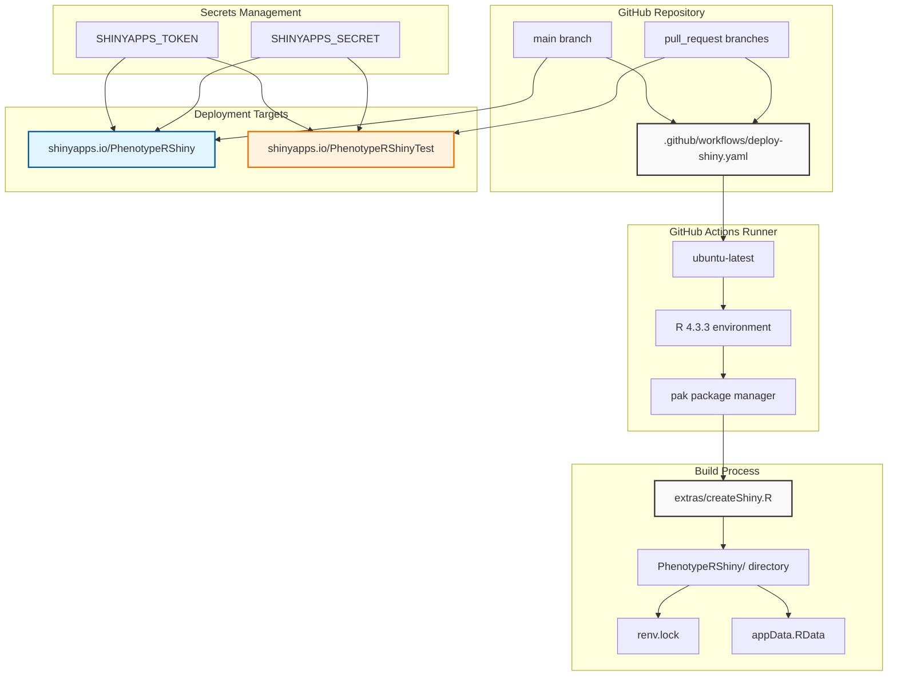
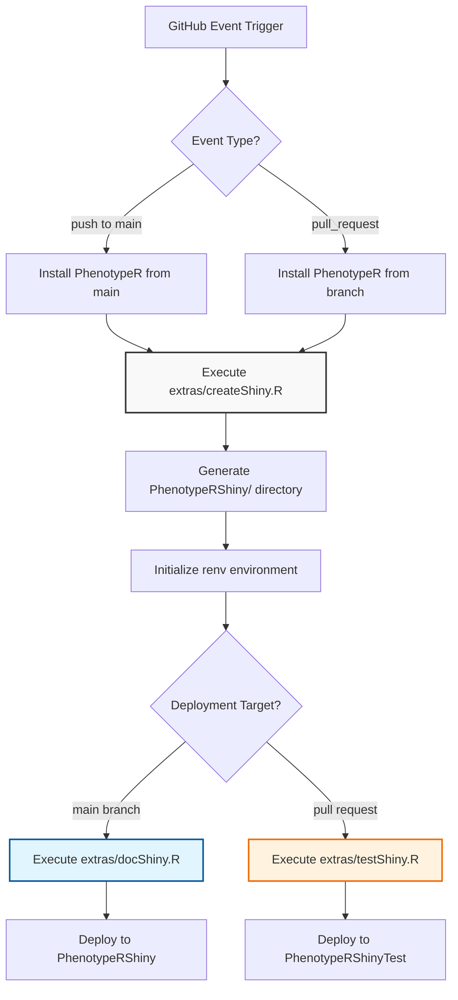
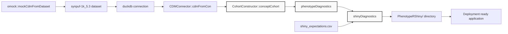
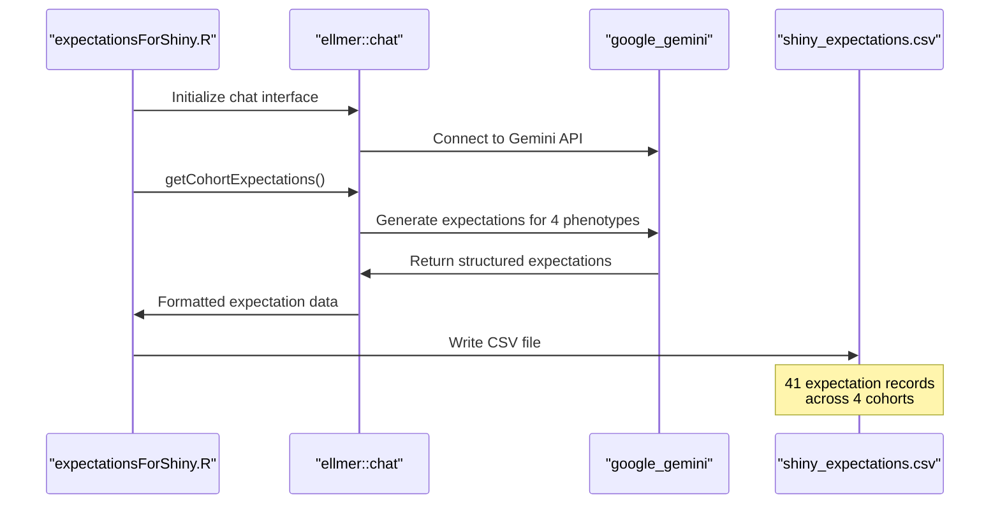

# Page: Deployment and Infrastructure

# Deployment and Infrastructure

<details>
<summary>Relevant source files</summary>

The following files were used as context for generating this wiki page:

- [.github/workflows/deploy-shiny.yaml](.github/workflows/deploy-shiny.yaml)
- [extras/createShiny.R](extras/createShiny.R)
- [extras/deployShiny.R](extras/deployShiny.R)
- [extras/docShiny.R](extras/docShiny.R)
- [extras/expectationsForShiny.R](extras/expectationsForShiny.R)
- [extras/shiny_expectations.csv](extras/shiny_expectations.csv)
- [extras/testShiny.R](extras/testShiny.R)

</details>


This document covers the automated deployment pipeline and infrastructure components used to deploy PhenotypeR's Shiny diagnostic application to production. The system uses GitHub Actions for continuous integration and deployment, with shinyapps.io as the hosting platform for interactive web applications.

For information about the Shiny application architecture itself, see [Interactive Visualization System](#3). For development and testing frameworks, see [Development and Testing](#4).

## Deployment Architecture Overview



**Sources:** [.github/workflows/deploy-shiny.yaml:1-75](), [extras/createShiny.R:1-41](), [extras/deployShiny.R:1-13]()

## GitHub Actions CI/CD Pipeline

The deployment process is orchestrated by a GitHub Actions workflow that triggers on pushes to main and pull requests. The workflow handles both test deployments for pull requests and production deployments for the main branch.

### Workflow Configuration

| Trigger | Target Environment | App Name |
|---------|-------------------|----------|
| `push` to `main` | Production | `PhenotypeRShiny` |
| `pull_request` | Test | `PhenotypeRShinyTest` |

The workflow uses a matrix strategy with Ubuntu Latest and R version 4.3.3, ensuring consistent deployment environments.



**Sources:** [.github/workflows/deploy-shiny.yaml:3-74](), [extras/docShiny.R:1-3](), [extras/testShiny.R:1-3]()

### Package Installation Strategy

The workflow implements branch-aware package installation to ensure pull request deployments test the exact code changes being proposed:

- **Pull Requests**: Installs PhenotypeR from the specific branch using `pak::pkg_install('ohdsi/PhenotypeR@$BRANCH_NAME')`
- **Main Branch**: Installs the latest release using `pak::pkg_install("ohdsi/PhenotypeR")`

**Sources:** [.github/workflows/deploy-shiny.yaml:43-53]()

## Shiny Application Generation

The deployment process generates a complete Shiny application with demonstration data through the `createShiny.R` script.

### Mock Data Pipeline



**Sources:** [extras/createShiny.R:2-40]()

### Demonstration Cohorts

The system generates four demonstration cohorts from concept sets:

| Cohort Name | Concept IDs | Purpose |
|-------------|-------------|---------|
| `user_of_warfarin` | 1310149L, 40163554L | Anticoagulant usage |
| `user_of_acetaminophen` | 1125315L, 1127078L, 1127433L, 40229134L, 40231925L, 40162522L, 19133768L | Pain medication usage |
| `user_of_morphine` | 1110410L, 35605858L, 40169988L | Opioid usage |
| `measurement_of_prostate_specific_antigen_level` | 2617206L | PSA testing |

**Sources:** [extras/createShiny.R:19-24]()

## Environment Management

### Dependency Management

The deployment process uses `renv` for reproducible R environments:

1. **Initialization**: `renv::init()` creates `renv.lock` in the `PhenotypeRShiny/` directory
2. **Snapshot**: Captures exact package versions used during build
3. **Restoration**: Ensures identical environments across deployments

**Sources:** [.github/workflows/deploy-shiny.yaml:58-60]()

### Secrets and Authentication

Deployment to shinyapps.io requires two environment secrets:

| Secret | Purpose |
|--------|---------|
| `SHINYAPPS_TOKEN` | Authentication token for shinyapps.io API |
| `SHINYAPPS_SECRET` | Secret key for secure communication |

These are configured through `rsconnect::setAccountInfo()` targeting the `dpa-pde-oxford` account.

**Sources:** [extras/deployShiny.R:2-6](), [.github/workflows/deploy-shiny.yaml:65-73]()

## AI-Generated Expectations

The demonstration application includes AI-generated cohort expectations to showcase the expectation comparison functionality.

### Expectation Generation Process



**Sources:** [extras/expectationsForShiny.R:2-10](), [extras/shiny_expectations.csv:1-42]()

### Expectation Data Structure

The generated expectations cover multiple diagnostic categories:

- `cohort_count`: Clinical descriptions and frequency expectations
- `cohort_characteristics`: Age and gender distributions
- `cohort_survival`: Five-year survival estimates
- `compare_cohorts`: Overlap and timing patterns
- `large_scale_characteristics`: Comorbidities, symptoms, and medications

**Sources:** [extras/shiny_expectations.csv:1-42]()

## Deployment Scripts

### Common Deployment Logic

The `deployShiny.R` script provides shared deployment functionality:

```r
rsconnect::setAccountInfo(
  name = "dpa-pde-oxford",
  token = Sys.getenv("SHINYAPPS_TOKEN"),
  secret = Sys.getenv("SHINYAPPS_SECRET")
)
rsconnect::deployApp(
  appDir = file.path(getwd(), "PhenotypeRShiny"),
  appName = appName,
  forceUpdate = TRUE,
  logLevel = "verbose"
)
```

**Sources:** [extras/deployShiny.R:2-12]()

### Environment-Specific Scripts

| Script | App Name | Environment |
|--------|----------|-------------|
| `docShiny.R` | `PhenotypeRShiny` | Production |
| `testShiny.R` | `PhenotypeRShinyTest` | Testing |

Both scripts source the common deployment logic with different `appName` values.

**Sources:** [extras/docShiny.R:2-3](), [extras/testShiny.R:2-3]()

## Concurrency and Resource Management

The workflow implements concurrency controls to prevent conflicting deployments:

```yaml
concurrency:
  group: pr-${{ github.event.pull_request.number || github.run_id }}
  cancel-in-progress: true
```

This ensures that new deployments cancel previous ones for the same pull request, preventing resource conflicts and deployment collisions.

**Sources:** [.github/workflows/deploy-shiny.yaml:17-19]()