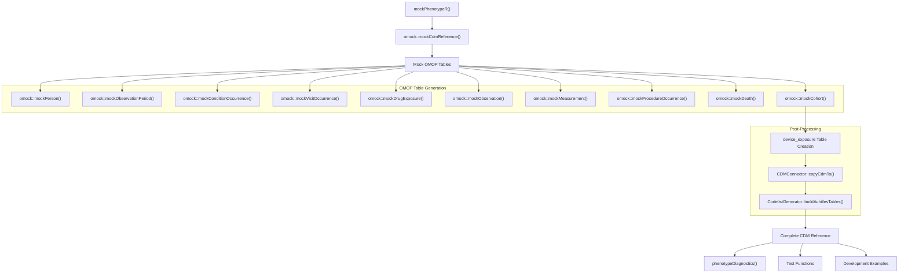
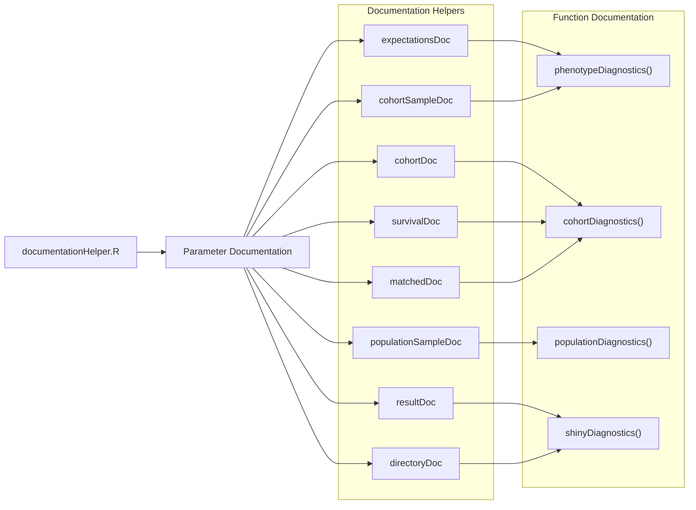
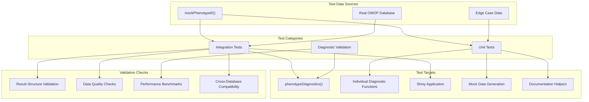

# Page: Development and Testing

# Development and Testing

<details>
<summary>Relevant source files</summary>

The following files were used as context for generating this wiki page:

- [R/documentationHelper.R](R/documentationHelper.R)
- [R/mockPhenotypeR.R](R/mockPhenotypeR.R)
- [_pkgdown.yml](_pkgdown.yml)
- [man/matchedDoc.Rd](man/matchedDoc.Rd)

</details>


This page covers the development tools, testing frameworks, and utilities available for developers working with PhenotypeR. It provides an overview of the mock data generation system, documentation helpers, and testing approaches used in the codebase.

For information about the core diagnostic functionality, see [Core Diagnostic System](#2). For deployment and production infrastructure, see [Deployment and Infrastructure](#5).

## Purpose and Scope

The PhenotypeR development framework provides several key components to support package development and testing:

- **Mock Data Generation**: Create realistic OMOP CDM datasets for testing and development
- **Documentation Helpers**: Consistent parameter documentation across functions
- **Testing Utilities**: Support for both unit tests and integration tests with real databases
- **Development Workflow**: Tools and patterns for extending the diagnostic capabilities

## Development Architecture Overview

The development and testing system follows a modular approach that supports both local development and automated testing workflows.

### Mock Data Generation System



The `mockPhenotypeR` function creates a complete OMOP CDM reference with realistic data for testing and development purposes. It generates a specified number of persons with associated clinical events across all major OMOP tables.

Sources: [R/mockPhenotypeR.R:24-66](), [_pkgdown.yml:58-60]()

### Documentation Helper System



The documentation helper system ensures consistent parameter documentation across all functions in the package. Each helper defines a reusable parameter description that can be inherited by multiple functions.

Sources: [R/documentationHelper.R:1-76](), [man/matchedDoc.Rd:1-14]()

## Mock Data Configuration

The `mockPhenotypeR` function provides several configuration options for creating test datasets:

| Parameter | Type | Default | Description |
|-----------|------|---------|-------------|
| `nPerson` | numeric | 100 | Number of people in the CDM |
| `con` | DBI connection | `duckdb::duckdb()` | Database connection |
| `writeSchema` | character | "main" | Schema with write permissions |
| `seed` | numeric | 111 | Seed for reproducible data generation |

### Key Features

- **Complete OMOP CDM**: Generates all standard OMOP tables with realistic relationships
- **Configurable Size**: Adjustable number of persons for different testing scenarios  
- **Reproducible**: Uses seed parameter for consistent test data
- **Database Agnostic**: Works with any DBI-compatible database connection
- **Achilles Integration**: Automatically builds Achilles tables for comprehensive testing

Sources: [R/mockPhenotypeR.R:24-32](), [R/mockPhenotypeR.R:60-61]()

## Testing Approach

### Unit Testing Strategy

PhenotypeR employs a comprehensive testing strategy that covers both individual functions and full diagnostic workflows:



### Testing Framework Components

The testing framework includes several key components:

- **Mock Data Generation**: Provides consistent test datasets through `mockPhenotypeR()`
- **Database Integration Tests**: Validates functionality across different database backends
- **Result Validation**: Ensures diagnostic outputs conform to expected structure and content
- **Performance Testing**: Monitors execution time and memory usage for large datasets
- **Cross-Platform Testing**: Validates compatibility across different operating systems and R versions

Sources: [R/mockPhenotypeR.R:16-23](), [_pkgdown.yml:58-60]()

## Development Utilities

### Documentation Consistency

The package uses a centralized documentation system to ensure parameter descriptions remain consistent across all functions:

```r
# Example usage in function documentation
#' @inheritParams expectationsDoc
#' @inheritParams cohortDoc
#' @inheritParams survivalDoc
```

This approach reduces documentation maintenance overhead and ensures users see consistent parameter descriptions throughout the package.

### Mock Data Workflow

Creating a test environment involves the following steps:

1. **Initialize Mock CDM**: Call `mockPhenotypeR()` with desired parameters
2. **Generate Test Cohorts**: Use the built-in cohort tables or create custom ones
3. **Run Diagnostics**: Execute diagnostic functions against the mock data
4. **Validate Results**: Check output structure and content
5. **Clean Up**: Disconnect from temporary database connections

Sources: [R/documentationHelper.R:3-9](), [R/documentationHelper.R:11-17]()

## Development Best Practices

### Code Organization

- **Function Isolation**: Each diagnostic module is independently testable
- **Consistent Interfaces**: All diagnostic functions follow similar parameter patterns
- **Error Handling**: Comprehensive input validation using `omopgenerics::assert*` functions
- **Documentation**: Extensive use of documentation helpers for consistency

### Testing Guidelines

- **Mock Data First**: Start development with `mockPhenotypeR()` for rapid iteration
- **Real Data Validation**: Test against actual OMOP databases before release
- **Edge Case Coverage**: Include tests for empty cohorts, missing data, and boundary conditions
- **Performance Monitoring**: Track execution time for large dataset scenarios

Sources: [R/mockPhenotypeR.R:29-31](), [R/documentationHelper.R:1-76]()