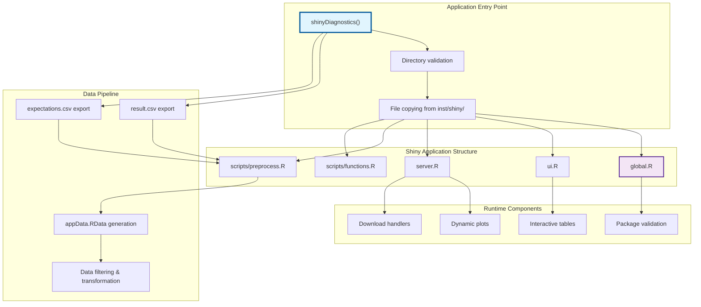
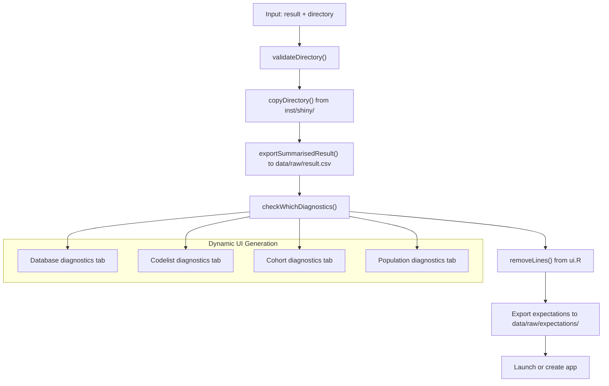
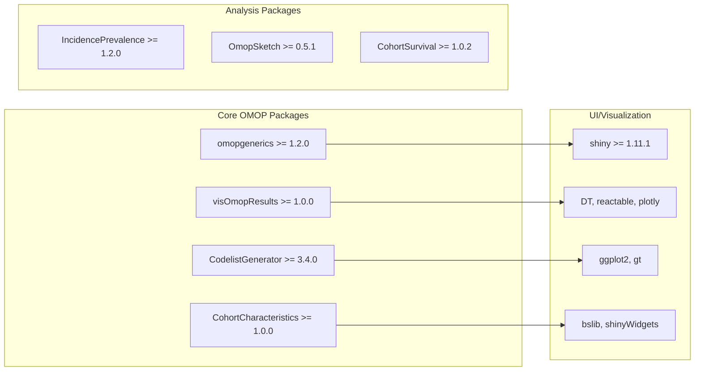
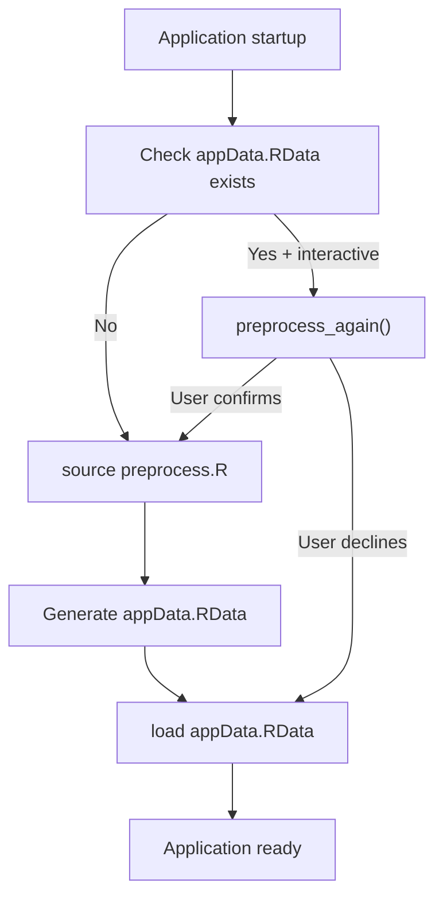
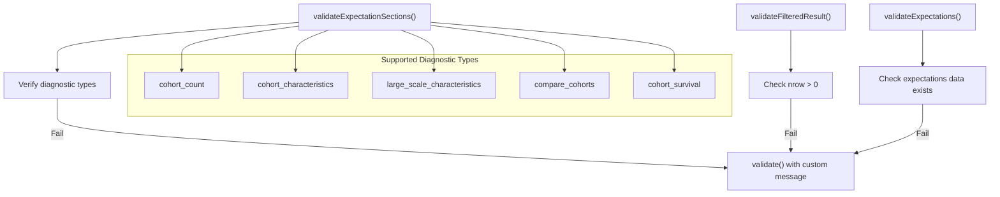

# Page: Interactive Visualization System

# Interactive Visualization System

Relevant source files

The following files were used as context for generating this wiki page:

- [R/shinyDiagnostics.R](R/shinyDiagnostics.R)
- [inst/shiny/global.R](inst/shiny/global.R)
- [man/shinyDiagnostics.Rd](man/shinyDiagnostics.Rd)
- [tests/testthat/test-shinyDiagnostics.R](tests/testthat/test-shinyDiagnostics.R)

The Interactive Visualization System provides web-based exploration of phenotyping diagnostic results through a Shiny application framework. This system transforms raw diagnostic outputs into interactive dashboards with dynamic filtering, plotting capabilities, and downloadable reports.

For information about the diagnostic engines that generate the underlying data, see [Core Diagnostic System](#2). For deployment and hosting details, see [Deployment and Infrastructure](#5).

## System Architecture

The Interactive Visualization System operates as a self-contained Shiny application that processes diagnostic results and presents them through a web interface.

**Sources:** [R/shinyDiagnostics.R:1-224](), [inst/shiny/global.R:1-274]()

## Application Creation and Setup

The `shinyDiagnostics()` function serves as the primary interface for creating Shiny applications from diagnostic results. The function performs several key operations:

| Operation | Function | Description |
|-----------|----------|-------------|
| **Input Validation** | `omopgenerics::assertTable()` | Validates expectations table structure |
| **Version Checking** | Version compatibility checks | Ensures result compatibility with current PhenotypeR version |
| **Directory Management** | `validateDirectory()` | Creates target directory and handles overwrites |
| **File Operations** | `copyDirectory()` | Copies Shiny template files from `inst/shiny/` |
| **Data Export** | `omopgenerics::exportSummarisedResult()` | Exports diagnostic results as CSV |
| **UI Customization** | `removeLines()` | Removes tabs for unavailable diagnostics |

**Sources:** [R/shinyDiagnostics.R:43-123](), [R/shinyDiagnostics.R:173-197]()

## Global Configuration and Dependencies

The `global.R` file establishes the application runtime environment with comprehensive package loading and utility functions.

### Package Dependencies

The system requires specific minimum versions of core packages:

**Sources:** [inst/shiny/global.R:1-33]()

### Data Loading and Preprocessing

The global setup implements a sophisticated data loading mechanism:

**Sources:** [inst/shiny/global.R:36-59]()

## Visualization Utilities

The global environment includes specialized plotting functions for cohort analysis:

### Age Density Visualization

The `plotAgeDensity()` function creates population pyramids with optional interquartile range overlays:

- **Input Processing**: Filters age density data and applies sex-based transformations
- **Geometric Rendering**: Uses `geom_polygon()` for density visualization
- **Statistical Overlays**: Median and IQR lines with conditional display
- **Faceting**: Supports database and cohort-level grouping

### Large Scale Characteristics Comparison

The `plotComparedLsc()` function implements standardized mean difference (SMD) scatter plots:

- **Data Transformation**: Converts percentages and calculates SMDs
- **Interactive Elements**: Hover details with concept information  
- **Missing Data Handling**: Optional imputation of missing values
- **Reference Lines**: Diagonal reference line for comparison

**Sources:** [inst/shiny/global.R:61-133](), [inst/shiny/global.R:136-219]()

## Table Configuration System

The system provides standardized table formatting through `getColsForTbl()`:

| Feature | Implementation | Purpose |
|---------|----------------|---------|
| **Concept ID Linking** | ATHENA URL generation | Direct links to concept definitions |
| **Number Formatting** | `colFormat(separators = TRUE)` | Thousands separators for readability |
| **NA Handling** | Custom cell renderers | Consistent display of missing values |
| **Sorting** | `sortNALast = TRUE` | Predictable sort behavior |

**Sources:** [inst/shiny/global.R:221-249]()

## Validation Framework

The application implements multiple validation layers:

### Input Validation Functions

**Sources:** [inst/shiny/global.R:251-274]()

## Tab Management System

The application dynamically adjusts its interface based on available diagnostic results through the `checkWhichDiagnostics()` and `removeLines()` functions:

### Conditional Tab Display

| Diagnostic Type | Required Result Type | Fallback Action |
|----------------|---------------------|-----------------|
| **Codelist Diagnostics** | `achilles_code_use` | Remove achilles_results tab |
| **Measurement Diagnostics** | `measurement_timings` | Remove measurement_diagnostics tab |
| **Cohort Survival** | `survival_probability` | Remove cohort_survival tab |

**Sources:** [R/shinyDiagnostics.R:173-197](), [R/shinyDiagnostics.R:198-216]()