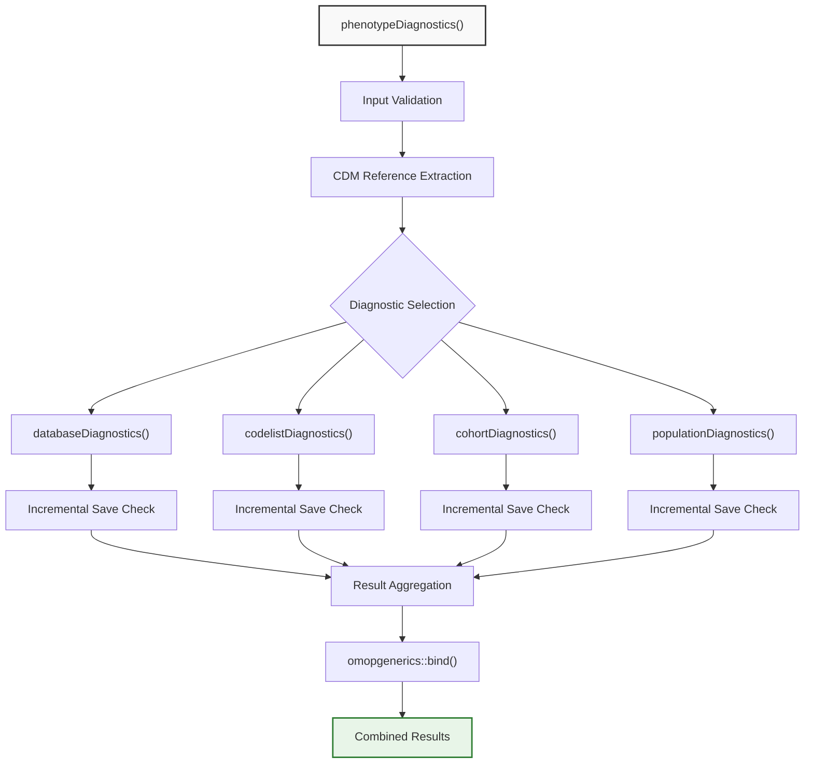
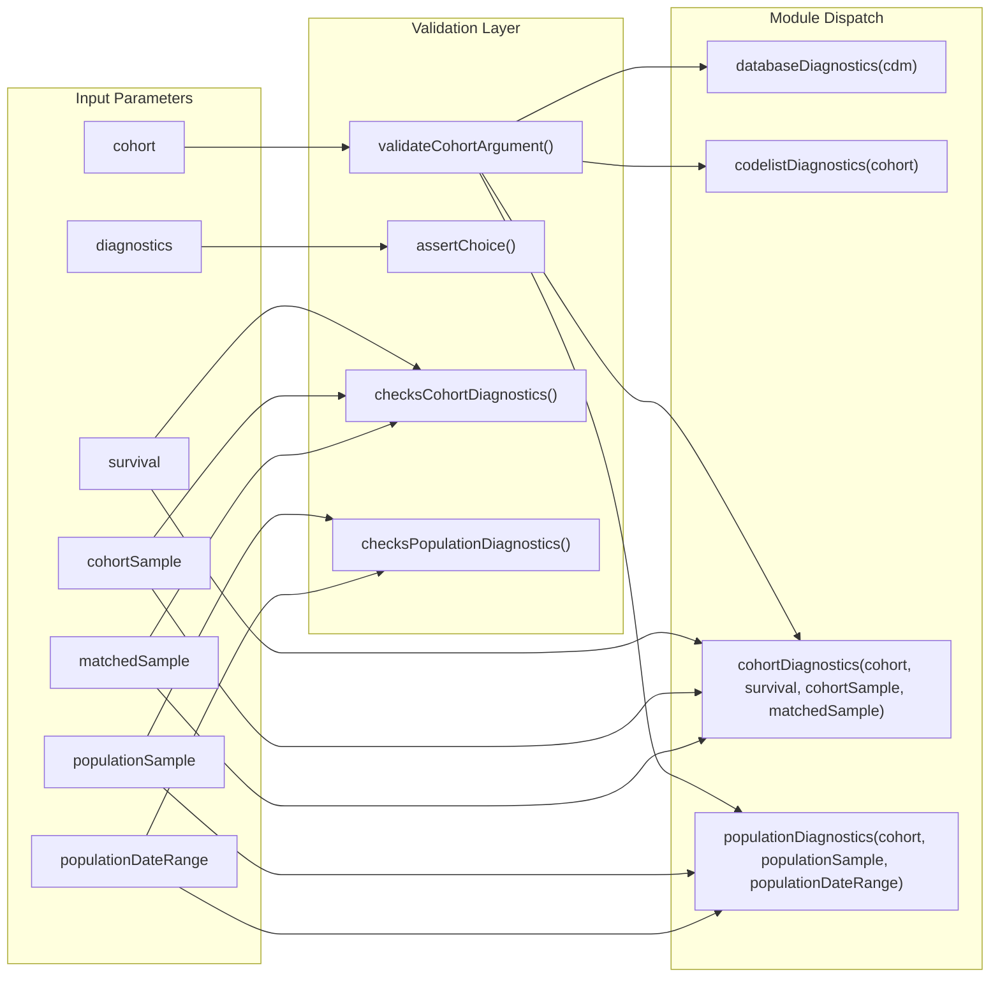
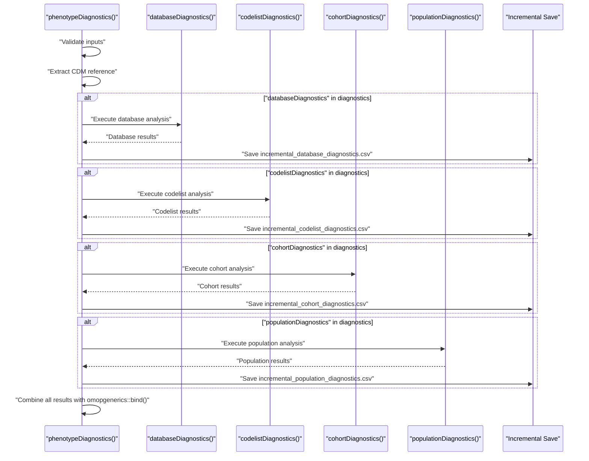
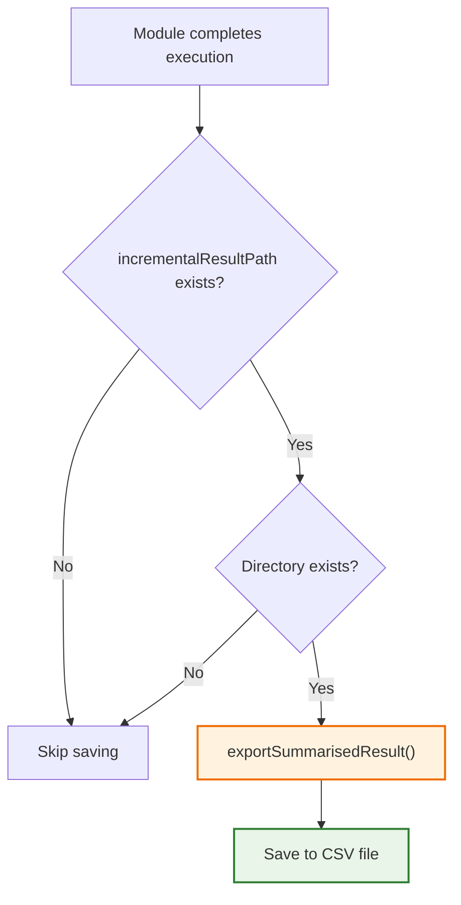

# Page: Main Orchestrator Function

# Main Orchestrator Function

<details>
<summary>Relevant source files</summary>

The following files were used as context for generating this wiki page:

- [R/phenotypeDiagnostics.R](R/phenotypeDiagnostics.R)
- [man/phenotypeDiagnostics.Rd](man/phenotypeDiagnostics.Rd)
- [tests/testthat/test-cohortDiagnostics.R](tests/testthat/test-cohortDiagnostics.R)
- [tests/testthat/test-phenotypeDiagnostics.R](tests/testthat/test-phenotypeDiagnostics.R)

</details>


This page documents the `phenotypeDiagnostics()` function, which serves as the central orchestrator for all diagnostic analyses in the PhenotypeR system. This function coordinates the execution of database, codelist, cohort, and population-level diagnostics, manages sampling strategies, and handles result aggregation.

For information about individual diagnostic modules, see [Cohort Diagnostics](#2.2), [Codelist Diagnostics](#2.3), and [Database and Population Diagnostics](#2.4). For the interactive visualization of results, see [Interactive Visualization System](#3).

## Function Overview

The `phenotypeDiagnostics()` function is defined in [R/phenotypeDiagnostics.R:34-118]() and serves as the main entry point for comprehensive cohort assessment. It orchestrates multiple diagnostic modules, each focusing on different aspects of cohort validation and research-readiness evaluation.

### Function Signature and Core Parameters

```r
phenotypeDiagnostics(
  cohort,
  diagnostics = c("databaseDiagnostics", "codelistDiagnostics", 
                  "cohortDiagnostics", "populationDiagnostics"),
  survival = FALSE,
  cohortSample = 20000,
  matchedSample = 1000,
  populationSample = 1000000,
  populationDateRange = as.Date(c(NA, NA))
)
```

Sources: [R/phenotypeDiagnostics.R:34-41](), [man/phenotypeDiagnostics.Rd:6-16]()

## Orchestration Architecture

### High-Level Workflow



This diagram shows how `phenotypeDiagnostics()` coordinates the execution of individual diagnostic modules and manages the result aggregation process.

Sources: [R/phenotypeDiagnostics.R:53-117]()

### Parameter Flow and Module Configuration



This diagram illustrates how input parameters are validated and distributed to the appropriate diagnostic modules.

Sources: [R/phenotypeDiagnostics.R:43-49]()

## Diagnostic Module Orchestration

### Conditional Execution Logic

The function uses conditional execution to run only the requested diagnostic modules based on the `diagnostics` parameter:

| Module | Function Call | Key Parameters |
|--------|---------------|----------------|
| Database | `databaseDiagnostics(cdm)` | CDM reference only |
| Codelist | `codelistDiagnostics(cohort)` | Cohort table with codelist attributes |
| Cohort | `cohortDiagnostics(cohort, survival, cohortSample, matchedSample)` | Sampling and survival analysis settings |
| Population | `populationDiagnostics(cohort, populationSample, populationDateRange)` | Population sampling and date range |

The orchestrator ensures that each module receives only the parameters it requires, as implemented in [R/phenotypeDiagnostics.R:56-106]().

### Module Execution Sequence



Sources: [R/phenotypeDiagnostics.R:56-106]()

## Incremental Result Saving

### Save Path Configuration

The function supports incremental saving of results through the global option `PhenotypeR.incremenatl_save_path`. When this option is set and the directory exists, each diagnostic module's results are automatically saved as CSV files:

- `incremental_database_diagnostics.csv`
- `incremental_codelist_diagnostics.csv`
- `incremental_cohort_diagnostics.csv`
- `incremental_population_diagnostics.csv`

This feature is implemented in [R/phenotypeDiagnostics.R:51]() and [R/phenotypeDiagnostics.R:59-65](), [R/phenotypeDiagnostics.R:71-77](), [R/phenotypeDiagnostics.R:86-92](), [R/phenotypeDiagnostics.R:99-105]().

### Save Logic Flow



Sources: [R/phenotypeDiagnostics.R:59-65](), [tests/testthat/test-phenotypeDiagnostics.R:94-101]()

## Input Validation and Error Handling

### Validation Pipeline

The function implements a comprehensive validation pipeline to ensure data integrity and parameter validity:

1. **Cohort Validation**: Uses `omopgenerics::validateCohortArgument()` to ensure the input is a valid cohort table
2. **Diagnostics Selection**: Uses `omopgenerics::assertChoice()` to validate the diagnostics parameter
3. **Cohort Parameters**: Custom function `checksCohortDiagnostics()` validates survival, cohortSample, and matchedSample
4. **Population Parameters**: Custom function `checksPopulationDiagnostics()` validates populationSample and populationDateRange

These validations are implemented in [R/phenotypeDiagnostics.R:43-49]().

### Error Handling Examples

The test suite demonstrates the error handling capabilities:

```r
# Invalid diagnostics parameter
expect_error(phenotypeDiagnostics(cdm$my_cohort, diagnostics = "hello"))

# Invalid sample sizes
expect_error(phenotypeDiagnostics(cdm$my_cohort, matchedSample = -10))
expect_error(phenotypeDiagnostics(cdm$my_cohort, populationSample = 0))
```

Sources: [tests/testthat/test-phenotypeDiagnostics.R:67-70]()

## Result Aggregation and Output

### Result Combination Strategy

The function aggregates results from all executed diagnostic modules using a standardized approach:

1. **Collection**: Results are stored in a named list structure
2. **Empty Handling**: Empty results are dropped using `vctrs::list_drop_empty()`
3. **Binding**: All valid results are combined using `omopgenerics::bind()`
4. **Empty Fallback**: If no results exist, returns `omopgenerics::emptySummarisedResult()`

This process is implemented in [R/phenotypeDiagnostics.R:108-117]().

### Output Structure

The function returns a `summarised_result` object that conforms to the OMOP standards, containing:

- Combined diagnostic results from all executed modules
- Standardized metadata and settings
- Consistent group and variable naming conventions
- Compatible format for downstream visualization and analysis

Sources: [R/phenotypeDiagnostics.R:21](), [R/phenotypeDiagnostics.R:108-117](), [tests/testthat/test-phenotypeDiagnostics.R:24-66]()