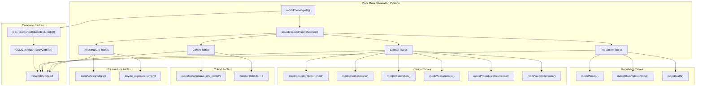
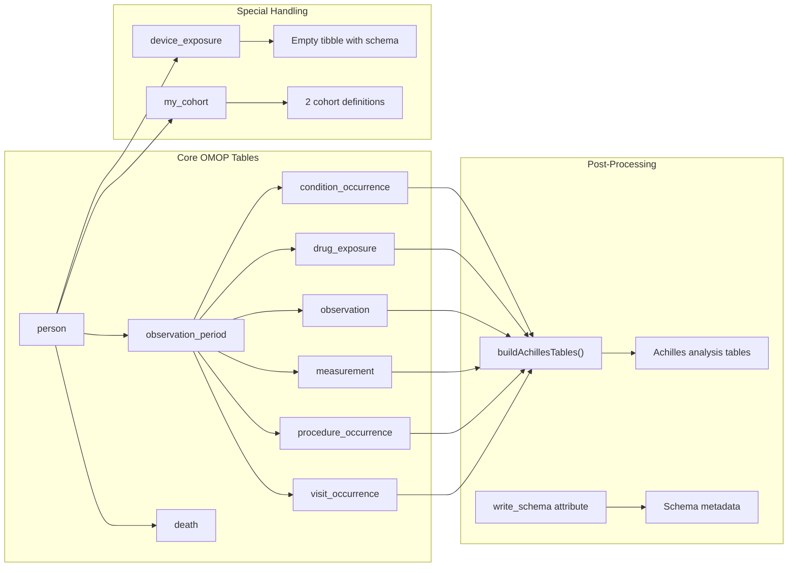
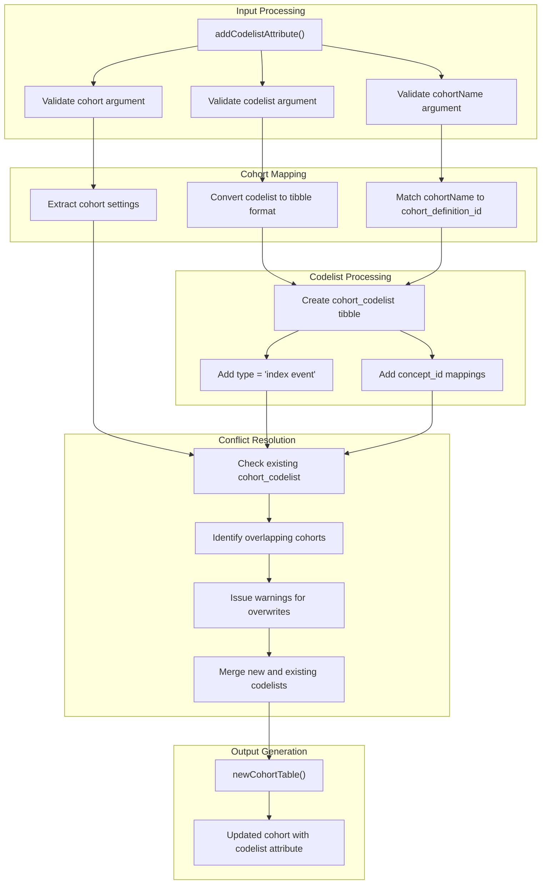
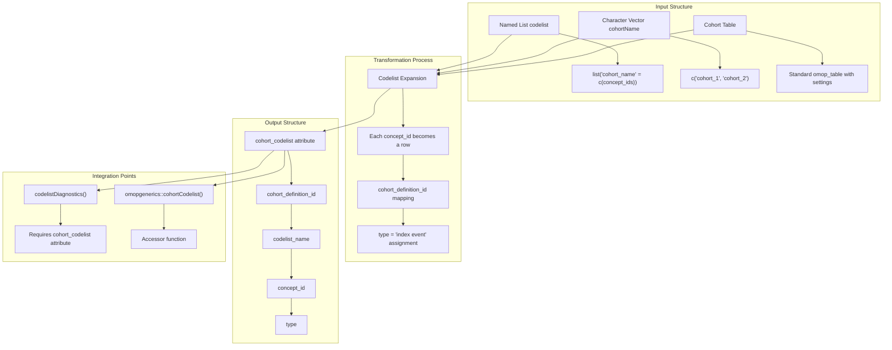
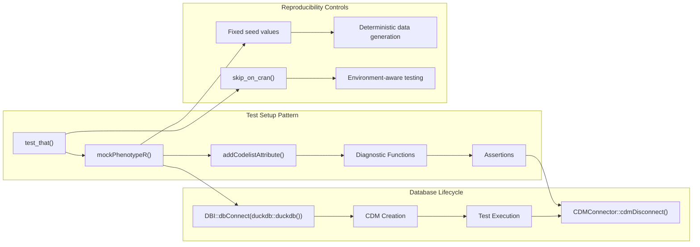

# Page: Mock Data and Utilities

# Mock Data and Utilities

<details>
<summary>Relevant source files</summary>

The following files were used as context for generating this wiki page:

- [R/addCodelistAttribute.R](R/addCodelistAttribute.R)
- [R/mockPhenotypeR.R](R/mockPhenotypeR.R)
- [_pkgdown.yml](_pkgdown.yml)
- [man/addCodelistAttribute.Rd](man/addCodelistAttribute.Rd)
- [tests/testthat/test-addCodelistAttribute.R](tests/testthat/test-addCodelistAttribute.R)

</details>


This document covers the mock data generation and development utility functions within PhenotypeR. These components provide essential infrastructure for testing, development, and demonstration purposes. The mock data system creates synthetic OMOP CDM databases that can be used to validate diagnostic functionality without requiring access to real healthcare data, while utility functions provide helper capabilities for common development tasks.

For information about the broader testing framework that uses these utilities, see [Testing Framework](#4.1). For deployment and production infrastructure, see [Deployment and Infrastructure](#5).

## Mock Data Generation System

### mockPhenotypeR Function

The core mock data generation is handled by the `mockPhenotypeR()` function, which creates a complete synthetic OMOP CDM database suitable for testing and demonstration purposes.



**Mock Data Architecture**

Sources: [R/mockPhenotypeR.R:1-71]()

The `mockPhenotypeR()` function accepts several key parameters:

| Parameter | Type | Default | Purpose |
|-----------|------|---------|---------|
| `nPerson` | integer | 100 | Number of synthetic patients to generate |
| `con` | DBI connection | `duckdb::duckdb()` | Database connection for CDM storage |
| `writeSchema` | character | "main" | Schema name with write permissions |
| `seed` | integer | 111 | Random seed for reproducible data generation |

The function creates a comprehensive mock CDM by leveraging the `omock` package ecosystem. It generates all standard OMOP CDM tables with realistic relationships and constraints.

### Mock Data Table Generation



**Mock CDM Table Dependencies and Processing**

Sources: [R/mockPhenotypeR.R:33-65]()

The mock data generation process includes several important steps:

1. **Base CDM Creation**: Uses `omock::mockCdmReference()` to establish the foundational CDM structure [R/mockPhenotypeR.R:33]()

2. **Table Population**: Each clinical domain table is populated with synthetic data using domain-specific mock functions [R/mockPhenotypeR.R:34-43]()

3. **Special Table Handling**: The `device_exposure` table is manually created as an empty table with proper schema [R/mockPhenotypeR.R:45-53]()

4. **Database Migration**: The in-memory CDM is copied to the specified database connection using `CDMConnector::copyCdmTo()` [R/mockPhenotypeR.R:55-58]()

5. **Achilles Tables**: `CodelistGenerator::buildAchillesTables()` generates the necessary summary tables for various diagnostic functions [R/mockPhenotypeR.R:60-61]()

## Development Utilities

### addCodelistAttribute Function

The `addCodelistAttribute()` function is a critical utility for associating concept lists with cohort definitions, which is essential for codelist diagnostic functionality.



**addCodelistAttribute Processing Pipeline**

Sources: [R/addCodelistAttribute.R:1-84]()

The function performs several validation and processing steps:

1. **Input Validation**: Ensures all inputs conform to expected formats using `omopgenerics` validation functions [R/addCodelistAttribute.R:35-38]()

2. **Cohort Matching**: Verifies that specified `cohortName` values exist in the cohort settings [R/addCodelistAttribute.R:40-43]()

3. **Codelist Transformation**: Converts the named list of concept codes into the standardized `cohort_codelist` tibble format [R/addCodelistAttribute.R:51-60]()

4. **Conflict Handling**: Manages cases where codelists already exist for specified cohorts, issuing warnings and performing overwrites as needed [R/addCodelistAttribute.R:61-77]()

### Codelist Integration Architecture



**Codelist Attribute Integration with Diagnostic System**

Sources: [R/addCodelistAttribute.R:7-9](), [tests/testthat/test-addCodelistAttribute.R:87-98]()

## Integration with Testing Framework

### Mock Data in Test Environment

The mock data system integrates closely with the testing framework to provide consistent, reproducible test environments.



**Testing Integration Pattern**

Sources: [tests/testthat/test-addCodelistAttribute.R:1-15](), [R/mockPhenotypeR.R:27]()

### Test Data Characteristics

The mock data system generates test data with specific characteristics optimized for diagnostic validation:

| Component | Configuration | Purpose |
|-----------|---------------|---------|
| Patient Count | 100 (default) | Sufficient for statistical validity while maintaining performance |
| Cohort Structure | 2 cohorts in "my_cohort" table | Tests multi-cohort diagnostic scenarios |
| Seed Control | 111 (default) | Ensures reproducible test results |
| Database Backend | DuckDB in-memory | Fast, isolated test execution |
| Schema Design | "main" schema | Standard testing configuration |

## Usage Patterns and Examples

### Basic Mock Data Creation

The most common usage pattern involves creating a mock CDM for testing or demonstration:

```r
# Basic mock CDM creation
cdm <- mockPhenotypeR()

# Custom configuration
cdm <- mockPhenotypeR(
  nPerson = 500,
  seed = 42
)
```

Sources: [R/mockPhenotypeR.R:16-23](), [man/addCodelistAttribute.Rd:32-37]()

### Codelist Attribution Workflow

The typical workflow for adding codelists to cohorts follows this pattern:

```r
# Add codelists to cohorts
cohort <- addCodelistAttribute(
  cohort = cdm$my_cohort,
  codelist = list("diabetes" = c(250, 251, 252)),
  cohortName = "diabetes_cohort"
)

# Verify codelist integration
attr(cohort, "cohort_codelist")
```

Sources: [R/addCodelistAttribute.R:19-29](), [tests/testthat/test-addCodelistAttribute.R:17-27]()

### Integration with Diagnostic Functions

These utilities are designed to work seamlessly with the broader diagnostic system:

```r
# Complete workflow
cdm <- mockPhenotypeR()
cdm$cohort <- addCodelistAttribute(
  cohort = cdm$my_cohort,
  codelist = list("condition_codes" = c(1, 2, 3))
)

# Ready for diagnostics
results <- codelistDiagnostics(cohort = cdm$cohort)
```

Sources: [R/addCodelistAttribute.R:7-9]()

## Summary

The mock data and utilities system provides essential infrastructure for PhenotypeR development and testing. The `mockPhenotypeR()` function creates comprehensive synthetic OMOP CDM databases, while `addCodelistAttribute()` enables proper codelist integration required for diagnostic functionality. Together, these utilities support reproducible testing, development workflows, and demonstration scenarios without requiring access to real healthcare data.

Sources: [_pkgdown.yml:58-61](), [R/mockPhenotypeR.R:1-71](), [R/addCodelistAttribute.R:1-84]()