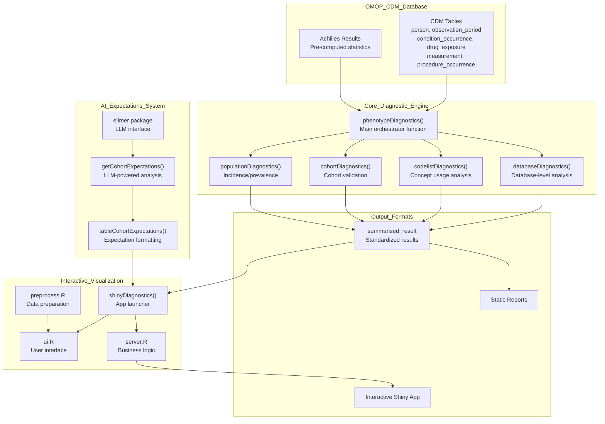
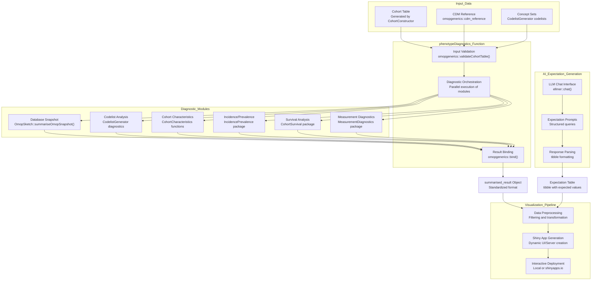
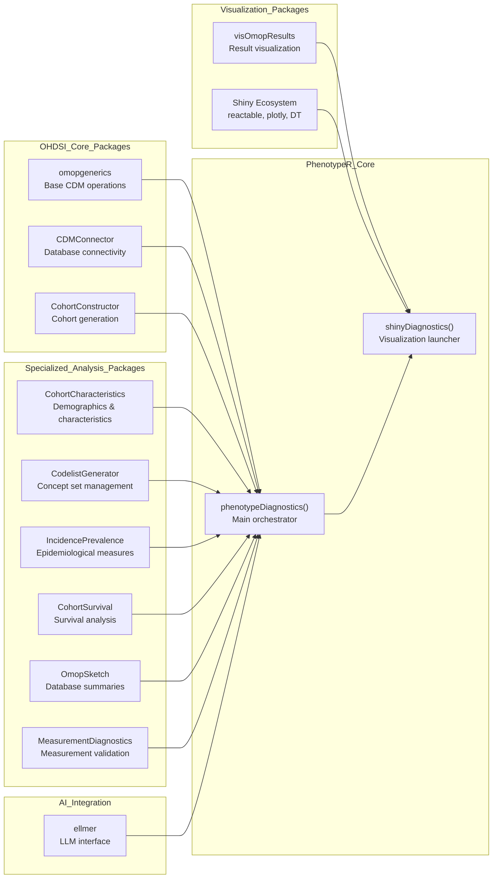

# Page: Overview

# Overview

Relevant source files

The following files were used as context for generating this wiki page:

- [DESCRIPTION](DESCRIPTION)
- [README.Rmd](README.Rmd)
- [README.md](README.md)

## Purpose and Scope

PhenotypeR is a comprehensive diagnostic system for assessing the research-readiness of study cohorts defined within OMOP Common Data Model (CDM) databases. The system performs multi-level analysis across database, codelist, cohort, and population dimensions to validate phenotype definitions and ensure cohorts meet quality standards for observational health research.

This document provides a high-level overview of the PhenotypeR system architecture and core capabilities. For detailed information about specific diagnostic modules, see [Core Diagnostic System](#2). For interactive visualization features, see [Interactive Visualization System](#3). For AI-powered expectation generation, see [AI-Powered Expectations](#2.5).

## System Architecture

PhenotypeR follows a modular architecture with four primary subsystems working together to provide comprehensive cohort assessment capabilities.

### Core System Components

Sources: [DESCRIPTION:1-84](), [README.Rmd:30-54](), [README.md:15-39]()

## Data Flow and Processing Pipeline

The following diagram illustrates how data flows through the PhenotypeR system from OMOP CDM input to final diagnostic outputs.

### End-to-End Data Processing

Sources: [README.Rmd:121-123](), [README.Rmd:136-149](), [README.Rmd:152-154]()

## Core Diagnostic Capabilities

PhenotypeR provides four complementary diagnostic approaches to comprehensively assess cohort quality and research-readiness:

| Diagnostic Type | Purpose | Key Functions | Output |
|-----------------|---------|---------------|---------|
| **Database Diagnostics** | Understand database structure and coverage | `databaseDiagnostics()`, `OmopSketch` functions | Database size, time periods, observation patterns |
| **Codelist Diagnostics** | Validate concept usage and coverage | `codelistDiagnostics()`, `CodelistGenerator` functions | Concept usage, orphan codes, measurement patterns |
| **Cohort Diagnostics** | Assess cohort composition and quality | `cohortDiagnostics()`, `CohortCharacteristics` functions | Demographics, attrition, overlap, survival |
| **Population Diagnostics** | Measure population-level frequencies | `populationDiagnostics()`, `IncidencePrevalence` functions | Incidence rates, prevalence estimates |

Sources: [README.Rmd:33-54](), [DESCRIPTION:18-21]()

### Key Analysis Features

- **Multi-level Assessment**: Database, codelist, cohort, and population-level diagnostics
- **OMOP CDM Integration**: Native integration with OMOP standardized vocabularies and data structures
- **AI-Powered Expectations**: LLM-generated expected values for comparison with actual results
- **Interactive Visualization**: Web-based Shiny application for exploration and reporting
- **Scalable Processing**: Sampling strategies and preprocessing for large healthcare datasets
- **Research-Ready Output**: Standardized `summarised_result` format compatible with OHDSI tools

Sources: [README.Rmd:30-39](), [DESCRIPTION:67-81]()

## Integration with OMOP Ecosystem

PhenotypeR leverages the extensive OHDSI/OMOP ecosystem through deep integration with specialized packages:

Sources: [DESCRIPTION:67-81](), [DESCRIPTION:27-64]()

## Getting Started

To begin using PhenotypeR, users typically follow this workflow:

1. **Establish OMOP CDM Connection**: Connect to an OMOP CDM database using `CDMConnector`
2. **Define Study Cohorts**: Create cohorts using `CohortConstructor` functions
3. **Run Comprehensive Diagnostics**: Execute `phenotypeDiagnostics()` for complete assessment
4. **Generate AI Expectations**: Use `getCohortExpectations()` for LLM-powered comparisons
5. **Launch Interactive Application**: Use `shinyDiagnostics()` for web-based exploration

For detailed implementation guidance, see [Tutorials and Examples](#6). For development and testing information, see [Development and Testing](#4).

Sources: [README.Rmd:77-158](), [README.md:62-162]()