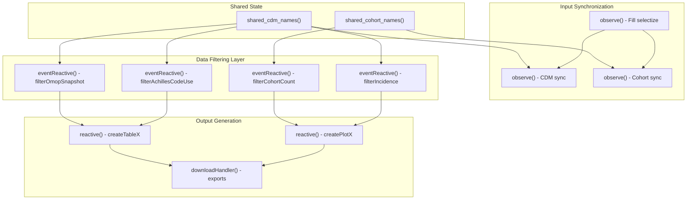
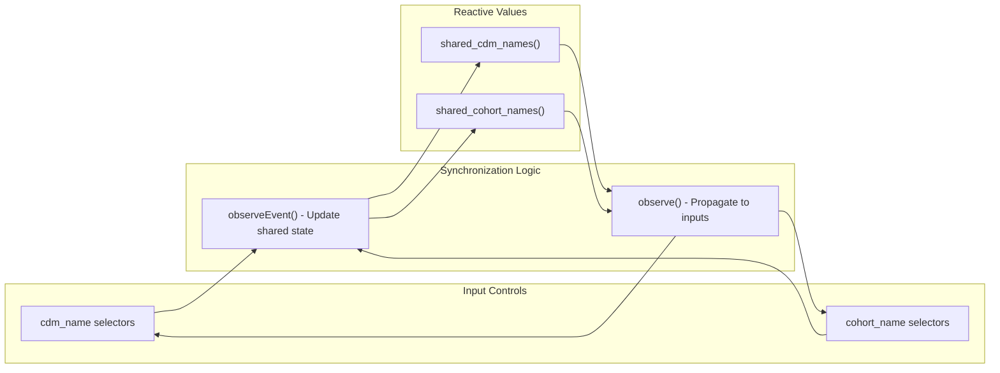
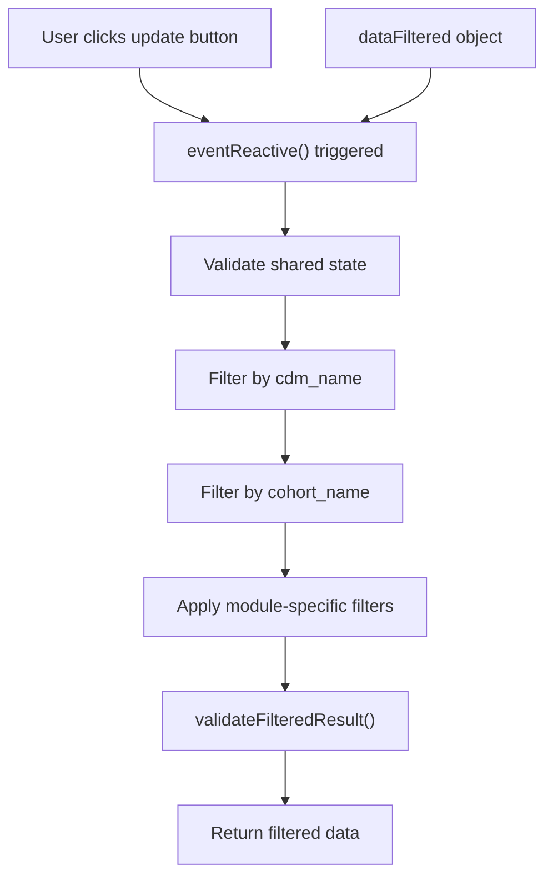
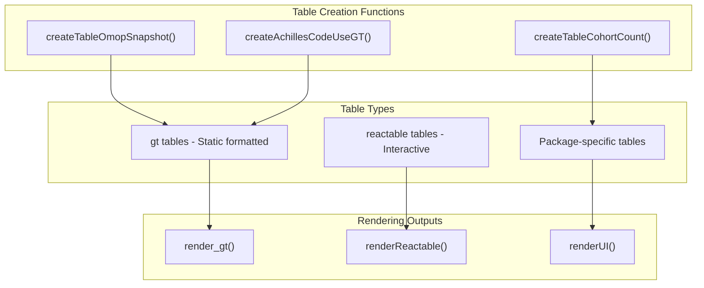
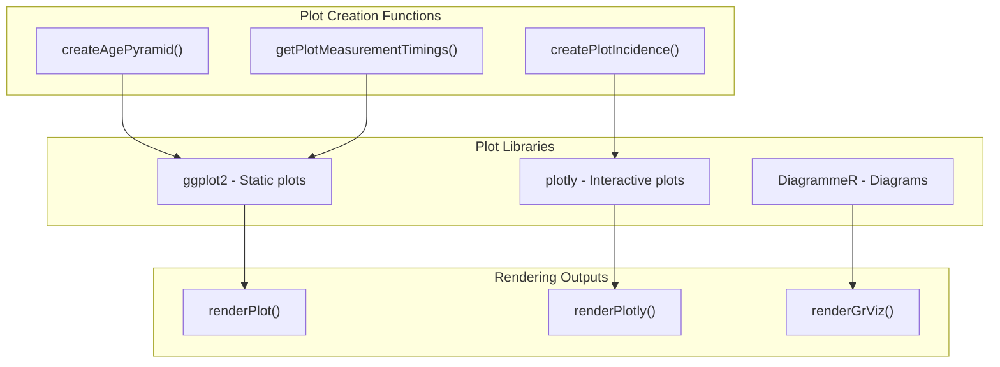
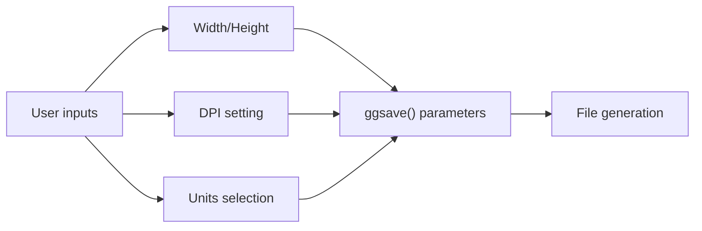
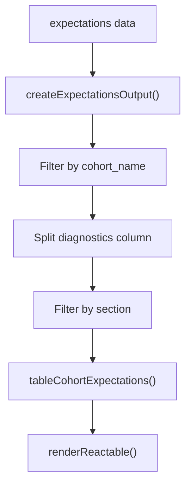

# Page: Server Logic and Data Processing

# Server Logic and Data Processing

Relevant source files

The following files were used as context for generating this wiki page:

- [inst/shiny/server.R](inst/shiny/server.R)

This document covers the server-side logic and data processing within the PhenotypeR Shiny application. The server component handles reactive programming, data filtering, visualization generation, and user interactions for the diagnostic interface.

For information about the user interface components, see [User Interface Components](#3.2). For details about data preprocessing before the application starts, see [Data Preprocessing Pipeline](#3.4).

## Reactive Architecture Overview

The server logic follows Shiny's reactive programming model, where user inputs trigger cascading updates through a network of reactive expressions. The architecture is built around shared state management and modular data processing pipelines.

**Sources:** [inst/shiny/server.R:1-1972]()

## Shared State Management

The server maintains two primary reactive values that synchronize user selections across different UI components: `shared_cdm_names` and `shared_cohort_names`. These enable coordinated filtering across all diagnostic modules.

The synchronization mechanism uses multiple observer patterns:

| Observer Type | Purpose | Code Location |
|---------------|---------|---------------|
| Input observers | Capture user selections and update shared state | [inst/shiny/server.R:37-75]() |
| State propagators | Push shared state changes back to UI inputs | [inst/shiny/server.R:51-86]() |
| Choice populators | Initialize dropdown options from data | [inst/shiny/server.R:11-34]() |

**Sources:** [inst/shiny/server.R:6-86]()

## Data Filtering Pipeline

Each diagnostic module implements a consistent filtering pattern using `eventReactive()` functions. These functions respond to update button clicks and apply user-selected filters to the underlying diagnostic data.

### Example Filtering Functions

The server implements numerous filtering functions following this pattern:

| Function | Purpose | Input Dependencies |
|----------|---------|-------------------|
| `filterOmopSnapshot` | Database metadata filtering | `updateSnapshot`, `shared_cdm_names` |
| `filterAchillesCodeUse` | Code usage analysis filtering | `updateAchillesCodeUse`, codelist selections |
| `filterCohortCount` | Cohort counts filtering | `updateCohortCount`, person/record toggles |
| `filterIncidence` | Incidence analysis filtering | `updateIncidence`, demographic filters |

**Sources:** [inst/shiny/server.R:108-119](), [inst/shiny/server.R:181-205](), [inst/shiny/server.R:816-839](), [inst/shiny/server.R:1661-1682]()

## Output Generation System

The server generates two primary output types: formatted tables and interactive plots. Each uses reactive expressions that respond to filtered data changes.

### Table Generation Architecture

### Plot Generation Architecture

**Sources:** [inst/shiny/server.R:121-134](), [inst/shiny/server.R:628-638](), [inst/shiny/server.R:1715-1767]()

## Download Handler System

The server provides extensive download capabilities for both tables and plots through Shiny's `downloadHandler()` mechanism. Each output type has corresponding download functionality.

| Content Type | File Formats | Example Function |
|--------------|-------------|------------------|
| GT Tables | `.docx` | `summarise_omop_snapshot_gt_download` |
| Reactable Tables | `.csv` | `achilles_code_use_download` |
| ggplot2 Plots | `.png` | `plot_measurement_timings_download` |
| Raw Data | `.csv` | `download_raw` |

### Download Configuration

Download handlers accept user-configurable parameters for image exports:

**Sources:** [inst/shiny/server.R:135-140](), [inst/shiny/server.R:284-299](), [inst/shiny/server.R:644-657]()

## Module-Specific Processing Logic

### Database Diagnostics Module

Handles OMOP CDM snapshot and observation period analysis:

- **Data Sources**: `dataFiltered$summarise_omop_snapshot`, `dataFiltered$summarise_observation_period`
- **Key Functions**: `filterOmopSnapshot()`, `filterObservationPeriod()`
- **Output Tables**: `OmopSketch::tableOmopSnapshot()`, `OmopSketch::tableObservationPeriod()`

### Codelist Diagnostics Module

Processes code usage analysis including Achilles codes, orphan codes, and cohort-specific code usage:

- **Data Sources**: `dataFiltered$achilles_code_use`, `dataFiltered$orphan_code_use`, `dataFiltered$cohort_code_use`
- **Interactive Features**: Toggle between static GT tables and interactive Reactable tables
- **Filtering Options**: Person count, record count, codelist selections

### Cohort Diagnostics Module

Comprehensive cohort analysis including demographics, characteristics, overlap, timing, and survival:

- **Core Functions**: `filterSummariseCharacteristics()`, `filterCohortOverlap()`, `filterCohortSurvival()`
- **Specialized Outputs**: Age pyramids, survival plots, attrition diagrams
- **Large Scale Characteristics**: Interactive exploration with concept linking to ATHENA

### Population Diagnostics Module

Incidence and prevalence analysis with demographic stratification:

- **Analysis Types**: Time-series incidence rates, prevalence estimates
- **Stratification**: Age groups, sex, prior observation periods
- **Visualization**: Interactive plotly charts with free-scale faceting options

**Sources:** [inst/shiny/server.R:142-178](), [inst/shiny/server.R:180-300](), [inst/shiny/server.R:945-1163](), [inst/shiny/server.R:1660-1924]()

## Expectations Integration

The server includes a specialized expectations system that compares diagnostic results against AI-generated expectations:

The expectations system validates that expectations data exists and matches the current diagnostic section, providing contextual AI-generated insights for each analysis type.

**Sources:** [inst/shiny/server.R:1927-1969]()