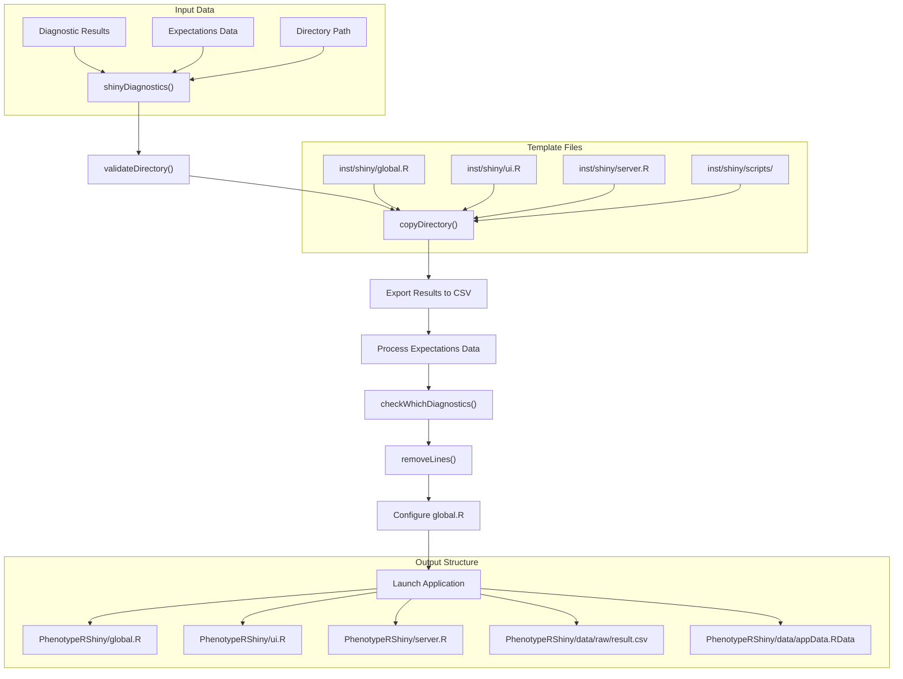
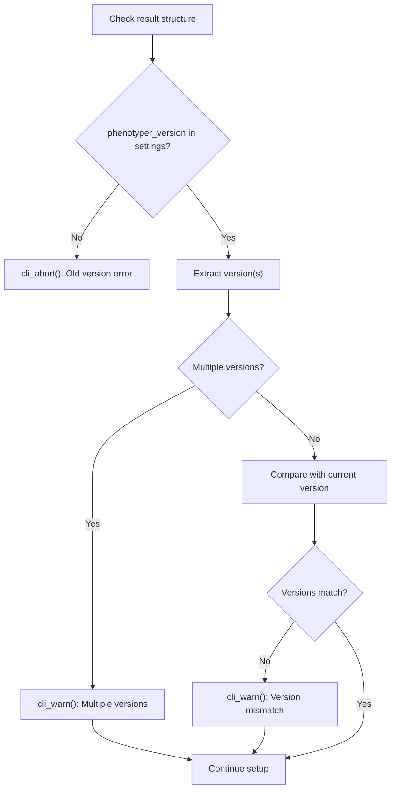
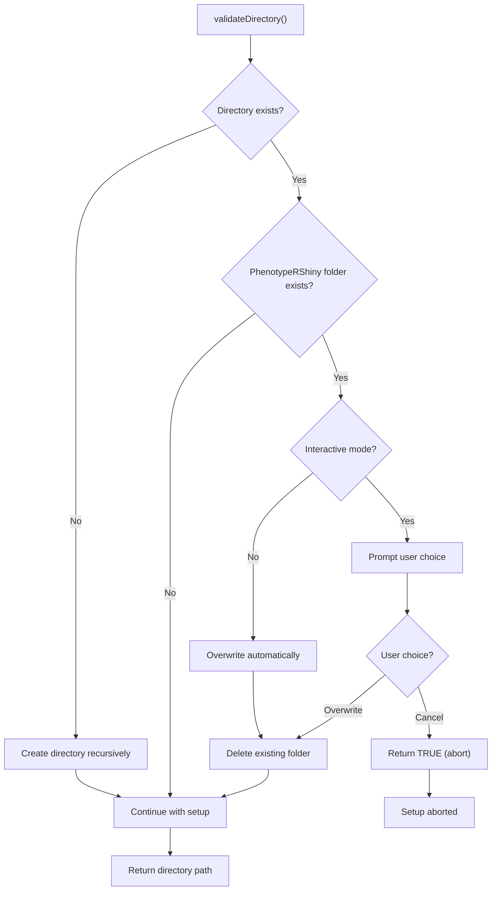
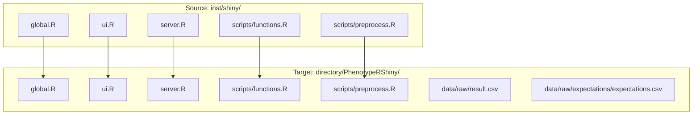
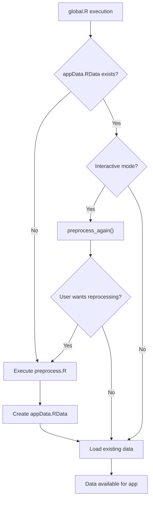
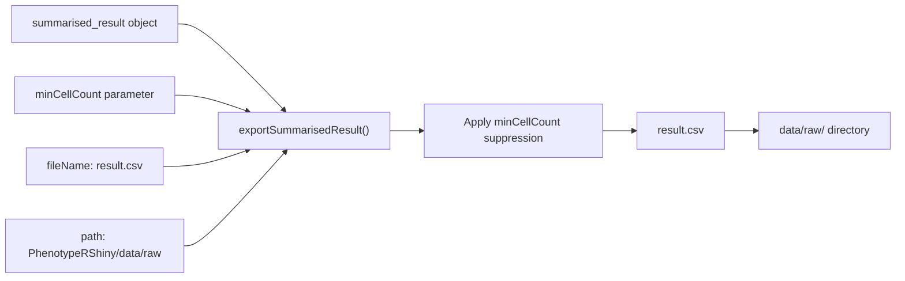
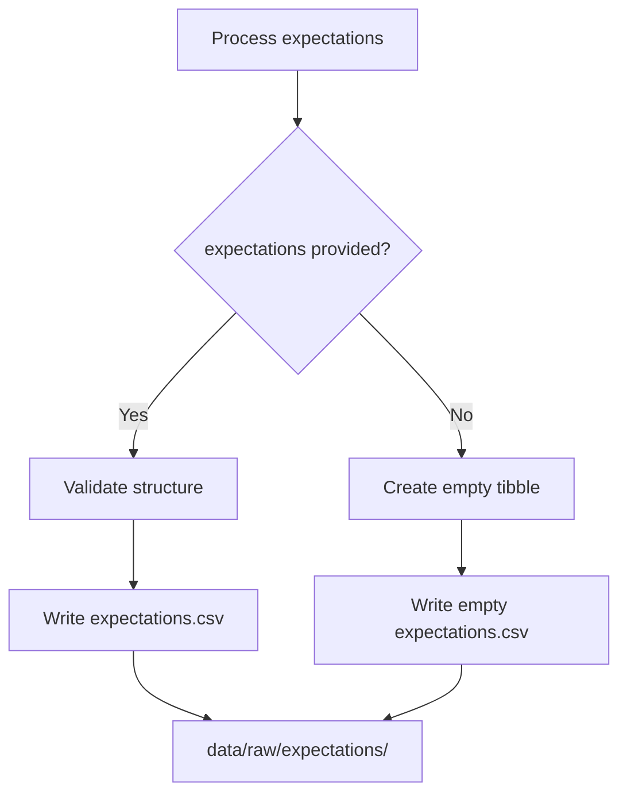
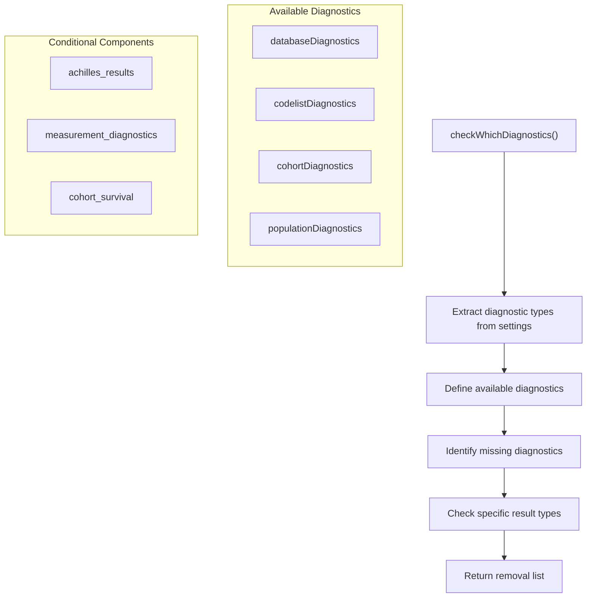
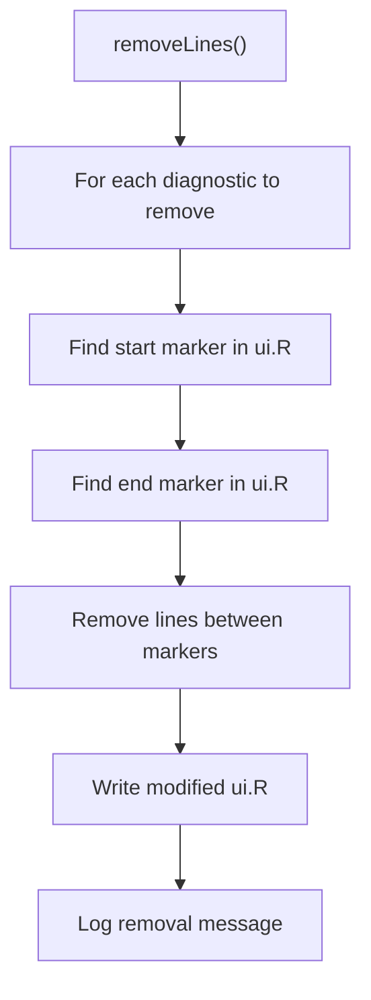
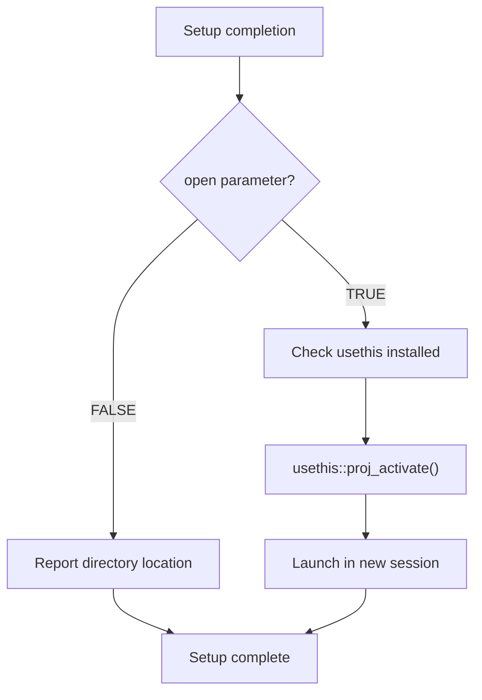

# Page: Shiny Application Setup

# Shiny Application Setup

Relevant source files

The following files were used as context for generating this wiki page:

- [R/shinyDiagnostics.R](R/shinyDiagnostics.R)
- [inst/shiny/global.R](inst/shiny/global.R)
- [man/shinyDiagnostics.Rd](man/shinyDiagnostics.Rd)
- [tests/testthat/test-shinyDiagnostics.R](tests/testthat/test-shinyDiagnostics.R)

This document covers the setup and configuration of the PhenotypeR Shiny application, including the main orchestrator function `shinyDiagnostics()`, directory structure creation, dependency management, and data preprocessing configuration. For detailed information about the user interface structure, see [User Interface Components](#3.2). For server-side logic and reactive programming, see [Server Logic and Data Processing](#3.3). For data transformation details, see [Data Preprocessing Pipeline](#3.4).

## Setup Workflow Overview

The Shiny application setup follows a structured workflow that transforms diagnostic results into a fully configured web application:

Sources: [R/shinyDiagnostics.R:43-123](), [inst/shiny/global.R:36-59]()

## Main Setup Function

The `shinyDiagnostics()` function serves as the primary entry point for creating and launching the diagnostic application. It accepts diagnostic results from any PhenotypeR analysis and transforms them into an interactive web application.

### Function Parameters

| Parameter | Type | Description |
|-----------|------|-------------|
| `result` | `summarised_result` | Diagnostic results from PhenotypeR functions |
| `directory` | `character` | Target directory for app creation |
| `minCellCount` | `numeric` | Minimum cell count for result suppression (default: 5) |
| `open` | `logical` | Whether to launch app automatically |
| `expectations` | `data.frame` | Optional cohort expectations data |

### Version Compatibility Validation

The setup process includes version compatibility checks to ensure consistency between the results and the current PhenotypeR installation:

Sources: [R/shinyDiagnostics.R:54-71]()

## Directory Structure and File Management

### Directory Validation and Creation

The `validateDirectory()` function handles directory creation and conflict resolution:

### File Copy Operations

The `copyDirectory()` function replicates the entire Shiny template structure:

Sources: [R/shinyDiagnostics.R:126-171](), [R/shinyDiagnostics.R:159-171]()

## Global Configuration and Dependencies

The `global.R` file establishes the runtime environment for the Shiny application through dependency management and utility function definitions.

### Dependency Management

The global configuration enforces minimum package versions and loads required libraries:

| Package | Minimum Version | Purpose |
|---------|----------------|---------|
| `omopgenerics` | 1.2.0 | Core OMOP data structures |
| `visOmopResults` | 1.0.0 | Result visualization |
| `shiny` | 1.11.1 | Web application framework |
| `CodelistGenerator` | 3.4.0 | Concept set management |
| `CohortCharacteristics` | 1.0.0 | Cohort analysis |
| `IncidencePrevalence` | 1.2.0 | Epidemiological calculations |

### Data Loading Pipeline

The global setup implements a conditional data loading strategy:

Sources: [inst/shiny/global.R:1-59]()

## Data Export and Configuration

### Result Export Process

Diagnostic results are exported using `omopgenerics::exportSummarisedResult()` with configurable cell count suppression:

### Expectations Data Handling

The setup process creates expectations data regardless of input:

Sources: [R/shinyDiagnostics.R:87-108]()

## Dynamic UI Configuration

The setup process dynamically removes unused interface components based on available diagnostic types:

### Diagnostic Detection

### UI Modification Process

The `removeLines()` function modifies the UI template based on available diagnostics:

Sources: [R/shinyDiagnostics.R:173-215]()

## Launch Configuration

The setup concludes with optional application launch based on the `open` parameter:

The application can be launched manually by navigating to the created directory and running the Shiny application through standard R/RStudio methods.

Sources: [R/shinyDiagnostics.R:111-122]()