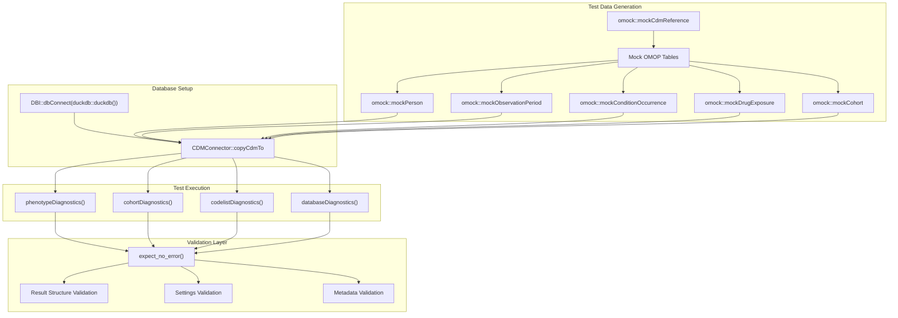
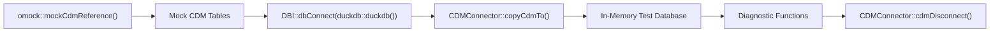
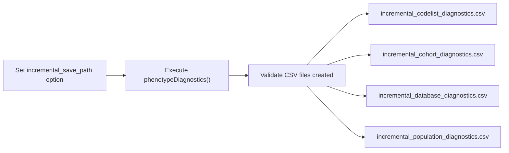
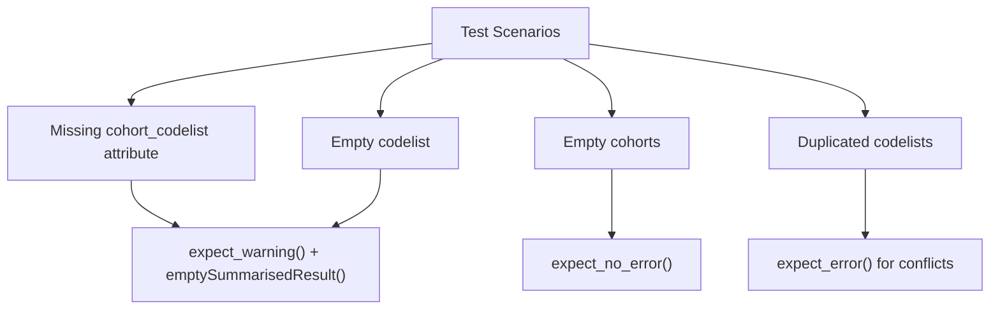
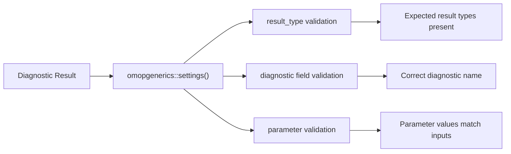

# Page: Testing Framework

# Testing Framework

<details>
<summary>Relevant source files</summary>

The following files were used as context for generating this wiki page:

- [tests/testthat/test-codelistDiagnostics.R](tests/testthat/test-codelistDiagnostics.R)
- [tests/testthat/test-cohortDiagnostics.R](tests/testthat/test-cohortDiagnostics.R)
- [tests/testthat/test-databaseDiagnostics.R](tests/testthat/test-databaseDiagnostics.R)
- [tests/testthat/test-phenotypeDiagnostics.R](tests/testthat/test-phenotypeDiagnostics.R)

</details>


## Purpose and Scope

This document describes the comprehensive testing framework used in PhenotypeR to ensure reliability and correctness of diagnostic functions. The testing system emphasizes integration testing with mock OMOP CDM databases and validates both functional behavior and result metadata across all diagnostic modules.

For information about mock data utilities and development helpers, see [Mock Data and Utilities](#4.2). For deployment and continuous integration workflows, see [Deployment and Infrastructure](#5).

## Testing Architecture Overview

The PhenotypeR testing framework follows a multi-layered approach that validates the entire diagnostic pipeline from database connection through result generation.

### Core Testing Strategy



Sources: [tests/testthat/test-phenotypeDiagnostics.R:5-15](), [tests/testthat/test-cohortDiagnostics.R:4-17](), [tests/testthat/test-databaseDiagnostics.R:4-17]()

## Mock Data Infrastructure

### OMOP CDM Mock Generation

The testing framework relies heavily on the `omock` package to generate realistic OMOP CDM structures for testing purposes.

| Mock Function | Purpose | Typical Usage |
|---------------|---------|---------------|
| `omock::mockCdmReference()` | Creates base CDM structure | Starting point for all tests |
| `omock::mockPerson(nPerson = 100)` | Generates person records | Standard 100 persons per test |
| `omock::mockObservationPeriod()` | Creates observation periods | Required for temporal analysis |
| `omock::mockConditionOccurrence()` | Adds condition records | Tests codelist diagnostics |
| `omock::mockDrugExposure()` | Adds drug exposure records | Tests drug-related diagnostics |
| `omock::mockCohort(numberCohorts = 2)` | Creates cohort tables | Tests cohort overlap and timing |

### Database Connection Pattern



Sources: [tests/testthat/test-phenotypeDiagnostics.R:17-19](), [tests/testthat/test-cohortDiagnostics.R:15-17]()

## Test Function Structure

### Main Orchestrator Tests

The `phenotypeDiagnostics()` function tests follow a comprehensive pattern validating both individual diagnostic modules and their integration.

#### Primary Integration Test
```
test_that("overall diagnostics function", {
  skip_on_cran()
  # Mock data setup
  # Database connection
  # Function execution with expect_no_error()
  # Result validation
  # Parameter validation
})
```

#### Module-Specific Tests
- **Database Diagnostics Only**: Tests `diagnostics = c("databaseDiagnostics")`
- **Codelist Diagnostics Only**: Tests `diagnostics = "codelistDiagnostics"`  
- **Cohort Diagnostics Only**: Tests `diagnostics = "cohortDiagnostics"`
- **Population Diagnostics Only**: Tests `diagnostics = "populationDiagnostics"`

Sources: [tests/testthat/test-phenotypeDiagnostics.R:28-71]()

### Incremental Save Testing

The framework validates the incremental save functionality that allows partial results to be saved during long-running analyses.



Sources: [tests/testthat/test-phenotypeDiagnostics.R:73-107]()

## Diagnostic Module Testing

### Cohort Diagnostics Tests

#### Single vs Multiple Cohort Scenarios

| Test Scenario | Expected Results | Validation Points |
|---------------|------------------|-------------------|
| Single Cohort | Basic characteristics, no overlap/timing | `group_level == "cohort_1"` |
| Multiple Cohorts | Full analysis including overlap/timing | Overlap and timing result types present |
| Survival Analysis | Additional survival metrics | `survival_probability`, `survival_events` result types |

#### Result Type Validation
```
expect_true(all(c("summarise_characteristics", "summarise_table",
                  "summarise_cohort_attrition", "summarise_cohort_overlap", 
                  "summarise_cohort_timing", "summarise_large_scale_characteristics") %in%
                (settings(result) |> dplyr::pull("result_type"))))
```

Sources: [tests/testthat/test-cohortDiagnostics.R:19-48](), [tests/testthat/test-cohortDiagnostics.R:50-142]()

### Codelist Diagnostics Tests

#### Edge Case Handling

The codelist diagnostics tests focus on handling missing or incomplete codelist attributes.



#### Measurement Diagnostics Integration
- Tests integration with `MeasurementDiagnostics` package
- Validates result types: `cohort_code_use`, `measurement_timings`, `measurement_value_as_numeric`, `measurement_value_as_concept`

Sources: [tests/testthat/test-codelistDiagnostics.R:1-45](), [tests/testthat/test-codelistDiagnostics.R:83-114]()

### Database Diagnostics Tests

Simple validation ensuring the `databaseDiagnostics()` function executes without error and produces valid OMOP snapshot results.

```
expect_no_error(OmopSketch::tableOmopSnapshot(db_diag))
expect_identical(db_diag |> settings() |> pull("diagnostic"), "databaseDiagnostics")
```

Sources: [tests/testthat/test-databaseDiagnostics.R:19-26]()

## Validation Strategies

### Result Structure Validation

#### Settings Metadata Validation
All tests validate that diagnostic results contain proper settings metadata:



#### Group Level Validation
Tests ensure cohort-specific results have appropriate `group_level` values:
- Single cohort: `"cohort_1"`
- Multiple cohorts: `"cohort_1"`, `"cohort_2"`, `"cohort_1 &&& cohort_2"`, etc.
- Matched samples: `"cohort_1_matched"`, `"cohort_1_sampled"`

Sources: [tests/testthat/test-cohortDiagnostics.R:41](), [tests/testthat/test-cohortDiagnostics.R:98-100]()

### Error Handling Tests

#### Parameter Validation
```
expect_error(phenotypeDiagnostics(cdm$my_cohort, diagnostics = "hello"))
expect_error(phenotypeDiagnostics(cdm$my_cohort, matchedSample = -10))
expect_error(phenotypeDiagnostics(cdm$my_cohort, populationSample = 0))
```

Sources: [tests/testthat/test-phenotypeDiagnostics.R:67-70]()

## Test Execution Environment

### CRAN Skip Pattern
All integration tests use `skip_on_cran()` to avoid database-dependent tests in CRAN builds, ensuring reliable package distribution while maintaining comprehensive local testing.

### Database Management
Tests follow a consistent pattern of:
1. Creating in-memory DuckDB connections
2. Copying mock CDM data to the database  
3. Executing diagnostic functions
4. Cleaning up with `CDMConnector::cdmDisconnect()`

### Test Organization
- **Module-specific test files**: Each diagnostic module has dedicated test file
- **Integration tests**: Main orchestrator function tested separately
- **Edge case coverage**: Specific tests for empty tables, missing attributes, parameter validation

Sources: [tests/testthat/test-phenotypeDiagnostics.R:3](), [tests/testthat/test-cohortDiagnostics.R:2](), [tests/testthat/test-databaseDiagnostics.R:28]()