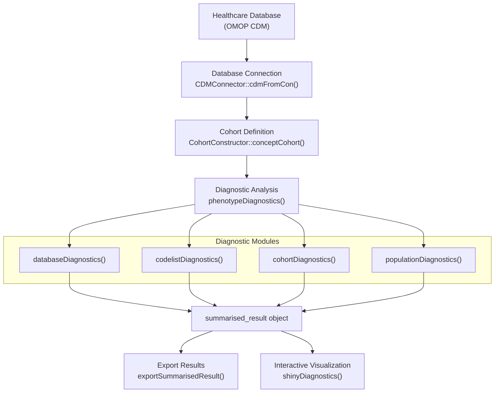
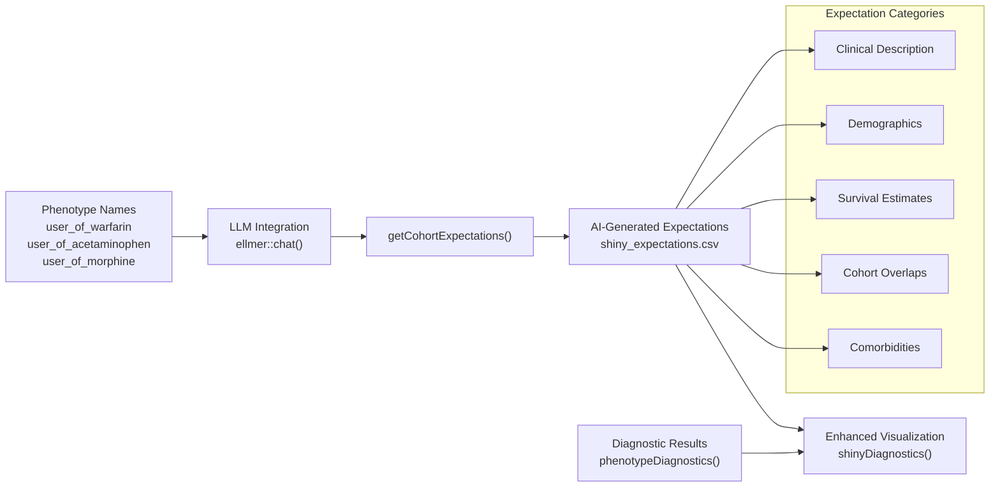
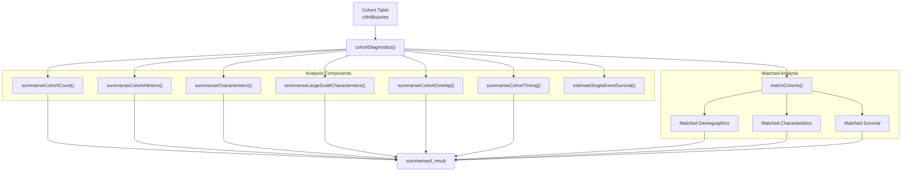
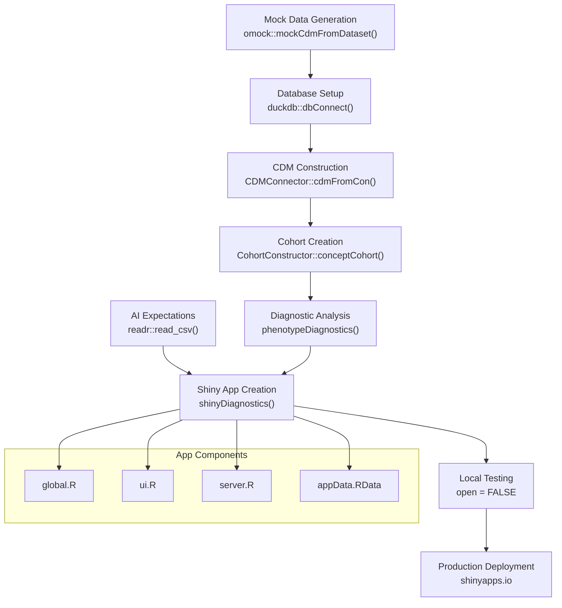

# Page: Tutorials and Examples

# Tutorials and Examples

<details>
<summary>Relevant source files</summary>

The following files were used as context for generating this wiki page:

- [extras/createShiny.R](extras/createShiny.R)
- [extras/expectationsForShiny.R](extras/expectationsForShiny.R)
- [extras/shiny_expectations.csv](extras/shiny_expectations.csv)
- [man/cohortSampleDoc.Rd](man/cohortSampleDoc.Rd)
- [vignettes/CohortDiagnostics.Rmd](vignettes/CohortDiagnostics.Rmd)
- [vignettes/PhenotypeDiagnostics.Rmd](vignettes/PhenotypeDiagnostics.Rmd)

</details>


This document provides step-by-step guides and practical examples demonstrating how to use PhenotypeR for real-world cohort assessment workflows. It covers complete end-to-end examples from database connection through interactive visualization, including integration with AI-powered expectations.

For technical details about individual diagnostic modules, see [Core Diagnostic System](#2). For Shiny application architecture details, see [Interactive Visualization System](#3).

## Purpose and Scope

The tutorials in this document demonstrate:

- Complete phenotype diagnostic workflows using real and synthetic data
- Integration with the OMOP CDM and OHDSI ecosystem packages  
- AI-powered expectation generation using LLM integration
- Interactive visualization deployment via Shiny applications
- Best practices for sampling, performance optimization, and result interpretation

## Basic Phenotype Diagnostics Workflow

### Tutorial Overview



### Step 1: Database Setup and Connection

The tutorial begins by establishing a connection to an OMOP CDM database using the Eunomia synthetic dataset:

```r
library(CohortConstructor)
library(PhenotypeR)
library(dplyr)

con <- DBI::dbConnect(duckdb::duckdb(), 
                      CDMConnector::eunomiaDir("synpuf-1k", "5.3"))
cdm <- CDMConnector::cdmFromCon(con = con, 
                                cdmName = "Eunomia Synpuf",
                                cdmSchema   = "main",
                                writeSchema = "main", 
                                achillesSchema = "main")
```

The inclusion of `achillesSchema` enables accelerated analyses by leveraging pre-computed database statistics.

Sources: [vignettes/PhenotypeDiagnostics.Rmd:26-38]()

### Step 2: Cohort Construction

The tutorial demonstrates creating multiple drug cohorts using concept-based definitions:

```r
codes <- list("warfarin" = c(1310149, 40163554),
              "acetaminophen" = c(1125315, 1127078, 1127433, 40229134, 40231925, 40162522, 19133768),
              "morphine" = c(1110410, 35605858, 40169988))

cdm$my_cohort <- conceptCohort(cdm = cdm,
                               conceptSet = codes, 
                               exit = "event_end_date",
                               overlap = "merge",
                               name = "my_cohort")
```

This creates cohorts for warfarin, acetaminophen, and morphine users using OMOP concept IDs, with overlapping exposures merged and cohort exit set to the event end date.

Sources: [vignettes/PhenotypeDiagnostics.Rmd:48-58]()

### Step 3: Running Comprehensive Diagnostics

The core analysis uses `phenotypeDiagnostics()` to execute all diagnostic modules:

```r
result <- phenotypeDiagnostics(
  cohort = cdm$my_cohort, 
  diagnostics = c("databaseDiagnostics", "codelistDiagnostics", 
                  "cohortDiagnostics", "populationDiagnostics"),
  cohortSample = 20000,
  matchedSample = 1000,
  populationSample = 1e+06,
  populationDateRange = as.Date(c(NA, NA))
)
```

#### Sampling Parameters

- `cohortSample`: Limits cohort-level analyses to a random sample for performance optimization
- `matchedSample`: Controls the size of matched control cohorts  
- `populationSample`: Restricts population-level analyses to improve computational efficiency
- `populationDateRange`: Defines the temporal scope for population diagnostics

Sources: [vignettes/PhenotypeDiagnostics.Rmd:70-88]()

### Step 4: Results Export and Visualization

Results can be exported as CSV files or launched in an interactive Shiny application:

```r
# Export to files
exportSummarisedResult(result, directory = here::here(), minCellCount = 5)

# Launch interactive visualization
shinyDiagnostics(result,
                 directory = tempdir(),
                 minCellCount = 5, 
                 open = TRUE)
```

Sources: [vignettes/PhenotypeDiagnostics.Rmd:91-104]()

## Advanced Workflow with AI-Powered Expectations

### Expectation Generation Workflow



### Generating AI Expectations

The system integrates with Large Language Models to generate clinically-informed expectations:

```r
chat <- ellmer::chat("google_gemini")
expectations <- PhenotypeR::getCohortExpectations(chat = chat,
                      phenotypes = c(
                        "user_of_warfarin",
                        "user_of_acetaminophen", 
                        "user_of_morphine",
                        "measurement_of_prostate_specific_antigen_level"))
```

This generates structured expectations across multiple diagnostic categories including demographics, survival, comorbidities, and cohort relationships.

Sources: [extras/expectationsForShiny.R:2-8]()

### Integration with Shiny Visualization

The generated expectations enhance the Shiny application by providing clinical context and comparison benchmarks:

```r
expectations <- readr::read_csv(here::here("extras", "shiny_expectations.csv"))

PhenotypeR::shinyDiagnostics(result = result,
                             expectations = expectations,
                             minCellCount = 2, 
                             directory = getwd(), 
                             open = FALSE)
```

Sources: [extras/createShiny.R:36-40]()

## Cohort-Specific Diagnostics Tutorial

### Detailed Cohort Analysis Workflow



### Medical Condition Cohorts Example

The cohort diagnostics tutorial demonstrates analysis of injury-related cohorts:

```r
cdm$injuries <- conceptCohort(cdm = cdm,
  conceptSet = list(
    "ankle_sprain" = 81151,
    "ankle_fracture" = 4059173,
    "forearm_fracture" = 4278672,
    "hip_fracture" = 4230399
  ),
  name = "injuries")

cohort_diag <- cohortDiagnostics(cdm$injuries, 
                                 cohortSample = NULL,
                                 matchedSample = NULL,
                                 survival = TRUE)
```

### Matched Cohort Analysis

The system automatically generates matched control cohorts based on year of birth and sex, enabling comparison between study cohorts and the general population. The analysis produces results for:

1. Original cohort
2. Sampled cohort (individuals with matches)  
3. Matched control cohort

Sources: [vignettes/CohortDiagnostics.Rmd:56-74](), [vignettes/CohortDiagnostics.Rmd:91-93]()

## Shiny Application Deployment Tutorial

### Production Deployment Workflow



### Mock Data Setup for Development

The deployment example uses synthetic data for demonstration purposes:

```r
cdm <- omock::mockCdmFromDataset(datasetName = "synpuf-1k_5.3")
con <- duckdb::dbConnect(drv = duckdb::duckdb())
src <- CDMConnector::dbSource(con = con, writeSchema = "main")
cdm <- omopgenerics::insertCdmTo(cdm = cdm, to = src)
```

This creates a complete OMOP CDM environment using the `omock` package for testing and development.

Sources: [extras/createShiny.R:2-9]()

### Cohort Definition for Shiny Example

The Shiny deployment example includes multiple phenotype categories:

```r
codes <- list(
  "user_of_warfarin" = c(1310149L, 40163554L),
  "user_of_acetaminophen" = c(1125315L, 1127078L, 1127433L, 40229134L, 40231925L, 40162522L, 19133768L),
  "user_of_morphine" = c(1110410L, 35605858L, 40169988L),
  "measurement_of_prostate_specific_antigen_level" = c(2617206L)
)
```

This demonstrates both drug exposure cohorts and measurement-based cohorts for comprehensive diagnostic coverage.

Sources: [extras/createShiny.R:19-24]()

## Performance Optimization Patterns

### Sampling Strategy Guidelines

| Cohort Size | Recommended `cohortSample` | Recommended `matchedSample` | Rationale |
|-------------|---------------------------|----------------------------|-----------|
| < 1,000 | `NULL` (no sampling) | `NULL` (no sampling) | Full analysis feasible |
| 1,000 - 20,000 | `NULL` | 1,000 | Sample matched analysis only |
| 20,000 - 100,000 | 20,000 | 1,000 | Sample both analyses |
| > 100,000 | 20,000 | 1,000 | Always sample for performance |

### Database Optimization

The tutorials consistently demonstrate the use of Achilles pre-computed statistics to accelerate database diagnostics:

```r
cdm <- CDMConnector::cdmFromCon(con = con, 
                                cdmName = "Eunomia Synpuf",
                                cdmSchema   = "main",
                                writeSchema = "main", 
                                achillesSchema = "main")
```

When `achillesSchema` is specified, database diagnostics leverage pre-computed summary statistics rather than computing them dynamically.

Sources: [vignettes/PhenotypeDiagnostics.Rmd:33-37](), [vignettes/CohortDiagnostics.Rmd:48-54]()

## Common Integration Patterns

### OHDSI Ecosystem Integration

The tutorials demonstrate integration with key OHDSI packages:

- **CDMConnector**: Database connection and CDM object management
- **CohortConstructor**: Cohort definition and construction  
- **CohortCharacteristics**: Baseline characteristics and demographics
- **CohortSurvival**: Survival analysis capabilities
- **CodelistGenerator**: Concept set management and codelist creation

### Result Export Patterns

Standard export workflow for sharing results:

```r
# Export with cell count suppression
exportSummarisedResult(result, directory = here::here(), minCellCount = 5)

# Create portable Shiny application
shinyDiagnostics(result, directory = "output_directory", minCellCount = 5, open = FALSE)
```

The `minCellCount` parameter ensures privacy protection by suppressing small cell counts in both exported data and Shiny visualizations.

Sources: [vignettes/PhenotypeDiagnostics.Rmd:92-94](), [vignettes/PhenotypeDiagnostics.Rmd:100-104]()