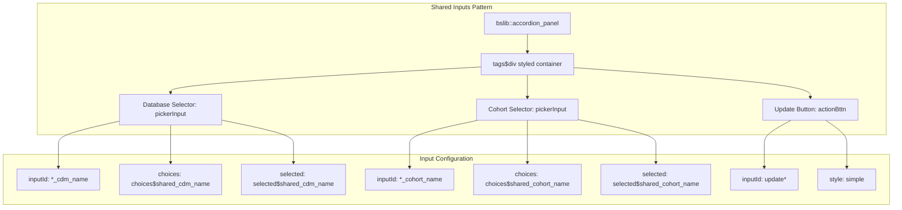
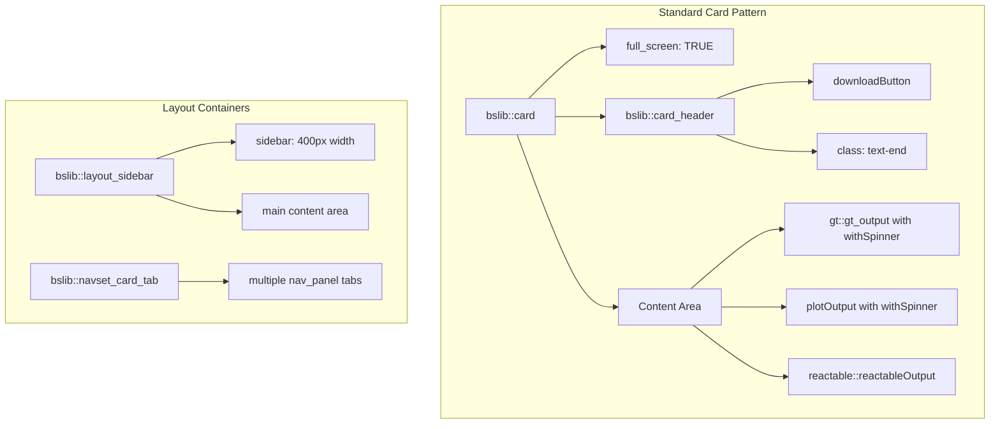
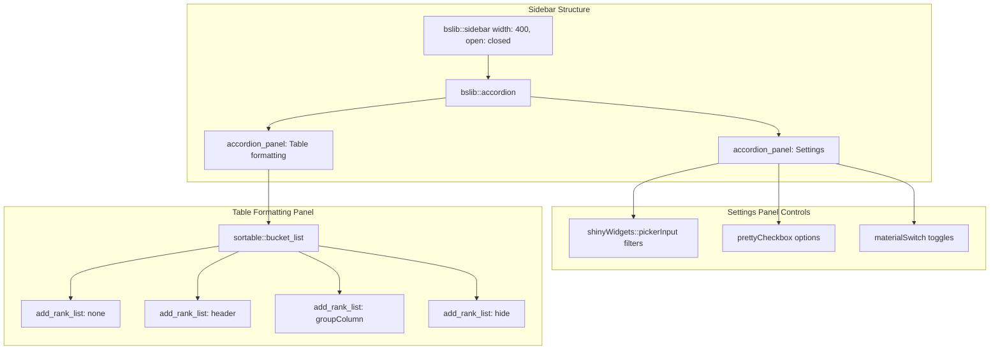
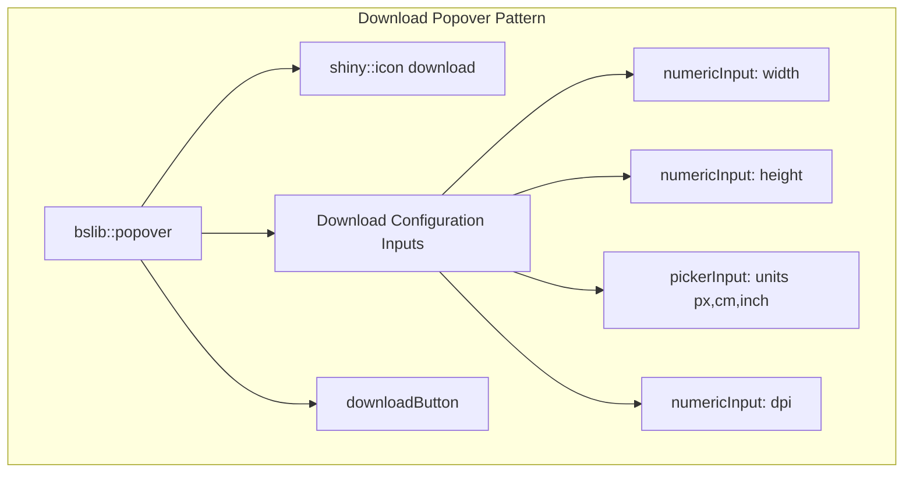
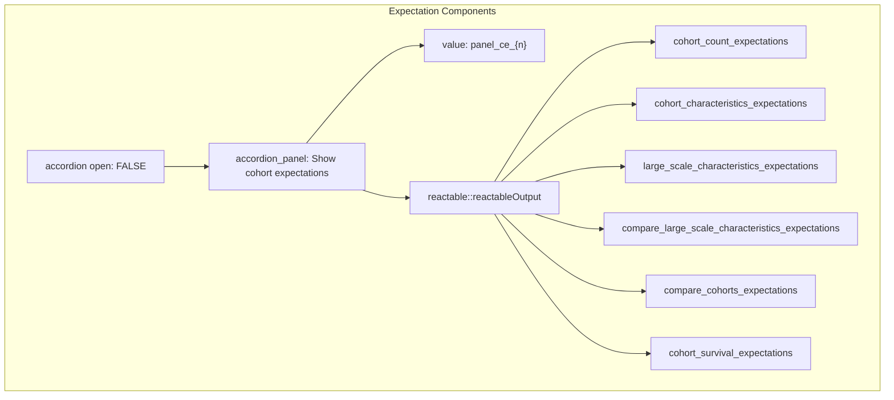

# Page: User Interface Components

# User Interface Components

Relevant source files

The following files were used as context for generating this wiki page:

- [inst/shiny/ui.R](inst/shiny/ui.R)

This document covers the structure and organization of the Shiny application's user interface components in PhenotypeR. It focuses on the technical implementation of UI elements, their organization patterns, and the code structure that defines the interactive diagnostic interface.

For information about the server-side logic that powers these UI components, see [Server Logic and Data Processing](#3.3). For details about launching and configuring the Shiny application, see [Shiny Application Setup](#3.1).

## Overall UI Architecture

The PhenotypeR Shiny interface follows a hierarchical navigation structure built using the `bslib` framework. The main UI container is defined as a `fluidPage` with a `page_navbar` layout that organizes diagnostic functionality into distinct menu categories.

```mermaid
graph TB
    subgraph "Main UI Container"
        A["fluidPage"] --> B["bslib::page_navbar"]
    end
    
    subgraph "Navigation Structure"
        B --> C["nav_panel: Background"]
        B --> D["nav_menu: Database diagnostics"]
        B --> E["nav_menu: Codelist diagnostics"]
        B --> F["nav_menu: Cohort diagnostics"]
        B --> G["nav_menu: Population diagnostics"]
        B --> H["nav_item: Info Popover"]
        B --> I["nav_item: Download Raw Data"]
    end
    
    subgraph "Database Diagnostics Panels"
        D --> D1["nav_panel: Snapshot"]
        D --> D2["nav_panel: Observation periods"]
    end
    
    subgraph "Codelist Diagnostics Panels"
        E --> E1["nav_panel: Achilles code use"]
        E --> E2["nav_panel: Orphan codes"]
        E --> E3["nav_panel: Cohort code use"]
        E --> E4["nav_panel: Measurements Code Use"]
    end
    
    subgraph "Cohort Diagnostics Panels"
        F --> F1["nav_panel: Cohort count"]
        F --> F2["nav_panel: Cohort characteristics"]
        F --> F3["nav_panel: Large scale characteristics"]
        F --> F4["nav_panel: Compare large scale characteristics"]
        F --> F5["nav_panel: Compare cohorts"]
        F --> F6["nav_panel: Cohort survival"]
    end
    
    subgraph "Population Diagnostics Panels"
        G --> G1["nav_panel: Incidence"]
        G --> G2["nav_panel: Prevalence"]
    end
```

Sources: [inst/shiny/ui.R:1-2544]()

## Navigation Menu Structure

The application uses `bslib::nav_menu` components to group related diagnostic functions. Each menu contains multiple `nav_panel` elements that represent individual diagnostic views. The navigation follows a consistent pattern with themed icons and organized content.

| Menu Category | Icon | Panel Count | Line Range |
|---------------|------|-------------|------------|
| Database diagnostics | `list` | 2 | [13-105]() |
| Codelist diagnostics | `list` | 4 | [108-924]() |
| Cohort diagnostics | `list` | 6 | [928-2090]() |
| Population diagnostics | `list` | 2 | [2094-2510]() |

Each navigation menu implements a consistent theming approach using the "pulse" Bootstrap theme with dark navbar styling defined at [inst/shiny/ui.R:3-4]().

Sources: [inst/shiny/ui.R:13-2510]()

## Shared Input Components Pattern

The application implements a standardized "Shared inputs" pattern across all diagnostic panels. This pattern uses `bslib::accordion_panel` components to house common filter controls that affect the data displayed in each section.

The shared inputs container uses consistent styling with a purple background (`#750075`) and flexbox layout defined at [inst/shiny/ui.R:23]() and repeated throughout the file. Each section has its own namespaced input IDs following the pattern `{section}_{input_type}`.

Sources: [inst/shiny/ui.R:19-47](), [inst/shiny/ui.R:115-143](), [inst/shiny/ui.R:299-327]()

## Display Component Architecture

The application uses `bslib::card` components as the primary containers for data visualization. Cards are consistently configured with full-screen capability and download functionality in their headers.

### Card Structure Pattern

### Content Types by Component

| Component Type | Usage Pattern | Examples |
|----------------|---------------|----------|
| `gt::gt_output` | Formatted tables | Database snapshots, characteristics tables |
| `shiny::plotOutput` | Static plots | Age pyramids, survival curves |
| `plotly::plotlyOutput` | Interactive plots | Comparison visualizations |
| `reactable::reactableOutput` | Interactive tables | Large datasets, expectations |
| `DiagrammeR::grVizOutput` | Flowcharts | Cohort attrition diagrams |

Sources: [inst/shiny/ui.R:50-57](), [inst/shiny/ui.R:146-217](), [inst/shiny/ui.R:577-922]()

## Sidebar Configuration Patterns

The application extensively uses `bslib::sidebar` components with a standard width of 400px and "closed" initial state. Sidebars contain two main types of controls:

### Settings Accordion Pattern

The table formatting pattern uses `sortable::bucket_list` components to allow users to drag and drop column configurations between different display categories. This pattern is implemented consistently across multiple diagnostic sections.

Sources: [inst/shiny/ui.R:147-204](), [inst/shiny/ui.R:331-388](), [inst/shiny/ui.R:454-510]()

## Interactive Control Components

The UI implements several categories of interactive controls with specific widget types and configuration patterns:

### Filter Controls
- **Database Selection**: `shinyWidgets::pickerInput` with multi-select and action buttons
- **Cohort Selection**: `shinyWidgets::pickerInput` with "count > 1" text formatting
- **Domain/Category Filters**: `shinyWidgets::pickerInput` with size limits

### Display Options
- **Interactive Mode**: `materialSwitch` components for toggling between static and interactive views
- **Data Inclusion**: `prettyCheckbox` components for optional data elements
- **Plot Configuration**: `shinyWidgets::pickerInput` for axis, color, and facet selections

### Download Configuration
The application provides sophisticated download controls using `bslib::popover` components that contain multiple configuration inputs:

Sources: [inst/shiny/ui.R:622-647](), [inst/shiny/ui.R:1177-1201](), [inst/shiny/ui.R:1508-1532]()

## Expectation Integration Components

The cohort diagnostics sections include specialized `accordion` components for displaying AI-generated expectations. These use `reactable::reactableOutput` components with specific input IDs following the pattern `{section}_expectations`.

These components are positioned before the main diagnostic content in each cohort diagnostics panel and provide a collapsed view of expected cohort characteristics generated by the AI system.

Sources: [inst/shiny/ui.R:982-987](), [inst/shiny/ui.R:1112-1117](), [inst/shiny/ui.R:1275-1280]()

## Application Footer and Metadata

The navigation bar includes utility items positioned at the end using `nav_spacer()` and `nav_item()` components. These provide application information and global download functionality:

- **Info Popover**: Displays PhenotypeR logo and version information
- **Raw Data Download**: Global download button for complete diagnostic data

The footer components use `bslib::popover` elements to provide hover-activated interfaces without cluttering the main navigation area.

Sources: [inst/shiny/ui.R:2512-2543]()