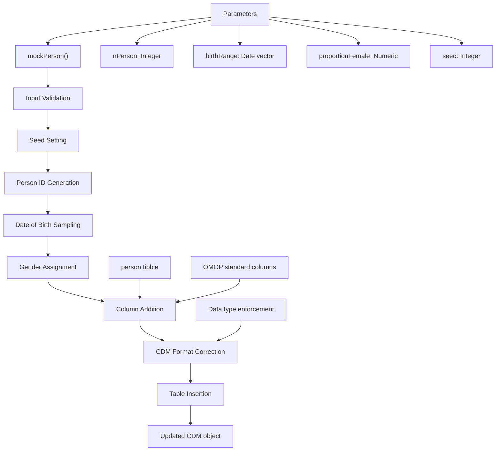
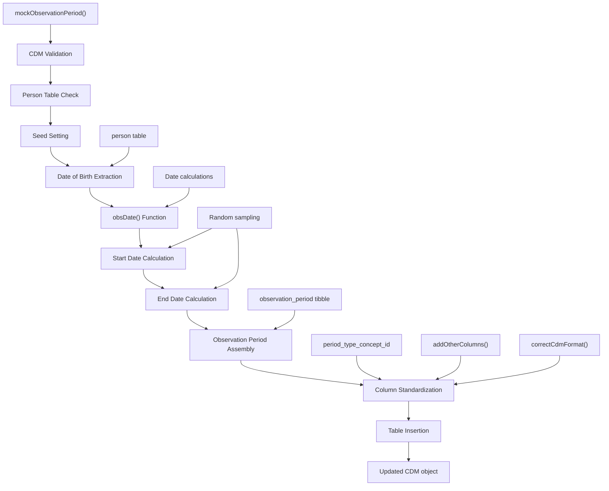
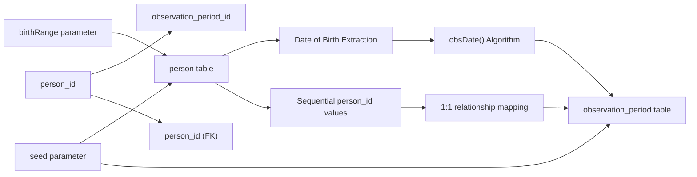

# Page: Basic CDM Tables

# Basic CDM Tables

<details>
<summary>Relevant source files</summary>

The following files were used as context for generating this wiki page:

- [R/mockObservationPeriod.R](R/mockObservationPeriod.R)
- [R/mockPerson.R](R/mockPerson.R)
- [man/mockCohort.Rd](man/mockCohort.Rd)
- [man/mockObservationPeriod.Rd](man/mockObservationPeriod.Rd)
- [man/mockPerson.Rd](man/mockPerson.Rd)
- [tests/testthat/test-mockObservationPeriod.R](tests/testthat/test-mockObservationPeriod.R)
- [tests/testthat/test-mockPerson.R](tests/testthat/test-mockPerson.R)

</details>


## Purpose and Scope

This document covers the generation of fundamental OMOP CDM tables that serve as the foundation for mock clinical data. The basic CDM tables include the `person` and `observation_period` tables, which establish patient demographics and their periods of data availability. These tables form the prerequisite foundation for all other clinical data tables.

For information about generating clinical event tables (drug exposures, conditions, measurements), see [Clinical Event Tables](#3.2). For building CDM objects from pre-existing custom tables, see [Building CDM from Custom Tables](#5.1).

## Core Basic CDM Tables

The basic CDM tables in omock establish the fundamental patient population and temporal framework:

| Table | Function | Purpose |
|-------|----------|---------|
| `person` | `mockPerson()` | Patient demographics and birth information |
| `observation_period` | `mockObservationPeriod()` | Time periods when patients have data availability |

These tables must be created before any clinical event tables, as they provide the primary keys and temporal constraints for all subsequent data generation.

## Person Table Generation

The `person` table contains core demographic information and serves as the primary patient registry for the CDM.

### mockPerson Function Architecture



**Sources:** [R/mockPerson.R:39-106](), [man/mockPerson.Rd:1-57]()

### Key Implementation Details

The `mockPerson` function generates synthetic patient records with the following characteristics:

- **Sequential Person IDs**: Generated using `seq_len(nPerson)` [R/mockPerson.R:57]()
- **Random Birth Dates**: Sampled uniformly from the specified `birthRange` [R/mockPerson.R:59-68]()
- **Gender Distribution**: Uses OMOP concept IDs 8532 (female) and 8507 (male) with configurable proportions [R/mockPerson.R:70-75]()
- **Required OMOP Columns**: Automatically adds `race_concept_id` and `ethnicity_concept_id` as NA values [R/mockPerson.R:85-88]()

### Generated Table Structure

| Column | Data Type | Source | Description |
|--------|-----------|---------|-------------|
| `person_id` | Integer | Sequential | Unique patient identifier |
| `gender_concept_id` | Integer | Random | OMOP gender concepts (8532/8507) |
| `year_of_birth` | Integer | Calculated | Extracted from random birth date |
| `month_of_birth` | Integer | Calculated | Extracted from random birth date |  
| `day_of_birth` | Integer | Calculated | Extracted from random birth date |
| `race_concept_id` | Integer | NA | OMOP race concept (not populated) |
| `ethnicity_concept_id` | Integer | NA | OMOP ethnicity concept (not populated) |

**Sources:** [R/mockPerson.R:77-90](), [tests/testthat/test-mockPerson.R:14-17]()

## Observation Period Table Generation

The `observation_period` table defines time intervals during which patient data is available for analysis.

### mockObservationPeriod Function Workflow



**Sources:** [R/mockObservationPeriod.R:28-96](), [R/mockObservationPeriod.R:102-110]()

### Date Generation Algorithm

The observation period dates are generated using a two-step random sampling process in the `obsDate` function:

1. **Start Date**: `dob + floor((max_date - dob) * r1)` where `r1` is uniform random [0,1] [R/mockObservationPeriod.R:104-105]()
2. **End Date**: `start + ceiling((max_date - start) * r2)` where `r2` is uniform random [0,1] [R/mockObservationPeriod.R:106-107]()

This ensures observation periods:
- Begin after the patient's birth date
- End by the maximum observation date (default: 2020-01-01)
- Have realistic durations with random variability

### Table Relationships and Dependencies



**Sources:** [R/mockObservationPeriod.R:69-79](), [tests/testthat/test-mockObservationPeriod.R:18-25]()

## Usage Patterns and Workflows

### Basic Table Generation Sequence

The standard workflow requires creating tables in dependency order:

```r
# Step 1: Create CDM reference
cdm <- mockCdmReference()

# Step 2: Generate person table (prerequisite)  
cdm <- cdm |> mockPerson(nPerson = 100)

# Step 3: Generate observation periods (depends on person)
cdm <- cdm |> mockObservationPeriod()
```

### Parameter Configuration

| Parameter | Function | Default | Purpose |
|-----------|----------|---------|---------|
| `nPerson` | `mockPerson` | 10 | Controls population size |
| `birthRange` | `mockPerson` | 1950-2000 | Constrains birth date sampling |
| `proportionFemale` | `mockPerson` | 0.5 | Gender distribution |
| `seed` | Both functions | NULL | Reproducibility control |

**Sources:** [R/mockPerson.R:39-43](), [R/mockObservationPeriod.R:28-29](), [man/mockPerson.Rd:6-14]()

### Validation and Error Handling

Both functions include comprehensive input validation:

- **CDM Object Validation**: Ensures valid `cdm_reference` input [R/mockPerson.R:44](), [R/mockObservationPeriod.R:30]()
- **Table State Checks**: Prevents overwriting existing person data [R/mockPerson.R:45-102]()
- **Parameter Validation**: Validates date ranges, proportions, and numeric inputs [R/mockPerson.R:46-51]()
- **Dependency Checks**: Ensures person table exists before generating observation periods [R/mockObservationPeriod.R:31]()

**Sources:** [tests/testthat/test-mockPerson.R:32-71](), [tests/testthat/test-mockObservationPeriod.R:1-26]()