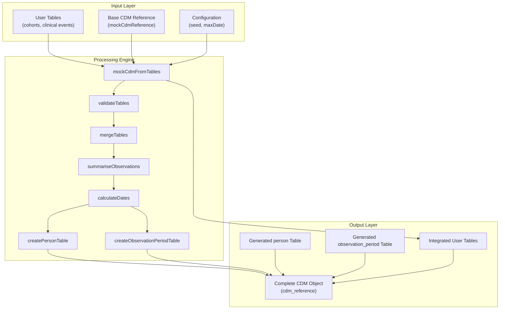
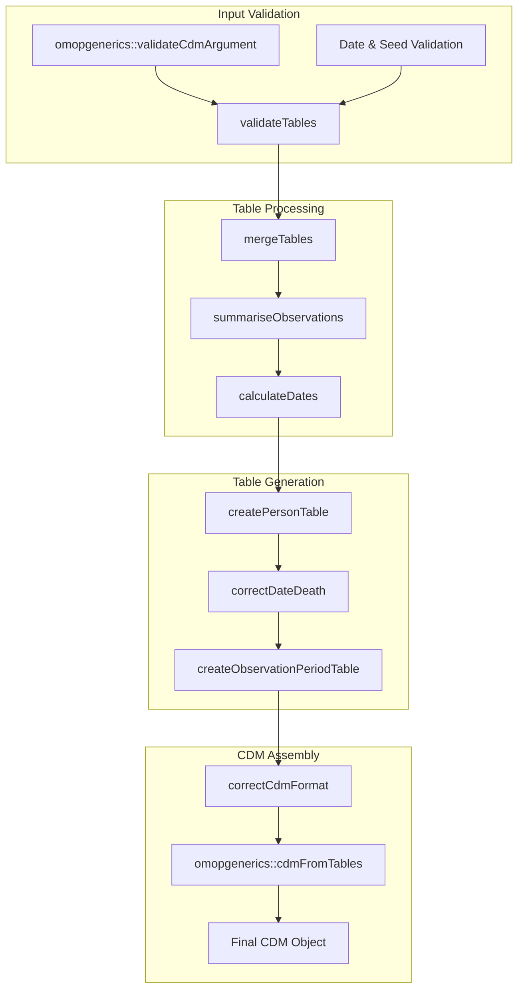
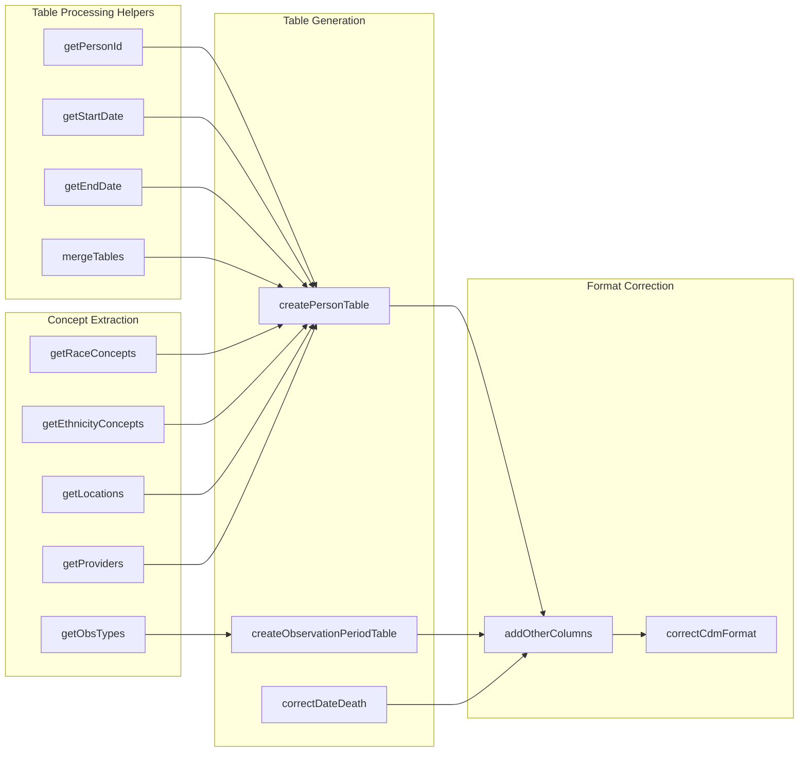

# Page: Building CDM from Custom Tables

# Building CDM from Custom Tables

<details>
<summary>Relevant source files</summary>

The following files were used as context for generating this wiki page:

- [R/mockCdmFromTables.R](R/mockCdmFromTables.R)
- [man/mockCdmFromTables.Rd](man/mockCdmFromTables.Rd)
- [omock.Rproj](omock.Rproj)
- [tests/testthat/test-mockCdmFromTables.R](tests/testthat/test-mockCdmFromTables.R)
- [vignettes/a01_Creating_synthetic_clinical_tables.Rmd](vignettes/a01_Creating_synthetic_clinical_tables.Rmd)
- [vignettes/a02_Creating_synthetic_cohorts.Rmd](vignettes/a02_Creating_synthetic_cohorts.Rmd)
- [vignettes/a04_Building_a_bespoke_mock_cdm.Rmd](vignettes/a04_Building_a_bespoke_mock_cdm.Rmd)

</details>


This document covers the `mockCdmFromTables` system for creating OMOP CDM objects from user-provided custom tables with automatic generation of required foundational tables like `person` and `observation_period`. This approach allows users to bring their own data structures while ensuring CDM compliance and consistency.

For information about building CDM from predefined datasets, see [Predefined Datasets](#4.1). For basic population-based CDM generation, see [Core Mock Data Generation](#3).

## Overview

The `mockCdmFromTables` function serves as a bridge between custom user data and standardized OMOP CDM structures. It accepts any combination of OMOP standard tables or cohort tables and automatically generates the required foundational tables (`person` and `observation_period`) to ensure data consistency and CDM compliance.

**Core Architecture**



Sources: [R/mockCdmFromTables.R:1-138]()

## Core Workflow Components

The `mockCdmFromTables` function implements a multi-stage processing pipeline that transforms user tables into a compliant CDM structure.

**Processing Pipeline**



Sources: [R/mockCdmFromTables.R:52-138]()

### Input Validation and Table Merging

The function begins by validating inputs and merging user-provided tables with any existing CDM tables. The `mergeTables` function handles conflicts by overwriting existing tables and issuing warnings when tables will be replaced.

Key validation steps include:
- CDM reference validation via `omopgenerics::validateCdmArgument`
- Date validation ensuring `maxObservationalPeriodEndDate` doesn't exceed current date
- Table structure validation through `validateTables`

Sources: [R/mockCdmFromTables.R:61-89]()

### Individual Observation Analysis

The `summariseObservations` function analyzes all provided tables to identify unique individuals and their observation date ranges. This function:

- Extracts `person_id` or `subject_id` columns based on table type
- Identifies start and end date columns using `getStartDate` and `getEndDate` helper functions
- Consolidates all observation dates per individual to determine `first_observation` and `last_observation`

**Person ID and Date Column Mapping**

| Table Type | Person ID Column | Start Date Logic | End Date Logic |
|------------|------------------|------------------|----------------|
| OMOP Standard Tables | `person_id` | Table-specific mapping via `namesTable` | Table-specific mapping via `namesTable` |
| Cohort Tables | `subject_id` | `cohort_start_date` | `cohort_end_date` |

Sources: [R/mockCdmFromTables.R:248-284](), [R/mockCdmFromTables.R:221-247]()

### Date Calculation and Person Generation

The `calculateDates` function generates realistic timelines by calculating:
- Birth dates (using exponential distribution with mean 5 years before observation start)
- Observation period start dates (mean 2 years before first observation)
- Observation period end dates (mean 1 year after last observation)

The `createPersonTable` function then generates a complete person table with:
- Demographic information (gender, race, ethnicity)
- Location and provider assignments (if available in CDM)
- Birth date components (year, month, day)

Sources: [R/mockCdmFromTables.R:286-311](), [R/mockCdmFromTables.R:312-342]()

## Function Integration and Dependencies

**Key Helper Functions**



Sources: [R/mockCdmFromTables.R:158-380]()

### Concept and Reference Data Handling

The system intelligently extracts reference data from the CDM to populate generated tables:

- **Race Concepts**: Extracted from `concept` table where `domain_id == "Race"` and `standard_concept == "S"`
- **Ethnicity Concepts**: Similar extraction for ethnicity domain
- **Locations**: Retrieved from existing `location` table if present
- **Providers**: Extracted with associated care site information for realistic assignments

Sources: [R/mockCdmFromTables.R:165-220]()

## Special Cases and Edge Conditions

### Observation Period Only Input

When users provide only an `observation_period` table, the function detects this special case and:
- Generates only the `person` table to match the observation periods
- Skips observation period generation to preserve user-provided data
- Issues an informational message about the limited processing

Sources: [R/mockCdmFromTables.R:73-118]()

### Death Date Handling

If a `death` table is provided, the `correctDateDeath` function ensures observation periods extend to at least the death date, maintaining logical consistency in the timeline.

Sources: [R/mockCdmFromTables.R:344-361]()

## Usage Patterns

**Basic Cohort Integration**
The most common pattern involves creating CDM objects from cohort tables:

```r
# As shown in the examples
cohort <- tibble(
  cohort_definition_id = c(1, 1, 2, 2, 1),
  subject_id = c(1, 4, 2, 3, 5),
  cohort_start_date = as.Date(c("2020-04-01", "2021-06-01", "2022-05-22", "2010-01-01", "2019-08-01")),
  cohort_end_date = cohort_start_date
)
cdm <- mockCdmFromTables(cdm = mockCdmReference(), tables = list(cohort = cohort))
```

Sources: [R/mockCdmFromTables.R:29-51](), [vignettes/a04_Building_a_bespoke_mock_cdm.Rmd:23-46]()

**Multi-Table Integration**
Users can provide multiple tables simultaneously, and the function will coordinate person and observation period generation across all tables to ensure consistency.

Sources: [tests/testthat/test-mockCdmFromTables.R:1-118]()