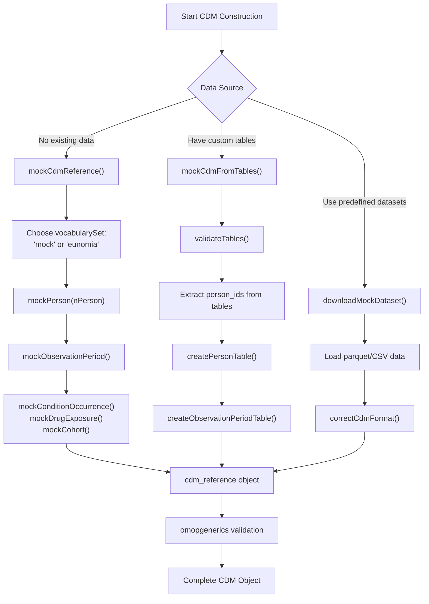
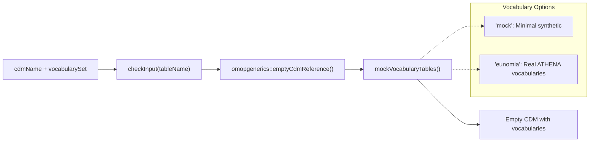
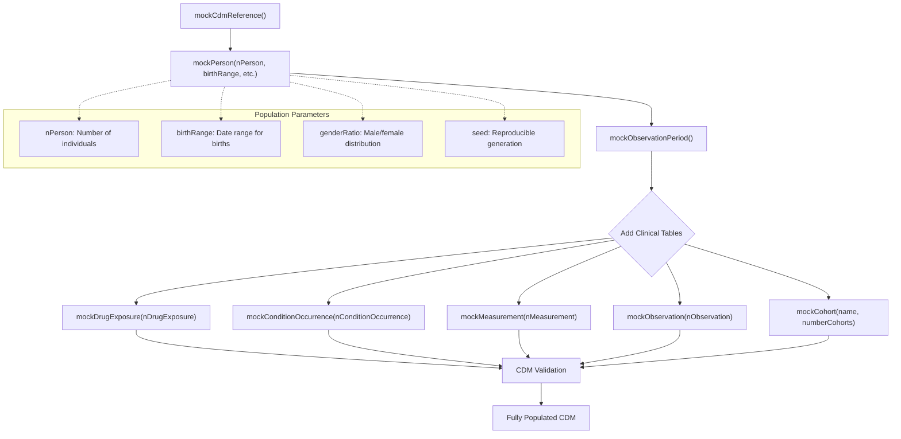
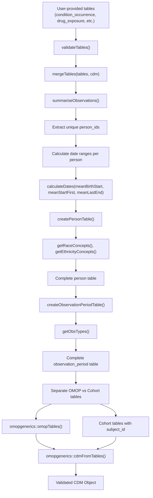
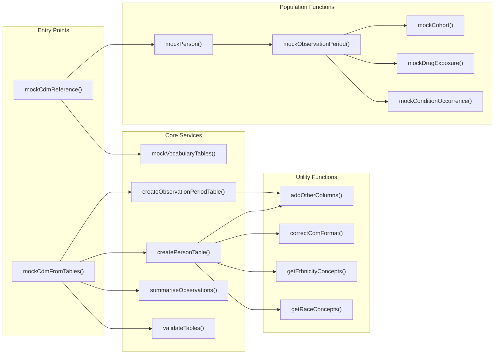

# Page: CDM Construction Methods

# CDM Construction Methods

Relevant source files

The following files were used as context for generating this wiki page:

- [R/mockCdmFromTables.R](R/mockCdmFromTables.R)
- [R/mockCdmReference.R](R/mockCdmReference.R)
- [man/mockCdmReference.Rd](man/mockCdmReference.Rd)
- [man/mockVocabularyTables.Rd](man/mockVocabularyTables.Rd)
- [paper/code.Rmd](paper/code.Rmd)
- [paper/paper.bib](paper/paper.bib)
- [paper/paper.md](paper/paper.md)
- [tests/testthat/test-mockCdmFromTables.R](tests/testthat/test-mockCdmFromTables.R)
- [tests/testthat/test-mockCdmReference.R](tests/testthat/test-mockCdmReference.R)

This page documents the different approaches available in omock for constructing OMOP CDM objects. The package provides three primary methods for CDM construction: empty initialization with step-by-step population, table-based construction from existing data, and dataset-based construction from predefined collections. For information about working with predefined datasets, see [Dataset Management System](#4). For specific details about building CDM objects from custom tables, see [Building CDM from Custom Tables](#5.1).

## Overview of Construction Approaches

The omock package offers flexible CDM construction through three distinct workflows, each designed for different use cases and data availability scenarios.

### CDM Construction Workflow Overview

Sources: [R/mockCdmReference.R:40-50](), [R/mockCdmFromTables.R:52-138](), [paper/paper.md:68-74]()

## Empty CDM Initialization

The `mockCdmReference()` function creates an empty CDM structure that serves as the foundation for step-by-step population with mock data.

### Empty CDM Creation Process

The function accepts two key parameters:
- `cdmName`: String identifier for the CDM object (default: "mock database")  
- `vocabularySet`: Either "mock" for minimal synthetic vocabularies or "eunomia" for real ATHENA vocabularies

Sources: [R/mockCdmReference.R:40-50](), [man/mockCdmReference.Rd:6-47]()

## Population-Based Construction

Population-based construction builds CDM objects by specifying demographic parameters and sequentially adding clinical data tables. This approach provides fine-grained control over the synthetic population characteristics.

### Population Construction Pipeline

This method is ideal for testing scenarios requiring specific population characteristics or when building up complex clinical scenarios incrementally.

Sources: [paper/paper.md:78-97](), [paper/code.Rmd:20-27]()

## Table-Based Construction

The `mockCdmFromTables()` function creates CDM objects from existing user-provided tables, automatically generating consistent `person` and `observation_period` tables to support the provided data.

### Table-Based Construction Architecture

Key internal functions in the table-based workflow:
- `summariseObservations()`: Extracts person IDs and date ranges from all tables
- `calculateDates()`: Computes birth dates and observation periods using exponential distributions
- `createPersonTable()`: Generates demographic data with proper concept mappings
- `createObservationPeriodTable()`: Creates observation periods covering all clinical events

Sources: [R/mockCdmFromTables.R:52-138](), [R/mockCdmFromTables.R:248-285](), [R/mockCdmFromTables.R:312-342]()

## Function Interaction Network

Sources: [R/mockCdmFromTables.R:1-380](), [R/mockCdmReference.R:40-50]()

## Method Comparison and Use Cases

| Method | Use Case | Advantages | Limitations |
|--------|----------|------------|-------------|
| `mockCdmReference()` + Population Functions | Testing with specific population parameters | Full control over demographics, incremental building | Requires multiple function calls |
| `mockCdmFromTables()` | Have existing clinical tables | Automatic consistency, preserves relationships | Limited control over generated person data |
| Dataset-based | Need realistic data quickly | Pre-validated datasets, immediate use | Fixed scenarios, less customization |

### Key Implementation Details

The `mockCdmFromTables()` function implements several important validation and generation mechanisms:

1. **Date Validation**: The `maxObservationalPeriodEndDate` parameter ensures generated dates don't exceed current date [R/mockCdmFromTables.R:67-70]()

2. **Table Overwriting Logic**: When existing CDM contains tables that conflict with provided ones, warnings are issued and tables are overwritten [R/mockCdmFromTables.R:140-157]()

3. **Observation Period Generation**: Uses exponential distributions with configurable means for birth dates, observation start, and end periods [R/mockCdmFromTables.R:286-311]()

4. **Concept Integration**: Automatically extracts race, ethnicity, and location concepts from vocabulary tables when available [R/mockCdmFromTables.R:165-197]()

Sources: [R/mockCdmFromTables.R:52-138](), [tests/testthat/test-mockCdmFromTables.R:1-118](), [paper/paper.md:143-189]()