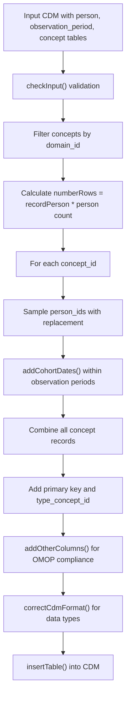
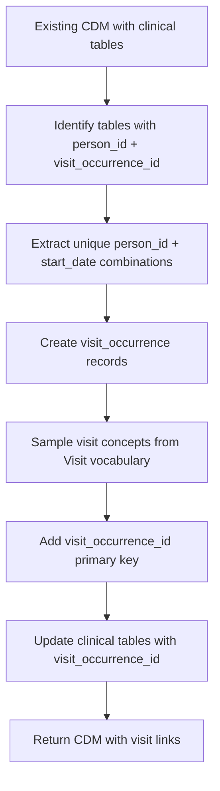
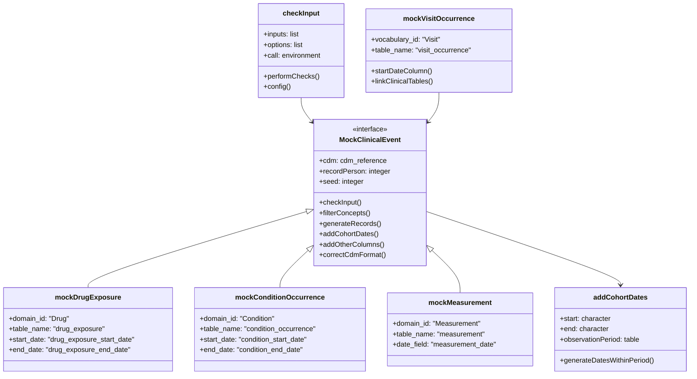

# Page: Clinical Event Tables

# Clinical Event Tables

Relevant source files

The following files were used as context for generating this wiki page:

- [R/checkInputs.R](R/checkInputs.R)
- [R/mockConditionOccurrence.R](R/mockConditionOccurrence.R)
- [R/mockDeath.R](R/mockDeath.R)
- [R/mockDrugExposure.R](R/mockDrugExposure.R)
- [R/mockMeasurement.R](R/mockMeasurement.R)
- [R/mockObservation.R](R/mockObservation.R)
- [R/mockProcedureOccurrence.R](R/mockProcedureOccurrence.R)
- [R/mockVisitOccurrence.R](R/mockVisitOccurrence.R)
- [man/mockProcedureOccurrence.Rd](man/mockProcedureOccurrence.Rd)
- [tests/testthat/test-mockCondtitionOccurrence.R](tests/testthat/test-mockCondtitionOccurrence.R)
- [tests/testthat/test-mockDrugExposure.R](tests/testthat/test-mockDrugExposure.R)
- [tests/testthat/test-mockMeasurement.R](tests/testthat/test-mockMeasurement.R)
- [tests/testthat/test-mockObservation.R](tests/testthat/test-mockObservation.R)

This section covers the generation of mock clinical event tables in the omock package. Clinical event tables represent healthcare encounters, procedures, diagnoses, medications, and other medical events that occur during a patient's observation period. These tables differ from basic CDM tables (covered in [Basic CDM Tables](#3.1)) in that they contain domain-specific medical concepts and must be temporally aligned with observation periods.

The clinical event tables supported by omock include `drug_exposure`, `condition_occurrence`, `measurement`, `observation`, `procedure_occurrence`, `visit_occurrence`, and `death`. For information about cohort generation from these clinical events, see [Cohort Generation](#3.3).

## Clinical Event Table Generation Pattern

All clinical event table generation functions in omock follow a consistent pattern that ensures OMOP CDM compliance and realistic data relationships.

**Core Generation Process**

The generation process follows these steps:

1. **Input Validation**: All functions use `checkInput()` to validate the CDM object, `recordPerson` parameter, and optional `seed`
2. **Concept Filtering**: Each function filters the `concept` table by the appropriate `domain_id` (Drug, Condition, Measurement, etc.)
3. **Record Calculation**: The total number of records is calculated as `recordPerson * person_count`
4. **Date Assignment**: The `addCohortDates()` function ensures all events occur within valid observation periods
5. **OMOP Compliance**: `addOtherColumns()` and `correctCdmFormat()` ensure the output matches OMOP CDM specifications

Sources: [R/mockDrugExposure.R:34-109](), [R/mockConditionOccurrence.R:50-123](), [R/mockMeasurement.R:34-113](), [R/checkInputs.R:193-247]()

## Individual Clinical Event Tables

### Drug Exposure Table

The `mockDrugExposure()` function generates synthetic medication records by filtering concepts with `domain_id == "Drug"` and `standard_concept == "S"`.

| Parameter | Type | Description |
|-----------|------|-------------|
| `cdm` | cdm_reference | Existing CDM with person, observation_period, concept tables |
| `recordPerson` | integer | Expected number of drug records per person (default: 1) |
| `seed` | integer | Optional seed for reproducibility |

The function creates records with `drug_exposure_start_date`, `drug_exposure_end_date`, and assigns `drug_type_concept_id = 1`.

Sources: [R/mockDrugExposure.R:1-109](), [tests/testthat/test-mockDrugExposure.R:1-67]()

### Condition Occurrence Table

The `mockConditionOccurrence()` function simulates diagnostic and condition records using concepts with `domain_id == "Condition"`.

Key fields generated include `condition_start_date`, `condition_end_date`, and `condition_type_concept_id = 1`.

Sources: [R/mockConditionOccurrence.R:1-123](), [tests/testthat/test-mockCondtitionOccurrence.R:1-54]()

### Measurement Table

The `mockMeasurement()` function creates laboratory and clinical measurement records from concepts with `domain_id == "Measurement"`.

Unlike other clinical events, measurements only have a single `measurement_date` rather than start/end dates, as measurements are typically point-in-time events.

Sources: [R/mockMeasurement.R:1-113](), [tests/testthat/test-mockMeasurement.R:1-55]()

### Observation Table

The `mockObservation()` function generates clinical observations and assessments using concepts with `domain_id == "Observation"`.

Similar to measurements, observations have a single `observation_date` representing when the observation was recorded.

Sources: [R/mockObservation.R:1-113](), [tests/testthat/test-mockObservation.R:1-54]()

### Procedure Occurrence Table

The `mockProcedureOccurrence()` function creates records for medical procedures using concepts with `domain_id == "Procedure"`.

The function includes validation to ensure procedure concepts exist in the vocabulary, raising an error if no procedures are found.

Sources: [R/mockProcedureOccurrence.R:1-128](), [man/mockProcedureOccurrence.Rd:1-58]()

### Death Table

The `mockDeath()` function is unique among clinical event generators as it has special constraints:

- `recordPerson` must be between 0 and 1 (a person can only die once)
- `death_date` is set to the `observation_period_end_date`
- Sampling is done without replacement to ensure no duplicate deaths

Sources: [R/mockDeath.R:1-103]()

## Visit Occurrence Integration

The `mockVisitOccurrence()` function provides a special integration layer that links clinical events to healthcare visits.

**Visit Occurrence Workflow**

1. **Table Discovery**: Scans all CDM tables for those containing both `person_id` and `visit_occurrence_id` columns
2. **Visit Creation**: Creates unique visit records based on person and date combinations
3. **Concept Assignment**: Assigns visit concepts from the Visit vocabulary where `standard_concept == "S"`
4. **Backfill Links**: Updates existing clinical tables to include `visit_occurrence_id` foreign keys

The function uses the `startDateColumn()` helper to determine the appropriate start date column for each table type.

Sources: [R/mockVisitOccurrence.R:1-100](), [R/checkInputs.R:252-258]()

## Code Architecture and Data Flow

**Key Components**

- **`checkInput`**: Validates all input parameters and options before generation
- **Domain Filtering**: Each function filters concepts by specific `domain_id` values
- **`addCohortDates`**: Ensures temporal alignment with observation periods
- **`addOtherColumns`**: Adds required OMOP columns not explicitly generated
- **`correctCdmFormat`**: Converts columns to appropriate data types
- **`mockVisitOccurrence`**: Links clinical events to healthcare encounters

Sources: [R/checkInputs.R:20-258](), [R/mockDrugExposure.R:82-86](), [R/mockVisitOccurrence.R:42-94]()