# Page: Cohort Generation

# Cohort Generation

<details>
<summary>Relevant source files</summary>

The following files were used as context for generating this wiki page:

- [R/mockCohort.R](R/mockCohort.R)
- [man/mockCohort.Rd](man/mockCohort.Rd)
- [man/mockObservationPeriod.Rd](man/mockObservationPeriod.Rd)
- [man/mockPerson.Rd](man/mockPerson.Rd)
- [tests/testthat/test-mockCohort.R](tests/testthat/test-mockCohort.R)
- [vignettes/a01_Creating_synthetic_clinical_tables.Rmd](vignettes/a01_Creating_synthetic_clinical_tables.Rmd)
- [vignettes/a02_Creating_synthetic_cohorts.Rmd](vignettes/a02_Creating_synthetic_cohorts.Rmd)
- [vignettes/a04_Building_a_bespoke_mock_cdm.Rmd](vignettes/a04_Building_a_bespoke_mock_cdm.Rmd)

</details>


This document covers the cohort generation functionality within the omock package, specifically the creation of synthetic cohorts for testing analytical workflows. Cohort generation creates patient groupings with defined start and end dates that conform to OMOP CDM cohort table standards.

For information about generating other clinical event tables like drug exposures or conditions, see [Clinical Event Tables](#3.2). For building CDM objects from custom tables that may include pre-defined cohorts, see [Building CDM from Custom Tables](#5.1).

## Overview

The cohort generation system provides functionality to create synthetic cohorts within existing CDM references. The primary function `mockCohort()` generates cohort tables containing patient groupings with realistic observation periods, supporting multiple cohorts with configurable properties.


Sources: [R/mockCohort.R:1-228]()

## Core Function Architecture

The `mockCohort()` function operates as the primary interface for cohort generation, accepting a CDM reference and configuration parameters to produce synthetic cohort data.

| Parameter | Type | Default | Description |
|-----------|------|---------|-------------|
| `cdm` | cdm_reference | - | CDM object containing person and observation_period tables |
| `name` | character | "cohort" | Name of the cohort table to create |
| `numberCohorts` | integer | 1 | Number of distinct cohorts to generate |
| `cohortName` | character vector | "cohort_1", "cohort_2", ... | Names assigned to each cohort |
| `recordPerson` | integer/vector | 1 | Expected records per person per cohort |
| `seed` | integer | NULL | Random seed for reproducibility |


Sources: [R/mockCohort.R:49-85](), [man/mockCohort.Rd:6-44]()

## Cohort Date Generation Process

The `addCohortDates()` helper function manages the assignment of cohort start and end dates within each patient's observation period constraints.

```mermaid
flowchart TD
    subgraph "Input Data"
        A["Subject IDs<br/>(subject_id)"]
        B["Observation Periods<br/>(observation_period)"]
    end
    
    subgraph "addCohortDates Function"
        C["obsDate2()<br/>Date Range Function"]
        D["runif()<br/>Random Generation"]
        E["Date Calculations<br/>(start + offset)"]
        F["Date Validation<br/>(pmax)"]
    end
    
    subgraph "Date Constraints"
        G["observation_period_start_date"]
        H["observation_period_end_date"]
        I["cohort_start_date ≤ cohort_end_date"]
        J["Dates within observation window"]
    end
    
    A --> C
    B --> C
    C --> D
    D --> E
    E --> F
    F --> G
    F --> H
    F --> I
    F --> J
```



The date generation algorithm uses uniform random distribution to select start dates within observation periods, then generates end dates that fall between the start date and the observation period end:

Sources: [R/mockCohort.R:187-227]()

## Overlap Resolution and Data Quality

The cohort generation process includes sophisticated overlap resolution to ensure data quality and realistic cohort patterns.


The overlap resolution ensures that within each cohort and subject combination, cohort periods do not overlap by adjusting end dates when necessary.

Sources: [R/mockCohort.R:118-165]()

## CDM Integration and Output Structure

The final integration step creates OMOP CDM-compliant cohort objects using the `omopgenerics` package standards.


The integration process creates both the main cohort table and the associated metadata tables required by OMOP CDM standards:

- **Cohort Table**: Contains `cohort_definition_id`, `subject_id`, `cohort_start_date`, `cohort_end_date`
- **Cohort Set Table**: Contains `cohort_definition_id` and `cohort_name` mappings
- **Cohort Attrition**: Tracks cohort creation metadata

Sources: [R/mockCohort.R:166-185]()

## Usage Examples and Testing

The cohort generation system supports multiple usage patterns, from simple single-cohort creation to complex multi-cohort scenarios.

**Basic Single Cohort**:
```r
cdm <- mockCdmReference() |>
  mockPerson(nPerson = 100) |>
  mockObservationPeriod() |>
  mockCohort()
```

**Multiple Named Cohorts**:
```r
cdm <- mockCdmReference() |>
  mockPerson(nPerson = 100) |>
  mockObservationPeriod() |>
  mockCohort(
    name = "omock_example",
    numberCohorts = 2,
    cohortName = c("omock_cohort_1", "omock_cohort_2")
  )
```

The testing suite validates functionality across multiple scales and configurations, including stress testing with up to 20,000 persons and seed-based reproducibility verification.

Sources: [vignettes/a02_Creating_synthetic_cohorts.Rmd:30-41](), [tests/testthat/test-mockCohort.R:1-74](), [man/mockCohort.Rd:57-69]()