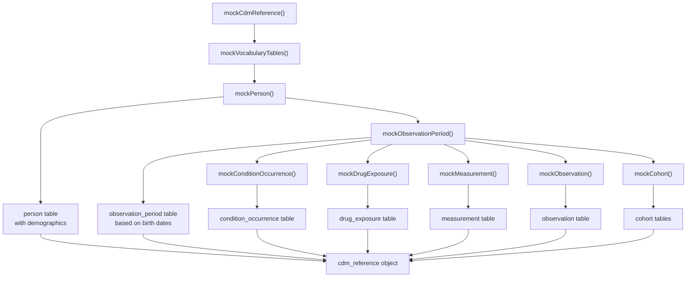
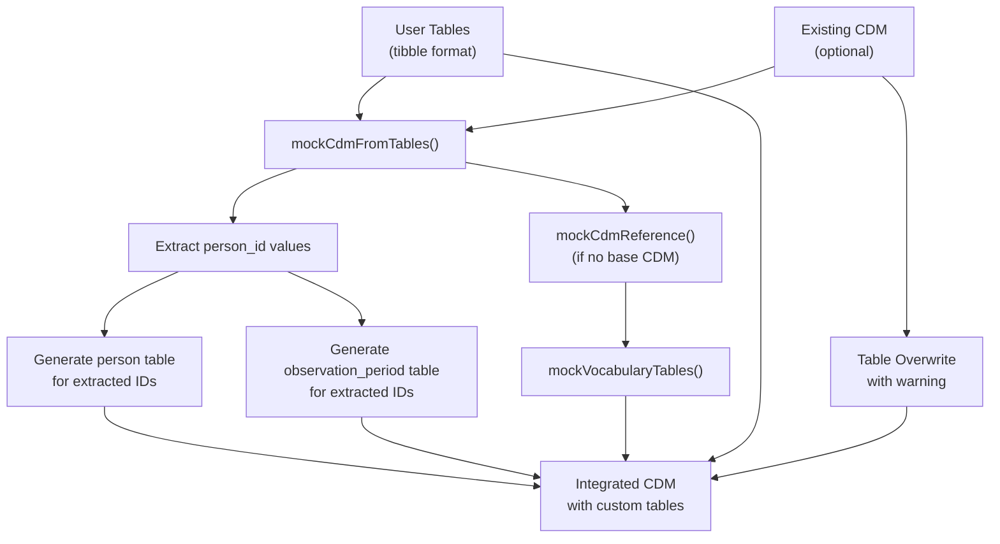
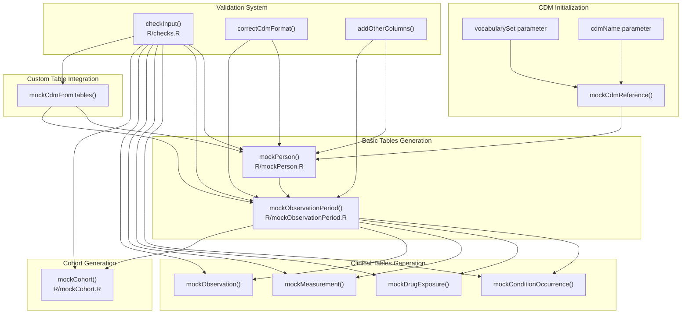
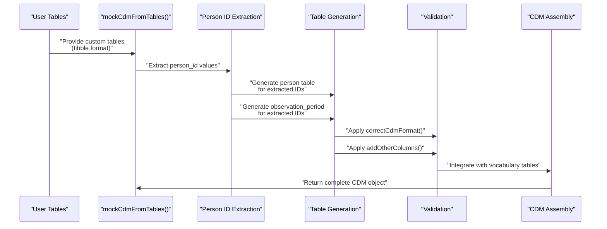

# Page: Core Mock Data Generation

# Core Mock Data Generation

Relevant source files

The following files were used as context for generating this wiki page:

- [R/mockObservationPeriod.R](R/mockObservationPeriod.R)
- [R/mockPerson.R](R/mockPerson.R)
- [man/mockCohort.Rd](man/mockCohort.Rd)
- [man/mockObservationPeriod.Rd](man/mockObservationPeriod.Rd)
- [man/mockPerson.Rd](man/mockPerson.Rd)
- [paper/code.Rmd](paper/code.Rmd)
- [paper/paper.bib](paper/paper.bib)
- [paper/paper.md](paper/paper.md)

This document covers the primary workflows and functions for generating mock OMOP CDM data in omock. It provides a comprehensive overview of the two main generation approaches: population-based generation and table-based generation. For specific details about generating basic CDM tables, see [Basic CDM Tables](#3.1). For clinical event table generation, see [Clinical Event Tables](#3.2). For cohort generation specifics, see [Cohort Generation](#3.3).

## Generation Approaches Overview

The omock package provides two primary approaches for creating mock OMOP CDM data, each designed for different use cases and testing scenarios.

### Population-Based Generation Workflow

This approach allows users to specify population characteristics and generates a complete CDM from demographic parameters.

Sources: [paper/paper.md:78-97](), [R/mockPerson.R:39-106](), [R/mockObservationPeriod.R:28-96]()

### Table-Based Generation Workflow

This approach takes user-provided tables and generates supporting CDM structure automatically.

Sources: [paper/paper.md:143-189](), [paper/code.Rmd:39-58]()

## Core Generation Functions Architecture

The generation system is built around a modular architecture where each function adds specific table types to the CDM reference.

Sources: [paper/paper.md:78-97](), [R/mockPerson.R:44-51](), [R/mockObservationPeriod.R:30]()

## Data Flow and Dependencies

The generation process follows strict dependencies to ensure OMOP CDM compliance and referential integrity.

### Population-Based Generation Data Flow

| Function | Dependencies | Outputs | Key Parameters |
|----------|-------------|---------|----------------|
| `mockCdmReference()` | None | Empty CDM with vocabulary | `cdmName`, `vocabularySet` |
| `mockPerson()` | Empty CDM | `person` table | `nPerson`, `birthRange`, `proportionFemale` |
| `mockObservationPeriod()` | `person` table | `observation_period` table | `seed` |
| Clinical table functions | `person`, `observation_period` | Clinical tables | Varies by function |
| `mockCohort()` | `person`, `observation_period` | Cohort tables | `numberCohorts`, `recordPerson` |

Sources: [man/mockPerson.Rd:6-36](), [man/mockObservationPeriod.Rd:9-16](), [man/mockCohort.Rd:16-44]()

### Table-Based Generation Data Flow

Sources: [paper/paper.md:143-150]()

## Random Generation and Reproducibility

The generation system uses controlled randomization to ensure realistic but reproducible data.

### Seed Management

All generation functions accept a `seed` parameter for reproducibility:

- **Person Generation**: Controls birth date distribution and gender assignment [R/mockPerson.R:53-55]()
- **Observation Period Generation**: Controls start/end date randomization [R/mockObservationPeriod.R:37-39]()
- **Clinical Table Generation**: Controls event timing and concept assignments

### Date Generation Logic

The observation period generation uses a two-stage randomization process:

1. **Start Date**: Random point between birth date and maximum observation date [R/mockObservationPeriod.R:104-105]()
2. **End Date**: Random point between start date and maximum observation date [R/mockObservationPeriod.R:106-107]()

This ensures realistic observation periods that respect individual lifecycles while maintaining temporal consistency across the CDM.

Sources: [R/mockObservationPeriod.R:102-110]()

## Integration with OMOP Standards

The generation system ensures OMOP CDM compliance through several mechanisms:

### Format Standardization

Each generated table undergoes standardization:
- `correctCdmFormat()` ensures proper column types and constraints
- `addOtherColumns()` adds required OMOP columns not explicitly generated
- Integration with `omopgenerics` package for CDM reference validation

### Vocabulary Integration

The system supports multiple vocabulary sets:
- **Mock vocabularies**: Simplified concept sets for basic testing
- **Eunomia vocabularies**: More complete vocabulary from the Eunomia dataset
- Custom vocabulary integration through the `vocabularySet` parameter

Sources: [R/mockPerson.R:89-90](), [R/mockObservationPeriod.R:83-84](), [paper/paper.md:64-65]()