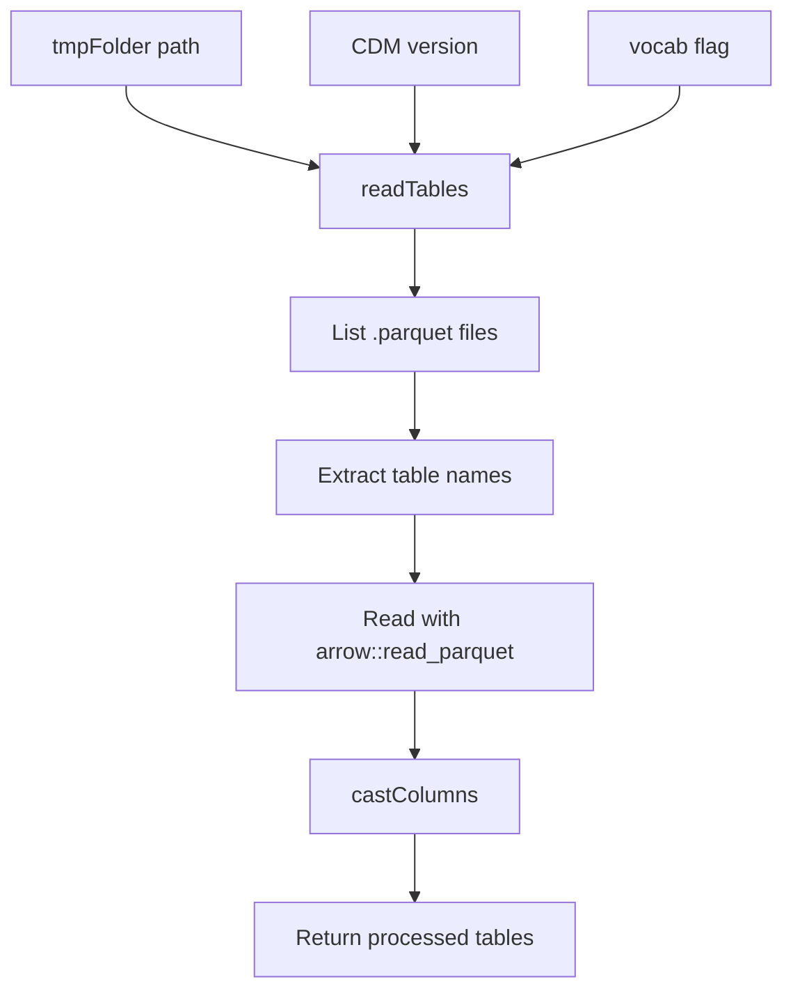
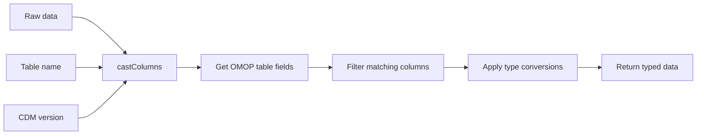
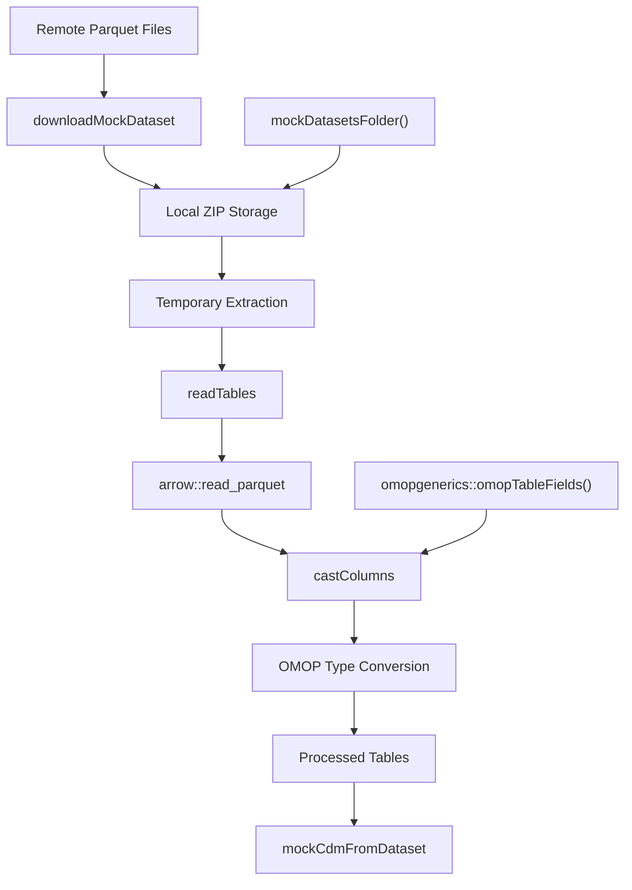
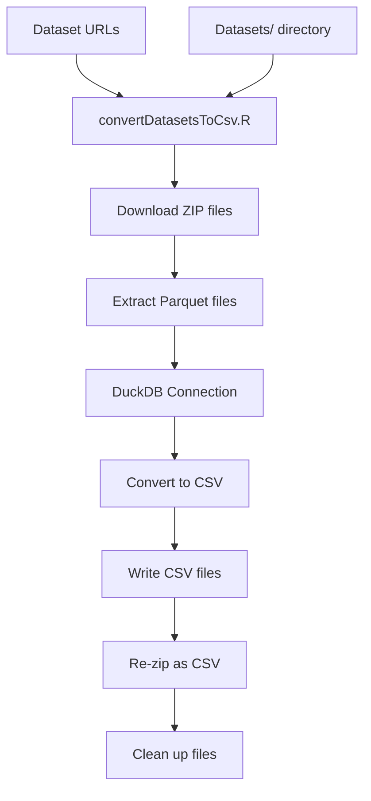
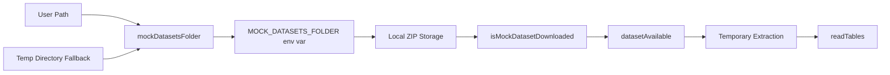
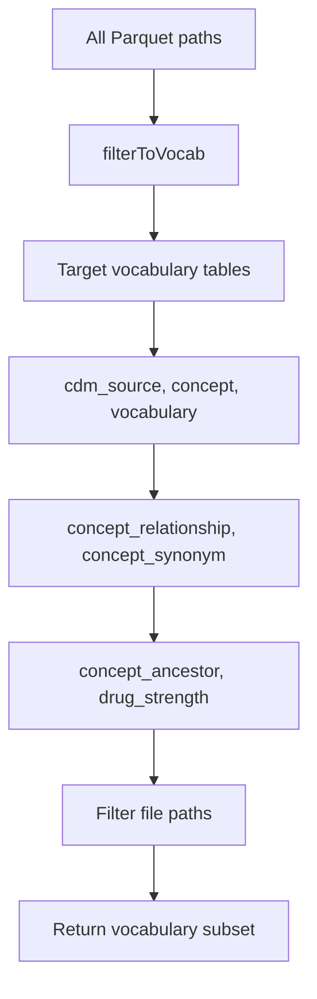
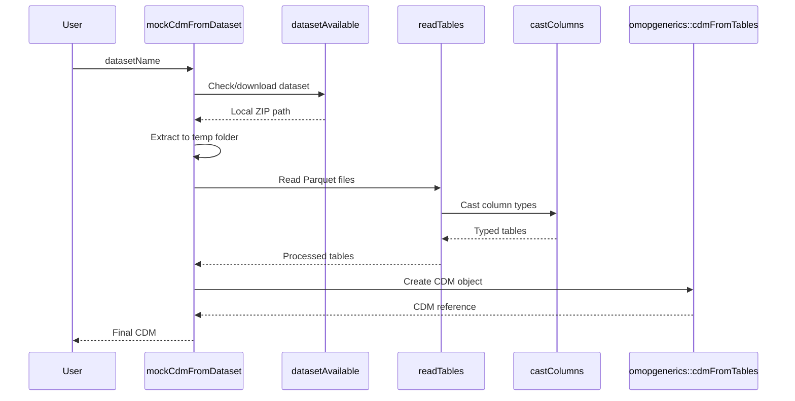

# Page: Data Format Conversion

# Data Format Conversion

Relevant source files

The following files were used as context for generating this wiki page:

- [.Rbuildignore](.Rbuildignore)
- [.gitignore](.gitignore)
- [Datasets/convertDatasetsToCsv.R](Datasets/convertDatasetsToCsv.R)
- [R/mockDatasets.R](R/mockDatasets.R)
- [R/sysdata.rda](R/sysdata.rda)
- [data-raw/default/concept.csv](data-raw/default/concept.csv)
- [data-raw/default/conceptAncestor.csv](data-raw/default/conceptAncestor.csv)
- [data-raw/default/conceptRelationship.csv](data-raw/default/conceptRelationship.csv)
- [data-raw/default/conceptSynonym.csv](data-raw/default/conceptSynonym.csv)
- [data-raw/default/drugStrength.csv](data-raw/default/drugStrength.csv)
- [data-raw/internalData.R](data-raw/internalData.R)
- [man/availableMockDatasets.Rd](man/availableMockDatasets.Rd)

This document covers the data format conversion system in omock, focusing on converting between Parquet and CSV formats and managing local data storage for mock datasets. This system enables the package to work with externally hosted datasets that are distributed in Parquet format but need to be processed locally.

For information about working with predefined datasets and their management, see [Predefined Datasets](#4.1). For broader dataset management concepts, see [Dataset Management System](#4).

## Overview

The omock package handles datasets that are stored remotely in Parquet format but need to be converted and processed locally. The conversion system manages the download, format transformation, and local caching of these datasets to support CDM object creation.

## Core Conversion Functions

The primary conversion logic is implemented through several key functions that handle different aspects of the format conversion process:

### Reading and Processing Tables

The `readTables()` function handles the core table reading and processing logic:

**readTables Function Workflow**
Sources: [R/mockDatasets.R:88-105]()

### Column Type Casting

The `castColumns()` function ensures data types match OMOP CDM specifications:

**Column Casting Process**
Sources: [R/mockDatasets.R:378-402]()

## Format Conversion Architecture

The system implements a multi-stage conversion process that handles the transformation from remote Parquet files to locally processed CSV data:

**Data Format Conversion Flow**
Sources: [R/mockDatasets.R:19-87](), [R/mockDatasets.R:88-105](), [R/mockDatasets.R:378-402]()

## Dataset Conversion Script

The package includes a dedicated conversion script for processing multiple datasets:

**Bulk Conversion Process**
Sources: [Datasets/convertDatasetsToCsv.R:29-66]()

## Data Type Handling

The conversion system handles multiple OMOP CDM data types through the `castColumns()` function:

| OMOP Type | R Function | Description |
|-----------|------------|-------------|
| `varchar` | `as.character` | String/text fields |
| `integer` | `as.integer` | Whole numbers |
| `datetime` | `as.POSIXct` | Timestamps |
| `date` | `as.Date` | Date values |
| `float` | `as.numeric` | Decimal numbers |
| `logical` | `as.logical` | Boolean values |

Sources: [R/mockDatasets.R:378-402]()

## Local Storage Management

The conversion system integrates with the local storage management through several key components:

**Storage Management Integration**
Sources: [R/mockDatasets.R:312-340](), [R/mockDatasets.R:342-352](), [R/mockDatasets.R:252-259]()

## Vocabulary Table Filtering

The system includes specialized handling for vocabulary-only datasets through the `filterToVocab()` function:

**Vocabulary Filtering Process**
Sources: [R/mockDatasets.R:404-424]()

## Integration with CDM Creation

The format conversion system directly supports CDM object creation through the `mockCdmFromDataset()` workflow:

**CDM Creation Integration**
Sources: [R/mockDatasets.R:19-87](), [R/mockDatasets.R:88-105]()