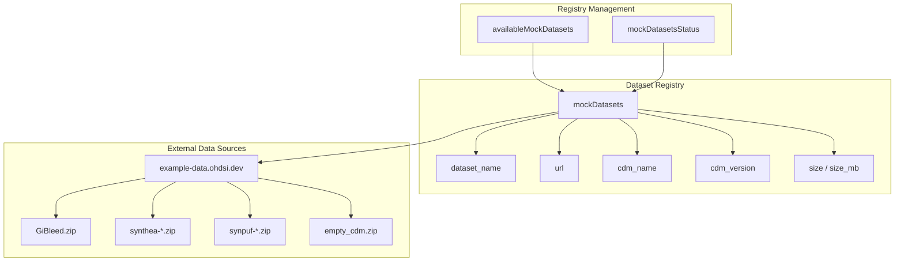
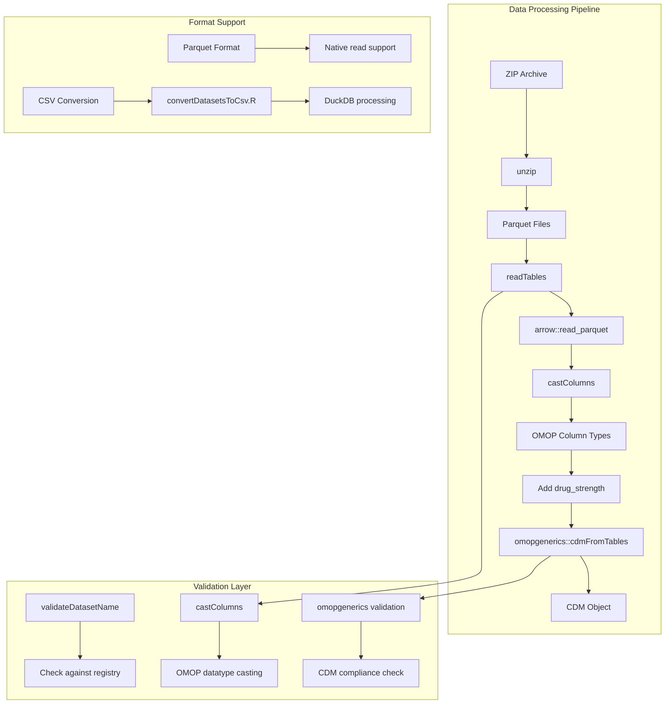
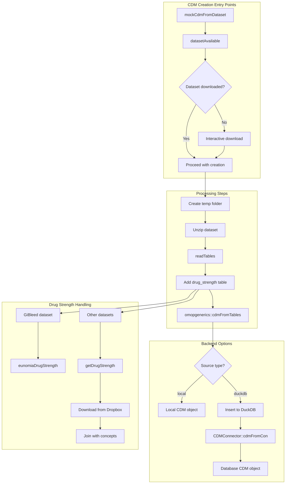
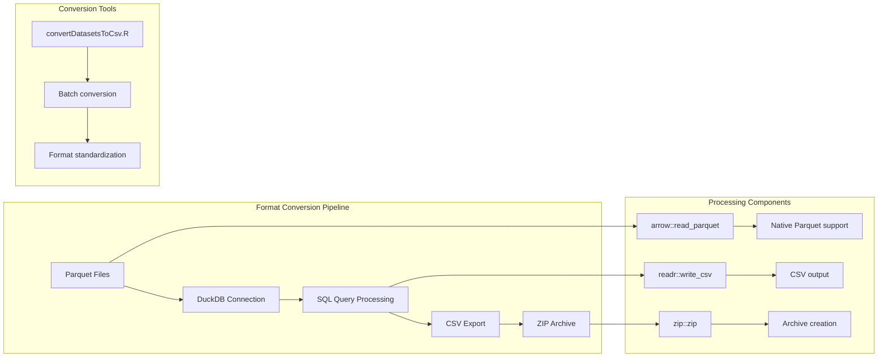
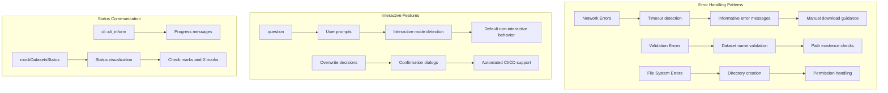

# Page: Dataset Management System

# Dataset Management System

Relevant source files

The following files were used as context for generating this wiki page:

- [.Rbuildignore](.Rbuildignore)
- [.gitignore](.gitignore)
- [Datasets/convertDatasetsToCsv.R](Datasets/convertDatasetsToCsv.R)
- [R/mockDatasets.R](R/mockDatasets.R)
- [R/sysdata.rda](R/sysdata.rda)
- [_pkgdown.yml](_pkgdown.yml)
- [data-raw/internalData.R](data-raw/internalData.R)
- [man/availableMockDatasets.Rd](man/availableMockDatasets.Rd)
- [tests/testthat/test-mockDatasets.R](tests/testthat/test-mockDatasets.R)

The Dataset Management System provides functionality for working with predefined mock OMOP CDM datasets. This system handles downloading, caching, format conversion, and CDM object creation from external dataset sources. It enables users to quickly access curated synthetic healthcare datasets without generating mock data from scratch.

For information about generating custom CDM objects from user-provided tables, see [Building CDM from Custom Tables](#5.1). For details on mock vocabulary management, see [Vocabulary and Concept Management](#6).

## Dataset Registry and Metadata

The system maintains a centralized registry of available datasets through the `mockDatasets` data frame, which contains metadata for each available dataset including download URLs, CDM versions, and file sizes.

**Registry Structure and Population**

The registry is populated at build time and includes datasets from multiple sources:

| Dataset Type | Examples | CDM Version | Size Range |
|--------------|----------|-------------|------------|
| GiBleed | `GiBleed` | 5.3 | ~10MB |
| Synthea | `synthea-covid19-10k`, `synthea-heart-10k` | 5.3 | 5-50MB |
| SynPUF | `synpuf-1k_5.3`, `synpuf-1k_5.4` | 5.3/5.4 | ~20MB |
| Empty | `empty_cdm` | 5.3 | <1MB |

Sources: [data-raw/internalData.R:170-196](), [R/mockDatasets.R:161](), [R/mockDatasets.R:271-273]()

## Download and Caching System

The system implements a robust download and caching mechanism that manages local storage of datasets with validation and overwrite controls.

```mermaid
graph TD
    subgraph "Download Workflow"
        A[downloadMockDataset] --> B[validateDatasetName]
        B --> C[validatePath]
        C --> D{"Dataset exists locally?"}
        D -->|Yes| E{"Overwrite policy"}
        D -->|No| F[Download from URL]
        E -->|Overwrite=TRUE| G[Remove existing]
        E -->|Overwrite=FALSE| H[Return existing path]
        E -->|Overwrite=NULL| I[Interactive prompt]
        G --> F
        I -->|Yes| G
        I -->|No| H
        F --> J[Save to local path]
    end
    
    subgraph "Status Management"
        K[isMockDatasetDownloaded] --> L[Check file existence]
        M[mockDatasetsStatus] --> N[Scan all datasets]
        N --> O[Display status grid]
    end
    
    subgraph "Storage Management"
        P[mockDatasetsFolder] --> Q{"Path provided?"}
        Q -->|No| R[Return current folder]
        Q -->|Yes| S[Set environment variable]
        S --> T[Create directory if needed]
    end
```

**Caching and Storage Configuration**

The system uses environment variable `MOCK_DATASETS_FOLDER` to manage dataset storage location:

- **Default behavior**: Creates temporary folder if not set
- **Persistent storage**: Users can set permanent location via `.Renviron`
- **Interactive setup**: Provides guidance for permanent configuration

Sources: [R/mockDatasets.R:183-232](), [R/mockDatasets.R:252-259](), [R/mockDatasets.R:312-340](), [R/mockDatasets.R:285-295]()

## Data Processing Pipeline

The system processes datasets through multiple stages from download to CDM object creation, handling format conversion and validation along the way.

**Column Type Casting and Validation**

The system ensures OMOP CDM compliance through systematic column type casting:

- **Data types**: `varchar`, `integer`, `datetime`, `date`, `float`, `logical`
- **OMOP compliance**: Uses `omopgenerics::omopTableFields()` for field definitions
- **Version support**: Handles CDM versions 5.3 and 5.4

Sources: [R/mockDatasets.R:88-105](), [R/mockDatasets.R:378-402](), [R/mockDatasets.R:19-87]()

## CDM Object Creation Methods

The system provides flexible CDM creation with support for both local and database backends.

**Backend Support and Configuration**

The system supports multiple CDM backends:

| Backend | Use Case | Requirements |
|---------|----------|--------------|
| `local` | In-memory analysis | Base R |
| `duckdb` | Larger datasets, SQL queries | `duckdb`, `CDMConnector` |

Sources: [R/mockDatasets.R:19-87](), [R/mockDatasets.R:106-141]()

## Format Conversion Utilities

The system includes utilities for converting between data formats to support different storage and processing requirements.

**Conversion Workflow and Tools**

The conversion process handles multiple dataset formats:

- **Input**: Parquet files from external sources
- **Processing**: DuckDB for SQL-based transformations
- **Output**: CSV files in ZIP archives
- **Batch processing**: Automated conversion of all datasets

Sources: [Datasets/convertDatasetsToCsv.R:1-68]()

## Error Handling and User Interaction

The system implements comprehensive error handling and user interaction patterns for robust dataset management.

**User Experience Features**

The system provides clear communication and control:

- **Progress indicators**: Download progress and processing status
- **Interactive prompts**: Overwrite confirmations and download decisions
- **Status visualization**: Clear display of dataset availability
- **Error guidance**: Specific instructions for resolving issues

Sources: [R/mockDatasets.R:353-366](), [R/mockDatasets.R:285-295](), [R/mockDatasets.R:213-229]()