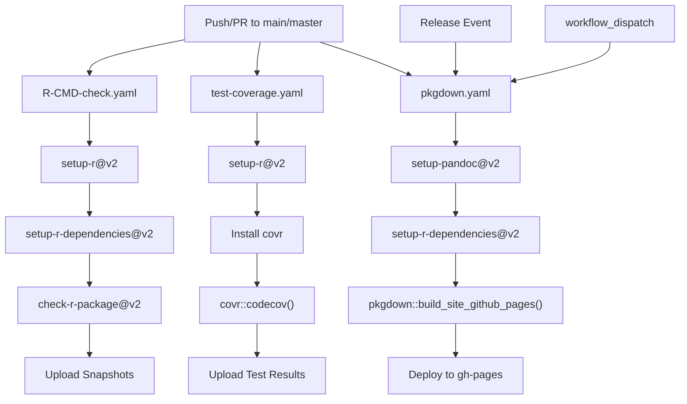
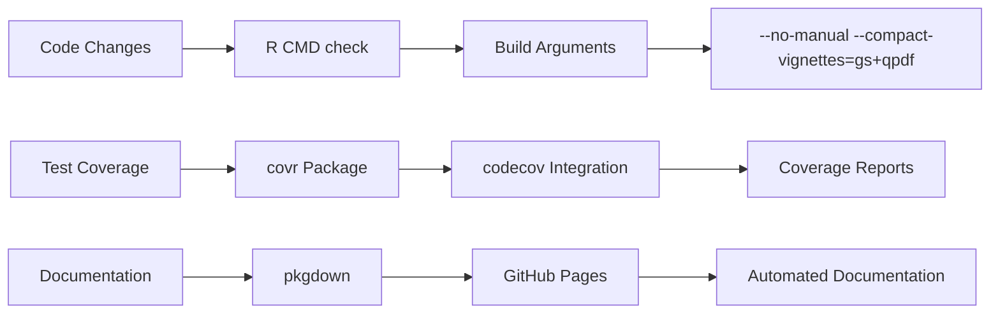
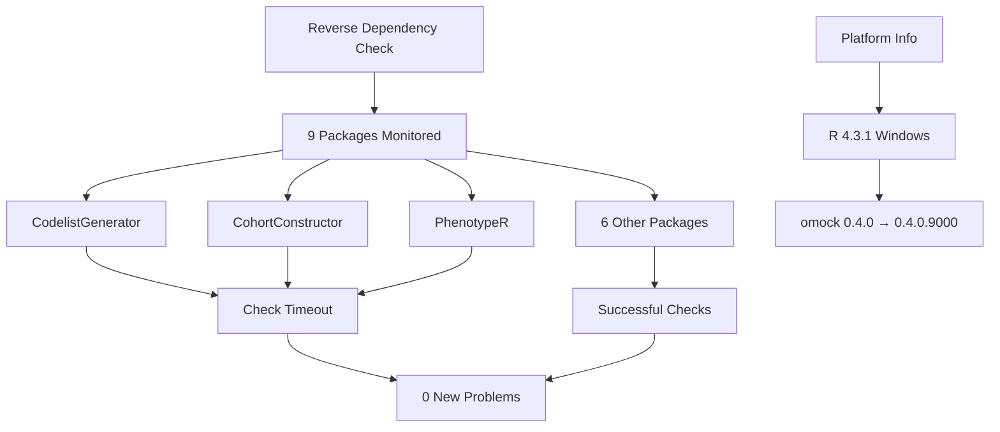
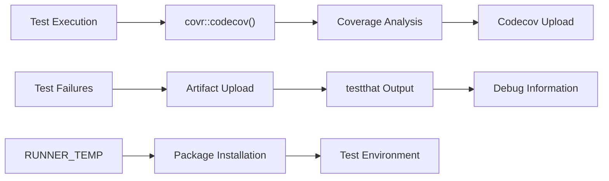

# Page: Development and Contributing

# Development and Contributing

Relevant source files

The following files were used as context for generating this wiki page:

- [.github/.gitignore](.github/.gitignore)
- [.github/workflows/R-CMD-check.yaml](.github/workflows/R-CMD-check.yaml)
- [.github/workflows/pkgdown.yaml](.github/workflows/pkgdown.yaml)
- [.github/workflows/test-coverage.yaml](.github/workflows/test-coverage.yaml)
- [cran-comments.md](cran-comments.md)
- [inst/CITATION](inst/CITATION)
- [man/figures/logo.png](man/figures/logo.png)
- [revdep/.gitignore](revdep/.gitignore)
- [revdep/README.md](revdep/README.md)
- [revdep/cran.md](revdep/cran.md)
- [revdep/failures.md](revdep/failures.md)
- [revdep/problems.md](revdep/problems.md)

This page provides information for developers who want to contribute to the omock R package, including details about the development workflow, testing infrastructure, continuous integration processes, and package validation procedures.

For information about using omock's core functionality, see [Core Mock Data Generation](#3). For details about the package structure and dependencies, see [Package Structure and Dependencies](#1.1).

## Development Infrastructure

The omock package uses a comprehensive development infrastructure that includes automated testing, continuous integration, reverse dependency checking, and package validation to ensure code quality and compatibility with the broader OHDSI ecosystem.

### Continuous Integration Pipeline

The package employs three main GitHub Actions workflows that automatically validate code changes and maintain package quality:

**CI/CD Workflow Components**

Sources: [.github/workflows/R-CMD-check.yaml:1-33](), [.github/workflows/test-coverage.yaml:1-51](), [.github/workflows/pkgdown.yaml:1-49]()

## Package Validation Process

The package validation follows R package development best practices with specific configurations for the OMOP CDM ecosystem:

**Package Check Configuration**

The R CMD check process uses specific build arguments to optimize for the package's requirements:
- `--no-manual`: Skips manual page generation during check
- `--compact-vignettes=gs+qpdf`: Compresses vignettes using Ghostscript and qpdf

Sources: [.github/workflows/R-CMD-check.yaml:32](), [cran-comments.md:1-5]()

## Reverse Dependency Management

The package maintains compatibility with downstream packages through systematic reverse dependency checking:

**Reverse Dependency Status**

The current reverse dependency status shows:
- **Total packages checked**: 9
- **Failed to check**: 3 (due to timeouts)
- **New problems**: 0
- **Package version transition**: 0.4.0 → 0.4.0.9000

The timeout failures in `CodelistGenerator`, `CohortConstructor`, and `PhenotypeR` appear to be infrastructure-related rather than code compatibility issues.

Sources: [revdep/cran.md:1-15](), [revdep/README.md:20-22](), [revdep/failures.md:1-72]()

## Development Environment Setup

### Platform Requirements

The development and testing environment is configured for:
- **Operating System**: Ubuntu Latest (CI), Windows 11 (development)
- **R Version**: 4.3.1 or later
- **Package Manager**: RSPM (R Studio Package Manager) for dependency resolution

### Key Dependencies

The package maintains stable dependencies across versions:

| Package | Version | Role |
|---------|---------|------|
| `omopgenerics` | 1.3.0 | OMOP CDM standards and validation |
| `dplyr` | 1.1.4 | Data manipulation |
| `rlang` | 1.1.5 | Language constructs |
| `purrr` | 1.0.4 | Functional programming |
| `arrow` | 19.0.1.1 | Data format handling |

Sources: [revdep/README.md:20-61]()

## Testing Infrastructure

### Test Coverage Monitoring

The package uses `covr` for test coverage analysis with the following configuration:

The coverage process includes:
- Quiet mode disabled for verbose output
- Clean mode disabled to preserve intermediate files
- Custom installation path in runner temporary directory
- Automatic artifact upload on test failures

Sources: [.github/workflows/test-coverage.yaml:30-50]()

### Package Logo and Branding

The package includes visual identity elements stored in the repository structure, with the logo available at `man/figures/logo.png` for use in documentation and presentations.

Sources: [man/figures/logo.png:1]()

## CRAN Submission Process

The package follows standard CRAN submission procedures with documented results:

**Current Status**
- **Errors**: 0
- **Warnings**: 0  
- **Notes**: 1 (new release notification)

The single note indicates this was a new package submission to CRAN, which is standard for initial releases.

Sources: [cran-comments.md:1-5]()

## Contributing Guidelines

### Development Workflow

1. **Fork and Clone**: Fork the repository and clone locally
2. **Branch Creation**: Create feature branches from `main`
3. **Code Changes**: Implement changes following R package conventions
4. **Local Testing**: Run `R CMD check` locally before pushing
5. **Pull Request**: Submit PR with clear description of changes
6. **CI Validation**: Ensure all GitHub Actions workflows pass
7. **Review Process**: Address reviewer feedback
8. **Merge**: Maintainer merges after approval

### Code Quality Standards

All contributions must pass:
- R CMD check without errors or warnings
- Test coverage maintenance or improvement
- Reverse dependency compatibility
- Documentation updates where applicable

The automated CI pipeline will validate these requirements for every pull request.

Sources: [.github/workflows/R-CMD-check.yaml:3-7](), [.github/workflows/test-coverage.yaml:3-7]()