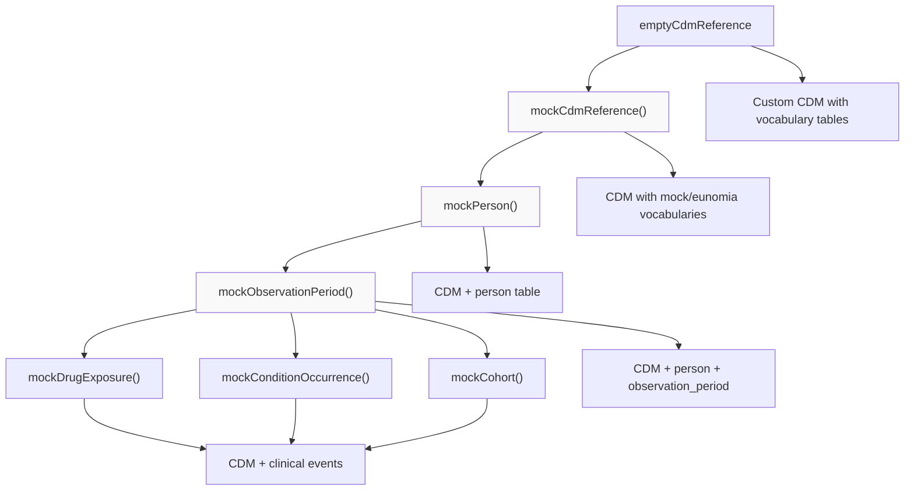
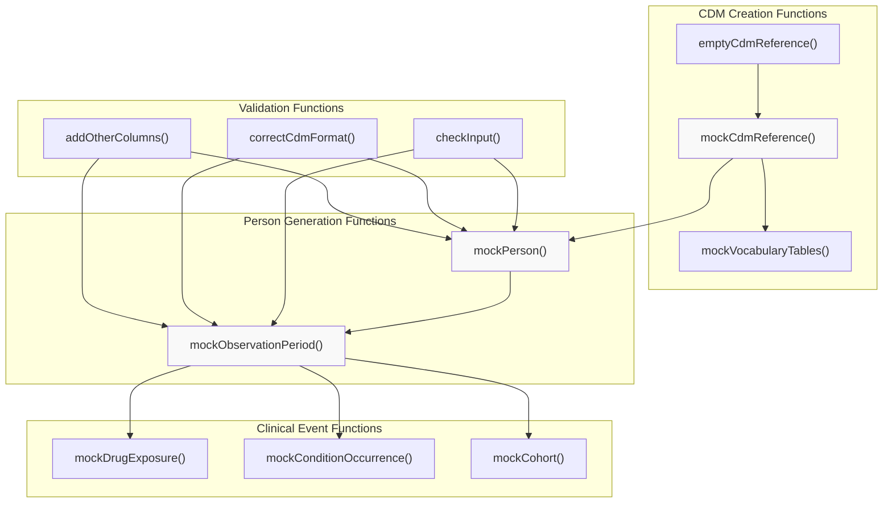

# Page: Getting Started

# Getting Started

<details>
<summary>Relevant source files</summary>

The following files were used as context for generating this wiki page:

- [R/mockCdmReference.R](R/mockCdmReference.R)
- [R/mockObservationPeriod.R](R/mockObservationPeriod.R)
- [R/mockPerson.R](R/mockPerson.R)
- [README.Rmd](README.Rmd)
- [README.md](README.md)
- [codecov.yml](codecov.yml)
- [man/figures/README-pressure-1.png](man/figures/README-pressure-1.png)
- [man/mockCdmReference.Rd](man/mockCdmReference.Rd)
- [man/mockVocabularyTables.Rd](man/mockVocabularyTables.Rd)
- [tests/testthat/test-mockCdmReference.R](tests/testthat/test-mockCdmReference.R)

</details>


This document provides a quick start guide for creating mock OMOP CDM objects and generating synthetic clinical data using the omock package. It covers the basic workflow for generating a minimal CDM with persons and observation periods, which forms the foundation for more advanced mock data generation scenarios. For detailed information about specific clinical event tables, see [Clinical Event Tables](#3.2). For working with predefined datasets, see [Dataset Management System](#4).

## Basic Workflow Overview

The omock package follows a sequential approach to building mock CDM objects. You start with an empty CDM reference, populate it with persons, add observation periods, and then optionally add clinical event tables.

### Core CDM Generation Workflow



Sources: [README.md:38-124](), [README.Rmd:37-71]()

## Step-by-Step Example

### 1. Create an Empty CDM Reference

The first step is creating a CDM reference structure. You can use either `emptyCdmReference()` for a completely empty CDM or `mockCdmReference()` for a CDM that includes vocabulary tables:

```r
library(omopgenerics)
library(omock)

# Option 1: Completely empty CDM
cdm <- emptyCdmReference(cdmName = "mock")

# Option 2: CDM with mock vocabulary tables (recommended)
cdm <- mockCdmReference(cdmName = "mock database", vocabularySet = "mock")
```

The `mockCdmReference()` function creates an empty CDM with vocabulary tables populated based on the `vocabularySet` parameter. You can choose between "mock" (minimal synthetic vocabulary) or "eunomia" (realistic ATHENA vocabularies).

Sources: [R/mockCdmReference.R:40-50](), [README.md:42-75]()

### 2. Add Person Data

Once you have a CDM reference, add mock persons using `mockPerson()`:

```r
cdm <- cdm |>
  mockPerson(nPerson = 1000, 
            birthRange = as.Date(c("1950-01-01", "2000-12-31")),
            proportionFemale = 0.5)
```

This function generates persons with:
- Sequential person IDs starting from 1
- Random birth dates within the specified range  
- Gender assignment based on the proportion specified
- OMOP concept IDs for gender (8532 for female, 8507 for male)

Sources: [R/mockPerson.R:39-106](), [README.md:80-106]()

### 3. Add Observation Periods

After creating persons, generate observation periods that define when each person was observable in the healthcare system:

```r
cdm <- cdm |>
  mockObservationPeriod()
```

The `mockObservationPeriod()` function automatically:
- Uses birth dates from the person table to calculate realistic observation periods
- Assigns random start dates after birth and before a maximum date (default 2020-01-01)
- Creates end dates that fall between the start date and the maximum date
- Links observation periods to persons via `person_id`

Sources: [R/mockObservationPeriod.R:28-96](), [README.md:110-123]()

## Key Function Architecture

### Core Function Relationships



Sources: [R/mockCdmReference.R:1-51](), [R/mockPerson.R:1-107](), [R/mockObservationPeriod.R:1-111]()

## Function Parameters and Configuration

| Function | Key Parameters | Default Values | Purpose |
|----------|----------------|----------------|---------|
| `mockCdmReference()` | `cdmName`, `vocabularySet` | "mock database", "mock" | Create CDM with vocabularies |
| `mockPerson()` | `nPerson`, `birthRange`, `proportionFemale` | 10, 1950-2000, 0.5 | Generate person records |
| `mockObservationPeriod()` | `seed` | NULL | Generate observation periods |

All functions support a `seed` parameter for reproducible results. The CDM object is built incrementally, with each function adding or modifying tables within the same reference object.

Sources: [man/mockCdmReference.Rd:6-47](), [R/mockPerson.R:39-51](), [R/mockObservationPeriod.R:28-29]()

## Validation and Data Quality

The omock package includes built-in validation at multiple levels:

- **Input validation**: The `checkInput()` function validates parameters before processing
- **Format correction**: `correctCdmFormat()` ensures tables conform to OMOP CDM standards  
- **Column completion**: `addOtherColumns()` adds required OMOP columns with appropriate default values
- **OMOP compliance**: Integration with `omopgenerics` package ensures CDM standards compliance

These validation steps occur automatically during table generation, ensuring that the resulting CDM objects are properly formatted and ready for use with other OHDSI ecosystem packages.

Sources: [R/mockPerson.R:84-91](), [R/mockObservationPeriod.R:81-85]()

## Next Steps

After completing the basic setup:

1. **Add clinical events**: Use functions like `mockDrugExposure()` and `mockConditionOccurrence()` to populate clinical tables (see [Clinical Event Tables](#3.2))
2. **Work with datasets**: Load predefined mock datasets for more complex scenarios (see [Predefined Datasets](#4.1))  
3. **Create cohorts**: Generate patient cohorts for analytical workflows (see [Cohort Generation](#3.3))
4. **Build from custom tables**: Create CDM objects from your own data tables (see [Building CDM from Custom Tables](#5.1))

The CDM object created through this basic workflow serves as the foundation for all subsequent mock data generation activities in the omock package.

Sources: [README.md:14-17](), [README.Rmd:24]()