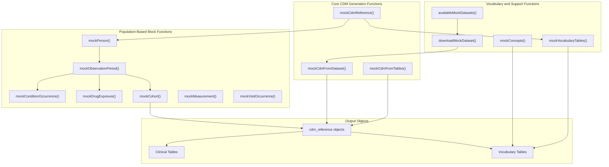
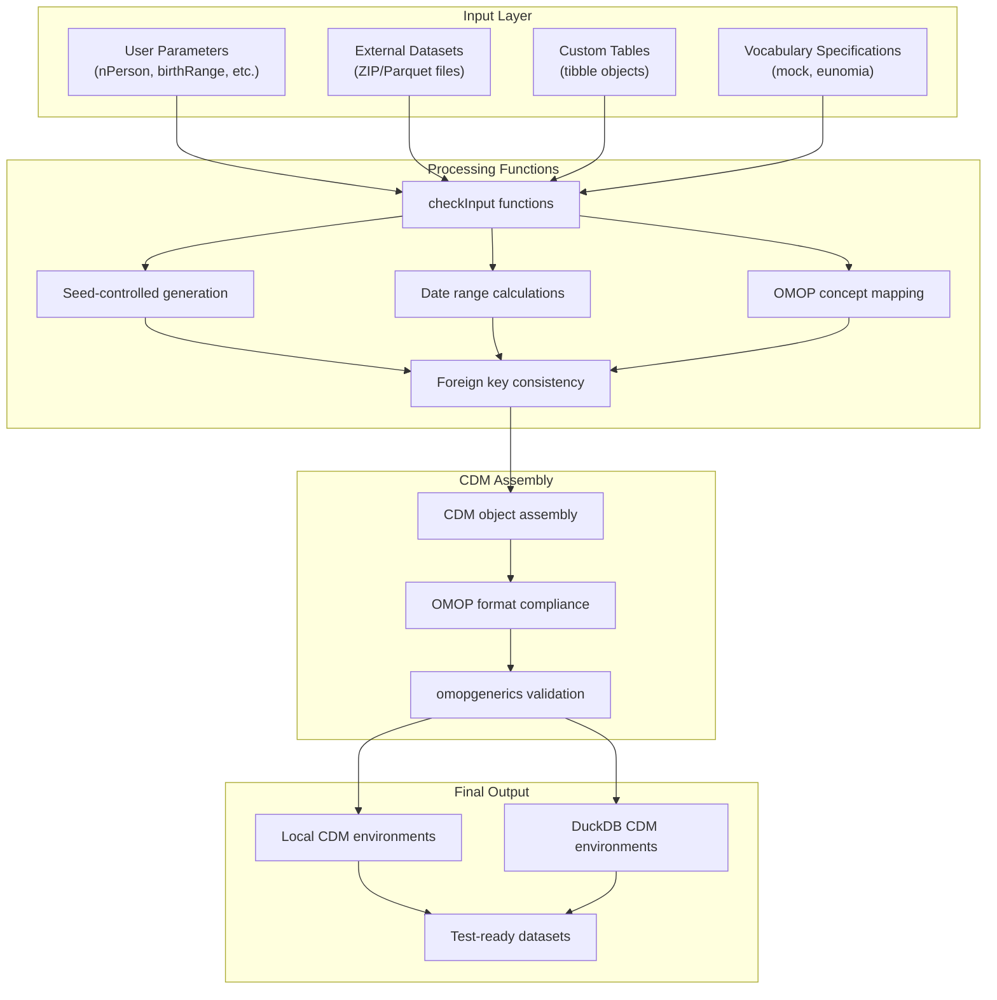

# Page: Overview

# Overview

Relevant source files

The following files were used as context for generating this wiki page:

- [DESCRIPTION](DESCRIPTION)
- [NEWS.md](NEWS.md)
- [README.Rmd](README.Rmd)
- [README.md](README.md)
- [codecov.yml](codecov.yml)
- [man/figures/README-pressure-1.png](man/figures/README-pressure-1.png)
- [paper/code.Rmd](paper/code.Rmd)
- [paper/paper.bib](paper/paper.bib)
- [paper/paper.md](paper/paper.md)

The `omock` R package provides a comprehensive framework for generating synthetic OMOP Common Data Model (CDM) data specifically designed for testing and development within the OHDSI ecosystem. This package enables developers to create reproducible, customizable mock datasets that conform to OMOP CDM standards without requiring access to real patient data.

For specific implementation details on mock data generation workflows, see [Core Mock Data Generation](#3). For information about working with predefined datasets, see [Dataset Management System](#4). For details on CDM construction approaches, see [CDM Construction Methods](#5).

## Package Architecture and Core Functions

The package is built around three primary data generation approaches, each implemented through distinct function families:

**Sources:** [DESCRIPTION:1-57](), [README.md:14-17](), [paper/paper.md:46-57]()

## Data Generation Workflow

The package implements a pipeline-friendly design where mock data generation follows a structured workflow from initialization to final CDM objects:

**Sources:** [paper/paper.md:67-85](), [README.Rmd:38-71]()

## Three Primary Generation Approaches

### 1. Population-Based Generation
Starting with `mockCdmReference()` and building up through sequential function calls using `mockPerson()`, `mockObservationPeriod()`, and clinical event functions. This approach provides maximum control over population characteristics and clinical event distributions.

### 2. Dataset-Based Generation  
Using `availableMockDatasets()` and `downloadMockDataset()` to work with predefined datasets, then creating CDM objects via `mockCdmFromDataset()`. This approach leverages curated datasets like GiBleed and Synthea data.

### 3. Table-Based Generation
Employing `mockCdmFromTables()` to create CDM objects from user-provided clinical tables, with automatic generation of consistent `person` and `observation_period` tables. This approach is optimal for unit testing with known data values.

**Sources:** [paper/paper.md:69-75](), [paper/paper.md:143-150]()

## Key Dependencies and Integration

| Dependency | Purpose | Integration Points |
|------------|---------|-------------------|
| `omopgenerics` | OMOP CDM standards and validation | `cdm_reference` objects, format validation |
| `dplyr` | Data manipulation operations | All mock generation functions |
| `arrow` | Parquet file handling | Dataset conversion and processing |
| `lubridate` | Date/time operations | Observation period and event date generation |
| `purrr` | Functional programming utilities | Batch operations and data transformations |

The package outputs `cdm_reference` objects that are compatible with the broader OHDSI ecosystem, including packages like CDMConnector, PatientProfiles, and other analysis tools that expect OMOP CDM formatted data.

**Sources:** [DESCRIPTION:28-40](), [paper/paper.md:62-65]()

## Testing and Quality Assurance Framework

The package implements comprehensive input validation through the `checkInput` function family and ensures OMOP CDM compliance through integration with `omopgenerics`. All generated mock data maintains referential integrity between tables and follows OMOP CDM column specifications and data types.

The reproducible nature of the mock data generation (controlled by seed parameters) enables reliable automated testing scenarios, making it particularly valuable for continuous integration workflows and package development in the OHDSI ecosystem.

**Sources:** [paper/paper.md:190-264](), [codecov.yml:1-15]()