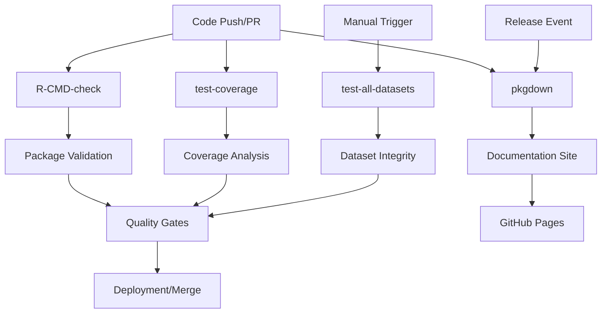
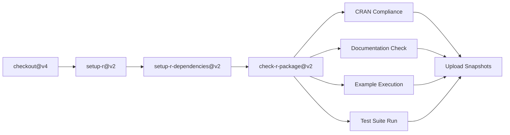
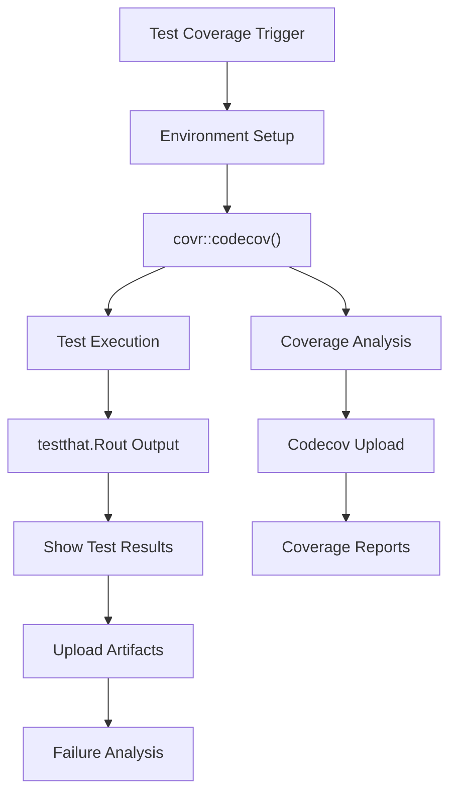
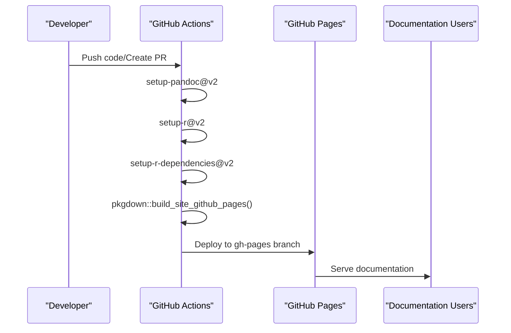
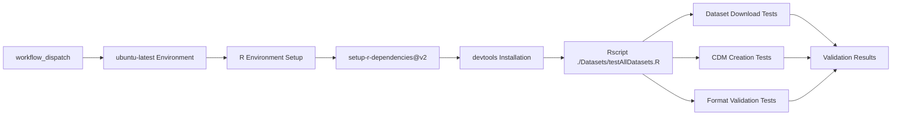
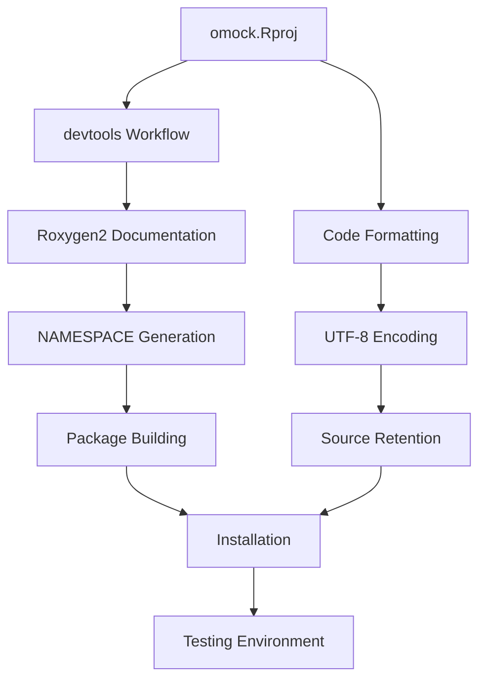

# Page: Package Development Workflow

# Package Development Workflow

Relevant source files

The following files were used as context for generating this wiki page:

- [.github/.gitignore](.github/.gitignore)
- [.github/workflows/R-CMD-check.yaml](.github/workflows/R-CMD-check.yaml)
- [.github/workflows/pkgdown.yaml](.github/workflows/pkgdown.yaml)
- [.github/workflows/test-all-datasets.yaml](.github/workflows/test-all-datasets.yaml)
- [.github/workflows/test-coverage.yaml](.github/workflows/test-coverage.yaml)
- [man/figures/logo.png](man/figures/logo.png)
- [man/mockCdmFromTables.Rd](man/mockCdmFromTables.Rd)
- [omock.Rproj](omock.Rproj)

This document describes the continuous integration, testing, and quality assurance workflows used in the omock package development process. It covers the automated systems that validate code changes, ensure package compliance, and maintain documentation quality.

For information about the testing suite organization and reverse dependency management, see [Testing and Reverse Dependencies](#8.2).

## Continuous Integration Pipeline

The omock package implements a comprehensive CI/CD pipeline using GitHub Actions to automate testing, validation, and deployment processes. The pipeline consists of four main workflows that trigger on different events.

### Core CI/CD Workflows

**CI/CD Workflow Architecture**

The pipeline automatically validates package integrity, tests functionality, measures code coverage, and generates documentation upon code changes.

Sources: [.github/workflows/R-CMD-check.yaml:1-33](), [.github/workflows/test-coverage.yaml:1-51](), [.github/workflows/pkgdown.yaml:1-49](), [.github/workflows/test-all-datasets.yaml:1-26]()

## Package Validation Workflow

The `R-CMD-check` workflow serves as the primary quality gate for the omock package, implementing standard R package validation procedures.

### R CMD Check Process

| Workflow Component | Configuration | Purpose |
|-------------------|---------------|---------|
| Trigger Events | `push`, `pull_request` on main/master | Validates all code changes |
| Environment | `ubuntu-latest`, `R_KEEP_PKG_SOURCE: yes` | Maintains source package integrity |
| Dependencies | `any::rcmdcheck` | Package checking utilities |
| Build Arguments | `--no-manual --compact-vignettes=gs+qpdf` | Optimized package building |

**R CMD Check Validation Pipeline**

The workflow ensures CRAN compliance by executing comprehensive package checks including documentation validation, example testing, and test suite execution.

Sources: [.github/workflows/R-CMD-check.yaml:9-33]()

## Test Coverage and Quality Assurance

The `test-coverage` workflow monitors code coverage using the `covr` package and uploads results to Codecov for continuous quality tracking.

### Coverage Analysis Configuration

**Test Coverage Workflow Architecture**

The coverage workflow provides detailed analysis of test completeness and automatically uploads failure artifacts for debugging.

The workflow includes specific failure handling mechanisms:
- Test output collection via `find '${{ runner.temp }}/package' -name 'testthat.Rout*'`
- Artifact upload for failed test analysis
- Coverage report generation with detailed metrics

Sources: [.github/workflows/test-coverage.yaml:29-51]()

## Documentation Generation Pipeline

The `pkgdown` workflow automatically builds and deploys the package documentation website using GitHub Pages.

### Documentation Deployment Process

| Configuration | Value | Purpose |
|--------------|-------|---------|
| Triggers | `push`, `pull_request`, `release`, `workflow_dispatch` | Comprehensive documentation updates |
| Concurrency Control | `pkgdown-${{ github.event_name != 'pull_request' }}` | Prevents deployment conflicts |
| Permissions | `contents: write` | GitHub Pages deployment access |
| Deployment Target | `gh-pages` branch | Standard GitHub Pages configuration |

**Documentation Generation Sequence**

The workflow builds comprehensive package documentation including function references, vignettes, and examples, then deploys to GitHub Pages for public access.

Sources: [.github/workflows/pkgdown.yaml:38-49]()

## Dataset Validation Framework

The `test-all-datasets` workflow provides manual validation of all available mock datasets to ensure data integrity and compatibility.

### Dataset Testing Architecture

**Dataset Validation Testing Flow**

This manual workflow validates the integrity and functionality of all predefined datasets available through the omock package, ensuring dataset download, format conversion, and CDM creation processes work correctly.

Sources: [.github/workflows/test-all-datasets.yaml:8-26]()

## Development Environment Configuration

The package development environment is configured through the `omock.Rproj` file, which establishes standardized development settings and build parameters.

### R Project Configuration

| Setting | Value | Purpose |
|---------|-------|---------|
| `BuildType` | `Package` | Enables R package development mode |
| `PackageUseDevtools` | `Yes` | Integrates devtools development workflow |
| `PackageInstallArgs` | `--no-multiarch --with-keep.source` | Optimized installation parameters |
| `PackageRoxygenize` | `rd,collate,namespace,vignette` | Automated documentation generation |
| `UseSpacesForTab` | `Yes` (2 spaces) | Code formatting consistency |
| `Encoding` | `UTF-8` | Character encoding standardization |

### Development Workflow Integration

**Development Environment Configuration Flow**

The R project configuration ensures consistent development practices, automated documentation generation, and standardized package building across all development environments.

Sources: [omock.Rproj:18-22]()