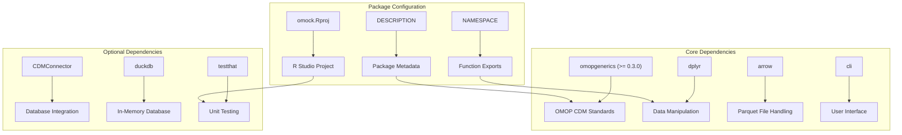
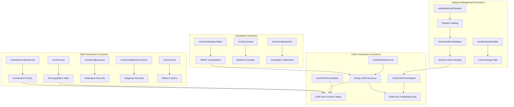
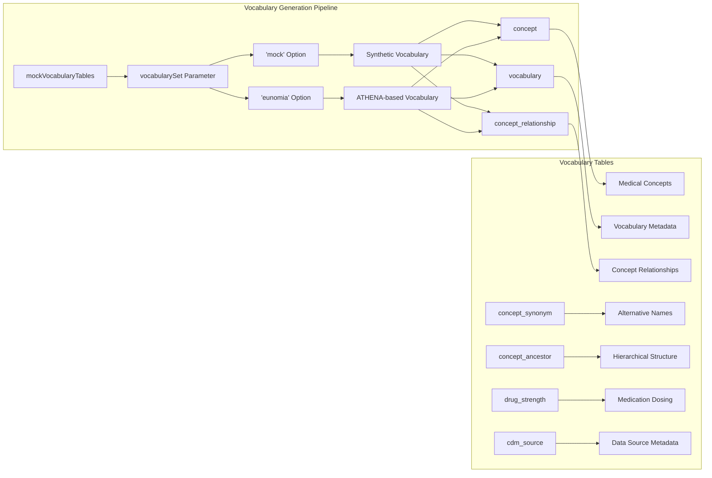
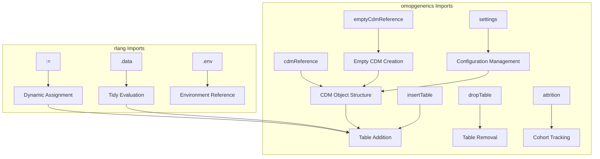

# Page: Package Structure and Dependencies

# Package Structure and Dependencies

Relevant source files

The following files were used as context for generating this wiki page:

- [DESCRIPTION](DESCRIPTION)
- [NAMESPACE](NAMESPACE)
- [NEWS.md](NEWS.md)
- [R/mockVocabulary.R](R/mockVocabulary.R)
- [man/mockCdmFromTables.Rd](man/mockCdmFromTables.Rd)
- [omock.Rproj](omock.Rproj)
- [tests/testthat/test-mockVocabularyTables.R](tests/testthat/test-mockVocabularyTables.R)

This document provides a comprehensive overview of the omock R package architecture, including its core dependencies, exported functions, and internal organization. The omock package is designed to create mock OMOP Common Data Model (CDM) data for testing and development purposes within the OHDSI ecosystem.

For information about specific mock data generation workflows, see [Core Mock Data Generation](#3). For dataset management capabilities, see [Dataset Management System](#4).

## Package Overview

The omock package follows a modular architecture organized around three primary approaches to CDM generation: population-based generation, dataset-based generation, and table-based generation. The package maintains strict compatibility with OMOP CDM standards through the `omopgenerics` dependency.

### Package Metadata and Configuration

Sources: [DESCRIPTION:1-57](), [NAMESPACE:1-49](), [omock.Rproj:1-22]()

## Core Dependencies

The package maintains a focused dependency structure centered around data manipulation, OMOP standards compliance, and file handling capabilities.

| Dependency Category | Package | Version Requirement | Purpose |
|-------------------|---------|-------------------|---------|
| **Core Standards** | omopgenerics | >= 0.3.0 | OMOP CDM validation and structure |
| **Data Manipulation** | dplyr | - | Data frame operations |
| **Data Manipulation** | purrr | - | Functional programming utilities |
| **Data Manipulation** | rlang | - | Non-standard evaluation |
| **File Handling** | arrow | - | Parquet file reading/writing |
| **File Handling** | readr | - | CSV file operations |
| **Utilities** | cli | - | Command-line interface messaging |
| **Utilities** | lubridate | - | Date/time manipulation |
| **Utilities** | snakecase | - | String case conversion |

Sources: [DESCRIPTION:28-40]()

## Exported Function Architecture

The package exports 27 core functions organized into functional categories, each serving specific aspects of CDM mock data generation.

Sources: [NAMESPACE:3-33]()

## Function Categories and Responsibilities

### Core CDM Construction

The package provides three primary entry points for CDM creation:

- `mockCdmReference()`: Creates empty CDM structure with basic person and observation_period tables
- `mockCdmFromTables()`: Constructs CDM from user-provided tables with automatic person/observation_period generation
- `mockCdmFromDataset()`: Builds CDM from predefined datasets (GiBleed, synthea, etc.)

### Individual Table Generators

| Function Pattern | Purpose | Output Table |
|-----------------|---------|--------------|
| `mockPerson()` | Generate demographics | person |
| `mockObservationPeriod()` | Create enrollment periods | observation_period |  
| `mockDrugExposure()` | Generate medication records | drug_exposure |
| `mockConditionOccurrence()` | Create diagnosis records | condition_occurrence |
| `mockMeasurement()` | Generate lab/vital signs | measurement |
| `mockObservation()` | Create observation records | observation |
| `mockProcedureOccurrence()` | Generate procedure records | procedure_occurrence |
| `mockVisitOccurrence()` | Create healthcare visits | visit_occurrence |
| `mockDeath()` | Generate mortality records | death |
| `mockCohort()` | Create patient cohorts | cohort |

Sources: [NAMESPACE:18-30]()

### Vocabulary Management System

Sources: [R/mockVocabulary.R:52-125](), [tests/testthat/test-mockVocabularyTables.R:1-200]()

## Import Structure and External Integration

The package leverages selective imports from key dependencies to maintain a clean namespace while providing comprehensive functionality.

### omopgenerics Integration

The package imports core CDM functionality from `omopgenerics`:

Sources: [NAMESPACE:35-48]()

### Development Dependencies

Optional dependencies support development, testing, and extended functionality:

| Package | Purpose | Usage Context |
|---------|---------|---------------|
| CDMConnector | Database connectivity | CDM object creation with remote databases |
| DBI | Database interface | Low-level database operations |
| duckdb | In-memory database | Fast local CDM testing |
| testthat | Unit testing | Package validation and quality assurance |
| knitr | Documentation | Vignette generation |
| rmarkdown | Documentation | Report generation |
| ggplot2 | Visualization | Data exploration and validation plots |

Sources: [DESCRIPTION:41-48]()

## Package Structure Summary

The omock package maintains a clean, modular architecture focused on three core competencies:

1. **Mock Data Generation**: Systematic creation of realistic OMOP CDM tables
2. **Dataset Management**: Handling of predefined datasets and format conversion
3. **OMOP Compliance**: Strict adherence to CDM standards through omopgenerics integration

The package design prioritizes reproducibility through seed-based generation, performance through efficient data structures, and usability through pipeline-friendly function design.

Sources: [DESCRIPTION:1-57](), [NAMESPACE:1-49](), [man/mockCdmFromTables.Rd:1-63]()