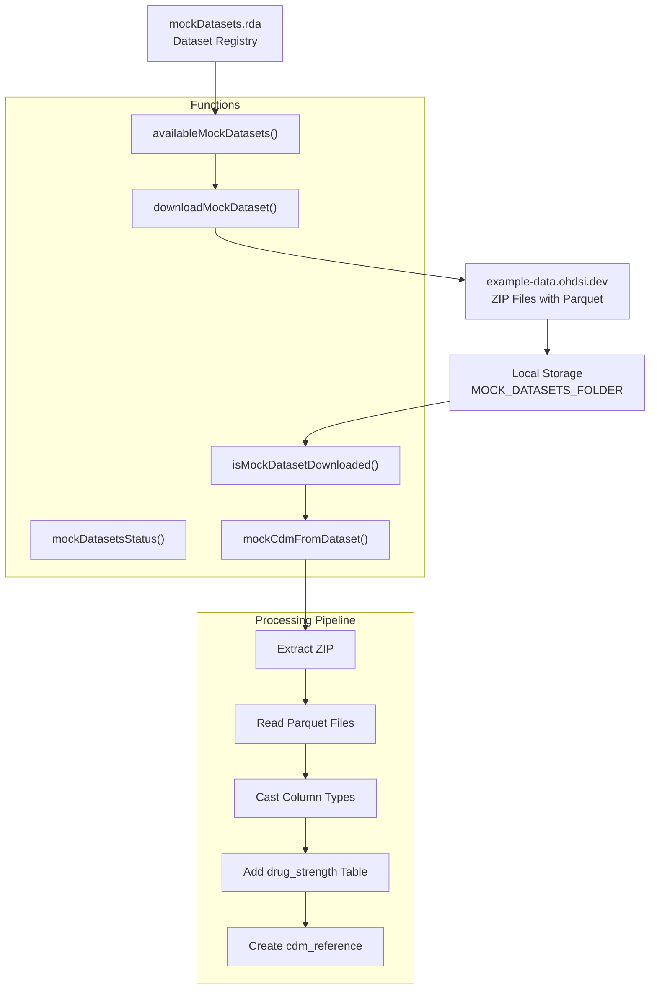
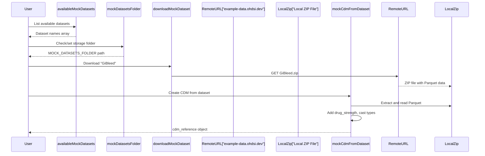

# Page: Predefined Datasets

# Predefined Datasets

<details>
<summary>Relevant source files</summary>

The following files were used as context for generating this wiki page:

- [.github/workflows/test-all-datasets.yaml](.github/workflows/test-all-datasets.yaml)
- [Datasets/testAllDatasets.R](Datasets/testAllDatasets.R)
- [R/mockDatasets.R](R/mockDatasets.R)
- [R/sysdata.rda](R/sysdata.rda)
- [data-raw/internalData.R](data-raw/internalData.R)
- [data/mockDatasets.rda](data/mockDatasets.rda)

</details>


This section covers the predefined mock OMOP CDM datasets available in the omock package. These datasets provide ready-to-use synthetic clinical data for testing and development purposes without requiring manual data generation. The datasets are hosted remotely and can be downloaded and converted to CDM objects on demand.

For information about creating CDM objects from custom user-provided tables, see [Building CDM from Custom Tables](#5.1). For details on data format conversion processes, see [Data Format Conversion](#4.2).

## Available Dataset Registry

The omock package maintains a registry of predefined datasets in the `mockDatasets` data object. Each dataset includes metadata about its source, CDM version, and download location.

| Dataset Family | Examples | CDM Version | Source |
|---|---|---|---|
| **GiBleed** | GiBleed | 5.3 | OHDSI example data |
| **Synthea** | synthea-allergies-10k, synthea-covid19-10k, synthea-breast_cancer-10k | 5.3 | Synthetic patient data |
| **SynPUF** | synpuf-1k_5.3, synpuf-1k_5.4 | 5.3, 5.4 | CMS synthetic public use files |
| **Empty CDM** | empty_cdm | 5.3 | Minimal structure for testing |

The complete registry is defined in [data-raw/internalData.R:170-196]() and contains over 20 predefined datasets covering various medical conditions and use cases.

**Sources:** [data-raw/internalData.R:170-196](), [R/mockDatasets.R:143-161]()

## Dataset Management Architecture



**Sources:** [R/mockDatasets.R:19-87](), [R/mockDatasets.R:271-273]()

## Dataset Download and Storage Workflow



**Sources:** [R/mockDatasets.R:183-232](), [R/mockDatasets.R:19-87](), [R/mockDatasets.R:312-340]()

## Core Dataset Functions

### Dataset Discovery and Status

The package provides several functions for discovering and managing predefined datasets:

- `availableMockDatasets()` - Returns character vector of available dataset names from the registry
- `mockDatasetsStatus()` - Shows download status of all datasets with checkmarks or X marks
- `isMockDatasetDownloaded()` - Checks if a specific dataset exists locally

### Dataset Retrieval

- `downloadMockDataset(datasetName, path, overwrite)` - Downloads dataset ZIP from remote URL to local storage
- `mockDatasetsFolder(path)` - Gets or sets the `MOCK_DATASETS_FOLDER` environment variable for local storage

### CDM Object Creation

- `mockCdmFromDataset(datasetName, source)` - Primary function that creates a `cdm_reference` object from a predefined dataset

The creation process involves:
1. Validating dataset name against registry [R/mockDatasets.R:22-25]()
2. Ensuring dataset is available locally [R/mockDatasets.R:28]()
3. Extracting ZIP file to temporary directory [R/mockDatasets.R:31-40]()
4. Reading Parquet files and casting column types [R/mockDatasets.R:88-104]()
5. Adding `drug_strength` table from external source [R/mockDatasets.R:46-61]()
6. Creating final `cdm_reference` with `omopgenerics::cdmFromTables()` [R/mockDatasets.R:64]()

**Sources:** [R/mockDatasets.R:271-273](), [R/mockDatasets.R:285-295](), [R/mockDatasets.R:252-259](), [R/mockDatasets.R:183-232](), [R/mockDatasets.R:312-340](), [R/mockDatasets.R:19-87]()

## Dataset Processing Pipeline

### Data Format Handling

The system processes datasets through several transformation steps:

1. **Parquet Reading**: Uses `arrow::read_parquet()` to read compressed Parquet files [R/mockDatasets.R:99]()
2. **Column Casting**: Applies OMOP CDM field specifications via `castColumns()` function [R/mockDatasets.R:101]()
3. **Drug Strength Integration**: Special handling for drug_strength table, either from Eunomia data or downloaded separately [R/mockDatasets.R:47-61]()

### Output Formats

The `mockCdmFromDataset()` function supports two output formats:
- **Local**: Returns in-memory `cdm_reference` object (default)
- **DuckDB**: Inserts data into DuckDB database for larger datasets [R/mockDatasets.R:66-84]()

**Sources:** [R/mockDatasets.R:88-104](), [R/mockDatasets.R:378-402](), [R/mockDatasets.R:66-84]()

## Example Usage Patterns

### Basic Dataset Usage
```r
# List available datasets
datasets <- availableMockDatasets()

# Download and create CDM
cdm <- mockCdmFromDataset(datasetName = "GiBleed")

# Check status of all datasets  
mockDatasetsStatus()
```

### Dataset Management
```r
# Set custom storage location
mockDatasetsFolder("/path/to/datasets")

# Check if dataset is downloaded
if (!isMockDatasetDownloaded("GiBleed")) {
  downloadMockDataset("GiBleed")
}

# Create DuckDB-backed CDM for large datasets
cdm <- mockCdmFromDataset("synthea-covid19-200k", source = "duckdb")
```

The predefined datasets provide a convenient way to quickly obtain realistic OMOP CDM data for testing analytical workflows, package development, and educational purposes without the complexity of generating synthetic data from scratch.

**Sources:** [R/mockDatasets.R:11-18](), [Datasets/testAllDatasets.R:1-13]()