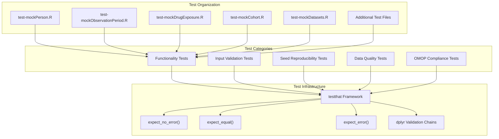
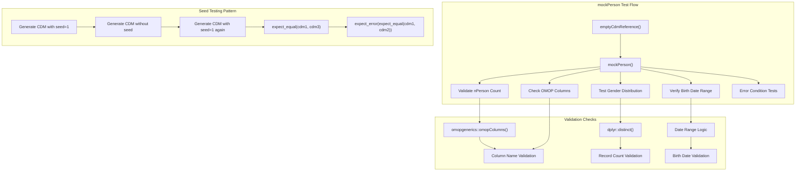
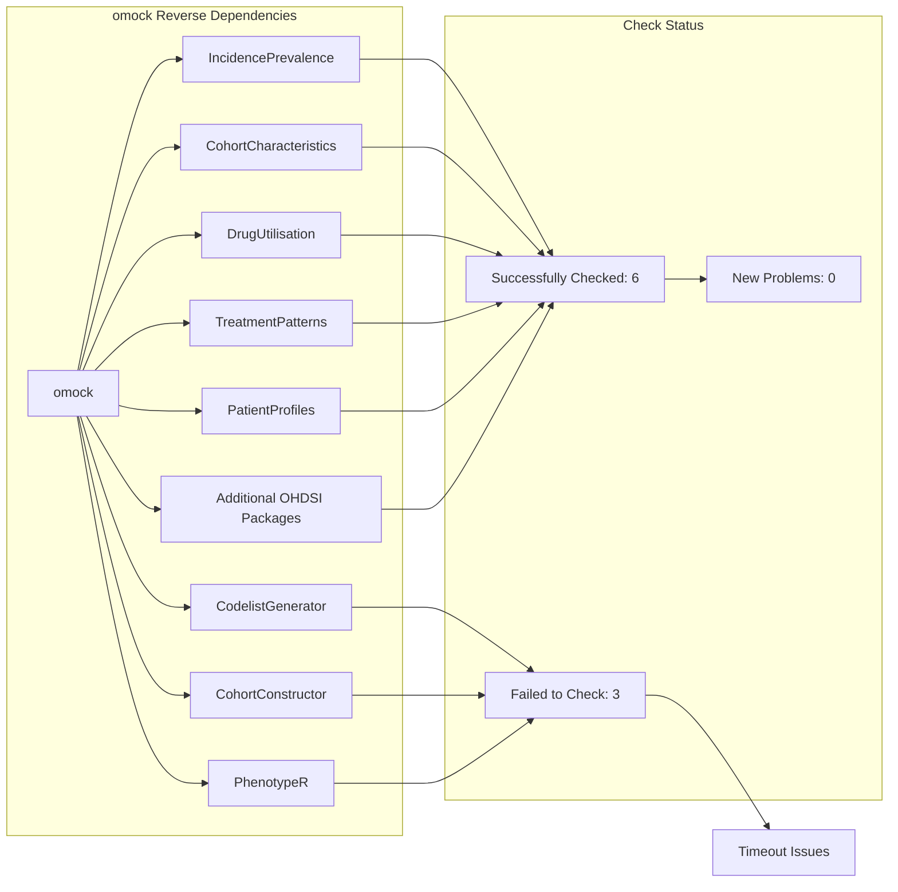
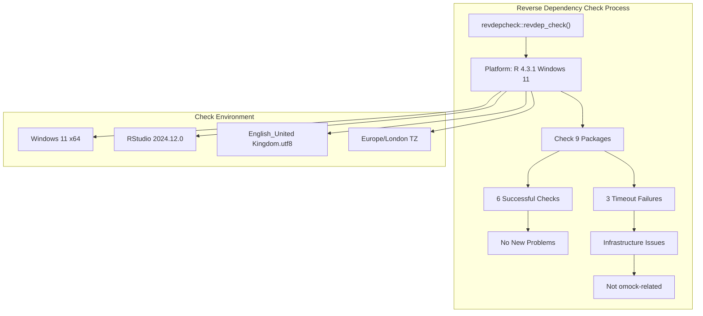
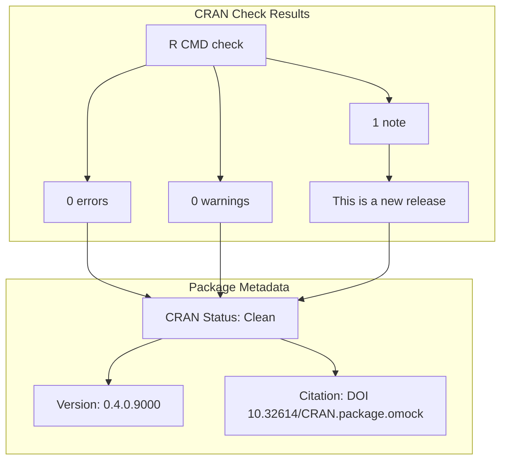
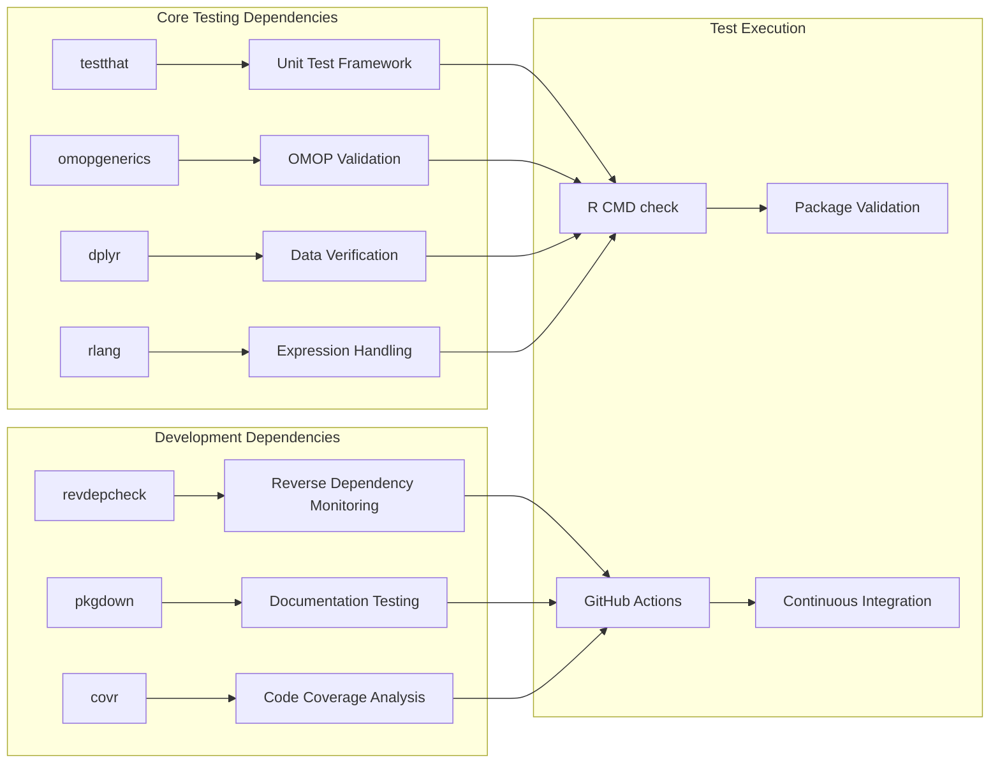

# Page: Testing and Reverse Dependencies

# Testing and Reverse Dependencies

Relevant source files

The following files were used as context for generating this wiki page:

- [cran-comments.md](cran-comments.md)
- [inst/CITATION](inst/CITATION)
- [revdep/.gitignore](revdep/.gitignore)
- [revdep/README.md](revdep/README.md)
- [revdep/cran.md](revdep/cran.md)
- [revdep/failures.md](revdep/failures.md)
- [revdep/problems.md](revdep/problems.md)
- [tests/testthat/test-mockObservationPeriod.R](tests/testthat/test-mockObservationPeriod.R)
- [tests/testthat/test-mockPerson.R](tests/testthat/test-mockPerson.R)

This page documents the testing infrastructure, reverse dependency management, and CRAN submission process for the omock package. It covers the test suite organization, automated reverse dependency checking workflows, and the current status of dependent packages in the OHDSI ecosystem.

For information about the CI/CD workflows and package validation processes, see [Package Development Workflow](#8.1).

## Test Suite Architecture

The omock package uses the `testthat` framework for comprehensive unit testing. The test suite is organized around individual mock generation functions, with emphasis on reproducibility, input validation, and OMOP CDM compliance.

Sources: [tests/testthat/test-mockPerson.R:1-99](), [tests/testthat/test-mockObservationPeriod.R:1-42]()

## Test Patterns and Validation Strategies

The test suite follows consistent patterns across all mock generation functions, emphasizing data integrity and reproducible behavior.

| Test Pattern | Purpose | Example Implementation |
|--------------|---------|----------------------|
| Basic Functionality | Verify core function behavior | `expect_no_error()` with parameter validation |
| Input Validation | Test parameter boundary conditions | Error checking for invalid `nPerson`, `birthRange` |
| Seed Reproducibility | Ensure deterministic output | Compare outputs with same seed values |
| OMOP Compliance | Validate CDM table structure | Check column names against `omopgenerics::omopColumns()` |
| Data Relationships | Verify table linkages | Validate foreign key consistency between tables |

Sources: [tests/testthat/test-mockPerson.R:88-98](), [tests/testthat/test-mockObservationPeriod.R:28-41]()

## Reverse Dependency Management

The omock package uses `revdepcheck` to monitor its impact on downstream packages in the OHDSI ecosystem. This automated process checks 9 reverse dependencies to ensure package updates don't break dependent functionality.

Sources: [revdep/cran.md:1-15](), [revdep/README.md:63-73]()

## Reverse Dependency Check Results

The latest reverse dependency check shows a clean status with no new problems introduced by omock updates.

| Package | Version | Status | Issues |
|---------|---------|--------|--------|
| CodelistGenerator | 3.5.0 | Failed | R CMD check timeout |
| CohortConstructor | 0.5.0 | Failed | R CMD check timeout |
| PhenotypeR | 0.2.0 | Failed | R CMD check timeout |
| IncidencePrevalence | Latest | Passed | None |
| CohortCharacteristics | Latest | Passed | None |
| DrugUtilisation | Latest | Passed | None |

Sources: [revdep/README.md:1-17](), [revdep/failures.md:17-70](), [revdep/problems.md:1-1]()

## CRAN Submission Status

The omock package maintains clean CRAN submission status with minimal notes and no errors or warnings.

Sources: [cran-comments.md:1-6](), [revdep/README.md:20-22](), [inst/CITATION:1-11]()

## Testing Infrastructure Dependencies

The testing ecosystem relies on several key dependencies that ensure comprehensive validation and reproducible test execution.

| Dependency | Version | Purpose |
|------------|---------|---------|
| testthat | Latest | Unit testing framework |
| omopgenerics | 1.3.0 | OMOP CDM compliance validation |
| dplyr | 1.1.4 | Data manipulation in tests |
| rlang | 1.1.5 | Expression evaluation |
| revdepcheck | Latest | Reverse dependency monitoring |

Sources: [revdep/README.md:18-62]()