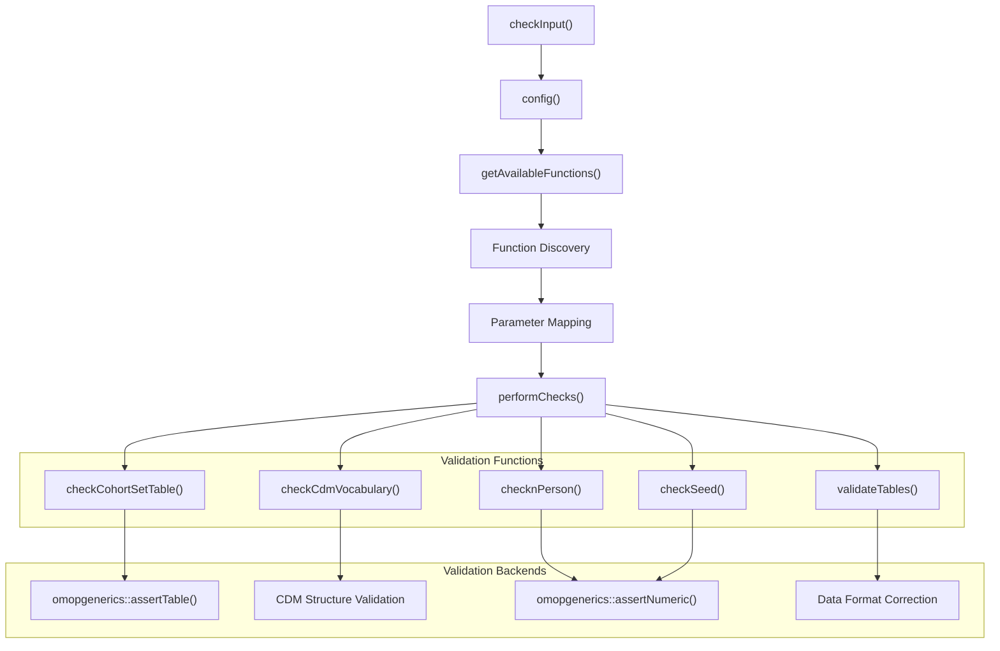
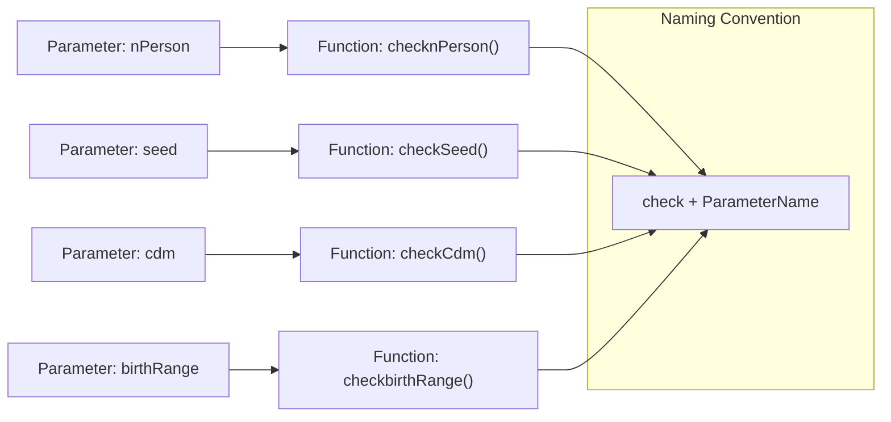
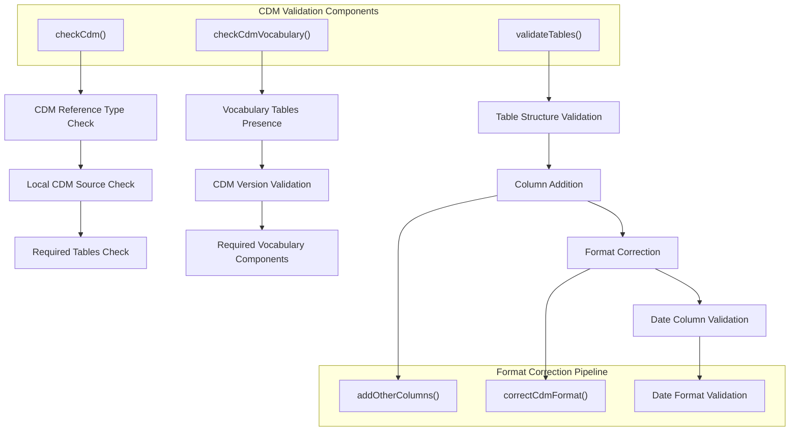
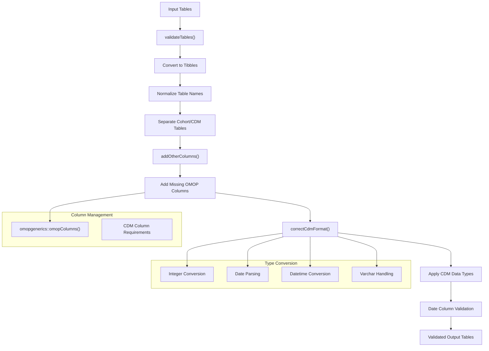
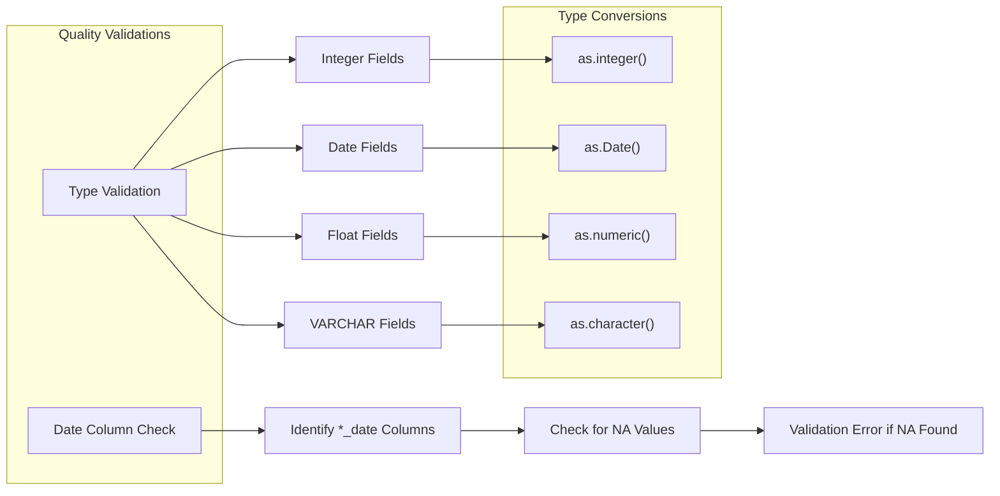
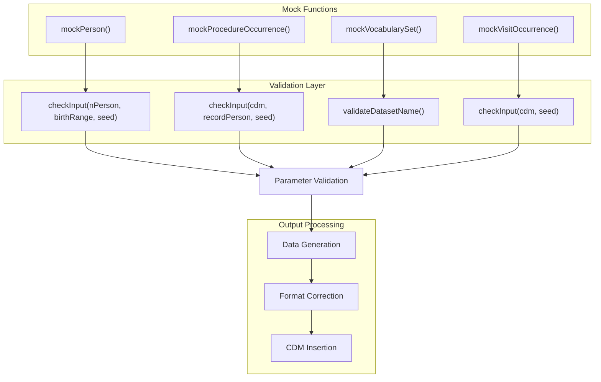
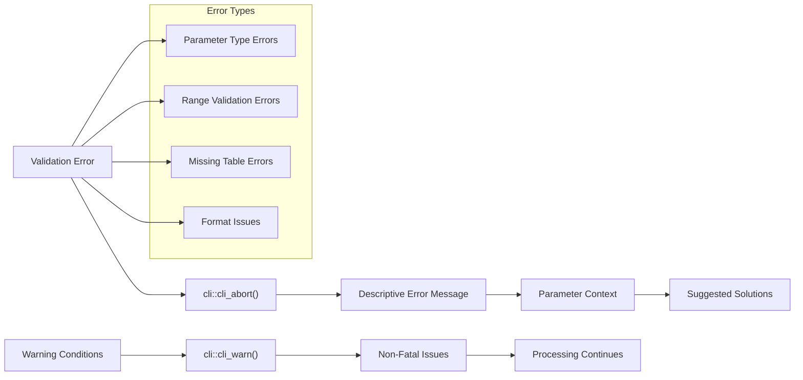

# Page: Validation and Quality Assurance

# Validation and Quality Assurance

Relevant source files

The following files were used as context for generating this wiki page:

- [R/checkInputs.R](R/checkInputs.R)
- [R/checks.R](R/checks.R)
- [R/mockProcedureOccurrence.R](R/mockProcedureOccurrence.R)
- [R/mockVisitOccurrence.R](R/mockVisitOccurrence.R)
- [R/mockVocabularySet.R](R/mockVocabularySet.R)
- [man/mockProcedureOccurrence.Rd](man/mockProcedureOccurrence.Rd)
- [man/mockVocabularySet.Rd](man/mockVocabularySet.Rd)
- [tests/testthat/test-mockVocabularySet.R](tests/testthat/test-mockVocabularySet.R)

This document covers the comprehensive validation and quality assurance systems within the omock package. The validation framework ensures that all mock data generation produces OMOP CDM-compliant outputs while providing robust input parameter checking and data format validation.

For information about mock data generation workflows, see [Core Mock Data Generation](#3). For details about CDM construction methods, see [CDM Construction Methods](#5).

## Input Validation System

The omock package implements a sophisticated input validation system centered around the `checkInput` function, which provides dynamic parameter validation based on naming conventions and function signatures.

### Validation Architecture

The validation system operates through a multi-layered approach where validation functions are automatically discovered and applied based on parameter names.

**Validation Flow Process**

Sources: [R/checkInputs.R:20-33](), [R/checkInputs.R:35-93](), [R/checkInputs.R:126-158]()

The `checkInput` function serves as the central validation dispatcher. It takes named parameters and automatically determines which validation functions to apply based on the parameter names. The `config` function discovers available validation functions by scanning both the omock namespace and the calling package's namespace.

### Dynamic Function Discovery

The validation system automatically discovers check functions using a naming convention where validation functions begin with "check" followed by the parameter name (with appropriate case conversion).

**Function Discovery and Mapping**

Sources: [R/checkInputs.R:126-158](), [R/checkInputs.R:164-186]()

The `getAvailableFunctions` function scans available namespaces for functions beginning with "check" and maps them to corresponding parameter names. The `addArgument` function analyzes function signatures to determine required and optional arguments for validation configuration.

## Core Validation Functions

The package provides specific validation functions for different data types and CDM components, each implementing domain-specific validation logic.

### CDM Structure Validation

**CDM and Vocabulary Validation**

Sources: [R/checks.R:135-158](), [R/checks.R:44-64](), [R/checks.R:235-270]()

The `checkCdm` function validates that CDM objects are proper `cdm_reference` instances with local sources. The `checkCdmVocabulary` function ensures vocabulary tables contain required components for OMOP CDM versions 5.3 or 5.4. The `validateTables` function handles comprehensive table validation including structure, format, and data quality checks.

### Parameter-Specific Validation

Individual validation functions handle specific parameter types with appropriate constraints and format requirements.

| Validation Function | Parameter Type | Key Validations |
|-------------------|----------------|----------------|
| `checknPerson` | Integer | Minimum 1, length 1, integerish |
| `checkbirthRange` | Date vector | Length 2, proper date range |
| `checkSeed` | Integer | Minimum 1, length 1, nullable |
| `checkrecordPerson` | Numeric | Minimum 0.01, non-integerish |
| `checknumberCohorts` | Integer | Minimum 1, integerish |
| `checkgenderSplit` | Numeric | Range 0-1, non-integerish |

Sources: [R/checks.R:167-170](), [R/checks.R:173-179](), [R/checks.R:105-114](), [R/checks.R:187-191](), [R/checks.R:194-198](), [R/checks.R:216-220]()

## Data Format Validation and Correction

The validation system includes comprehensive data format correction to ensure all generated data conforms to OMOP CDM specifications.

### Format Correction Pipeline

**Table Processing and Format Correction**

Sources: [R/checkInputs.R:235-270](), [R/checkInputs.R:193-204](), [R/checkInputs.R:210-247]()

The `validateTables` function processes input tables through multiple stages: tibble conversion, name normalization, cohort/CDM table separation, and format correction. The `addOtherColumns` function adds missing OMOP-required columns, while `correctCdmFormat` ensures proper data types according to CDM specifications.

### Data Quality Checks

The validation system implements specific data quality checks to prevent common data issues.

**Data Quality Enforcement**

Sources: [R/checkInputs.R:252-267](), [R/checkInputs.R:218-244]()

The validation system checks for missing values in date columns and enforces proper data types. Date columns cannot contain NA values, and all fields must conform to their specified CDM data types through automatic conversion.

## Integration with Mock Data Generation

The validation system integrates seamlessly into all mock data generation functions, providing consistent parameter validation and output quality assurance.

### Validation Integration Pattern

Mock data generation functions follow a consistent pattern of calling `checkInput` with their parameters before proceeding with data generation.

**Validation Integration Examples**

Sources: [R/mockProcedureOccurrence.R:53-57](), [R/mockVisitOccurrence.R:14-17]()

Mock data generation functions consistently call `checkInput` with their parameters as the first step. This ensures that all inputs are validated before any processing begins, providing immediate feedback for invalid parameters and preventing downstream errors.

### Error Handling and User Feedback

The validation system provides clear, actionable error messages through the `cli` package integration, helping users understand and correct input issues.

**Error Message System**

Sources: [R/checks.R:55-62](), [R/checks.R:141-146](), [R/mockVisitOccurrence.R:34-36]()

The validation system uses structured error messages that include context about the failing parameter, the expected format or range, and guidance for correction. Warning messages are used for non-fatal issues that don't prevent processing but may indicate suboptimal conditions.