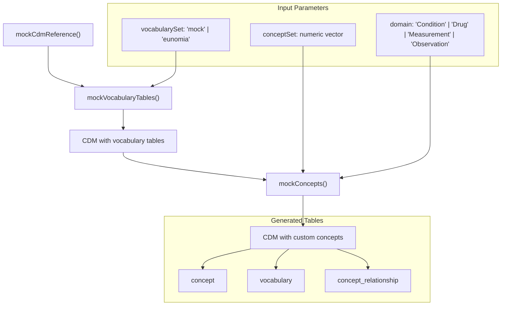
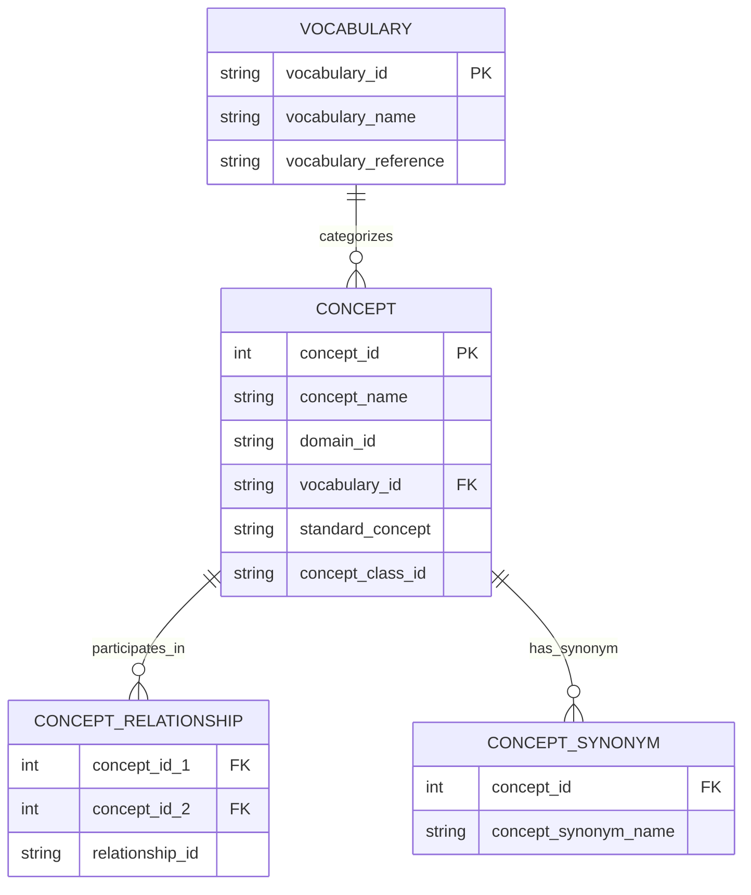
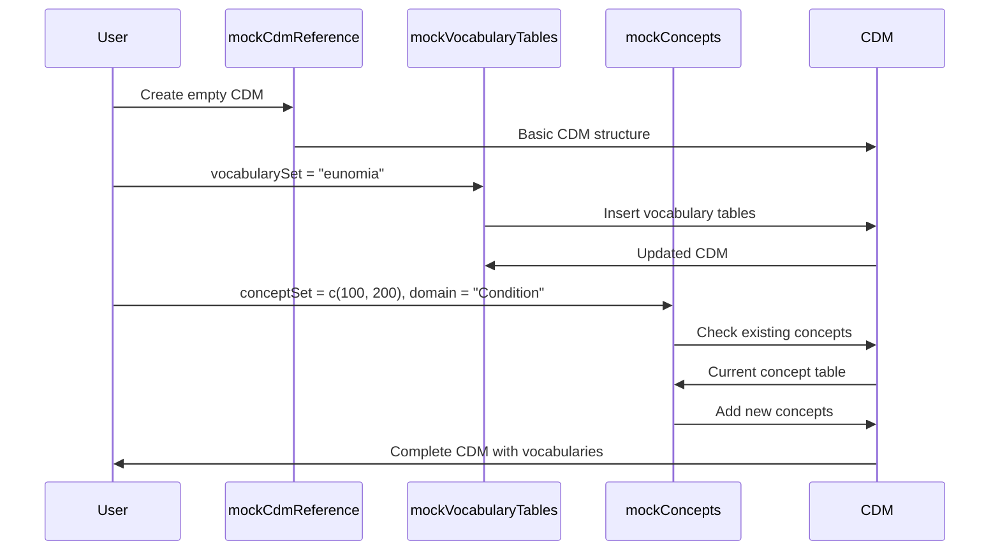
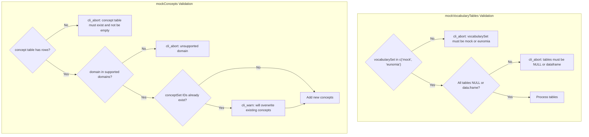

# Page: Vocabulary Sets and Concepts

# Vocabulary Sets and Concepts

<details>
<summary>Relevant source files</summary>

The following files were used as context for generating this wiki page:

- [NAMESPACE](NAMESPACE)
- [R/mockConcept.R](R/mockConcept.R)
- [R/mockVocabulary.R](R/mockVocabulary.R)
- [data-raw/default/concept.csv](data-raw/default/concept.csv)
- [data-raw/default/conceptAncestor.csv](data-raw/default/conceptAncestor.csv)
- [data-raw/default/conceptRelationship.csv](data-raw/default/conceptRelationship.csv)
- [data-raw/default/conceptSynonym.csv](data-raw/default/conceptSynonym.csv)
- [data-raw/default/drugStrength.csv](data-raw/default/drugStrength.csv)
- [man/mockConcepts.Rd](man/mockConcepts.Rd)
- [tests/testthat/test-mockConcepts.R](tests/testthat/test-mockConcepts.R)
- [tests/testthat/test-mockVocabularyTables.R](tests/testthat/test-mockVocabularyTables.R)

</details>


This page covers the vocabulary and concept management system within omock, which provides standardized medical terminology and concept definitions for mock OMOP CDM databases. The system supports creating vocabulary tables with predefined concept sets and adding custom medical concepts to existing CDM objects.

For information about generating complete CDM objects, see [CDM Construction Methods](#5).

## Vocabulary Sets Overview

The omock package supports two primary vocabulary sets that determine the medical terminology available in mock CDM databases:

```mermaid
graph TB
    subgraph "Vocabulary System"
        VS["`vocabularySet Parameter`"]
        M["`mock`"]
        E["`eunomia`"]
        
        VS --> M
        VS --> E
        
        M --> MC["`Small synthetic vocabulary`<br/>Suitable for basic tests"]
        E --> EC["`Real ATHENA vocabularies`<br/>From Eunomia database"]
        
        MC --> MVT["`mockVocabularyTables()`"]
        EC --> MVT
        
        MVT --> CDM["`CDM with vocabulary tables`"]
    end
    
    subgraph "Vocabulary Tables"
        CDM --> CS["`cdm_source`"]
        CDM --> C["`concept`"]
        CDM --> V["`vocabulary`"]
        CDM --> CR["`concept_relationship`"]
        CDM --> CSyn["`concept_synonym`"]
        CDM --> CA["`concept_ancestor`"]
        CDM --> DS["`drug_strength`"]
    end
```

**Sources**: [R/mockVocabulary.R:8-18](), [R/mockVocabulary.R:76-78]()

## Core Functions and Components

The vocabulary system centers on two primary functions that handle different aspects of concept management:

| Function | Purpose | Input Requirements |
|----------|---------|-------------------|
| `mockVocabularyTables()` | Creates complete vocabulary table set | CDM reference, vocabulary set choice |
| `mockConcepts()` | Adds custom concepts to existing tables | CDM with concept table, concept IDs, domain |



**Sources**: [R/mockVocabulary.R:52-125](), [R/mockConcept.R:45-132]()

## Vocabulary Table Generation Process

The `mockVocabularyTables()` function implements a dynamic table generation system that loads predefined data based on the selected vocabulary set:

```mermaid
graph LR
    subgraph "Table Generation Logic"
        INPUT["`User Input Tables`"] --> CHECK{"`Table provided?`"}
        CHECK -->|Yes| USE["`Use provided table`"]
        CHECK -->|No| GEN["`Generate from vocabularySet`"]
        
        GEN --> CONSTRUCT["`Construct table name:`<br/>`vocabularySet + TableName`"]
        CONSTRUCT --> EVAL["`eval(parse(text = tableName))`"]
        EVAL --> FORMAT["`addOtherColumns()`<br/>`correctCdmFormat()`"]
        FORMAT --> INSERT["`insertTable()`"]
        INSERT --> CDM["`Updated CDM`"]
        
        USE --> INSERT
    end
    
    subgraph "Example Table Names"
        MOCK_CONCEPT["`mockConcept`"]
        EUNOMIA_CONCEPT["`eunomiaConcept`"]
        MOCK_VOCAB["`mockVocabulary`"]
        EUNOMIA_VOCAB["`eunomiaVocabulary`"]
    end
    
    CONSTRUCT --> MOCK_CONCEPT
    CONSTRUCT --> EUNOMIA_CONCEPT
    CONSTRUCT --> MOCK_VOCAB
    CONSTRUCT --> EUNOMIA_VOCAB
```

**Sources**: [R/mockVocabulary.R:94-111](), [R/mockVocabulary.R:115-122]()

## Custom Concept Addition

The `mockConcepts()` function provides domain-specific concept generation with automatic vocabulary assignment:

```mermaid
flowchart TB
    subgraph "Domain-Specific Generation"
        DOMAIN["`domain parameter`"]
        DOMAIN --> CONDITION["`'Condition'`"]
        DOMAIN --> DRUG["`'Drug'`"]
        DOMAIN --> MEASUREMENT["`'Measurement'`"]
        DOMAIN --> OBSERVATION["`'Observation'`"]
        
        CONDITION --> CV["`vocabulary_id: 'SNOMED'`<br/>`concept_class_id: 'Clinical Finding'`<br/>`concept_name: 'Condition_' + conceptId`"]
        DRUG --> DV["`vocabulary_id: 'RxNorm'`<br/>`concept_class_id: 'Drug'`<br/>`concept_name: 'Drug_' + conceptId`"]
        MEASUREMENT --> MV["`vocabulary_id: 'RxNorm'`<br/>`concept_class_id: 'Measurement'`<br/>`concept_name: 'Measurement_' + conceptId`"]
        OBSERVATION --> OV["`vocabulary_id: 'LOINC'`<br/>`concept_class_id: 'Observation'`<br/>`concept_name: 'Observation_' + conceptId`"]
    end
    
    subgraph "Concept Generation"
        CV --> TABLE["`Generate concept tibble`"]
        DV --> TABLE
        MV --> TABLE
        OV --> TABLE
        
        TABLE --> APPEND["`dplyr::add_row()`"]
        APPEND --> UPDATED["`Updated concept table`"]
    end
```

**Sources**: [R/mockConcept.R:85-127]()

## Vocabulary Data Structures

The vocabulary system relies on interconnected tables that follow OMOP CDM standards:

### Core Vocabulary Tables

| Table | Key Columns | Purpose |
|-------|-------------|---------|
| `concept` | `concept_id`, `concept_name`, `domain_id`, `vocabulary_id` | Central concept definitions |
| `vocabulary` | `vocabulary_id`, `vocabulary_name` | Vocabulary metadata |
| `concept_relationship` | `concept_id_1`, `concept_id_2`, `relationship_id` | Inter-concept relationships |
| `concept_synonym` | `concept_id`, `concept_synonym_name` | Alternative concept names |
| `concept_ancestor` | `ancestor_concept_id`, `descendant_concept_id` | Hierarchical relationships |
| `drug_strength` | `drug_concept_id`, `ingredient_concept_id` | Drug composition data |



**Sources**: [data-raw/default/concept.csv:1-2](), [data-raw/default/conceptRelationship.csv:1-2](), [data-raw/default/conceptSynonym.csv:1-2]()

## Integration with CDM Construction

The vocabulary system integrates seamlessly with CDM construction workflows:



**Sources**: [tests/testthat/test-mockVocabularyTables.R:2-3](), [tests/testthat/test-mockConcepts.R:2-3]()

## Validation and Error Handling

The vocabulary system includes comprehensive validation for data integrity:



**Sources**: [R/mockVocabulary.R:76-89](), [R/mockConcept.R:62-80]()