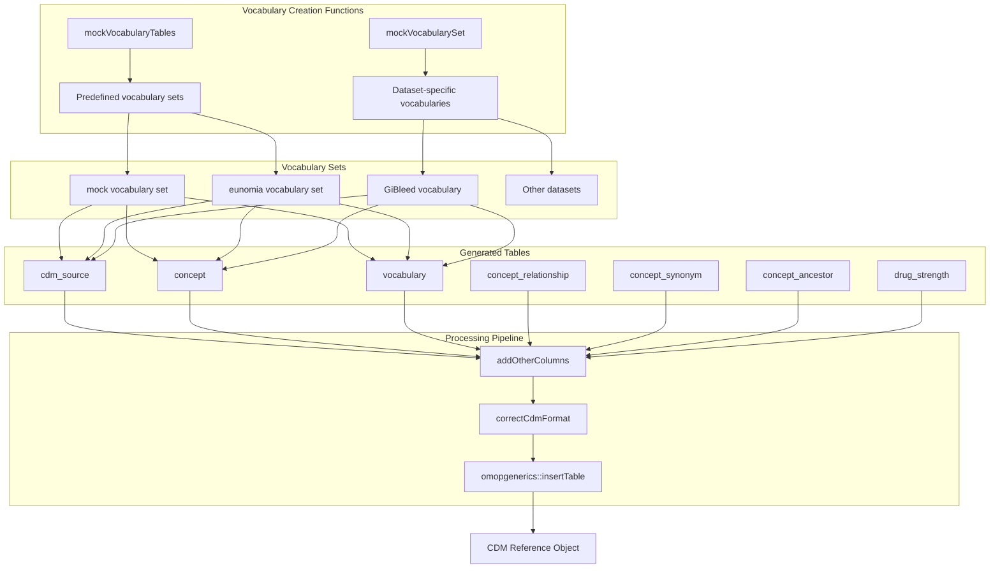
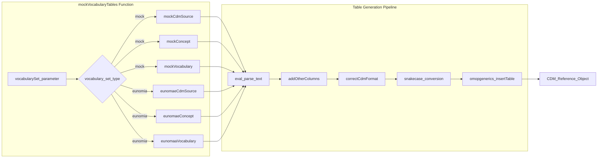
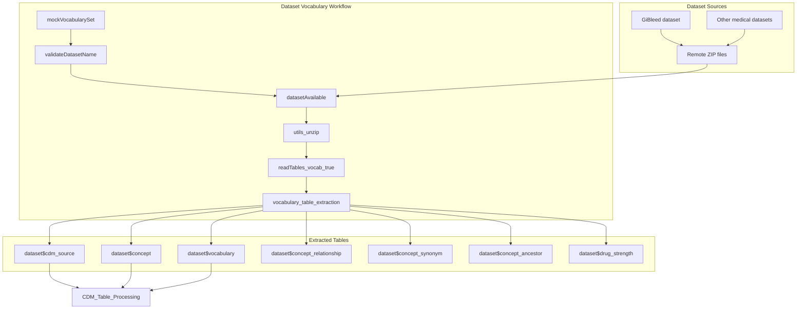
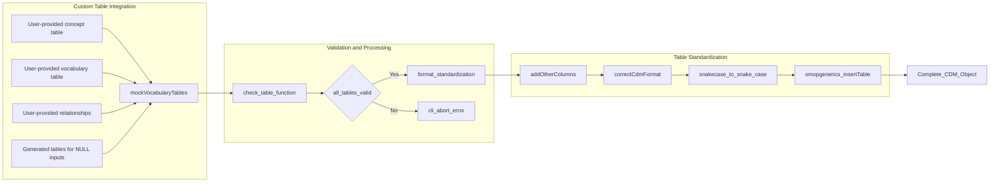
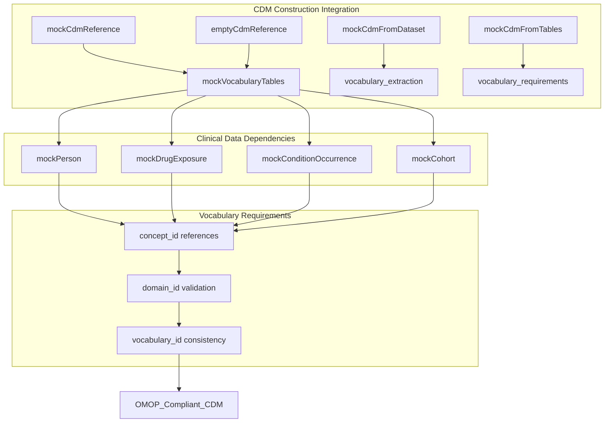

# Page: Vocabulary and Concept Management

# Vocabulary and Concept Management

Relevant source files

The following files were used as context for generating this wiki page:

- [NAMESPACE](NAMESPACE)
- [R/mockVocabulary.R](R/mockVocabulary.R)
- [R/mockVocabularySet.R](R/mockVocabularySet.R)
- [inst/WORDLIST](inst/WORDLIST)
- [man/figures/coffee.png](man/figures/coffee.png)
- [man/mockVocabularySet.Rd](man/mockVocabularySet.Rd)
- [man/omock-package.Rd](man/omock-package.Rd)
- [tests/testthat/test-mockVocabularySet.R](tests/testthat/test-mockVocabularySet.R)
- [tests/testthat/test-mockVocabularyTables.R](tests/testthat/test-mockVocabularyTables.R)
- [vignettes/a03_Creating_a_synthetic_vocabulary.Rmd](vignettes/a03_Creating_a_synthetic_vocabulary.Rmd)

This document covers the vocabulary and concept management system in omock, which handles OMOP Common Data Model (CDM) vocabulary tables that define medical concepts, terminologies, and their relationships. The system provides both predefined vocabulary sets and the flexibility to create custom medical terminologies for testing purposes.

For information about clinical event tables that use these vocabularies, see [Clinical Event Tables](#3.2). For CDM construction methods that incorporate vocabularies, see [CDM Construction Methods](#5).

## Purpose and Scope

The vocabulary management system enables creation of mock CDM environments with standardized medical terminologies. It supports multiple vocabulary sources including synthetic test vocabularies, real OMOP vocabularies from ATHENA, and custom user-defined concepts. The system ensures vocabulary tables conform to OMOP CDM specifications while providing flexibility for different testing scenarios.

## Core Vocabulary System Architecture

The vocabulary system consists of two primary functions that handle different vocabulary creation approaches, plus supporting infrastructure for format standardization and validation.

**Sources:** [R/mockVocabulary.R:1-125](), [R/mockVocabularySet.R:1-95](), [NAMESPACE:31-32]()

## Vocabulary Table Management

The system manages seven core OMOP vocabulary tables, each serving specific roles in the medical terminology framework:

| Table Name | Purpose | Key Columns |
|------------|---------|-------------|
| `cdm_source` | CDM metadata and versioning | `cdm_source_name`, `cdm_version`, `vocabulary_version` |
| `concept` | Individual medical concepts | `concept_id`, `concept_name`, `domain_id`, `vocabulary_id` |
| `vocabulary` | Vocabulary metadata | `vocabulary_id`, `vocabulary_name`, `vocabulary_reference` |
| `concept_relationship` | Relationships between concepts | `concept_id_1`, `concept_id_2`, `relationship_id` |
| `concept_synonym` | Alternative names for concepts | `concept_id`, `concept_synonym_name` |
| `concept_ancestor` | Hierarchical concept relationships | `ancestor_concept_id`, `descendant_concept_id` |
| `drug_strength` | Drug dosage information | `drug_concept_id`, `ingredient_concept_id`, `amount_value` |

**Sources:** [R/mockVocabulary.R:66-74](), [R/mockVocabularySet.R:45-53]()

## Predefined Vocabulary Sets

The `mockVocabularyTables()` function provides two predefined vocabulary sets optimized for different testing scenarios:

### Mock Vocabulary Set
- **Purpose**: Minimal synthetic vocabulary for basic functionality testing
- **Content**: Small subset of medical concepts with simple relationships
- **Use Case**: Unit tests that don't require realistic medical terminology
- **Access**: `vocabularySet = "mock"`

### Eunomia Vocabulary Set  
- **Purpose**: Real OMOP vocabularies for realistic testing environments
- **Content**: Complete vocabulary tables from ATHENA via Eunomia database
- **Use Case**: Integration testing requiring authentic medical terminology
- **Access**: `vocabularySet = "eunomia"`

**Sources:** [R/mockVocabulary.R:76-109](), [vignettes/a03_Creating_a_synthetic_vocabulary.Rmd:34-44]()

## Dataset-Specific Vocabulary Creation

The `mockVocabularySet()` function creates vocabularies from external datasets, particularly useful for domain-specific testing scenarios:

**Sources:** [R/mockVocabularySet.R:21-42](), [tests/testthat/test-mockVocabularySet.R:6-12]()

## Custom Vocabulary Integration

Both vocabulary functions support custom table integration, allowing users to provide their own medical terminologies while leveraging the system's standardization pipeline:

**Sources:** [R/mockVocabulary.R:80-89](), [tests/testthat/test-mockVocabularyTables.R:23-200](), [vignettes/a03_Creating_a_synthetic_vocabulary.Rmd:47-66]()

## Integration with CDM Construction

The vocabulary system integrates seamlessly with broader CDM construction workflows, supporting both empty CDM references and populated clinical data environments:

**Sources:** [R/mockVocabulary.R:52-53](), [vignettes/a03_Creating_a_synthetic_vocabulary.Rmd:28-32](), [R/mockVocabularySet.R:82-91]()

## Error Handling and Validation

The vocabulary system implements comprehensive validation to ensure data quality and OMOP compliance:

- **Input Validation**: Ensures vocabulary set parameters are valid (`"mock"` or `"eunomia"`)
- **Table Structure Validation**: Verifies all provided tables are data frames or NULL
- **Format Standardization**: Applies OMOP column types and naming conventions
- **Integration Validation**: Confirms vocabulary tables integrate properly with CDM objects

**Sources:** [R/mockVocabulary.R:76-89](), [R/mockVocabularySet.R:55-63]()