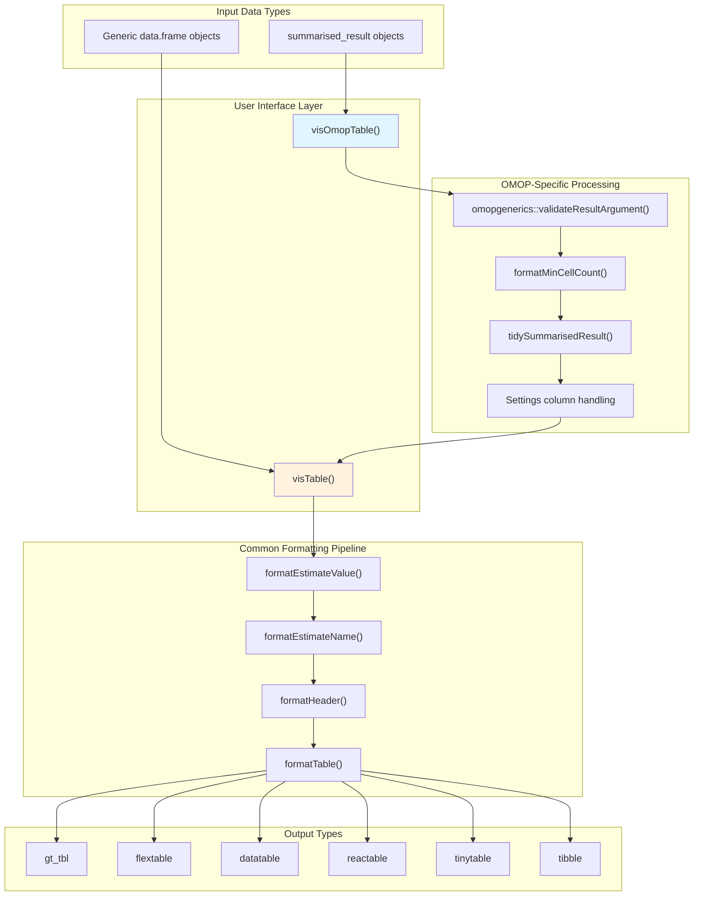
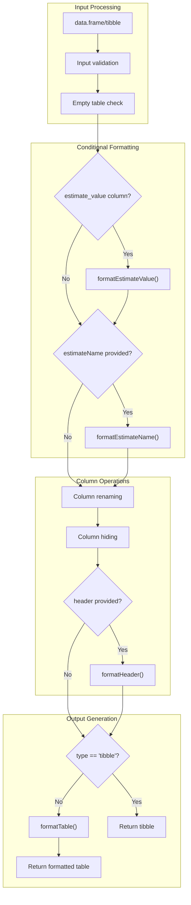
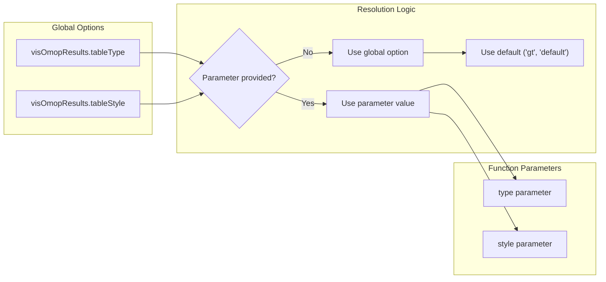

# Page: Core Table Functions

# Core Table Functions

<details>
<summary>Relevant source files</summary>

The following files were used as context for generating this wiki page:

- [R/visOmopTable.R](R/visOmopTable.R)
- [R/visTable.R](R/visTable.R)
- [man/visOmopTable.Rd](man/visOmopTable.Rd)
- [man/visTable.Rd](man/visTable.Rd)
- [tests/testthat/test-visOmopTable.R](tests/testthat/test-visOmopTable.R)

</details>


This document covers the two primary table generation functions in visOmopResults: `visOmopTable()` and `visTable()`. These functions serve as the main entry points for creating formatted tables and combine multiple formatting steps into convenient, single-function interfaces.

For detailed information about the underlying formatting pipeline that these functions orchestrate, see [Formatting Pipeline](#2.2). For information about the different table output formats and rendering backends, see [Table Rendering Backends](#2.3).

## Function Architecture

The core table functions operate in a hierarchical relationship where `visOmopTable()` provides OMOP-specific functionality while `visTable()` offers generic table formatting capabilities.

**Core Table Function Relationship**


Sources: [R/visOmopTable.R:64-158](), [R/visTable.R:53-171](), [tests/testthat/test-visOmopTable.R:1-432]()

## visOmopTable Function

The `visOmopTable()` function is the primary interface for creating formatted tables from OMOP analysis results. It specifically handles `summarised_result` objects and provides OMOP-specific functionality.

### Function Signature

```r
visOmopTable(
  result,
  estimateName = character(),
  header = character(),
  settingsColumn = character(),
  groupColumn = character(),
  rename = character(),
  type = "gt",
  hide = character(),
  columnOrder = character(),
  factor = list(),
  style = "default",
  showMinCellCount = TRUE,
  .options = list()
)
```

### Key OMOP-Specific Features

**OMOP Data Processing Pipeline**

```mermaid
flowchart LR
    subgraph "Input Validation"
        INPUT["summarised_result"]
        VALIDATE["validateResultArgument()"]
    end
    
    subgraph "OMOP-Specific Preprocessing"
        SUPPRESS["formatMinCellCount()"]
        SETTINGS["validateSettingsColumn()"]
        BC["backwardCompatibility()"]
        TIDY["tidySummarisedResult()"]
    end
    
    subgraph "Column Management"
        FACTOR["validateFactor()"]
        HIDE["Default hide: result_id, estimate_type"]
        ORDER["Column ordering logic"]
    end
    
    INPUT --> VALIDATE
    VALIDATE --> SUPPRESS
    SUPPRESS --> SETTINGS
    SETTINGS --> BC
    BC --> TIDY
    TIDY --> FACTOR
    FACTOR --> HIDE
    HIDE --> ORDER
    ORDER --> VISTABLE["visTable() call"]
```


Sources: [R/visOmopTable.R:87-105](), [R/visOmopTable.R:190-222]()

### OMOP-Specific Parameters

| Parameter | Purpose | OMOP Context |
|-----------|---------|--------------|
| `settingsColumn` | Include settings metadata in table | Exposes analysis parameters from `settings(result)` |
| `showMinCellCount` | Handle cell suppression | Manages privacy protection for OMOP results |
| `columnOrder` | Custom column positioning | Accounts for OMOP result structure |
| `factor` | Factor level ordering | Handles OMOP vocabulary hierarchies |

### Backward Compatibility Handling

The function includes extensive backward compatibility logic for header specifications:

```r
# Header shorthand mappings
cols <- list(
  "group" = groupColumns(result),
  "strata" = strataColumns(result),
  "additional" = additionalColumns(result),
  "variable" = colsVariable,
  "estimate" = "estimate_name",
  "settings" = settingsColumn
)
```

Sources: [R/visOmopTable.R:190-228]()

## visTable Function

The `visTable()` function provides generic table formatting capabilities for any data frame structure. While it doesn't require OMOP-specific structure, it expects certain column names for full functionality.

### Function Signature

```r
visTable(
  result,
  estimateName = character(),
  header = character(),
  groupColumn = character(),
  rename = character(),
  type = "gt",
  hide = character(),
  style = "default",
  .options = list()
)
```

### Generic Processing Pipeline

**visTable Processing Flow**


Sources: [R/visTable.R:91-171]()

## Key Differences Between Functions

| Aspect | visOmopTable | visTable |
|--------|-------------|----------|
| **Input Type** | `summarised_result` objects | Generic data frames |
| **Validation** | OMOP result validation | Basic table validation |
| **Cell Suppression** | Built-in `formatMinCellCount()` | Not included |
| **Settings Integration** | `settingsColumn` parameter | Not available |
| **Backward Compatibility** | Extensive header shortcuts | None |
| **Default Columns Hidden** | `result_id`, `estimate_type` | None |
| **Factor Handling** | OMOP-aware factor validation | Not included |

Sources: [R/visOmopTable.R:123](), [R/visTable.R:74]()

## Global Configuration

Both functions respect global configuration options for default behavior:

**Global Options Integration**


Sources: [R/visOmopTable.R:78-85](), [R/visTable.R:63-70]()

## Error Handling and Edge Cases

Both functions include robust error handling for common scenarios:

### Empty Table Handling
When input tables have zero rows, the functions return appropriate empty table objects via `emptyTable()`:

```r
if (nrow(result) == 0) return(emptyTable(type = type))
```

### Missing Column Warnings
The functions provide informative warnings when expected columns are missing:

```r
if (!any(c("estimate_name", "estimate_type") %in% colnames(result))) {
  cli::cli_inform("`estimate_name` and `estimate_type` must be present in `result` to apply `formatEstimateValue()`.")
}
```

Sources: [R/visTable.R:91](), [R/visTable.R:95-97](), [R/visTable.R:189-197]()

## Usage Patterns

### Basic OMOP Table Creation
```r
# Simple OMOP table with default settings
result |> visOmopTable()

# With custom estimate combinations
result |> visOmopTable(
  estimateName = c("N%" = "<count> (<percentage>)", "N" = "<count>"),
  header = c("strata"),
  type = "flextable"
)
```

### Generic Table Creation
```r
# Generic table from any data frame
my_data |> visTable(
  header = c("group_var"),
  groupColumn = c("category"),
  type = "gt"
)
```

Sources: [tests/testthat/test-visOmopTable.R:3-26](), [tests/testthat/test-visOmopTable.R:42-57](), [man/visTable.Rd:69-80]()