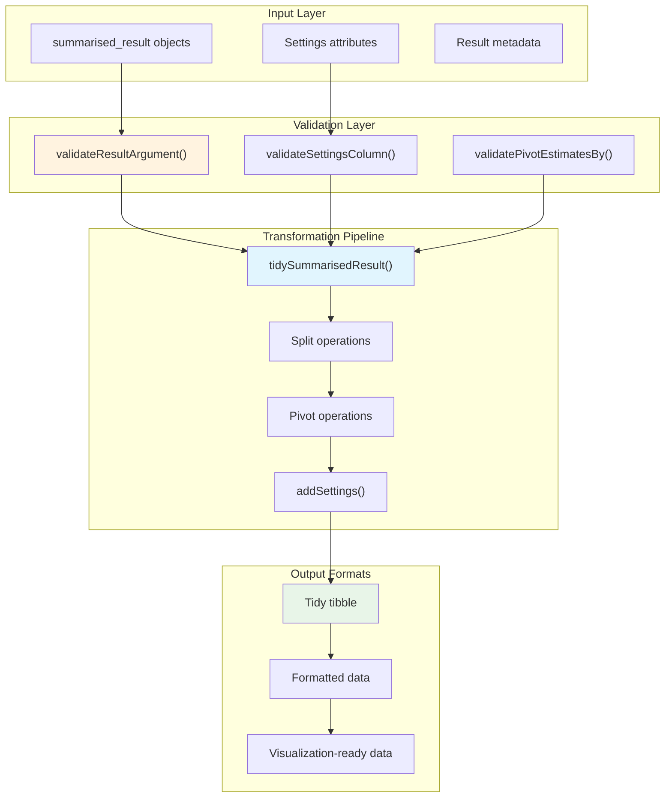
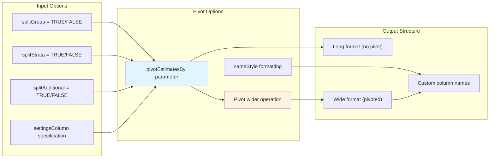

# Page: Data Processing and Utilities

# Data Processing and Utilities

Relevant source files

The following files were used as context for generating this wiki page:

- [R/tidy.R](R/tidy.R)
- [R/utilities.R](R/utilities.R)
- [tests/testthat/test-tidy.R](tests/testthat/test-tidy.R)

## Purpose and Scope

The data processing and utilities system provides the foundational infrastructure that enables the main table and plot generation capabilities of `visOmopResults`. This system handles data transformation, input validation, and utility functions that ensure data integrity throughout the visualization pipeline. 

For detailed information about table generation, see [Table Generation System](#2). For plot generation functionality, see [Plot Generation System](#3). For testing infrastructure and mock data, see [Testing and Mock Data](#5).

## Data Processing Pipeline

The data processing system transforms `summarised_result` objects into formats suitable for visualization. The central transformation function is `tidySummarisedResult()`, which provides a flexible way to reshape and prepare OMOP analysis results for downstream processing.

### Core Data Flow

**Data Processing Pipeline Architecture**

Sources: [R/tidy.R:38-66](), [R/utilities.R:109-122](), [R/utilities.R:124-138]()

## Utility Functions Architecture

The utility system provides comprehensive input validation and helper functions that ensure data integrity and parameter correctness across all package functions. These utilities form a defensive programming layer that prevents errors and provides clear feedback to users.

### Validation System Overview

```mermaid
graph TB
    subgraph "Parameter Validation"
        VAL_DEC["validateDecimals()"]
        VAL_EST["validateEstimateName()"]
        VAL_STYLE["validateStyle()"]
        VAL_DELIM["validateDelim()"]
    end
    
    subgraph "Data Structure Validation"
        VAL_PIVOT["validatePivotEstimatesBy()"]
        VAL_SETTINGS["validateSettingsColumn()"]
        VAL_RENAME["validateRename()"]
        VAL_GROUP["validateGroupColumn()"]
    end
    
    subgraph "Input Compatibility Checks"
        CHECK_VIS["checkVisTableInputs()"]
        VAL_HEADER["validateHeader()"]
        VAL_MERGE["validateMerge()"]
        VAL_FACTOR["validateFactor()"]
    end
    
    subgraph "Core Functions"
        VIS_OMOP["visOmopTable()"]
        VIS_TABLE["visTable()"]
        PLOTS["Plot functions"]
        FORMAT["Format functions"]
    end
    
    VAL_DEC --> VIS_OMOP
    VAL_EST --> VIS_OMOP
    VAL_STYLE --> VIS_TABLE
    VAL_DELIM --> FORMAT
    
    VAL_PIVOT --> VIS_OMOP
    VAL_SETTINGS --> VIS_OMOP
    VAL_RENAME --> VIS_TABLE
    VAL_GROUP --> VIS_TABLE
    
    CHECK_VIS --> VIS_TABLE
    VAL_HEADER --> VIS_TABLE
    VAL_MERGE --> VIS_TABLE
    VAL_FACTOR --> PLOTS
    
    style VAL_DEC fill:#e1f5fe
    style VAL_PIVOT fill:#e1f5fe
    style CHECK_VIS fill:#e1f5fe
```

**Validation System Architecture**

Sources: [R/utilities.R:19-57](), [R/utilities.R:59-71](), [R/utilities.R:241-248]()

## Key Validation Functions

The validation system includes specialized functions for different types of input checking:

| Function | Purpose | Key Features |
|----------|---------|--------------|
| `validateDecimals()` | Validates decimal formatting parameters | Handles estimate types, supports named vectors, automatic type detection |
| `validateEstimateName()` | Validates estimate name format strings | Checks for proper `<...>` syntax, prevents empty formats |
| `validateStyle()` | Validates table styling parameters | Backend-specific validation, supports named lists and preset styles |
| `validatePivotEstimatesBy()` | Validates pivot column specifications | Ensures valid result columns, prevents estimate_value/estimate_type conflicts |
| `validateGroupColumn()` | Validates grouping column parameters | Supports shorthand notation (`"group"`, `"strata"`, `"estimate"`), validates against available columns |
| `validateHeader()` | Validates header configuration | Ensures unique header combinations, automatically adjusts hidden columns when needed |

Sources: [R/utilities.R:19-57](), [R/utilities.R:109-122](), [R/utilities.R:157-196](), [R/utilities.R:264-306]()

## Data Transformation Features

The `tidySummarisedResult()` function provides flexible data reshaping capabilities:

### Transformation Options

**Data Transformation Options**

Sources: [R/tidy.R:38-66](), [tests/testthat/test-tidy.R:1-43]()

### Splitting Operations

The transformation system can automatically split compound columns:

- **Group splitting**: Separates `group_name` and `group_level` columns
- **Strata splitting**: Separates `strata_name` and `strata_level` columns  
- **Additional splitting**: Separates `additional_name` and `additional_level` columns

### Pivoting Operations

The system supports flexible pivoting by various result columns:

- **By estimate name**: Creates columns for each estimate type (`count`, `mean`, `percentage`, etc.)
- **By variable name**: Creates columns for each variable measured
- **By multiple columns**: Combines multiple grouping variables for complex pivots
- **Custom naming**: Uses `nameStyle` parameter for custom column naming patterns

Sources: [R/tidy.R:54-65](), [tests/testthat/test-tidy.R:12-33]()

## Integration with Main Systems

The data processing and utilities system serves as the foundation for both table and plot generation:

### Table Generation Integration
- Validation functions ensure parameter compatibility across different table backends
- Data transformation prepares `summarised_result` objects for formatting pipeline
- Header validation prevents rendering conflicts in complex table layouts

### Plot Generation Integration  
- Data transformation reshapes results for `ggplot2` aesthetic mapping
- Factor validation ensures proper categorical variable handling
- Column validation prevents aesthetic mapping errors

Sources: [R/utilities.R:73-106](), [R/utilities.R:250-262]()