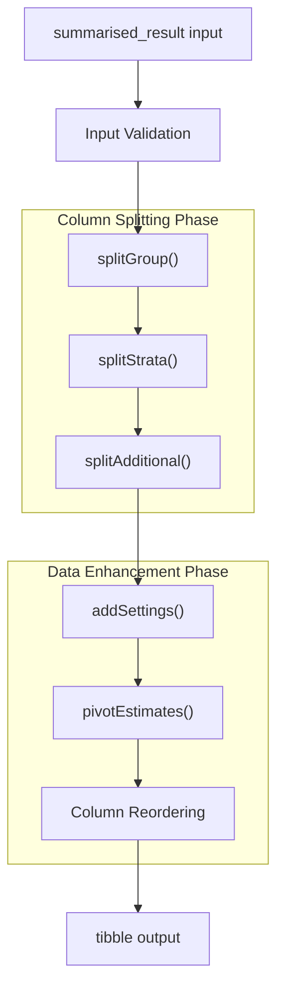
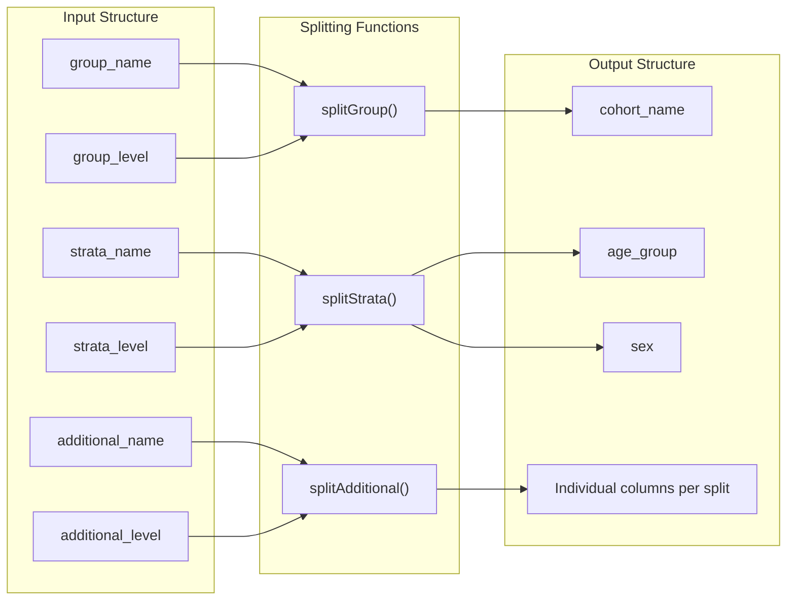
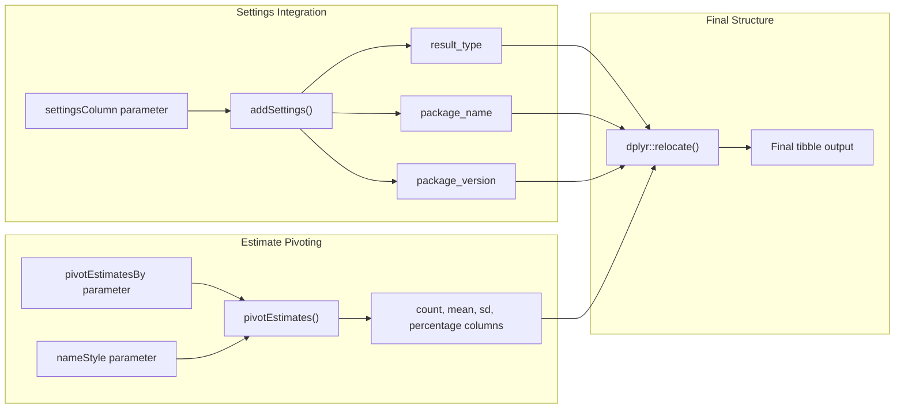
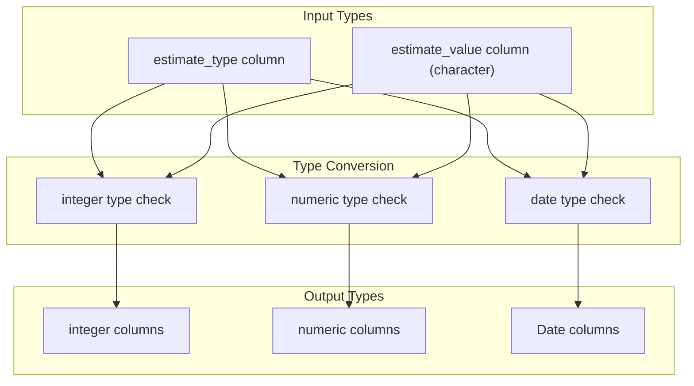
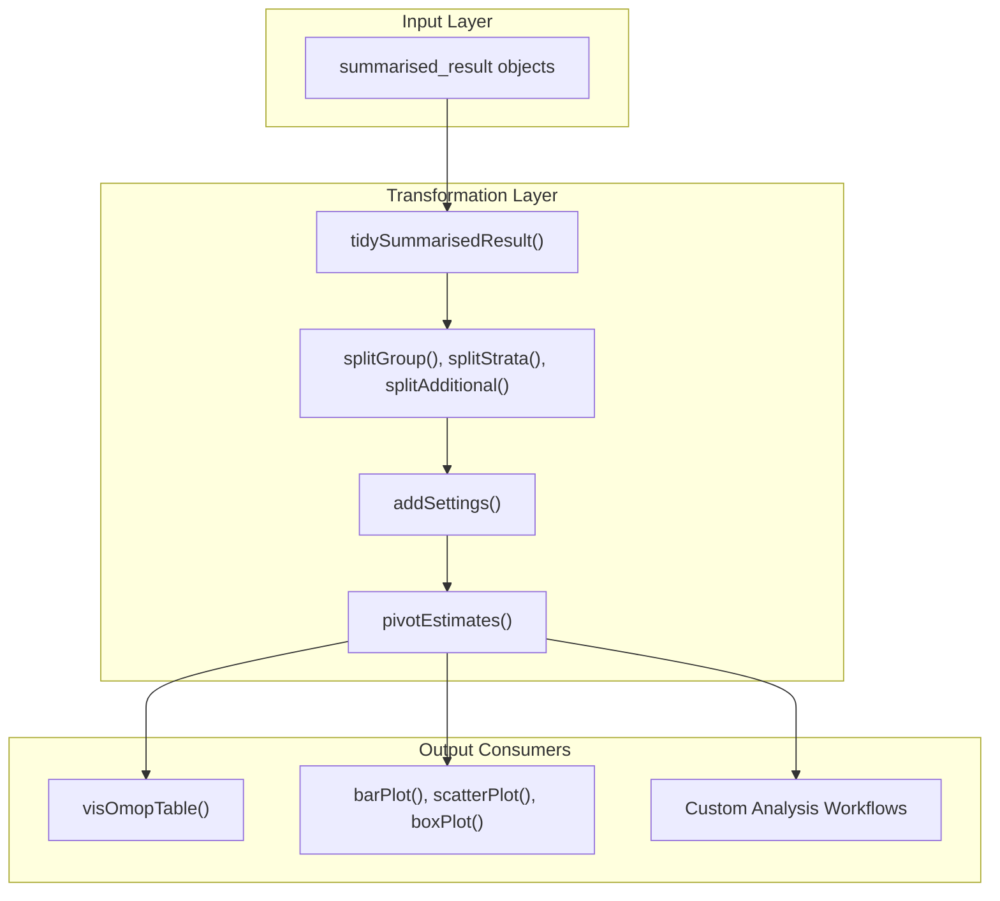

# Page: Data Transformation

# Data Transformation

<details>
<summary>Relevant source files</summary>

The following files were used as context for generating this wiki page:

- [R/tidy.R](R/tidy.R)
- [tests/testthat/test-tidy.R](tests/testthat/test-tidy.R)

</details>


## Purpose and Scope

The data transformation system provides utilities for converting `summarised_result` objects into different tabular formats optimized for analysis and visualization. The primary function `tidySummarisedResult` serves as a comprehensive data reshaping tool that can split complex column structures, pivot estimates, and add metadata columns to create analysis-ready data frames.

This system focuses specifically on data structure transformation rather than visual formatting. For table formatting and styling, see [Formatting Pipeline](#2.2). For input validation of transformation parameters, see [Input Validation System](#4.2).

## Core Transformation Function

The main transformation function `tidySummarisedResult` accepts a `summarised_result` object and applies a series of configurable transformations to restructure the data:



*Data Transformation Pipeline Flow*

The function signature and core parameters are defined in [R/tidy.R:38-44]():

- `result`: Input `summarised_result` object
- `splitGroup`: Boolean controlling group column splitting
- `splitStrata`: Boolean controlling strata column splitting  
- `splitAdditional`: Boolean controlling additional column splitting
- `settingsColumn`: Specifies which settings to add as columns
- `pivotEstimatesBy`: Controls estimate pivoting strategy
- `nameStyle`: Defines naming convention for pivoted columns

**Sources:** [R/tidy.R:17-66]()

## Transformation Phases

### Phase 1: Column Splitting

The splitting phase decomposes complex nested column structures into separate columns for easier analysis. Each splitting operation is conditional based on function parameters:



*Column Splitting Operations*

The splitting logic is executed conditionally in [R/tidy.R:54-57]():

```
if (isTRUE(splitGroup)) result <- result |> splitGroup()
if (isTRUE(splitStrata)) result <- result |> splitStrata()
if (isTRUE(splitAdditional)) result <- result |> splitAdditional()
```

**Sources:** [R/tidy.R:54-57](), [tests/testthat/test-tidy.R:12-16]()

### Phase 2: Data Enhancement

The enhancement phase adds metadata and reshapes estimate columns:



*Data Enhancement Operations*

**Sources:** [R/tidy.R:60-63](), [tests/testthat/test-tidy.R:6-10]()

## Function Parameters and Configuration

### Splitting Control Parameters

| Parameter | Type | Default | Purpose |
|-----------|------|---------|---------|
| `splitGroup` | logical | `TRUE` | Split group name-level pairs into separate columns |
| `splitStrata` | logical | `TRUE` | Split strata name-level pairs into separate columns |
| `splitAdditional` | logical | `TRUE` | Split additional name-level pairs into separate columns |

### Data Enhancement Parameters

| Parameter | Type | Default | Purpose |
|-----------|------|---------|---------|
| `settingsColumn` | character | `settingsColumns(result)` | Settings columns to add to output |
| `pivotEstimatesBy` | character | `"estimate_name"` | Columns to pivot estimates by |
| `nameStyle` | character | `NULL` | Glue-style naming pattern for pivoted columns |

**Sources:** [R/tidy.R:38-44]()

### Pivoting Strategies

The `pivotEstimatesBy` parameter supports multiple pivoting approaches:

1. **By estimate name**: `pivotEstimatesBy = "estimate_name"` creates columns like `count`, `mean`, `sd`
2. **By variable and estimate**: `pivotEstimatesBy = c("variable_name", "estimate_name")` creates columns like `count_number subjects`, `mean_age`
3. **Custom naming**: Using `nameStyle = "{estimate_name}_{variable_name}"` creates columns like `count_Medications`, `percentage_Medications`

**Sources:** [tests/testthat/test-tidy.R:17-32]()

## Data Type Preservation

The transformation system preserves appropriate data types during the reshaping process:



*Data Type Preservation During Transformation*

**Sources:** [tests/testthat/test-tidy.R:8-10](), [tests/testthat/test-tidy.R:30-32](), [tests/testthat/test-tidy.R:98]()

## Integration with Visualization Pipeline

The transformation system serves as a crucial bridge between raw OMOP results and visualization components:



*Integration with Visualization Components*

**Sources:** [R/tidy.R:17-66](), [tests/testthat/test-tidy.R:1-43]()