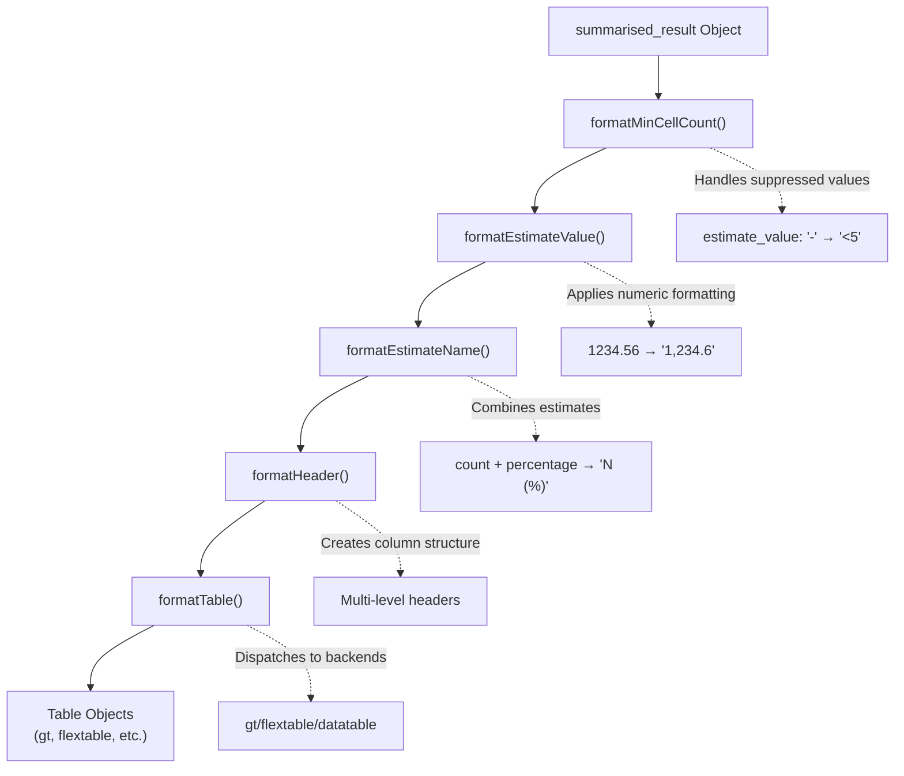

# Page: Formatting Pipeline

# Formatting Pipeline

<details>
<summary>Relevant source files</summary>

The following files were used as context for generating this wiki page:

- [R/formatEstimateName.R](R/formatEstimateName.R)
- [R/formatEstimateValue.R](R/formatEstimateValue.R)
- [R/formatHeader.R](R/formatHeader.R)
- [R/formatTable.R](R/formatTable.R)
- [R/mockResults.R](R/mockResults.R)
- [man/formatEstimateName.Rd](man/formatEstimateName.Rd)
- [man/formatEstimateValue.Rd](man/formatEstimateValue.Rd)
- [man/formatHeader.Rd](man/formatHeader.Rd)
- [man/formatTable.Rd](man/formatTable.Rd)
- [tests/testthat/test-formatEstimateName.R](tests/testthat/test-formatEstimateName.R)
- [tests/testthat/test-formatEstimateValue.R](tests/testthat/test-formatEstimateValue.R)
- [tests/testthat/test-formatTable.R](tests/testthat/test-formatTable.R)

</details>


## Purpose and Scope

The formatting pipeline is the core data transformation system in visOmopResults that converts raw `summarised_result` objects into presentation-ready data for table generation. This pipeline applies a sequence of formatting functions that handle estimate value formatting, estimate name combination, header creation, and final table styling.

This document covers the sequential formatting functions and their internal mechanics. For information about the table generation functions that consume formatted data, see [Core Table Functions](#2.1). For details about the specific table rendering backends, see [Table Rendering Backends](#2.3).

## Pipeline Overview

The formatting pipeline consists of five sequential transformation steps that progressively prepare data for final table rendering:



**Pipeline Characteristics:**
- Each step is optional and can be skipped
- Functions are designed to be chainable via pipe operators
- Data validation occurs at each step
- `summarised_result` class is preserved until `formatTable()`

Sources: [R/formatMinCellCount.R:92-120](), [R/formatEstimateValue.R:45-64](), [R/formatEstimateName.R:45-66](), [R/formatHeader.R:48-136](), [R/formatTable.R:111-213]()

## Core Formatting Functions

### formatMinCellCount Function

The `formatMinCellCount()` function handles data suppression by converting suppressed values (`"-"`) to explicit minimum cell count indicators (e.g., `"<5"`):

```mermaid
flowchart LR
    Input["`summarised_result`<br/>with suppressed values"]
    
    subgraph Processing["formatMinCellCount()"]
        GetSettings["Extract min_cell_count<br/>from settings"]
        CheckEstimate["Filter estimate_name<br/>contains 'count'"]
        Transform["Replace '-' with<br/>'<{min_cell_count}'"]
    end
    
    Output["`estimate_value`<br/>'-' → '<20'"]
    
    Input --> GetSettings
    GetSettings --> CheckEstimate  
    CheckEstimate --> Transform
    Transform --> Output
```

**Implementation Details:**
- Reads `min_cell_count` from the `settings` attribute of `summarised_result` objects
- Only applies to estimates where `estimate_name` contains "count"
- Formats suppression threshold with thousands separators

Sources: [R/formatEstimateValue.R:92-120]()

### formatEstimateValue Function

The `formatEstimateValue()` function applies numeric formatting including decimal places, decimal marks, and thousands separators:

```mermaid
flowchart TD
    Input["`estimate_value` as strings"]
    
    subgraph DecimalConfig["Decimal Configuration"]
        DecimalsByType["By estimate_type:<br/>integer=0, numeric=2<br/>percentage=1, proportion=3"]
        DecimalsByName["By estimate_name:<br/>mean=2, sd=3, count=0"]
        DecimalsAll["Single value for all:<br/>decimals=1"]
    end
    
    subgraph Processing["formatEstimateValueInternal()"]
        ParseNumeric["Parse string to numeric"]
        ApplyRounding["Round to specified decimals"]
        FormatSeparators["Apply decimal/thousands marks"]
        SkipSuppressed["Skip '-' and '<' values"]
    end
    
    Output["Formatted estimate_value<br/>'1,234.56'"]
    
    Input --> DecimalsByType
    Input --> DecimalsByName  
    Input --> DecimalsAll
    
    DecimalsByType --> Processing
    DecimalsByName --> Processing
    DecimalsAll --> Processing
    
    Processing --> Output
```

**Decimal Hierarchy:**
1. `estimate_name` specific (highest priority)
2. `estimate_type` specific  
3. Global decimal setting (lowest priority)

Sources: [R/formatEstimateValue.R:45-64](), [R/formatEstimateValue.R:122-155]()

### formatEstimateName Function

The `formatEstimateName()` function combines multiple estimates into single formatted strings using template syntax:

```mermaid
flowchart TD
    Input["`Multiple estimate rows`<br/>count=100, percentage=25.5"]
    
    subgraph Templates["Template Syntax"]
        Template1["`'N (%)' = '<count> (<percentage>%)'`"]
        Template2["`'Mean (SD)' = '<mean> (<sd>)'`"]  
        Template3["`'Range' = '[<min> - <max>]'`"]
    end
    
    subgraph Processing["formatEstimateNameInternal()"]
        GroupData["Group by non-estimate columns"]
        ExtractKeys["Extract <estimate_name> tokens"]
        ValidateKeys["Validate keys exist in data"]
        PivotWider["Pivot estimates to columns"]
        EvaluateTemplate["Substitute template with values"]
        CombineRows["Combine into single row per group"]
    end
    
    Output["`Single combined row`<br/>'100 (25.5%)'"]
    
    Input --> Templates
    Templates --> Processing
    Processing --> Output
```

**Template Processing Steps:**
1. Parse templates to extract `<estimate_name>` tokens via regex: `(?<=\\<).+?(?=\\>)`
2. Group data by all non-estimate columns  
3. Validate all required estimates exist for each group
4. Pivot estimates from rows to columns
5. Use `paste0()` to substitute template placeholders with actual values

Sources: [R/formatEstimateName.R:45-171](), [R/formatEstimateName.R:172-215]()

### formatHeader Function

The `formatHeader()` function transforms row data into multi-level column headers by pivoting specified columns:

```mermaid
flowchart TD
    Input["`summarised_result`<br/>with estimate_value column"]
    
    subgraph HeaderConfig["Header Configuration"]  
        HeaderSpec["`header = c('Study strata', 'strata_name', 'strata_level')`"]
        DelimConfig["`delim = '\\n'`"]
        NameConfig["`includeHeaderName = TRUE`"]
        KeyConfig["`includeHeaderKey = TRUE`"]
    end
    
    subgraph Processing["formatHeader() Internal"]
        IdentifyColumns["Identify columns in data:<br/>cols = header ∩ colnames(result)"]
        CreateColDetails["Generate column mapping:<br/>sprintf('column%03i', row_number())"]
        PivotWider["pivot_wider(names_from='name',<br/>values_from='estimate_value')"]
        BuildColumnNames["Construct header strings with<br/>[header_level], [header_name] keys"]
        RenameColumns["Apply new column names"]
    end
    
    Output["Wide format with header-encoded<br/>column names"]
    
    Input --> HeaderConfig
    HeaderConfig --> Processing  
    Processing --> Output
```

**Column Name Generation:**
- Format: `[header_name]Study strata\n[header_level]overall\nestimate_value`
- Keys like `[header_level]` enable `formatTable()` to create proper table headers
- Multiple header levels are concatenated with the specified delimiter

Sources: [R/formatHeader.R:48-136]()

## Sequential Processing Flow

The formatting pipeline implements a sequential transformation architecture where each function prepares data for the next stage:

```mermaid
graph TD
    subgraph Stage1["Stage 1: Value Suppression"]
        FMC["formatMinCellCount()"]
        FMCInput["`estimate_value: '-'`"]
        FMCOutput["`estimate_value: '<20'`"]
        FMCInput --> FMC --> FMCOutput
    end
    
    subgraph Stage2["Stage 2: Numeric Formatting"]  
        FEV["formatEstimateValue()"]
        FEVInput["`1234.567`"]
        FEVOutput["`'1,234.6'`"]
        FEVInput --> FEV --> FEVOutput
    end
    
    subgraph Stage3["Stage 3: Estimate Combination"]
        FEN["formatEstimateName()"]
        FENInput["`count=100`<br/>`percentage=25.5`"]
        FENOutput["`'100 (25.5%)'`"]
        FENInput --> FEN --> FENOutput  
    end
    
    subgraph Stage4["Stage 4: Header Pivoting"]
        FH["formatHeader()"]
        FHInput["`Long format data`"]
        FHOutput["`Wide format with`<br/>`header-encoded columns`"]
        FHInput --> FH --> FHOutput
    end
    
    subgraph Stage5["Stage 5: Table Rendering"]
        FT["formatTable()"]
        FTInput["`Formatted data`"]
        FTOutput["`gt/flextable objects`"]
        FTInput --> FT --> FTOutput
    end
    
    Stage1 --> Stage2
    Stage2 --> Stage3  
    Stage3 --> Stage4
    Stage4 --> Stage5
```

**Data Flow Characteristics:**
- Each stage can be skipped if not needed
- `summarised_result` class is maintained until `formatTable()`
- Column structure changes significantly in Stage 4 (header pivoting)
- Stage 5 dispatches to different table backends based on `type` parameter

Sources: [R/formatEstimateValue.R:92-120](), [R/formatEstimateValue.R:45-64](), [R/formatEstimateName.R:45-66](), [R/formatHeader.R:48-136](), [R/formatTable.R:111-213]()

## Integration with Table Backends

The final `formatTable()` function serves as a dispatcher that routes formatted data to different table rendering systems:

```mermaid
flowchart TD
    FormattedData["`Formatted Data`<br/>from pipeline"]
    
    FormatTable["`formatTable()`<br/>Central Dispatcher"]
    
    subgraph Validation["Input Validation"]
        ValidateType["`validateStyle()`<br/>`validateGroupColumn()`<br/>`validateMerge()`"]
    end
    
    subgraph Backends["Table Backends"]
        GTBackend["`gtTableInternal()`<br/>→ gt_tbl objects"]
        FXBackend["`fxTableInternal()`<br/>→ flextable objects"]  
        DTBackend["`datatableInternal()`<br/>→ datatable objects"]
        RTBackend["`reactableInternal()`<br/>→ reactable objects"]
        TTBackend["`tinytableInternal()`<br/>→ tinytable objects"]
    end
    
    FormattedData --> FormatTable
    FormatTable --> Validation
    Validation --> GTBackend
    Validation --> FXBackend
    Validation --> DTBackend
    Validation --> RTBackend  
    Validation --> TTBackend
```

**Backend Selection Logic:**
```r
if (type == "gt") {
  x |> gtTableInternal(...)
} else if (type == "flextable") {
  x |> fxTableInternal(...)
} else if (type == "datatable") {
  x |> datatableInternal(...)
}
```

**Key Parameters Passed to Backends:**
- `delim`: Delimiter for header parsing
- `style`: Styling configuration 
- `groupColumn`: Columns for grouping
- `merge`: Columns for cell merging
- `na`: Missing value representation

Sources: [R/formatTable.R:153-213]()