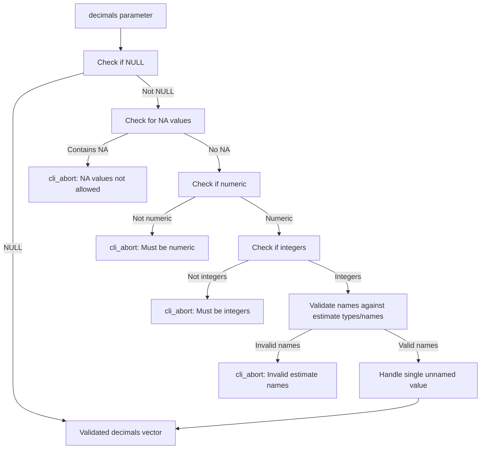
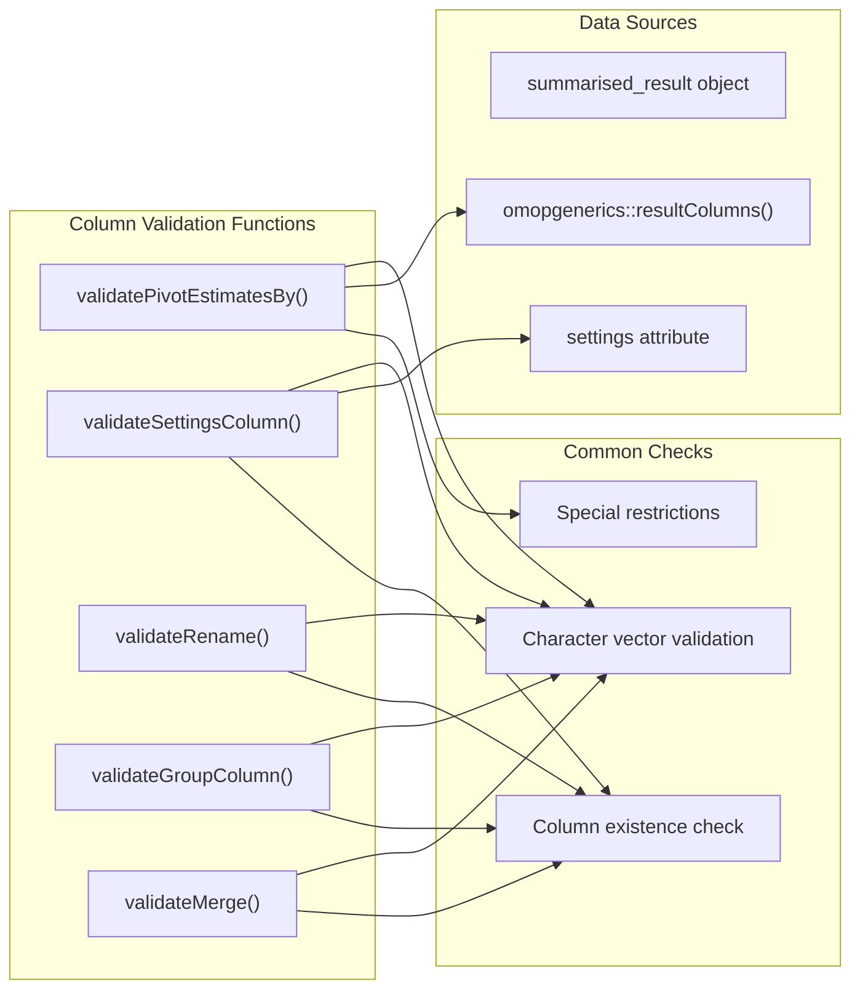
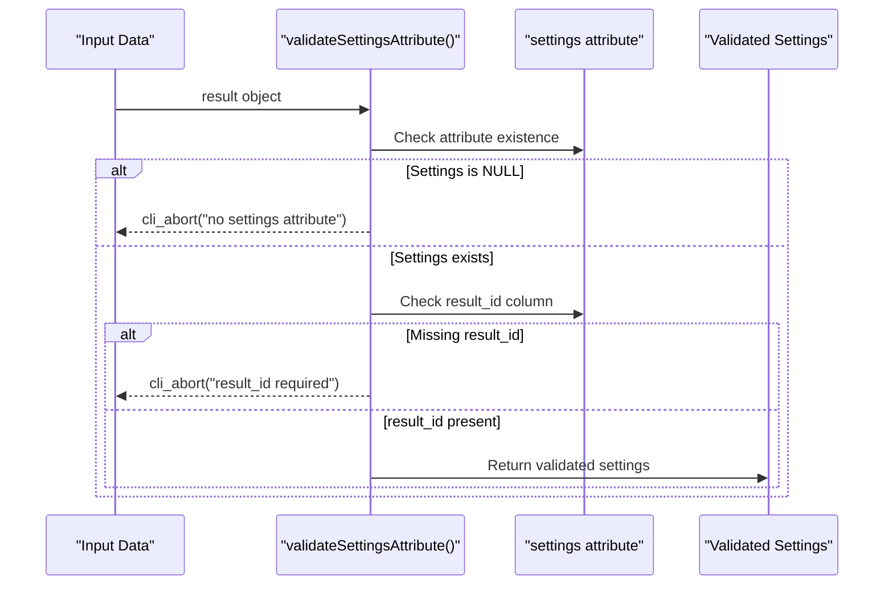
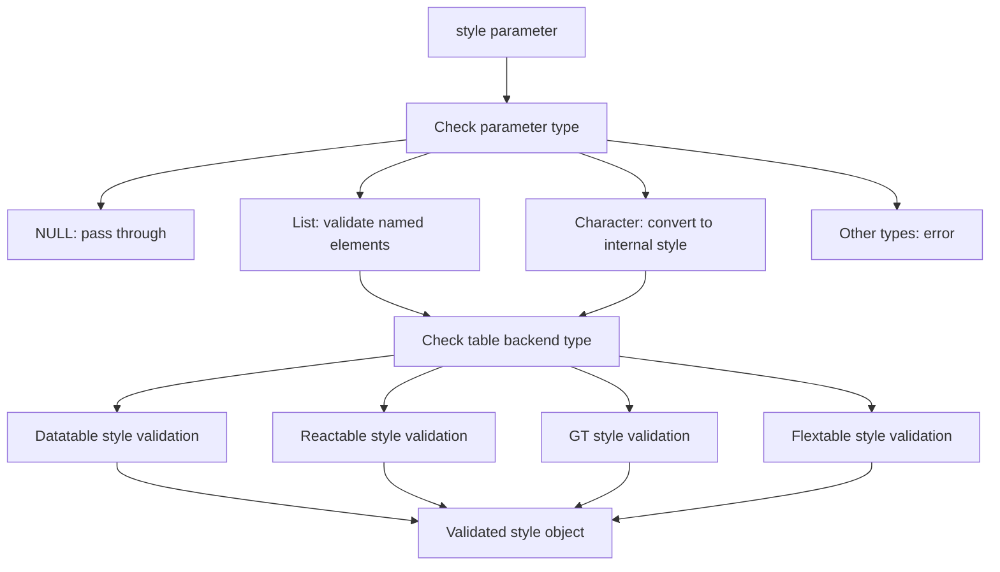
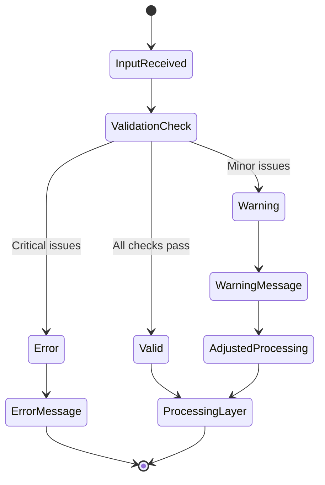
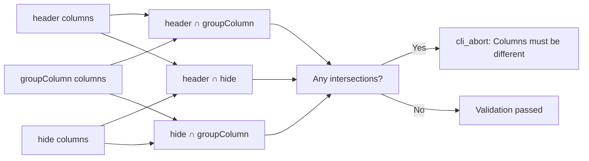

# Page: Input Validation System

# Input Validation System

Relevant source files

The following files were used as context for generating this wiki page:

- [R/utilities.R](R/utilities.R)

## Purpose and Scope

The Input Validation System provides comprehensive validation functions that ensure data integrity and parameter correctness throughout the visOmopResults package. This system validates user inputs, data structures, and configuration parameters before they are processed by the core table and plot generation functions.

For information about data transformation utilities, see [Data Transformation](#4.1). For details about the table generation system that relies on these validations, see [Table Generation System](#2).

## Validation Architecture

The validation system operates as a defensive layer between user inputs and core processing functions. Each validation function performs specific checks and provides clear error messages when issues are detected.

```mermaid
graph TB
    subgraph "User Input Layer"
        UserParams["User Parameters"]
        UserData["User Data"]
        UserConfig["User Configuration"]
    end
    
    subgraph "Validation Gateway"
        DataValidation["Data Structure Validation"]
        ParamValidation["Parameter Validation"] 
        ConfigValidation["Configuration Validation"]
    end
    
    subgraph "Core Validation Functions"
        validateDecimals["validateDecimals()"]
        validateEstimateName["validateEstimateName()"]
        validateStyle["validateStyle()"]
        validatePivotEstimatesBy["validatePivotEstimatesBy()"]
        validateSettingsColumn["validateSettingsColumn()"]
        validateRename["validateRename()"]
        validateGroupColumn["validateGroupColumn()"]
        validateMerge["validateMerge()"]
        validateDelim["validateDelim()"]
        validateShowMinCellCount["validateShowMinCellCount()"]
        validateSettingsAttribute["validateSettingsAttribute()"]
        validateFactor["validateFactor()"]
        validateHeader["validateHeader()"]
        checkVisTableInputs["checkVisTableInputs()"]
    end
    
    subgraph "Processing Layer"
        TableGeneration["Table Generation"]
        PlotGeneration["Plot Generation"]
        DataTransformation["Data Transformation"]
    end
    
    UserParams --> ParamValidation
    UserData --> DataValidation
    UserConfig --> ConfigValidation
    
    DataValidation --> validateSettingsAttribute
    DataValidation --> validateHeader
    DataValidation --> validateFactor
    
    ParamValidation --> validateDecimals
    ParamValidation --> validateEstimateName
    ParamValidation --> validatePivotEstimatesBy
    ParamValidation --> validateSettingsColumn
    ParamValidation --> validateRename
    ParamValidation --> validateGroupColumn
    ParamValidation --> validateMerge
    ParamValidation --> validateDelim
    ParamValidation --> validateShowMinCellCount
    
    ConfigValidation --> validateStyle
    ConfigValidation --> checkVisTableInputs
    
    validateDecimals --> TableGeneration
    validateEstimateName --> TableGeneration
    validateStyle --> TableGeneration
    validateHeader --> TableGeneration
    validateFactor --> PlotGeneration
    validatePivotEstimatesBy --> DataTransformation
```

Sources: [R/utilities.R:17-307]()

## Core Parameter Validation Functions

### Decimal Formatting Validation

The `validateDecimals` function ensures proper formatting specifications for numeric estimates:

Key validation checks performed by `validateDecimals`:
- **Null handling**: Allows NULL values to pass through
- **NA detection**: Rejects vectors containing NA values
- **Type checking**: Ensures values are numeric integers
- **Name validation**: Verifies names correspond to valid estimate types or names
- **Special handling**: Warns about unsupported types like "date" and "logical"

Sources: [R/utilities.R:19-57]()

### Estimate Name Format Validation

The `validateEstimateName` function validates format strings used for combining estimates:

| Validation Check | Function | Error Condition |
|-----------------|----------|----------------|
| Character type | `omopgenerics::assertCharacter()` | Non-character input |
| Format pattern | Regex pattern matching | Missing `<...>` placeholders |
| Empty format | Length check | Zero-length format string |

Sources: [R/utilities.R:59-71]()

### Column Specification Validation

Several functions validate column specifications for different operations:

Sources: [R/utilities.R:109-212]()

## Data Structure Validation

### Settings Attribute Validation

The `validateSettingsAttribute` function ensures required data structure integrity:

Sources: [R/utilities.R:230-239]()

### Header Configuration Validation

The `validateHeader` function performs complex validation of header configurations, ensuring unique value combinations:

Key validation steps:
1. **Duplicate detection**: Identifies non-unique combinations in grouped data
2. **Column adjustment**: Automatically adjusts `hide` and `settingsColumn` parameters
3. **Warning generation**: Provides informative warnings about required column additions
4. **Conflict resolution**: Resolves conflicts between header, hide, and groupColumn specifications

Sources: [R/utilities.R:264-306]()

## Style and Configuration Validation

### Table Style Validation

The `validateStyle` function validates styling configurations across different table backends:

The function validates style parameters against allowed options for each table backend:
- **datatable**: Uses `datatableStyleInternal("default")` names
- **reactable**: Uses `reactableStyleInternal("default")` names  
- **gt/flextable**: Uses fixed set of style parts: header, header_name, header_level, column_name, group_label, title, subtitle, body

Sources: [R/utilities.R:73-107]()

## Error Handling and Messaging

The validation system uses consistent error handling patterns through the `cli` package:

### Error Message Types

| Function | Message Type | Example |
|----------|-------------|---------|
| `cli::cli_abort()` | Fatal errors | Invalid parameter values |
| `cli::cli_warn()` | Warnings | Ignored parameters, automatic adjustments |
| `cli::cli_inform()` | Informational | Missing columns, suggestions |

### Validation Flow Control

Sources: [R/utilities.R:28-46](), [R/utilities.R:84-96](), [R/utilities.R:145-148]()

## Input Consistency Checks

The `checkVisTableInputs` function ensures mutually exclusive parameter specifications:

This function ensures that columns specified for different purposes (header display, grouping, hiding) do not conflict with each other.

Sources: [R/utilities.R:241-248]()