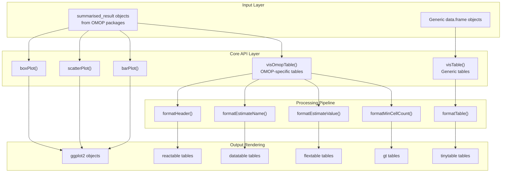
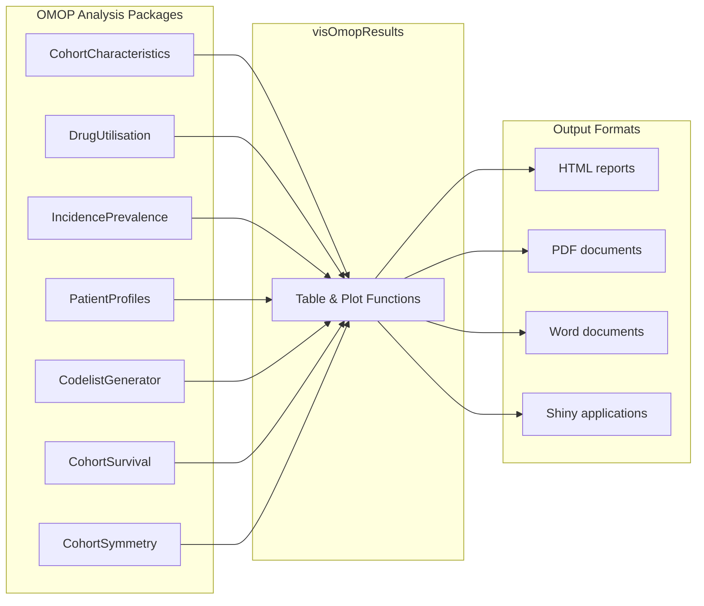

# Page: Overview

# Overview

<details>
<summary>Relevant source files</summary>

The following files were used as context for generating this wiki page:

- [DESCRIPTION](DESCRIPTION)
- [NAMESPACE](NAMESPACE)
- [README.Rmd](README.Rmd)
- [README.md](README.md)
- [cran-comments.md](cran-comments.md)
- [man/figures/README-unnamed-chunk-10-1.png](man/figures/README-unnamed-chunk-10-1.png)
- [man/figures/README-unnamed-chunk-11-1.png](man/figures/README-unnamed-chunk-11-1.png)

</details>


This document provides a high-level introduction to the `visOmopResults` package architecture and its core systems. The package transforms OMOP analysis results into publication-ready tables and plots using multiple rendering backends.

For detailed information about table generation workflows, see [Table Generation System](#2). For plotting functionality, see [Plot Generation System](#3). For data processing utilities, see [Data Processing and Utilities](#4).

## Package Purpose and Scope

The `visOmopResults` package serves as a visualization layer for the OMOP (Observational Medical Outcomes Partnership) ecosystem. It specializes in transforming `summarised_result` objects from OMOP analysis packages into formatted tables and plots suitable for research publications, reports, and interactive applications.

**Sources:** [DESCRIPTION:31-34](), [README.Rmd:27-31]()

## Core Architecture

The package follows a multi-layer architecture that separates data input, processing, and output rendering:



**Sources:** [NAMESPACE:3-49](), [README.Rmd:66-78](), [README.Rmd:94-120]()

## Two Primary Systems

### Table Generation System

The table system transforms `summarised_result` objects through a sequential formatting pipeline, supporting multiple output backends:

| Function | Purpose |
|----------|---------|
| `visOmopTable()` | Main function for OMOP-specific table formatting |
| `visTable()` | Generic table formatting for any data frame |
| `formatMinCellCount()` | Handle suppression of small cell counts |
| `formatEstimateValue()` | Format numeric estimates with decimals/separators |
| `formatEstimateName()` | Combine multiple estimates into display names |
| `formatHeader()` | Create multi-level table headers |
| `formatTable()` | Apply final styling and dispatch to rendering backends |

The system supports five table rendering backends: `gt`, `flextable`, `DT`, `reactable`, and `tinytable`.

### Plot Generation System  

The plotting system creates `ggplot2` visualizations from `summarised_result` objects:

| Function | Visualization Type |
|----------|-------------------|
| `barPlot()` | Column/bar charts |
| `scatterPlot()` | Scatter plots with lines, points, ribbons |
| `boxPlot()` | Box and whisker plots |
| `themeVisOmop()` | Default plot styling theme |
| `themeDarwin()` | DARWIN EU styling theme |

**Sources:** [README.Rmd:68-78](), [README.Rmd:98-104]()

## OMOP Ecosystem Integration



The package depends on `omopgenerics` for the `summarised_result` class definition and imports core manipulation functions from that package.

**Sources:** [README.Rmd:49-57](), [NAMESPACE:51-74](), [DESCRIPTION:43]()

## Main Entry Points

### Table Workflow
```
summarised_result → visOmopTable() → formatTable() → [gt|flextable|DT|reactable|tinytable]
```

### Plot Workflow  
```
summarised_result → [barPlot|scatterPlot|boxPlot]() → ggplot2 object
```

### Configuration Functions
- `tableOptions()`, `tableStyle()`, `tableType()` - Configure table appearance
- `setGlobalTableOptions()` - Set package-wide table defaults
- `setGlobalPlotOptions()` - Set package-wide plot defaults

**Sources:** [NAMESPACE:38-42](), [NAMESPACE:27-28]()

## Dependencies and Backend Support

The package's multi-backend architecture requires different packages depending on the desired output format:

**Core Dependencies:** `omopgenerics`, `dplyr`, `tidyr`, `ggplot2`

**Table Backends:** `gt`, `flextable`, `DT`, `reactable`, `tinytable`

**Plot Backend:** `ggplot2`

All backend packages are listed as "Suggests" dependencies, allowing users to install only the backends they need.

**Sources:** [DESCRIPTION:38-64]()