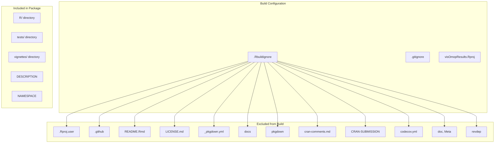
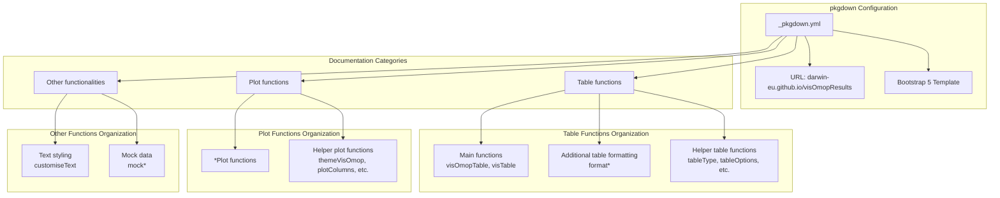
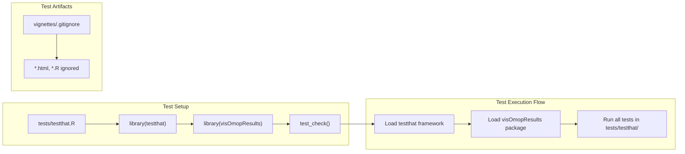
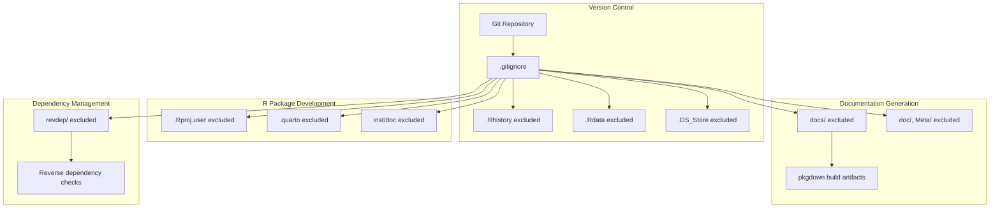
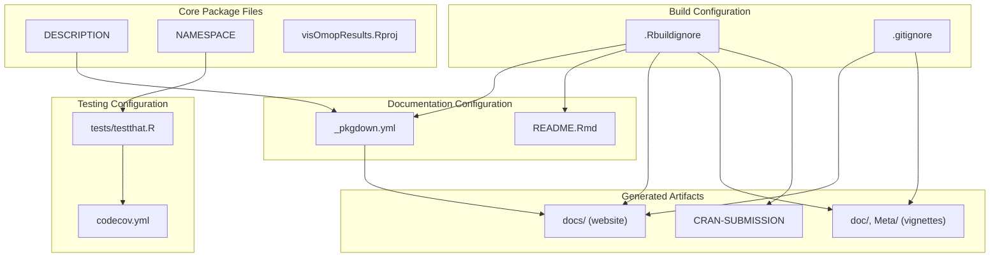

# Page: Package Development

# Package Development

Relevant source files

The following files were used as context for generating this wiki page:

- [.Rbuildignore](.Rbuildignore)
- [.gitignore](.gitignore)
- [_pkgdown.yml](_pkgdown.yml)
- [tests/testthat.R](tests/testthat.R)
- [vignettes/.gitignore](vignettes/.gitignore)

This document provides technical guidance for developers contributing to the visOmopResults package. It covers the package's build configuration, documentation structure, testing framework, and development workflow. The content focuses on the technical infrastructure that supports package development rather than the functional APIs.

For information about the package's main functionality, see [Overview](#1). For testing utilities and mock data generation, see [Testing and Mock Data](#5).

## Package Structure and Build Configuration

The visOmopResults package follows standard R package conventions with specific build and documentation configurations. The package structure is controlled by several configuration files that define what gets included in builds and how documentation is generated.

### Build Configuration Files

The package uses `.Rbuildignore` to exclude development files from the built package:

**Package Build Exclusions**

The build configuration excludes development and documentation files while preserving core package components. Key exclusions include:

| File/Directory | Purpose | Exclusion Reason |
|----------------|---------|------------------|
| `.Rproj.user` | RStudio user settings | Development-specific |
| `.github` | GitHub workflows | CI/CD configuration |
| `docs`, `pkgdown` | Generated documentation | Build artifacts |
| `revdep` | Reverse dependency checks | Development tooling |
| `doc`, `Meta` | Built vignettes | Generated content |

Sources: [.Rbuildignore:1-14](), [.gitignore:1-11]()

## Documentation System Architecture

The package uses pkgdown for generating its documentation website, with a structured organization of functions and topics defined in the configuration.

### pkgdown Configuration Structure

**Function Organization Pattern**

The pkgdown configuration uses pattern matching to automatically categorize functions:

| Pattern | Functions Matched | Purpose |
|---------|------------------|---------|
| `matches("visOmopTable\|visTable")` | `visOmopTable`, `visTable` | Main table functions |
| `matches("format")` | `formatMinCellCount`, `formatEstimateValue`, etc. | Formatting pipeline |
| `ends_with("Plot")` | `barPlot`, `scatterPlot`, `boxPlot` | Plotting functions |
| `matches("themeVisOmop\|plotColumns\|themeDarwin")` | Theme and styling functions | Plot customization |
| `contains("customiseText")` | Text formatting utilities | Text styling |
| `matches("mock")` | Mock data generators | Testing utilities |

Sources: [_pkgdown.yml:1-31]()

## Testing Framework Configuration

The package uses testthat for unit testing with a standard configuration that integrates with the package's development workflow.

### Test Configuration

**Test Framework Components**

The testing configuration follows testthat best practices:

- **Test Runner**: [`tests/testthat.R`]() provides the standard testthat setup
- **Library Loading**: Explicitly loads both `testthat` and `visOmopResults` packages
- **Test Discovery**: Uses `test_check("visOmopResults")` to automatically discover and run tests
- **Vignette Artifacts**: Excludes generated HTML and R files from version control

Sources: [tests/testthat.R:1-12](), [vignettes/.gitignore:1-2]()

## Development Workflow Integration

The package development workflow integrates several tools and processes to ensure code quality and documentation consistency.

### Git and Build Integration

**Development File Management**

The development workflow excludes various file types to maintain a clean repository:

| File Category | Examples | Management Strategy |
|---------------|----------|-------------------|
| R Session Files | `.Rhistory`, `.Rdata` | Excluded from git |
| IDE Files | `.Rproj.user`, `.DS_Store` | Excluded from git |
| Generated Documentation | `docs/`, `inst/doc` | Build artifacts excluded |
| Development Tools | `revdep/`, `.quarto` | Tool-specific exclusions |

**Package Website Deployment**

The package website is configured to deploy to `https://darwin-eu.github.io/visOmopResults/` using GitHub Pages integration with pkgdown's Bootstrap 5 template.

Sources: [.gitignore:1-11](), [_pkgdown.yml:1-3]()

## Configuration Dependencies

The package development infrastructure relies on several key configuration relationships that developers should understand when making changes.

### Configuration File Relationships

**Configuration Dependencies**

Key relationships between configuration files:

- **Build Exclusions**: `.Rbuildignore` must exclude files referenced in `.gitignore` for generated content
- **Documentation Generation**: `_pkgdown.yml` relies on `DESCRIPTION` and `NAMESPACE` for function discovery
- **Test Integration**: `tests/testthat.R` must load the package defined in `DESCRIPTION`
- **Website Deployment**: Generated `docs/` directory must be excluded from builds but included in git for GitHub Pages

Sources: [.Rbuildignore:6-14](), [_pkgdown.yml:1-31](), [tests/testthat.R:9-12]()