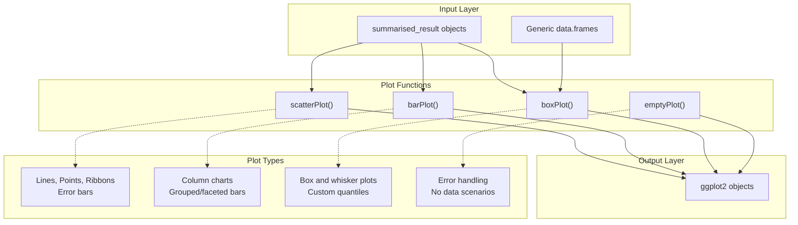
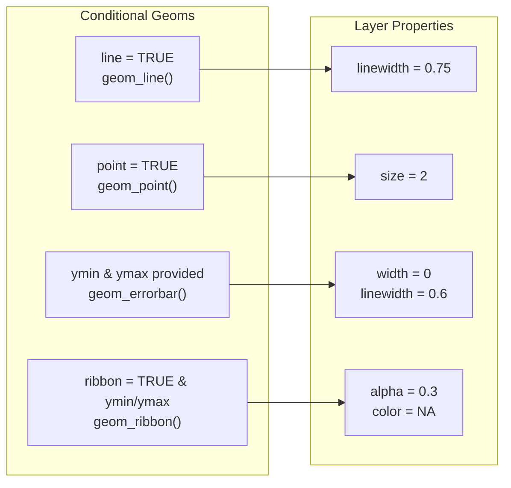
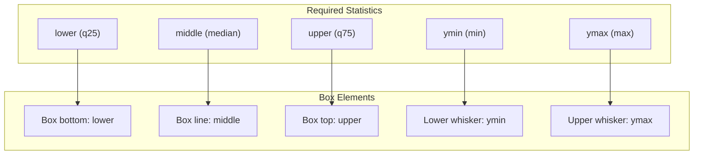
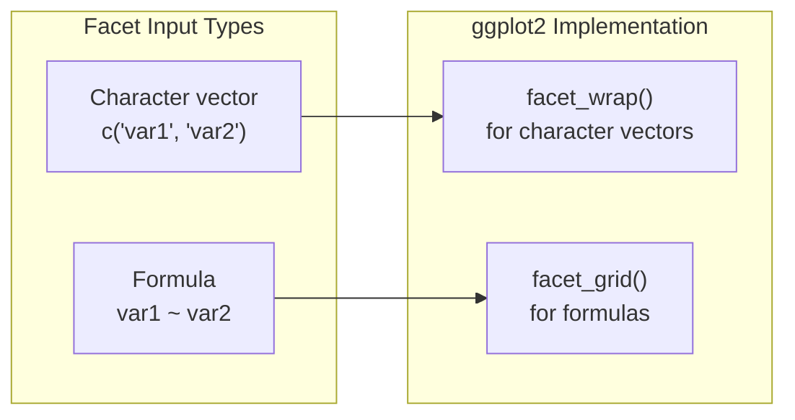

# Page: Plot Functions and Usage

# Plot Functions and Usage

Relevant source files

The following files were used as context for generating this wiki page:

- [R/plot.R](R/plot.R)
- [R/plottingThemes.R](R/plottingThemes.R)
- [man/barPlot.Rd](man/barPlot.Rd)
- [man/boxPlot.Rd](man/boxPlot.Rd)
- [man/scatterPlot.Rd](man/scatterPlot.Rd)
- [man/themeVisOmop.Rd](man/themeVisOmop.Rd)
- [tests/testthat/test-plot.R](tests/testthat/test-plot.R)

This document provides comprehensive documentation for the individual plotting functions in visOmopResults, including `scatterPlot()`, `barPlot()`, `boxPlot()`, and `emptyPlot()`. It covers their parameters, data requirements, customization options, and the underlying data processing pipeline that transforms `summarised_result` objects into `ggplot2` visualizations.

For information about plot themes and styling options, see [Plot Themes and Styling](#3.2). For the broader plot generation system architecture, see [Plot Generation System](#3).

## Plot Functions Overview

The visOmopResults package provides four primary plotting functions that create different types of visualizations from OMOP analysis results:

Sources: [R/plot.R:17-365]()

## Data Processing Pipeline

All plot functions follow a standardized data processing pipeline that transforms input data into visualization-ready format:

```mermaid
flowchart LR
    subgraph "Input Validation"
        INPUT["Input Data"]
        VALIDATE_PARAMS["Parameter Validation"]
        EMPTY_CHECK["Empty Data Check"]
    end
    
    subgraph "Data Preparation"
        CHECK_COLS["checkInData()"]
        CLEAN_EST["cleanEstimates()"]
        TIDY["tidyResult()"]
        WARN_MULTI["warnMultipleValues()"]
    end
    
    subgraph "Column Processing"
        PREP_COLS["prepareColumns()"]
        ADD_LABELS["addLabels()"]
        GET_AES["getAes()"]
    end
    
    subgraph "ggplot Construction"
        GGPLOT_BASE["ggplot() base"]
        ADD_GEOMS["Add geom layers"]
        ADD_FACETS["plotFacet()"]
        ADD_THEME["Apply style theme"]
    end
    
    INPUT --> VALIDATE_PARAMS
    VALIDATE_PARAMS --> EMPTY_CHECK
    EMPTY_CHECK --> CHECK_COLS
    CHECK_COLS --> CLEAN_EST
    CLEAN_EST --> TIDY
    TIDY --> WARN_MULTI
    WARN_MULTI --> PREP_COLS
    PREP_COLS --> ADD_LABELS
    ADD_LABELS --> GET_AES
    GET_AES --> GGPLOT_BASE
    GGPLOT_BASE --> ADD_GEOMS
    ADD_GEOMS --> ADD_FACETS
    ADD_FACETS --> ADD_THEME
```

Sources: [R/plot.R:54-138](), [R/plot.R:367-512]()

## scatterPlot() Function

The `scatterPlot()` function creates scatter plots with optional lines, points, ribbons, and error bars from `summarised_result` objects.

### Parameters and Usage

| Parameter | Type | Description | Default |
|-----------|------|-------------|---------|
| `result` | `<summarised_result>` | Input data object | Required |
| `x` | `character` | Column/estimate for x-axis | Required |
| `y` | `character` | Column/estimate for y-axis | Required |
| `line` | `logical` | Add line layer with `geom_line()` | Required |
| `point` | `logical` | Add point layer with `geom_point()` | Required |
| `ribbon` | `logical` | Add ribbon layer with `geom_ribbon()` | Required |
| `ymin` | `character` | Lower error bar limit | `NULL` |
| `ymax` | `character` | Upper error bar limit | `NULL` |
| `facet` | `character/formula` | Faceting variables | `NULL` |
| `colour` | `character` | Color grouping variable | `NULL` |
| `group` | `character` | Grouping variable | `colour` |
| `style` | `character` | Theme style ("default", "darwin", `NULL`) | "default" |
| `label` | `character` | Interactive labels for plotly | `character()` |

### Geometric Layers

The function builds plots by conditionally adding ggplot2 geometric layers:

Sources: [R/plot.R:108-118]()

## barPlot() Function

The `barPlot()` function creates column/bar charts using `geom_col()` for displaying categorical data with numeric values.

### Parameters

| Parameter | Type | Description | Default |
|-----------|------|-------------|---------|
| `result` | `<summarised_result>` | Input data object | Required |
| `x` | `character` | Column/estimate for x-axis | Required |
| `y` | `character` | Column/estimate for y-axis | Required |
| `width` | `numeric` | Bar width as in `geom_col()` | `NULL` |
| `just` | `numeric` | Bar justification (0-1) | 0.5 |
| `facet` | `character/formula` | Faceting variables | `NULL` |
| `colour` | `character` | Color/fill grouping | `NULL` |
| `style` | `character` | Theme style | "default" |
| `label` | `character` | Interactive labels | `character()` |

### Implementation Details

The function uses `geom_col()` with `position = "dodge"` to create grouped bars when color grouping is specified.

Sources: [R/plot.R:266-348]()

## boxPlot() Function

The `boxPlot()` function creates box and whisker plots using `geom_boxplot()` with `stat = "identity"` to use pre-computed quantile values.

### Parameters

| Parameter | Type | Description | Default |
|-----------|------|-------------|---------|
| `result` | `<summarised_result>` | Input data object | Required |
| `x` | `character` | Column/estimate for x-axis | Required |
| `lower` | `character` | Lower quartile estimate name | "q25" |
| `middle` | `character` | Median estimate name | "median" |
| `upper` | `character` | Upper quartile estimate name | "q75" |
| `ymin` | `character` | Minimum value estimate | "min" |
| `ymax` | `character` | Maximum value estimate | "max" |
| `facet` | `character/formula` | Faceting variables | `NULL` |
| `colour` | `character` | Color grouping | `NULL` |
| `style` | `character` | Theme style | "default" |
| `label` | `character` | Interactive labels | `character()` |

### Box Plot Construction

The function expects pre-computed quantile statistics and uses `stat = "identity"` with `position = "dodge2"`:

Sources: [R/plot.R:153-247]()

## emptyPlot() Function

The `emptyPlot()` function provides a fallback visualization when data is empty or invalid, preventing errors in visualization workflows.

### Parameters

| Parameter | Type | Description | Default |
|-----------|------|-------------|---------|
| `title` | `character` | Plot title | "No data to plot" |
| `subtitle` | `character` | Plot subtitle | "" |

Sources: [R/plot.R:361-365]()

## Common Parameters and Behaviors

### Faceting Support

All plot functions support faceting through the `facet` parameter, which accepts either character vectors or formulas:

Sources: [R/plot.R:391-400](), [R/plot.R:401-405]()

### Style System Integration

All plot functions integrate with the theming system by accepting a `style` parameter:

- `"default"`: Applies `themeVisOmop()`
- `"darwin"`: Applies `themeDarwin()`  
- `NULL`: Uses standard ggplot2 styling
- Global default can be set via `getOption("visOmopResults.plotStyle")`

Sources: [R/plot.R:67-71](), [R/plot.R:129-137]()

### Input Validation Pipeline

Each function performs comprehensive validation using utility functions:

| Function | Purpose | Location |
|----------|---------|----------|
| `omopgenerics::assertTable()` | Validates input data structure | Used in all functions |
| `checkInData()` | Verifies required columns exist | [R/plot.R:447-460]() |
| `validateFacet()` | Validates facet parameter format | [R/plot.R:401-405]() |
| `warnMultipleValues()` | Warns about ambiguous groupings | [R/plot.R:406-427]() |

### Error Handling

All plot functions handle empty data gracefully by returning `emptyPlot()` with appropriate warnings:

Sources: [R/plot.R:74-77](), [R/plot.R:185-188](), [R/plot.R:292-295]()

## Supporting Utility Functions

### Data Transformation Functions

| Function | Purpose | Implementation |
|----------|---------|----------------|
| `tidyResult()` | Converts `summarised_result` to tidy format | [R/plot.R:367-373]() |
| `cleanEstimates()` | Filters to relevant estimate names | [R/plot.R:439-446]() |
| `prepareColumns()` | Handles multi-column groupings | [R/plot.R:461-476]() |
| `getAes()` | Constructs ggplot2 aesthetics mapping | [R/plot.R:374-390]() |

### Label and Style Utilities

| Function | Purpose | Implementation |
|----------|---------|----------------|
| `styleLabel()` | Formats column names for display | [R/plot.R:493-502]() |
| `hideLegend()` | Determines legend visibility | [R/plot.R:503-505]() |
| `addLabels()` | Adds interactive plot labels | [R/plot.R:506-512]() |

Sources: [R/plot.R:367-512]()