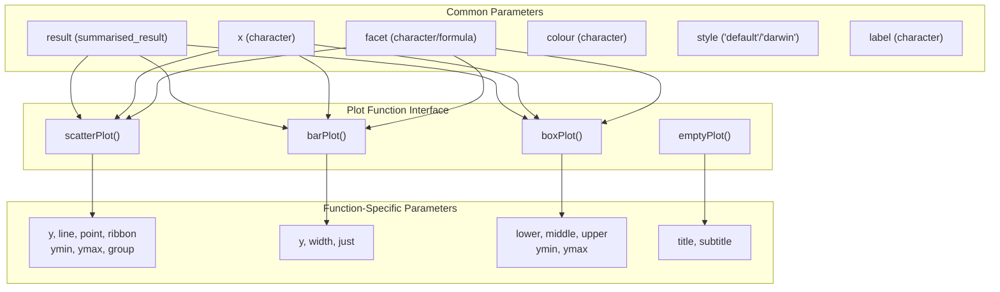
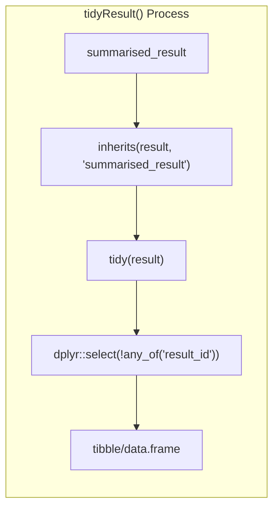
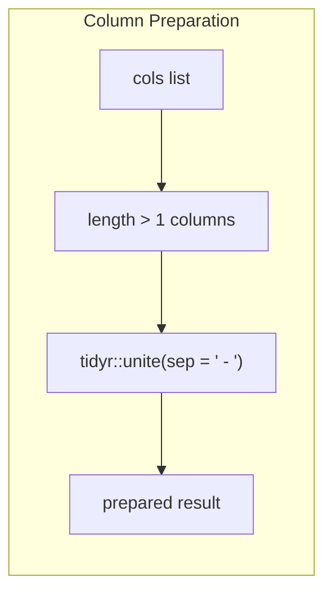
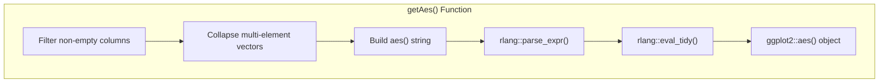
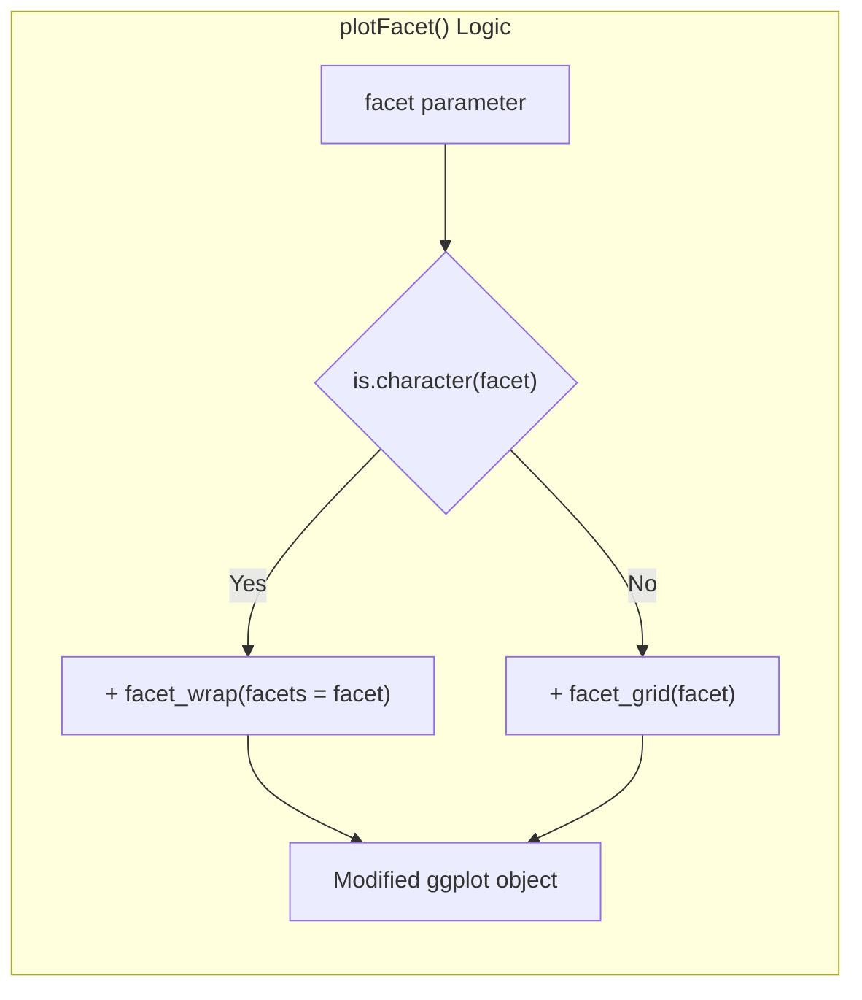
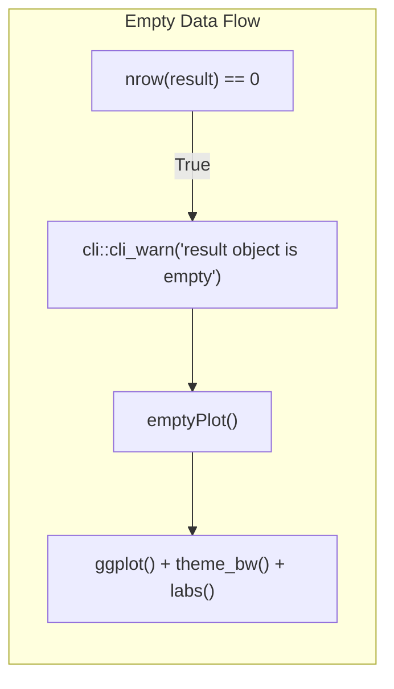
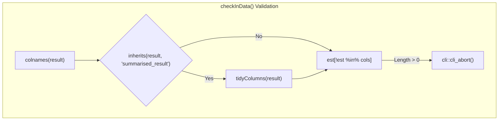
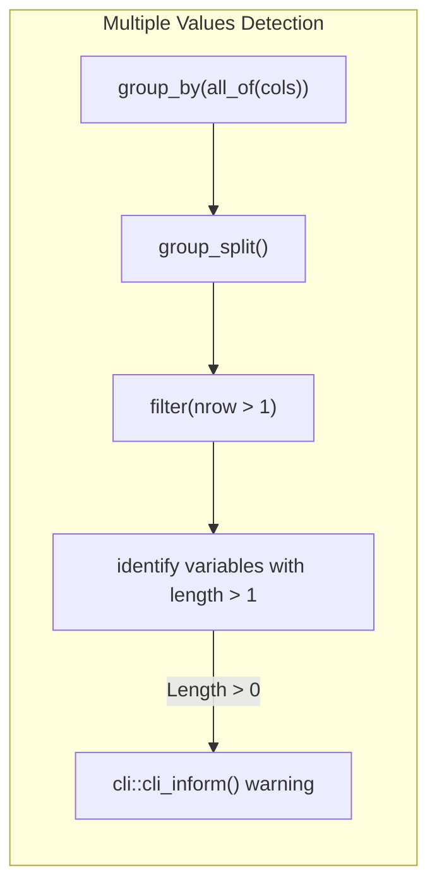

# Page: Plot Generation System

# Plot Generation System

Relevant source files

The following files were used as context for generating this wiki page:

- [R/plot.R](R/plot.R)
- [tests/testthat/test-plot.R](tests/testthat/test-plot.R)

## Purpose and Scope

The Plot Generation System provides functions for creating visualizations from OMOP analysis results stored in `summarised_result` objects. This system transforms structured analysis data into publication-ready ggplot2 objects through a standardized pipeline that handles data validation, transformation, and aesthetic mapping.

This document covers the core plotting functions and their data processing workflow. For information about plot styling and themes, see [Plot Themes and Styling](#3.2). For table-based visualizations of the same data, see [Table Generation System](#2).

## Core Plot Functions

The system provides three main visualization types through dedicated functions that follow a consistent interface pattern:

| Function | Purpose | Primary Geom | Key Parameters |
|----------|---------|--------------|----------------|
| `scatterPlot()` | Time series and relationship plots | `geom_line()`, `geom_point()` | `line`, `point`, `ribbon` |
| `barPlot()` | Categorical data visualization | `geom_col()` | `width`, `just` |
| `boxPlot()` | Distribution summaries | `geom_boxplot()` | `lower`, `middle`, `upper` |
| `emptyPlot()` | Error state handling | None | `title`, `subtitle` |

Sources: [R/plot.R:17-348]()

## Data Processing Pipeline

The plot generation follows a standardized pipeline that transforms `summarised_result` objects into ggplot-ready data structures:

```mermaid
flowchart LR
    subgraph "Input Validation"
        INPUT["summarised_result object"]
        VALIDATE_TABLE["omopgenerics::assertTable()"]
        VALIDATE_PARAMS["Parameter validation"]
        EMPTY_CHECK["nrow() == 0 check"]
    end
    
    subgraph "Data Extraction"
        EST_LIST["est = c(x, y, facet, colour, ...)"]
        CHECK_DATA["checkInData()"]
        CLEAN_EST["cleanEstimates()"]
    end
    
    subgraph "Data Transformation"
        TIDY_RESULT["tidyResult()"]
        WARN_MULTIPLE["warnMultipleValues()"]
        PREP_COLS["prepareColumns()"]
    end
    
    subgraph "Aesthetic Mapping"
        COLS_LIST["cols = list(x, y, colour, ...)"]
        ADD_LABELS["addLabels()"]
        GET_AES["getAes()"]
    end
    
    INPUT --> VALIDATE_TABLE
    VALIDATE_TABLE --> VALIDATE_PARAMS
    VALIDATE_PARAMS --> EMPTY_CHECK
    EMPTY_CHECK --> EST_LIST
    
    EST_LIST --> CHECK_DATA
    CHECK_DATA --> CLEAN_EST
    CLEAN_EST --> TIDY_RESULT
    
    TIDY_RESULT --> WARN_MULTIPLE
    WARN_MULTIPLE --> PREP_COLS
    PREP_COLS --> COLS_LIST
    
    COLS_LIST --> ADD_LABELS
    ADD_LABELS --> GET_AES
    GET_AES --> GGPLOT_CONSTRUCTION["ggplot() construction"]
```

Sources: [R/plot.R:54-104](), [R/plot.R:367-512]()

## Plot Construction Workflow

Each plot function follows a consistent workflow for building the final ggplot2 object:

### Data Preparation Phase

The `tidyResult()` function handles `summarised_result` objects by calling the `tidy()` method and removing unnecessary columns:

The `prepareColumns()` function handles multi-column mappings by uniting them with separators:

Sources: [R/plot.R:367-373](), [R/plot.R:461-492]()

### Aesthetic Generation

The `getAes()` function dynamically constructs ggplot2 aesthetic mappings:

Sources: [R/plot.R:374-390]()

## Integration with ggplot2

The system builds ggplot2 objects through layered construction with conditional geometry addition:

### ScatterPlot Construction

```mermaid
graph TB
    subgraph "scatterPlot() ggplot2 Construction"
        BASE_PLOT["ggplot(data, aes)"]
        
        subgraph "Conditional Geoms"
            LINE_CHECK{"line == TRUE"}
            LINE_GEOM["+ geom_line(linewidth = 0.75)"]
            
            ERRORBAR_CHECK{"ymin & ymax exist"}
            ERRORBAR_GEOM["+ geom_errorbar(width = 0, linewidth = 0.6)"]
            
            POINT_CHECK{"point == TRUE"}
            POINT_GEOM["+ geom_point(size = 2)"]
            
            RIBBON_CHECK{"ribbon & ymin & ymax"}
            RIBBON_GEOM["+ geom_ribbon(alpha = .3, color = NA)"]
        end
        
        FACET_CHECK{"length(facet) > 0"}
        FACET_LAYER["plotFacet()"]
        
        LABELS["+ labs(x, y, fill, colour)"]
        THEME_LAYER["+ theme modifications"]
        STYLE_APPLICATION["Apply style theme"]
    end
    
    BASE_PLOT --> LINE_CHECK
    LINE_CHECK -->|Yes| LINE_GEOM
    LINE_GEOM --> ERRORBAR_CHECK
    ERRORBAR_CHECK -->|Yes| ERRORBAR_GEOM
    ERRORBAR_GEOM --> POINT_CHECK
    POINT_CHECK -->|Yes| POINT_GEOM
    POINT_GEOM --> RIBBON_CHECK
    RIBBON_CHECK -->|Yes| RIBBON_GEOM
    
    RIBBON_GEOM --> FACET_CHECK
    FACET_CHECK -->|Yes| FACET_LAYER
    FACET_LAYER --> LABELS
    LABELS --> THEME_LAYER
    THEME_LAYER --> STYLE_APPLICATION
```

Sources: [R/plot.R:107-140]()

### Faceting System

The `plotFacet()` function handles both character vector and formula-based faceting:

Sources: [R/plot.R:391-400]()

## Error Handling and Validation

The system includes comprehensive validation and graceful error handling:

### Empty Data Handling

When `nrow(result) == 0`, all plot functions return an `emptyPlot()` with appropriate warning:

### Data Validation

The `checkInData()` function ensures required columns are present:

### Multiple Values Warning

The `warnMultipleValues()` function identifies potential data conflicts:

Sources: [R/plot.R:74-77](), [R/plot.R:184-188](), [R/plot.R:292-295](), [R/plot.R:447-460](), [R/plot.R:406-427](), [R/plot.R:361-365]()