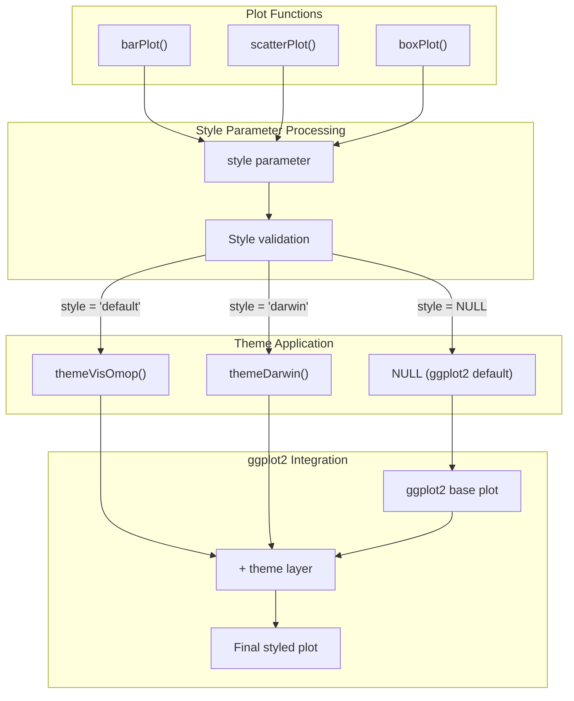
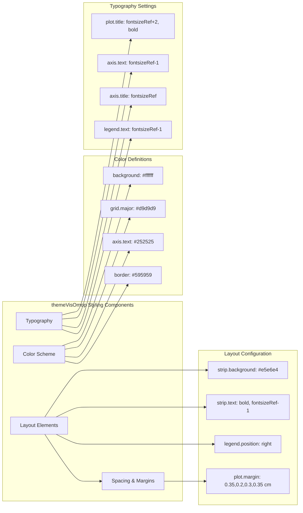
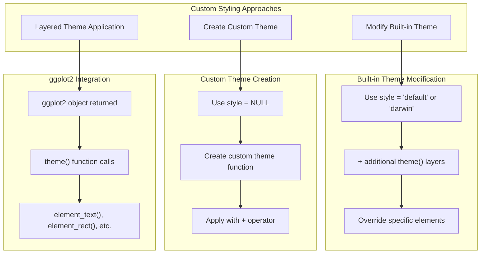
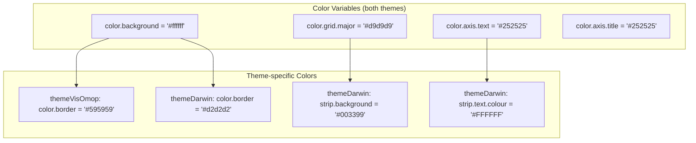

# Page: Plot Themes and Styling

# Plot Themes and Styling

<details>
<summary>Relevant source files</summary>

The following files were used as context for generating this wiki page:

- [R/plottingThemes.R](R/plottingThemes.R)
- [man/barPlot.Rd](man/barPlot.Rd)
- [man/boxPlot.Rd](man/boxPlot.Rd)
- [man/scatterPlot.Rd](man/scatterPlot.Rd)
- [man/themeVisOmop.Rd](man/themeVisOmop.Rd)

</details>


This document covers the visual theming and styling system for plots generated by visOmopResults. The package provides built-in themes for consistent plot appearance and supports custom styling through ggplot2 integration.

For information about plot function usage and parameters, see [Plot Functions and Usage](#3.1). For details about the overall plot generation architecture, see [Plot Generation System](#3).

## Theme System Overview

The visOmopResults package implements a theming system that provides consistent visual styling across all plot types. The system is built on top of ggplot2's theming capabilities and integrates seamlessly with the plot generation pipeline.



**Theme Integration Architecture**

Sources: [R/plottingThemes.R:35-125](), [man/barPlot.Rd:36-38](), [man/scatterPlot.Rd:47-49](), [man/boxPlot.Rd:43-45]()

## Built-in Themes

The package provides two predefined themes designed for different use cases and organizational requirements.

### themeVisOmop - Default Theme

The `themeVisOmop()` function provides the package's default styling with a clean, professional appearance suitable for scientific publications.



**themeVisOmop Component Structure**

Key styling characteristics:
- **Neutral color palette**: White background with gray grid lines and borders
- **Consistent typography**: Scalable font sizes based on `fontsizeRef` parameter (default: 10)
- **Subtle facet styling**: Light gray facet strip backgrounds with bold text
- **Professional grid**: Light gray major grid lines for easy data reading

Sources: [R/plottingThemes.R:35-69](), [man/themeVisOmop.Rd:1-27]()

### themeDarwin - Darwin EU Theme

The `themeDarwin()` function implements the Darwin EU organizational branding with distinctive blue accents and white text on colored backgrounds.

| Component | themeVisOmop | themeDarwin | Purpose |
|-----------|--------------|-------------|---------|
| Facet strip background | `#e5e6e4` (light gray) | `#003399` (Darwin blue) | Brand identification |
| Facet text color | Default (dark) | `#FFFFFF` (white) | Contrast on blue background |
| Border color | `#595959` (dark gray) | `#d2d2d2` (light gray) | Softer appearance |
| Strip border | `color.border` | `#ffffff` (white) for x, `#003399` for y | Directional distinction |

The Darwin theme maintains the same typography scaling and layout structure as the default theme while applying organizational branding through strategic color choices.

Sources: [R/plottingThemes.R:89-125]()

## Applying Themes to Plots

Themes are applied through the `style` parameter available in all plot functions: `barPlot()`, `scatterPlot()`, and `boxPlot()`.

### Style Parameter Options

| Style Value | Theme Applied | Use Case |
|-------------|---------------|----------|
| `"default"` | `themeVisOmop()` | General scientific publications |
| `"darwin"` | `themeDarwin()` | Darwin EU branded materials |
| `NULL` | ggplot2 default | Custom styling or minimal appearance |

### Example Usage

```r
# Apply default visOmopResults styling
barPlot(result, x = "cohort_name", y = "mean", style = "default")

# Apply Darwin EU branding
barPlot(result, x = "cohort_name", y = "mean", style = "darwin") 

# Use base ggplot2 styling for custom themes
barPlot(result, x = "cohort_name", y = "mean", style = NULL) + custom_theme()
```

Sources: [man/barPlot.Rd:36-38](), [man/scatterPlot.Rd:47-49](), [man/boxPlot.Rd:43-45]()

## Custom Styling and Extensions

The package's theming system is designed to work seamlessly with ggplot2's theming capabilities, enabling extensive customization.



**Custom Styling Architecture**

### Font Size Customization

Both built-in themes accept a `fontsizeRef` parameter for consistent typography scaling:

```r
# Larger text for presentations
barPlot(result, x = "cohort", y = "mean", style = "default") + 
  themeVisOmop(fontsizeRef = 14)

# Smaller text for dense layouts  
barPlot(result, x = "cohort", y = "mean", style = "darwin") + 
  themeDarwin(fontsizeRef = 8)
```

### Theme Extension Examples

```r
# Modify built-in theme
plot <- barPlot(result, x = "cohort", y = "mean", style = "default")
plot + theme(
  legend.position = "bottom",
  axis.text.x = element_text(angle = 45, hjust = 1)
)

# Complete custom theme
plot <- barPlot(result, x = "cohort", y = "mean", style = NULL)  
plot + theme_minimal() + theme(
  strip.text = element_text(face = "bold"),
  panel.grid.minor = element_blank()
)
```

Sources: [R/plottingThemes.R:35-69](), [R/plottingThemes.R:89-125]()

## Technical Implementation Details

The theming system is implemented through ggplot2's layered grammar of graphics, with themes applied as additional layers to the base plot object.

### Theme Function Structure

Both `themeVisOmop()` and `themeDarwin()` follow a consistent implementation pattern:

1. **Parameter validation**: `omopgenerics::assertNumeric(fontsizeRef)`
2. **Color definition**: Local variables for consistent color usage
3. **Base theme**: Start with `ggplot2::theme_bw()`
4. **Element customization**: Override specific theme elements
5. **Return**: ggplot2 theme object for layer addition

### Color System



**Color System Architecture**

The consistent color variable naming pattern enables easy maintenance and potential extension to additional themes.

Sources: [R/plottingThemes.R:37-42](), [R/plottingThemes.R:91-95]()