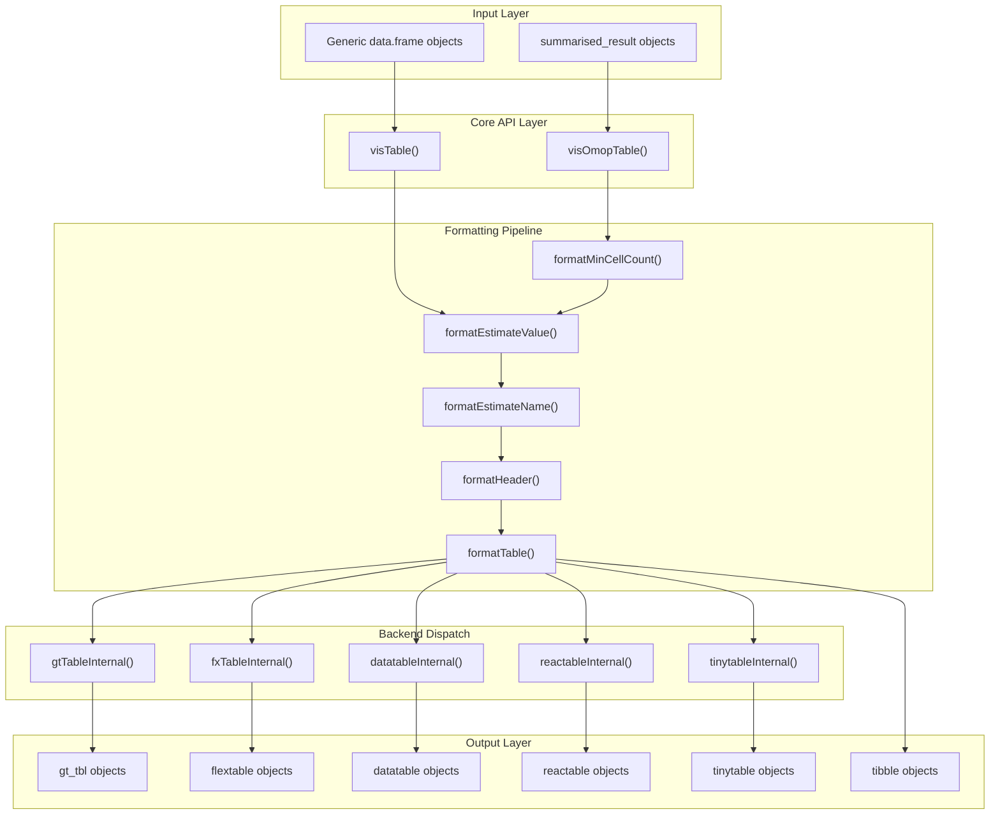
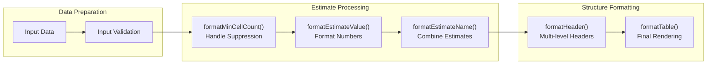
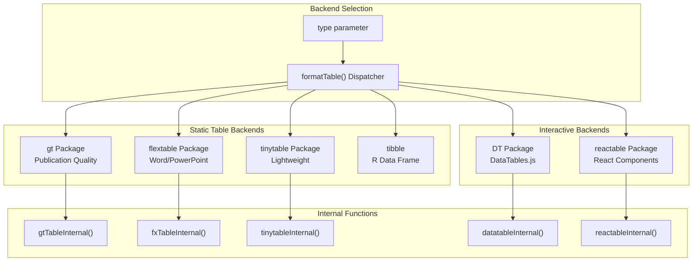
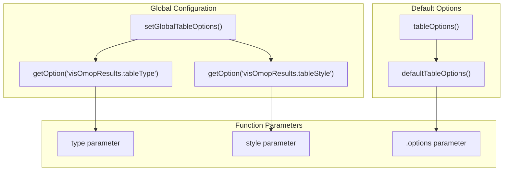

# Page: Table Generation System

# Table Generation System

Relevant source files

The following files were used as context for generating this wiki page:

- [CRAN-SUBMISSION](CRAN-SUBMISSION)
- [R/visOmopTable.R](R/visOmopTable.R)
- [man/visOmopResults-package.Rd](man/visOmopResults-package.Rd)
- [man/visOmopTable.Rd](man/visOmopTable.Rd)
- [tests/testthat/test-visOmopTable.R](tests/testthat/test-visOmopTable.R)
- [tests/testthat/test-visTable.R](tests/testthat/test-visTable.R)
- [vignettes/a01_tables.Rmd](vignettes/a01_tables.Rmd)
- [visOmopResults.Rproj](visOmopResults.Rproj)

## Purpose and Scope

The Table Generation System is the primary feature of visOmopResults, responsible for transforming OMOP analysis results and generic data frames into publication-ready tables. This system provides a comprehensive pipeline that handles data formatting, multi-level headers, estimate combinations, and output to multiple table rendering backends.

This document covers the table generation architecture, core functions, formatting pipeline, and rendering system. For information about plot generation, see [Plot Generation System](#3). For data processing utilities, see [Data Processing and Utilities](#4).

## System Architecture

The table generation system follows a layered architecture with distinct phases: input processing, formatting pipeline, and backend rendering.

### Overall System Flow

Sources: [R/visOmopTable.R:64-158](), [tests/testthat/test-visOmopTable.R:1-157](), [vignettes/a01_tables.Rmd:40-127]()

## Core Table Functions

The system provides two main entry points for table generation, each serving different use cases.

### visOmopTable Function

The `visOmopTable()` function is specifically designed for `summarised_result` objects and provides OMOP-specific enhancements:

| Feature | Description |
|---------|-------------|
| **Automatic Processing** | Always processes input through `splitAll()` for consistent column structure |
| **Settings Integration** | `settingsColumn` parameter to include study settings in tables |
| **Suppressed Data Handling** | `showMinCellCount` parameter to display suppressed estimates |
| **OMOP Header Shortcuts** | Accepts OMOP-specific header values like "strata", "group", "settings" |
| **Default Column Hiding** | Automatically hides `result_id` and `estimate_type` columns |

```mermaid
graph TB
    subgraph "visOmopTable Processing"
        INPUT["summarised_result input"]
        VAL["validateResultArgument()"]
        SHOWMIN["validateShowMinCellCount()"]
        SETTINGS["validateSettingsColumn()"]
        BC["backwardCompatibility()"]
        TIDY["tidySummarisedResult()"]
        FACTOR["validateFactor()"]
        RENAME["validateRename()"]  
        GROUP["validateGroupColumn()"]
        VISTABLE["visTable()"]
    end
    
    INPUT --> VAL
    VAL --> SHOWMIN
    SHOWMIN --> SETTINGS
    SETTINGS --> BC
    BC --> TIDY
    TIDY --> FACTOR
    FACTOR --> RENAME
    RENAME --> GROUP
    GROUP --> VISTABLE
```

Sources: [R/visOmopTable.R:64-158](), [man/visOmopTable.Rd:6-21]()

### visTable Function

The `visTable()` function works with any `data.frame` and provides the core table formatting functionality:

| Parameter | Purpose |
|-----------|---------|
| **estimateName** | Combines multiple estimates into formatted strings |
| **header** | Creates multi-level column headers |
| **groupColumn** | Specifies row grouping columns |
| **rename** | Customizes column names |
| **type** | Selects output format (gt, flextable, datatable, reactable, tinytable, tibble) |
| **hide** | Removes specified columns from output |
| **style** | Applies visual styling |

Sources: [tests/testthat/test-visTable.R:1-143](), [vignettes/a01_tables.Rmd:42-96]()

## Formatting Pipeline

The table generation system processes data through a sequential formatting pipeline, where each function transforms the data for the next stage.

### Pipeline Sequence

Sources: [R/visOmopTable.R:86-105](), [vignettes/a01_tables.Rmd:238-461]()

### formatMinCellCount

Handles suppressed estimates by replacing obscured values with minimum cell count indicators. Processes data that has been through `omopgenerics::suppress()`.

**Key Features:**
- Converts suppressed "-" values to `<{minCellCount}` format
- Controlled by `showMinCellCount` parameter
- Distinguishes between suppressed data and missing values

Sources: [R/visOmopTable.R:88-91](), [vignettes/a01_tables.Rmd:254-261]()

### formatEstimateValue

Formats numerical estimates with customizable decimal places, decimal marks, and thousands separators.

**Configuration Options:**
- `decimals`: Per estimate-type or estimate-name decimal specification
- `decimalMark`: Decimal separator symbol (default: ".")  
- `bigMark`: Thousands separator symbol (default: ",")

Sources: [vignettes/a01_tables.Rmd:264-285](), [R/visOmopTable.R:164-187]()

### formatEstimateName

Combines multiple estimates into formatted display strings using template syntax.

**Template Syntax:**
- `<estimate_name>` placeholders for estimate values
- Named patterns like `"N%" = "<count> (<percentage>)"`
- `keepNotFormatted`: Retains unformatted estimates
- `useFormatOrder`: Controls estimate display order

Sources: [vignettes/a01_tables.Rmd:287-311](), [man/visOmopTable.Rd:26-27]()

### formatHeader

Creates multi-level column headers with three header levels:

| Header Level | Key | Description |
|-------------|-----|-------------|
| **Custom Labels** | `header` | User-defined labels not tied to data |
| **Column Names** | `header_name` | Derived from column names |
| **Column Values** | `header_level` | Values within specified header columns |

**Configuration:**
- `delim`: Separator between header levels
- `includeHeaderName`: Include/exclude column name labels
- `includeHeaderKey`: Include/exclude header type prefixes

Sources: [vignettes/a01_tables.Rmd:313-356]()

### formatTable  

The final formatting step that converts processed data frames to rendered table objects.

**Styling System:**
- Pre-defined styles: "default", "darwin"
- Custom styling through style lists
- Backend-specific styling functions

**Table Features:**
- Multi-level headers with `delim` processing
- Row grouping with `groupColumn`
- Column merging for repeated values
- Title, subtitle, and caption support

Sources: [vignettes/a01_tables.Rmd:359-461]()

## Backend Rendering System

The system supports multiple table rendering backends, each optimized for different use cases and output formats.

### Backend Architecture

Sources: [man/visOmopTable.Rd:54-55](), [tests/testthat/test-visOmopTable.R:14-52]()

### Backend Comparison

| Backend | Use Case | Output Formats | Interactive |
|---------|----------|----------------|-------------|
| **gt** | Publication-ready tables | HTML, PNG, PDF, Word | No |
| **flextable** | Office documents | Word, PowerPoint, PDF | No |
| **tinytable** | Lightweight formatting | HTML, LaTeX, Word | No |
| **tibble** | R data analysis | R data.frame | No |
| **datatable** | Web applications | HTML with DataTables.js | Yes |
| **reactable** | Modern web apps | HTML with React | Yes |

Sources: [vignettes/a01_tables.Rmd:24-25]()

## Configuration System

The table generation system provides comprehensive configuration through options, styles, and global settings.

### Configuration Hierarchy  

Sources: [R/visOmopTable.R:77-85](), [R/visOmopTable.R:164-187](), [tests/testthat/test-visOmopTable.R:411-431]()

### Table Options

The `.options` parameter accepts a comprehensive set of formatting controls:

| Category | Options | Source Function |
|----------|---------|-----------------|
| **Value Formatting** | `decimals`, `decimalMark`, `bigMark` | `formatEstimateValue()` |
| **Name Formatting** | `keepNotFormatted`, `useFormatOrder` | `formatEstimateName()` |  
| **Header Formatting** | `delim`, `includeHeaderName`, `includeHeaderKey` | `formatHeader()` |
| **Table Formatting** | `style`, `na`, `title`, `subtitle`, `caption`, `groupAsColumn`, `groupOrder`, `merge` | `formatTable()` |

Sources: [R/visOmopTable.R:164-187](), [vignettes/a01_tables.Rmd:180-233]()

### Style System

The styling system provides both pre-defined and custom styling options:

**Pre-defined Styles:**
- `"default"`: visOmopResults standard styling
- `"darwin"`: DARWIN EU consortium styling  
- `NULL`: Backend default styling

**Custom Styling:**
Backend-specific style objects for granular control over table appearance.

Sources: [tests/testthat/test-visOmopTable.R:393-409](), [vignettes/a01_tables.Rmd:165-177]()