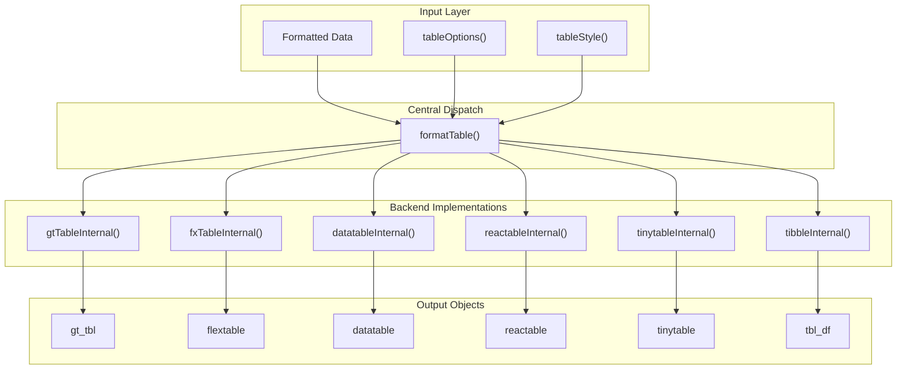
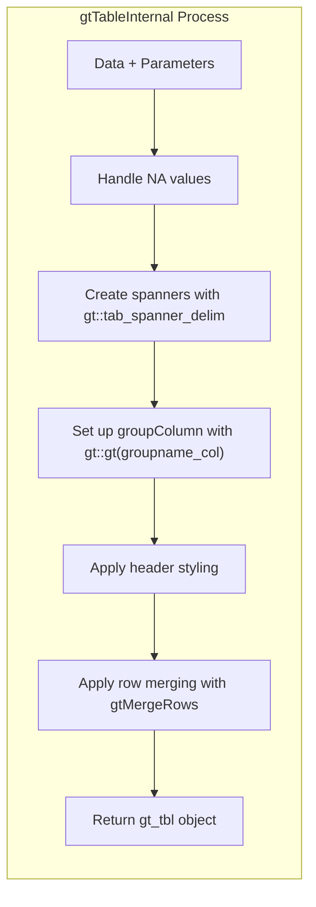
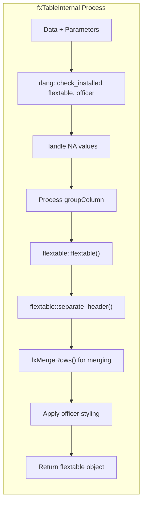
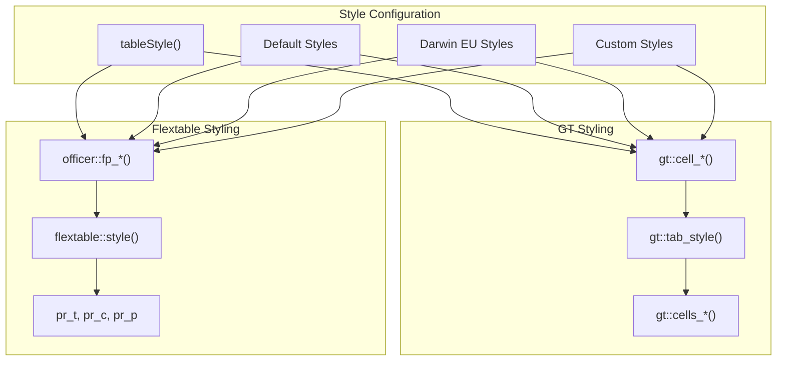
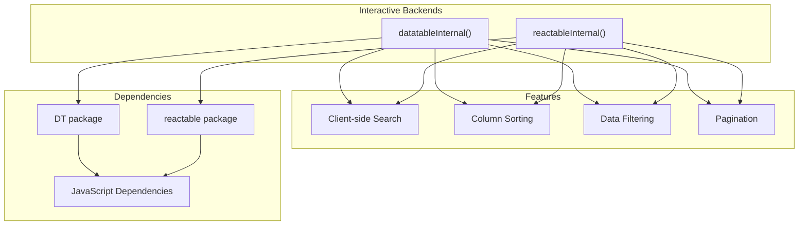
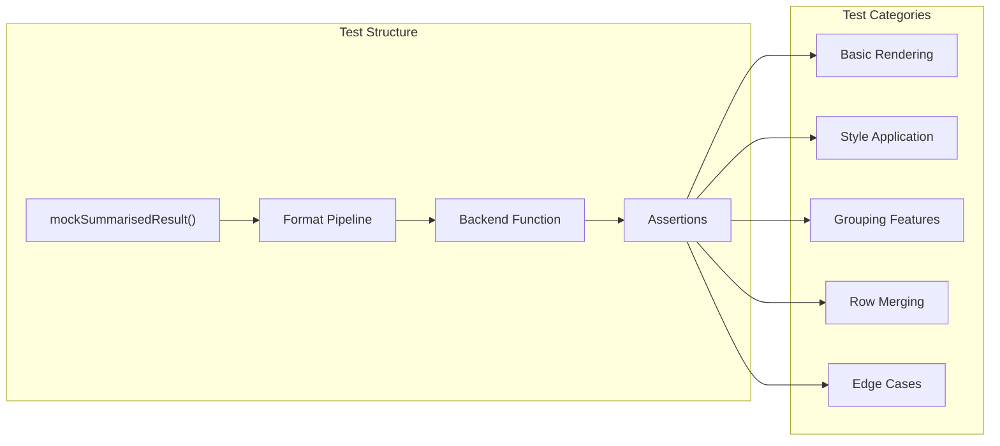

# Page: Table Rendering Backends

# Table Rendering Backends

Relevant source files

The following files were used as context for generating this wiki page:

- [R/fxTable.R](R/fxTable.R)
- [R/gtTable.R](R/gtTable.R)
- [tests/testthat/test-fxTable.R](tests/testthat/test-fxTable.R)
- [tests/testthat/test-gtTable.R](tests/testthat/test-gtTable.R)

This document covers the multi-backend table rendering system in visOmopResults, which allows the same formatted table data to be output in multiple formats including static tables (gt, flextable, tinytable), interactive tables (datatable, reactable), and data objects (tibble). For information about the core table generation functions, see [Core Table Functions](#2.1). For details about the data formatting pipeline that feeds these backends, see [Formatting Pipeline](#2.2).

## Backend Architecture Overview

The table rendering system uses a dispatcher pattern where `formatTable` acts as the central coordinator that routes formatted data to specific backend implementations based on the `type` parameter.

**Backend Selection Logic**

The system determines which backend to use based on the `type` parameter passed to table generation functions:

| Backend | Type Value | Package Dependency | Output Format |
|---------|------------|-------------------|---------------|
| gt | `"gt"` | `gt` | Static HTML table |
| flextable | `"flextable"` | `flextable`, `officer` | Word/PowerPoint compatible |
| datatable | `"datatable"` | `DT` | Interactive HTML table |
| reactable | `"reactable"` | `reactable` | React-based interactive table |
| tinytable | `"tinytable"` | `tinytable` | Lightweight table |
| tibble | `"tibble"` | None | R data.frame |

*Sources: High-level architecture diagrams, R/formatTable.R (inferred), table of contents structure*

## GT Backend Implementation

The `gtTableInternal` function handles rendering tables using the `gt` package, which specializes in publication-quality static tables with sophisticated styling capabilities.

**Key GT-Specific Features:**

- **Spanner Management**: Uses `gt::tab_spanner_delim()` to create hierarchical headers from delimited column names [R/gtTable.R:106]()
- **Group Handling**: Leverages `gt::gt(groupname_col)` for native grouping support [R/gtTable.R:105]()
- **Row Merging**: Custom `gtMergeRows()` function handles cell merging by setting content to empty strings and hiding borders [R/gtTable.R:287-334]()
- **Style Application**: Direct integration with gt's styling system using `gt::tab_style()` [R/gtTable.R:132-277]()

**Header Processing Logic:**

The GT backend identifies different header types using regex patterns on spanner IDs:
- `\[header\]` - Main headers
- `\[header_name\]` - Header names  
- `\[header_level\]` - Header levels
- `\[column_name\]` - Column names

*Sources: R/gtTable.R:56-285, R/gtTable.R:287-334, tests/testthat/test-gtTable.R:1-335*

## Flextable Backend Implementation  

The `fxTableInternal` function renders tables using the `flextable` package, optimized for Microsoft Office integration and complex layout requirements.

**Flextable-Specific Features:**

- **Package Dependencies**: Explicit dependency checking for `flextable` and `officer` packages [R/fxTable.R:69-70]()
- **Group Handling**: More complex group processing with both column and row grouping modes [R/fxTable.R:121-161]()
- **Header Separation**: Uses `flextable::separate_header()` to split multi-level headers [R/fxTable.R:96]()
- **Officer Styling**: Integrates with `officer` package for rich formatting options [R/fxTable.R:166-270]()

**Merge Implementation:**

The `fxMergeRows()` function uses a sophisticated approach:
1. Fills group columns to maintain context [R/fxTable.R:310-325]()
2. Uses `flextable::compose()` to set empty content [R/fxTable.R:353-356]()  
3. Applies transparent borders for visual merging [R/fxTable.R:357-371]()

*Sources: R/fxTable.R:56-375, R/fxTable.R:282-374, tests/testthat/test-fxTable.R:1-348*

## Backend-Specific Styling Systems

Each backend has its own styling approach that integrates with the central `tableStyle()` system:

**Style Structure Mapping:**

| Style Element | GT Implementation | Flextable Implementation |
|---------------|------------------|------------------------|
| Header | `gt::cell_fill()`, `gt::cell_text()` | `officer::fp_cell()`, `officer::fp_text()` |
| Body | `gt::tab_style(locations = gt::cells_body())` | `flextable::style(part = "body")` |
| Group Labels | `gt::cells_row_groups()` | Custom background application |
| Borders | `gt::cell_borders()` | `officer::fp_border()` |

*Sources: R/gtTable.R:132-277, R/fxTable.R:165-263, tests/testthat/test-gtTable.R:158-224, tests/testthat/test-fxTable.R:152-225*

## Interactive Backend Architecture

While the main implementation files show GT and Flextable backends, the system architecture supports interactive table backends through a similar pattern:

**Backend Characteristics:**

- **datatable**: Uses DataTables.js for rich interactivity
- **reactable**: React-based components with modern UI patterns
- **tinytable**: Lightweight alternative with minimal dependencies
- **tibble**: Returns raw data for further processing

*Sources: High-level architecture diagrams, table of contents structure*

## Testing and Backend Validation

Each backend implementation includes comprehensive testing to ensure consistent behavior across different output formats:

**Test Coverage Areas:**

- **Header Processing**: Validates spanner creation and styling [tests/testthat/test-gtTable.R:32-42]()
- **Group Functionality**: Tests both column and row grouping modes [tests/testthat/test-fxTable.R:114-149]()
- **Merge Operations**: Ensures proper cell merging behavior [tests/testthat/test-gtTable.R:226-292]()
- **Style Application**: Verifies correct style inheritance and application [tests/testthat/test-fxTable.R:35-98]()
- **Edge Cases**: Tests error conditions and boundary cases [tests/testthat/test-fxTable.R:332-335]()

*Sources: tests/testthat/test-gtTable.R:1-335, tests/testthat/test-fxTable.R:1-348*