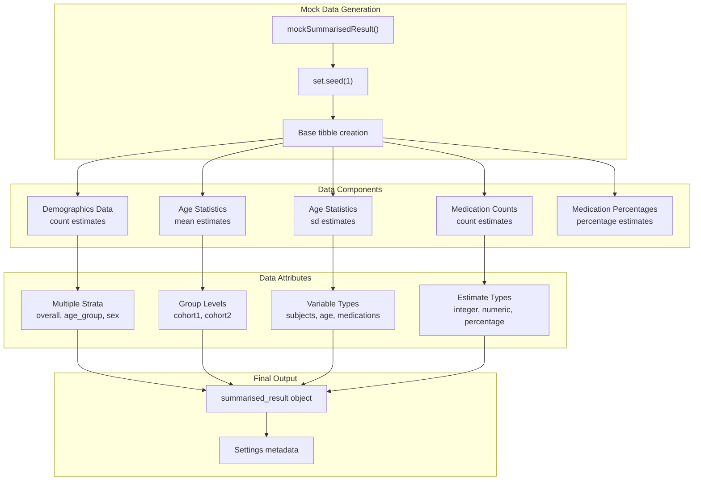
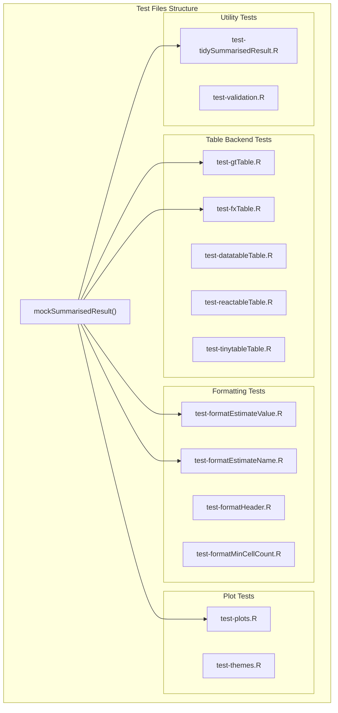
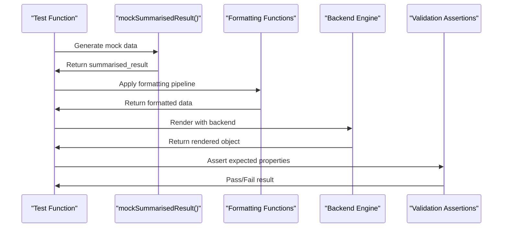
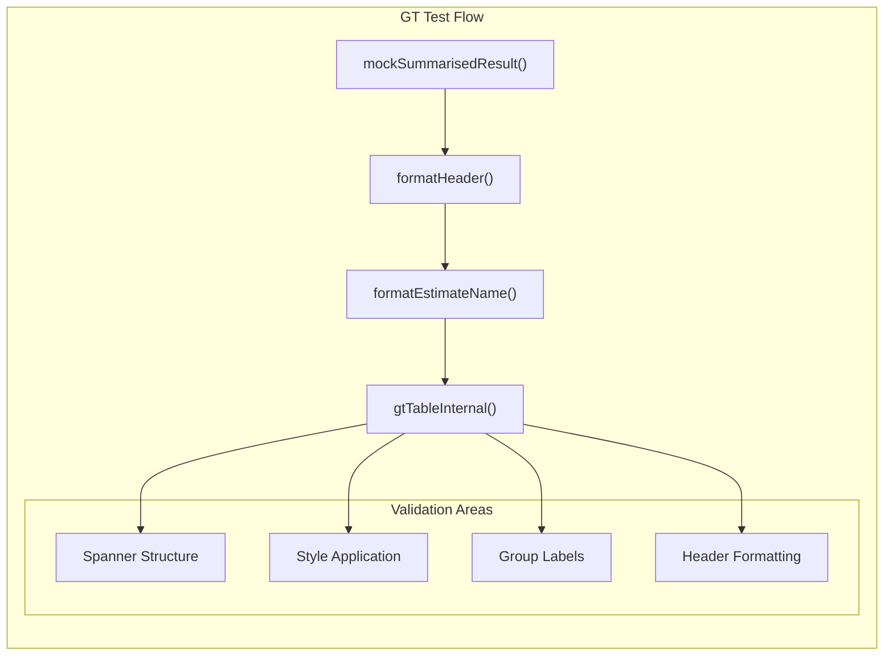
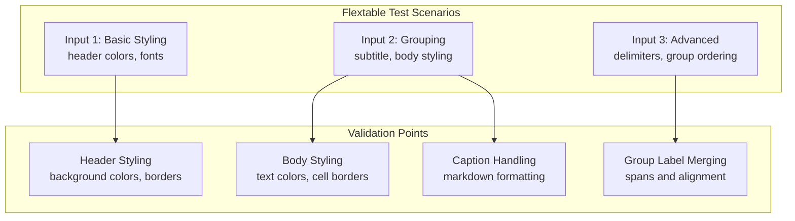
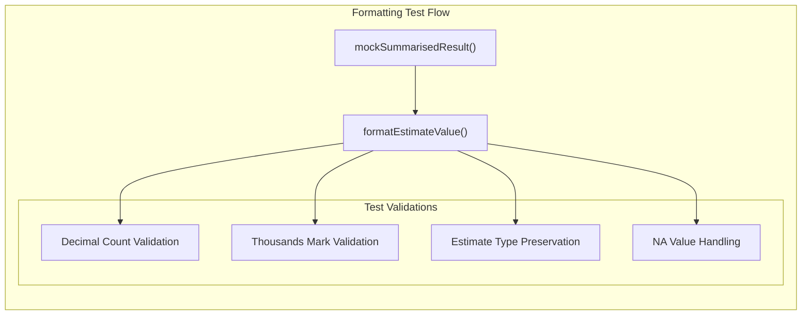
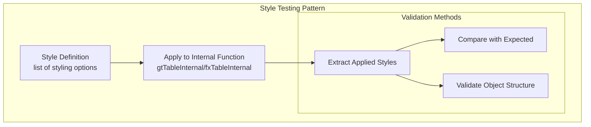

# Page: Testing and Mock Data

# Testing and Mock Data

Relevant source files

The following files were used as context for generating this wiki page:

- [R/formatEstimateValue.R](R/formatEstimateValue.R)
- [R/mockResults.R](R/mockResults.R)
- [man/formatEstimateValue.Rd](man/formatEstimateValue.Rd)
- [tests/testthat/test-formatEstimateValue.R](tests/testthat/test-formatEstimateValue.R)
- [tests/testthat/test-fxTable.R](tests/testthat/test-fxTable.R)
- [tests/testthat/test-gtTable.R](tests/testthat/test-gtTable.R)

## Purpose and Scope

This document covers the testing framework and mock data generation utilities in visOmopResults. The testing system provides comprehensive validation of table and plot generation functionality, while the mock data system creates realistic `summarised_result` objects for testing and documentation examples.

For information about the core table generation functionality being tested, see [Core Table Functions](#2.1). For details about data processing and validation, see [Data Processing and Utilities](#4).

## Mock Data Generation System

The package provides a centralized mock data generation system through the `mockSummarisedResult()` function, which creates realistic test data that covers all major use cases of the visualization system.

### Mock Data Structure

Sources: [R/mockResults.R:28-193]()

The `mockSummarisedResult()` function creates a comprehensive dataset with:
- **18 rows per data type** covering different demographic strata
- **Multiple estimate types**: integer counts, numeric means/standard deviations, percentages
- **Realistic stratification**: overall, age groups, sex, and combinations
- **Multiple cohorts**: cohort1 and cohort2 for group comparisons
- **Medication data**: Amoxiciline and Ibuprofen with counts and percentages

### Mock Data Implementation Details

The function uses a systematic approach to generate consistent test data:

| Component | Rows | Estimate Types | Purpose |
|-----------|------|----------------|---------|
| Demographics | 18 | integer (count) | Basic subject counts across strata |
| Age Mean | 18 | numeric (mean) | Continuous variable testing |  
| Age SD | 18 | numeric (sd) | Standard deviation testing |
| Medication Counts | 36 | integer (count) | Drug-specific count data |
| Medication Percentages | 36 | percentage | Proportion testing |

Sources: [R/mockResults.R:30-181]()

## Testing Framework Architecture

The testing system uses a modular approach where each major component has dedicated test files that validate functionality using mock data.

### Test File Organization

Sources: [tests/testthat/test-gtTable.R:1-335](), [tests/testthat/test-fxTable.R:1-348](), [tests/testthat/test-formatEstimateValue.R:1-322]()

### Test Pattern Implementation

Each test file follows a consistent pattern for validating functionality:

Sources: [tests/testthat/test-gtTable.R:1-30](), [tests/testthat/test-fxTable.R:2-28]()

## Table Backend Testing

The table backend tests validate that each rendering engine correctly processes formatted data and applies styling options.

### GT Table Testing Pattern

Sources: [tests/testthat/test-gtTable.R:2-30](), [tests/testthat/test-gtTable.R:64-87]()

The GT table tests validate:
- **Spanner creation**: Multi-level headers are correctly structured [tests/testthat/test-gtTable.R:33-41]()
- **Style application**: Custom styles are properly applied to different table sections [tests/testthat/test-gtTable.R:42-48]()
- **Group handling**: Row grouping and column grouping functionality [tests/testthat/test-gtTable.R:114-116]()
- **Merge functionality**: Cell merging for repeated values [tests/testthat/test-gtTable.R:226-292]()

### Flextable Testing Pattern

The flextable tests follow a similar structure but focus on Microsoft Office compatibility features:

Sources: [tests/testthat/test-fxTable.R:7-28](), [tests/testthat/test-fxTable.R:60-84](), [tests/testthat/test-fxTable.R:118-142]()

## Formatting Function Testing

The formatting tests validate the data transformation pipeline that prepares `summarised_result` objects for visualization.

### EstimateValue Formatting Tests

The `formatEstimateValue()` tests cover comprehensive number formatting scenarios:

| Test Scenario | Purpose | Mock Data Usage |
|--------------|---------|-----------------|
| Decimal formatting | Validate decimal place control | Uses integer, numeric, percentage estimates |
| Thousands separators | Test big mark insertion | Uses large count values from mock data |
| Estimate type precedence | Verify formatting hierarchy | Tests estimate_name vs estimate_type precedence |
| NULL handling | Edge case validation | Tests with NA and NULL values |

Sources: [tests/testthat/test-formatEstimateValue.R:2-10](), [tests/testthat/test-formatEstimateValue.R:11-31]()

### Test Data Validation Patterns

Sources: [tests/testthat/test-formatEstimateValue.R:35-53](), [tests/testthat/test-formatEstimateValue.R:126-140]()

The formatting tests use specific validation patterns:
- **String parsing**: Tests split formatted values to validate decimal places [tests/testthat/test-formatEstimateValue.R:45-46]()
- **Mark counting**: Counts separator characters to validate thousands formatting [tests/testthat/test-formatEstimateValue.R:16-24]()
- **Type preservation**: Ensures formatting doesn't change estimate types [tests/testthat/test-formatEstimateValue.R:81-82]()

## Test Utilities and Helpers

The testing framework includes several utility patterns for consistent validation across test files.

### Style Testing Utilities

Table backend tests use consistent patterns for validating style application:

Sources: [tests/testthat/test-gtTable.R:9-30](), [tests/testthat/test-fxTable.R:9-28]()

### Error Handling Tests

The test suite includes comprehensive error validation:
- **Parameter validation**: Tests invalid parameter combinations [tests/testthat/test-formatEstimateValue.R:234-254]()
- **Data structure validation**: Validates required columns exist [tests/testthat/test-formatEstimateValue.R:254]()
- **Type mismatch handling**: Tests incompatible data types [tests/testthat/test-formatEstimateValue.R:313-314]()

### Mock Data Edge Cases

The testing system handles several edge cases using enhanced mock data:
- **Missing values**: Tests with `NA` estimate values [tests/testthat/test-formatEstimateValue.R:207-232]()
- **Suppressed data**: Tests with "-" placeholder values [tests/testthat/test-formatEstimateValue.R:317-321]()
- **Date handling**: Special handling for date estimate types [tests/testthat/test-formatEstimateValue.R:258-315]()

Sources: [R/formatEstimateValue.R:92-120](), [tests/testthat/test-formatEstimateValue.R:317-322]()